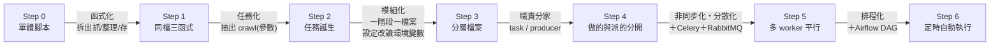

# evolution：從一支爬蟲到分散式的七步拆解

這個目錄是「課程手冊/補充J - 從一支爬蟲到分散式_七步拆解」的示範程式碼。
完整的步驟說明、判準、驗收方式、常見疑問都在補充 J；各資料夾另有自己的 README（怎麼跑、驗收什麼）。

## 七步一覽

| 路徑 | 步驟 | 內容 |
|---|---|---|
| `step0_single_file.py` | Step 0 | 單體版，抓與存寫在同一個函式裡 |
| `step1_functions.py` | Step 1 | 同檔拆成抓、整理、存三個函式 |
| `step2_task_function.py` | Step 2 | 同檔抽出一顆任務 `crawl()`——樞紐 |
| `step3_modules/` | Step 3 | 三個階段各自獨立成檔案，設定抽到 config |
| `step4_task/` | Step 4 | task 與 producer 分家 |
| `step5_celery/` | Step 5 | 接上 Celery 與 RabbitMQ |
| `step6_airflow/` | Step 6 | Airflow DAG 定時發任務 |

## 漸進式流程：每一步往下走時發生了什麼



| 轉變 | 這一步在做什麼 | 改了什麼 | 新增的程式／元件 | 刻意沒動的 |
|---|---|---|---|---|
| 0 → 1 | **函式化**：三種改動理由拆成三個函式 | 一個大函式 → `fetch_stock_price()` / `transform()` / `save()`，`main()` 串接；補上 Step 0 沒有的整理階段 | `transform()`（去重、轉型別、挑欄位） | 執行結果、儲存行為 |
| 1 → 2 | **任務化**：「處理一支股票」有了邊界 | 迴圈體抽成 `crawl(stock_id, start, end)`，輸入全來自參數 | `crawl()`——可分散的三條件在此成立 | 三個階段函式、檔案數量 |
| 2 → 3 | **模組化＋設定外部化**：一個階段一個檔案 | 三階段搬進獨立檔案；常數改 `os.environ.get()`，`STORAGE` 決定存哪些目標 | `config.py` / `client.py` / `transformer.py` / `repository.py`（含 `SAVERS` 對照表） | 三階段與 `crawl()` 的內容 |
| 3 → 4 | **職責分家**：做的與派的分開 | `crawl()` 搬進 task 檔、迴圈搬進 producer 檔；任務清單獨立成 `build_jobs()`（顆粒度在這裡決定） | `task.py` / `producer.py` | client / transformer / repository / config（可 diff 驗證） |
| 4 → 5 | **非同步化・分散化**：換掉「誰來執行」 | `crawl(...)` 當場執行 → `crawl.delay(...)` 丟進佇列；task 加一行 `@app.task()` | `worker.py`（Celery app）、`__init__.py`（模組路徑載入需要）；**新元件：Celery＋RabbitMQ** | 任務函式主體、`build_jobs()`——爬蟲邏輯改動量為零 |
| 5 → 6 | **排程化**：換掉「誰來按下 producer」 | 人工執行 producer → DAG 到點自動呼叫同一個 `crawl.delay()` | `evolution_producer_dag.py`；**新元件：Airflow** | 所有爬蟲相關程式 |

看規律：**前四步都在整理程式的形狀（不加任何元件），後兩步各加一個元件、但各只換掉一件事**——Step 5 換「誰來執行」、Step 6 換「誰來觸發」。這就是補充 J 兩條判準的具體展開：改動理由不同的東西分開放；每一步都能跑、都只做一件事。

## 快速執行

```bash
# Step 0–4 只需網路，不需要容器
uv run python example/evolution/step0_single_file.py
uv run python example/evolution/step1_functions.py
uv run python example/evolution/step2_task_function.py
uv run python example/evolution/step3_modules/main.py
uv run python example/evolution/step4_task/producer.py

# Step 3 起可用環境變數換儲存目標（先啟動 MySQL）
STORAGE=csv,mysql uv run python example/evolution/step3_modules/main.py
```

Step 5（Celery）與 Step 6（Airflow）的啟動方式見各資料夾 README。

## diff 對照（每一步只改一件事的證據）

```bash
diff step3_modules/client.py step4_task/client.py       # 無輸出＝分家沒動三層
diff step4_task/task.py step5_celery/task.py            # 差異只有裝飾器與 import
diff step4_task/producer.py step5_celery/producer.py    # 差異只有 .delay()
```
