# 補充A - 系統架構圖：用 draw.io 畫本地端與雲端

> 這一章教一個工具和一套判斷：draw.io 怎麼操作，以及架構圖該畫到什麼程度。
> 產出兩張圖——本地端的課程系統（第 1 到 13 章）與 GCP 雲端版（第 14 到 17 章）。
> 選讀章，不影響主線進度。

---

## 做完這一章你會

1. 用 draw.io 從空白畫布畫出一張分層的系統架構圖。
2. 分辨流程圖、系統架構圖、泳道圖、循序圖各自回答什麼問題。
3. 說得出哪些元件該畫進圖裡、哪些不該畫。
4. 把圖存成可再編輯的 `.drawio` 檔放進 repo，並用 VS Code 直接開啟。
5. 啟用 GCP 圖形庫，用官方圖示畫雲端架構。
6. 分辨 draw.io 與 Mermaid 各自適合的場合。

---

## 先搞懂

### 為什麼要畫圖

畫圖的目的是讓別人快速進入狀況。討論一個系統時，如果每個人腦中的架構都不一樣，會議會花大半時間在對齊認知而不是解決問題。一張圖把「有哪些元件、資料往哪走、誰跟誰有關係」定下來，討論才有共同的起點。

這也是為什麼圖要畫給特定的讀者看，而不是畫給自己看。

### 圖有很多種，這一章畫的是哪一種

軟體專案裡常見的圖不只一種，用途各自不同：

| 圖的種類 | 回答什麼問題 | 什麼時候用 |
|---|---|---|
| 流程圖（flowchart） | 事情按什麼順序發生、遇到條件怎麼分岔 | 描述業務流程或程式邏輯 |
| 系統架構圖 | 系統由哪些元件組成、資料怎麼流動 | **這一章畫的就是這種** |
| 泳道圖（swimlane） | 每一步是「誰」負責的 | 跨部門或跨服務的流程 |
| 循序圖（sequence） | 元件之間依時間順序來回呼叫了什麼 | 釐清 API 串接 |
| 實體關聯圖（ER） | 資料表之間怎麼關聯 | 設計資料庫 |

### 五種圖各長什麼樣子

下面五張都用課程自己的系統當題材，看得出同一套系統換個問題就換一種圖。完整可編輯的檔案在 `課程手冊/drawio/五種圖的範例.drawio`，一個檔五頁，每種圖一頁。

**流程圖**——爬蟲任務從開始到結束的順序，菱形是判斷，一進一出變成兩條路：

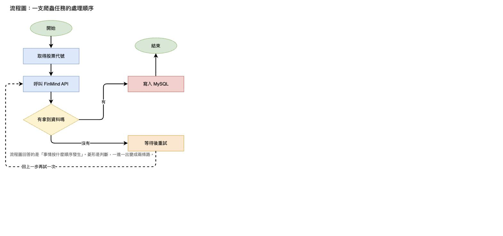

流程圖的符號有國際通用的慣例，不同形狀代表不同意思，不是拿來裝飾的：

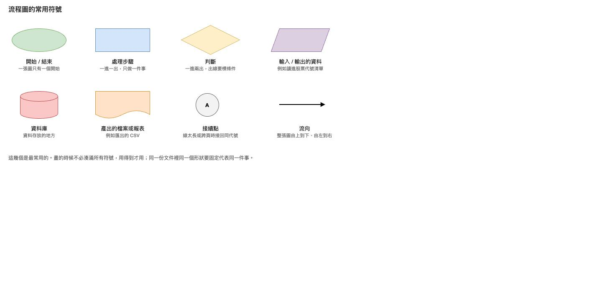

畫的時候有六條規則：

- 整張圖由上到下、由左到右，讀者才不用回頭找。
- 一個處理框只做一件事。要做兩件就拆成兩個框。
- 判斷框的每一條出線都要標條件（有／沒有、成功／失敗）。不標的話讀者只能猜哪條是哪條。
- 每個框都要有出口。沒有出口的框代表流程在那裡斷掉了。
- 開始只有一個，結束可以有多個。
- 線交叉太多會難讀，這時候用接續點：兩端各放一個同代號的圓圈，中間的線就不用畫。

**系統架構圖**——同一套爬蟲，改問「由哪些元件組成、資料往哪走」，畫出來的是元件之間的關係，沒有先後順序的判斷：

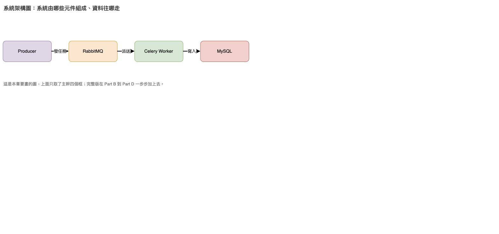

系統架構圖沒有國際標準符號，靠的是業界慣例加上你自己的圖例：

| 畫法 | 代表什麼 | 用的時候要注意 |
|---|---|---|
| 方框 | 一個服務或元件 | 名稱用實際跑起來的那個名字，例如容器名 `crawler_twse` |
| 圓柱 | 資料儲存 | 資料庫、佇列這種「資料會留下來」的地方 |
| 虛線框 | 一個邊界，例如一台機器、一個網路、一個雲端專案 | 框的標題要寫出這個邊界叫什麼 |
| 官方圖示 | 託管服務 | 用雲端商提供的圖示庫，不要自己畫近似的圖案 |
| 實線箭頭 | 資料或任務實際流動的方向 | 箭頭方向就是資料的方向，不是呼叫的方向 |
| 虛線箭頭 | 由你定義的另一類關係，例如管理介面或外部呼叫 | 定義了就要寫進圖例，整張圖一致 |

規則有三條：一層只放一個抽象高度，不要把「一整台 VM」和「VM 裡的一個行程」畫成同樣大小的框；框上補關鍵屬性，例如 port 或版本；一定要有圖例，因為這種圖沒有標準，讀者不會通靈。

**泳道圖**——步驟跟流程圖一樣，但每一步放進負責它的那條泳道，多回答了「這一步是誰做的」：

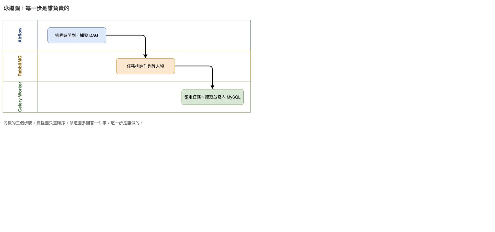

| 畫法 | 代表什麼 | 用的時候要注意 |
|---|---|---|
| 一條泳道 | 一個負責的角色或系統 | 一張圖只用一種分法，全部用人或全部用系統，不要混 |
| 泳道標題 | 那條泳道的負責者 | 橫式泳道寫在左側，直式泳道寫在上方 |
| 框 | 一個步驟，放在負責它的那條泳道裡 | 一個步驟只能屬於一條泳道 |
| 跨泳道的箭頭 | 責任從一方交到另一方 | 交接次數就是責任轉移次數，次數越多流程越容易出問題 |

規則有兩條：步驟由左到右照時間排；如果某個步驟你不確定該放哪條泳道，代表那件事的責任歸屬本身還沒講清楚，這是泳道圖最有價值的地方。

**循序圖**——垂直虛線是每個元件的時間軸，由上往下代表時間經過；實線是發出的請求，虛線是回傳的結果：

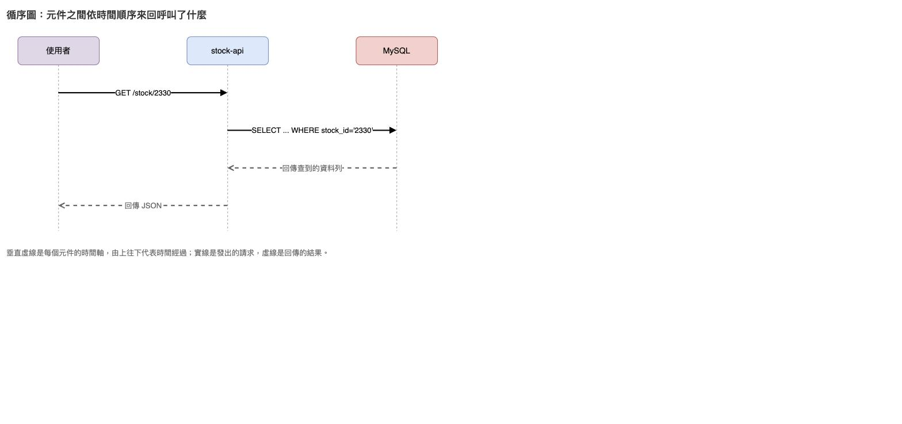

| 畫法 | 代表什麼 | 用的時候要注意 |
|---|---|---|
| 上方的方框 | 參與者，可以是服務、程式物件或人 | 由左到右排，發起的那一方通常放最左邊 |
| 垂直虛線 | 生命線，由上往下代表時間經過 | 時間只往下走，箭頭不能往上畫 |
| 實線加實心箭頭 | 同步呼叫，發出後要等對方回應 | 線上寫「呼叫了什麼」，例如 `GET /stock/2330` |
| 虛線加開放箭頭 | 回傳結果 | 它不是新動作，只是把結果送回去 |
| 實線加開放箭頭 | 非同步訊息，送出就不等回應 | 第 3 章 `apply_async()` 發任務就是這一種 |
| 細長矩形 | 該參與者正在處理事情的那段期間 | 可以省略，圖會比較乾淨 |

規則有兩條：訊息寫「做了什麼動作」而不是寫協定名稱；一張圖只畫一個情境，成功路徑一張、失敗路徑另外一張，不要把兩種結果塞在同一張。

**實體關聯圖**——不畫行為，只畫資料表的欄位與表之間的關聯，`1 對 N` 表示左邊一列對應右邊多列：

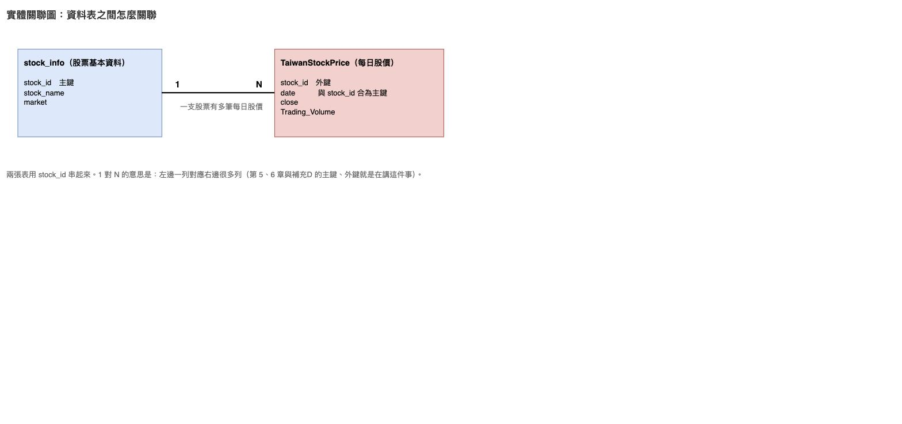

| 畫法 | 代表什麼 | 用的時候要注意 |
|---|---|---|
| 方框 | 一個實體，通常就是一張資料表 | 框名用實際的表名 |
| 框內的每一列 | 一個欄位 | 主鍵與外鍵一定要標出來，其他欄位可以只列重要的 |
| 兩框之間的連線 | 這兩張表有關聯 | 線上用一句白話寫出關聯的意思 |
| 線兩端的 1 與 N | 基數，一列對應到對方幾列 | `1 對 N` 最常見：一支股票對應多筆每日股價 |

規則有兩條：欄位型別可以省略，但主鍵與外鍵不能省，因為那是關聯成立的依據；遇到多對多的關係要拆成一張中介表，不要直接畫一條 N 對 N 的線。

這些圖的共通結構只有兩樣東西：**節點**（框，代表元件或活動）與**連線**（箭頭，代表順序或關係）。draw.io 的操作邏輯就建立在這兩樣上——先拉出節點，再從節點邊緣拉出連線。學會這一套，畫上表任何一種圖都是同一組動作。

另外要注意團隊有沒有既定規範。例如業務流程圖有 BPMN 這種標準符號系統，規定了什麼形狀代表什麼意思。沒有規範時，自己定的規則要一致，並且寫進圖例。

### draw.io 是什麼

由 diagrams.net 團隊維護的開源繪圖工具，在瀏覽器裡直接用，免費、不需要註冊帳號。網址 `app.diagrams.net`（舊網址 `draw.io` 會轉過去，兩個名字指的是同一個東西）。

它跟多數線上工具不同的地方是**檔案存在哪由你決定**：可以存到自己的電腦、Google 雲端硬碟、OneDrive、GitHub 或 GitLab。這一章選擇存到本機再放進 git repo，跟程式碼一起版控。

### 架構圖畫的是「讀者需要理解的層級」

第 13 章的全架構圖畫了 8 個框，但 `docker-compose-all.yml` 定義的是 13 個容器。差在哪裡：

| 實際的容器 | 圖上怎麼處理 | 理由 |
|---|---|---|
| `airflow-postgres`、`airflow-init`、`airflow-webserver`、`airflow-scheduler` | 收成一個「Airflow」框 | 讀者要知道的是「有一個排程器」，不是它內部有幾個行程 |
| `mongodb`、`mongo-express`（補充D） | 不畫 | 跟主線資料流無關 |
| `rabbitmq`、`mysql`、`crawler_twse`、`crawler_tpex` 等 | 各自一個框 | 它們是資料流上的節點，少一個就看不懂 |

架構圖不是把 `docker ps` 的輸出抄一遍。畫之前先問一句：**這個框拿掉，讀者還看得懂資料怎麼流動嗎？** 看得懂就不用畫。

### 兩種檔案，用途不同

| 格式 | 是什麼 | 什麼時候用 |
|---|---|---|
| `.drawio` | 圖的原始檔，內容是一段 XML | 這張圖之後還要修改、要進 git、要跟別人協作 |
| `.png` / `.svg` | 從原始檔匯出的圖片，不能再編輯 | 這張圖要貼進投影片、文件或簡報 |

`.drawio` 是純文字，所以 git 看得出改了哪一行。只存 PNG 的話，下次要改就得整張重畫。draw.io 另外提供「PNG 內嵌圖表副本」的選項——匯出的 PNG 檔裡藏著 XML，把那張 PNG 拖回 draw.io 就能繼續編輯。

### 這一章的檔案

| 檔案 | 說明 |
|---|---|
| `課程手冊/drawio/本地端架構圖.drawio` | 本地端的完成版，自己畫完可以打開對照 |
| `課程手冊/drawio/GCP雲端架構圖.drawio` | 雲端版的範本，Part F 會打開它講解 |
| `課程手冊/drawio/五種圖的範例.drawio` | 六頁：五種圖各一頁，加一頁流程圖符號對照 |

---

## 一步一步

### Part A：開場與介面

**A-1 開啟 draw.io**

瀏覽器打開 `app.diagrams.net`，不用註冊也不用安裝。

介面語言預設跟著瀏覽器走。要固定成繁體中文，網址後面加參數：

```
https://app.diagrams.net/?lang=zh-tw
```

目前的版本打開就是一張空白畫布，不會先問你檔案要存哪裡。要叫出儲存位置的選單，網址加 `splash=1`：

```
https://app.diagrams.net/?lang=zh-tw&splash=1
```

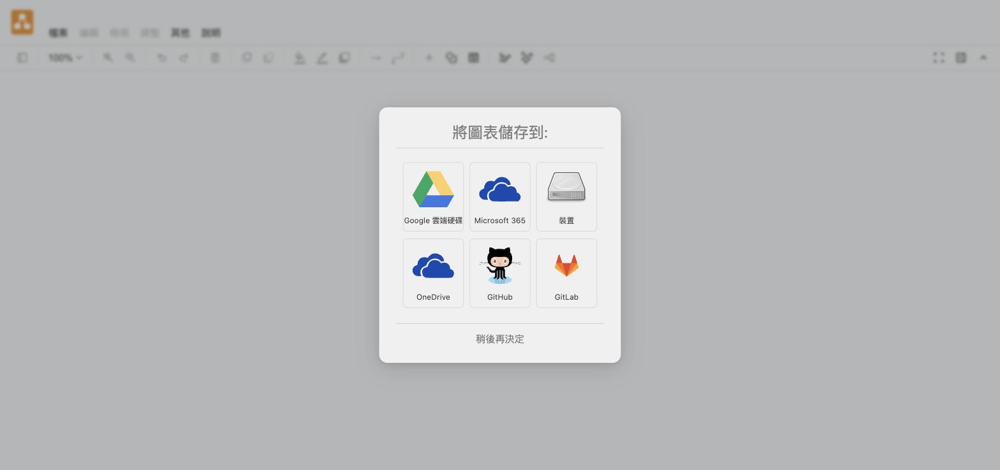

這一章選「裝置」，檔案留在自己電腦上。按「稍後再決定」也可以，之後用 `檔案 → 另存新檔` 一樣能選。

**A-2 認識介面三區**

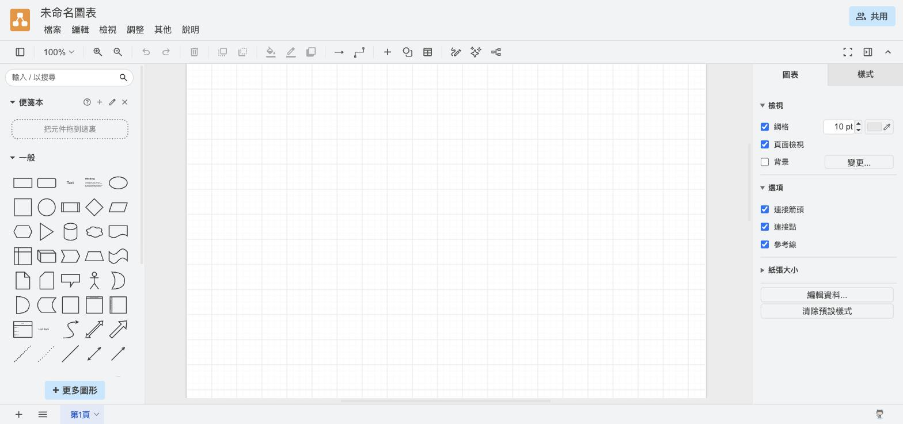

| 區域 | 位置 | 作用 |
|---|---|---|
| 圖形庫 | 左側 | 上方是搜尋框，下方是分類圖形。拖出來就能用 |
| 畫布 | 中間 | 圖畫在這裡。白色範圍是頁面邊界 |
| 格式面板 | 右側 | 分兩個分頁：沒選取任何東西時是「圖表」（網格、背景、紙張大小），選取物件後切到「樣式」（顏色、線條、字型） |

**A-3 先存檔**

`檔案 → 儲存`，選擇存到裝置，命名為 `本地端架構圖.drawio`。

之後每改一段就存一次。畫布有未儲存的變更時，功能表右邊會出現橘色的「修改未儲存。點此以儲存。」，點它就存檔。網頁版沒有自動存檔到你的硬碟，關掉分頁前一定要先存。

---

### Part B：第一輪——先畫資料流主幹

這一輪只畫四個框：**Producer → RabbitMQ → Celery Worker → MySQL**。它們是資料實際流動的路徑。

**B-1 拉出第一個框**

左側「一般」分類的第二個圖形是圓角矩形，用滑鼠拖到畫布上。

**B-2 輸入文字**

在框上**雙擊**，直接打字輸入 `Producer`，按 `Esc` 結束編輯。

**B-3 複製出另外三個**

選取剛才那個框，按 `Cmd+D`（Windows 是 `Ctrl+D`）複製一份，拖到右邊。重複到共有四個框。

用複製而不是重新拖，四個框的大小會完全一致，不用事後對齊。

**B-4 依序改名**

四個框分別雙擊改成 `Producer`、`RabbitMQ`、`Celery Worker`、`MySQL`。

**B-5 連線**

滑鼠移到 `Producer` 框的邊緣，框的四邊會出現**藍色方向箭頭**；從箭頭往 `RabbitMQ` 拖曳，放開就連上了。

兩種接法要分清楚：

| 接法 | 怎麼做 | 差別 |
|---|---|---|
| 固定連接點 | 對準邊緣上的**藍色 ✕** 再拖 | 線永遠接在那個點，移動框之後線可能繞遠路 |
| 浮動連接 | 對準框中央，框整個**變藍**時放開 | 移動框之後，線會自己改接最近的一邊 |

畫架構圖用浮動連接比較省事，之後調位置不用重接。

**B-5+ 更快的做法：點箭頭直接生出下一個框**

上面 B-3 到 B-5 是「先複製四個框、再一條一條連起來」。draw.io 有一個做法可以把兩件事合成一個動作：

滑鼠移到框上出現方向箭頭時，**不要拖曳，直接點一下**那個箭頭：

- 箭頭指的方向**已經有框**：直接連線過去。
- 箭頭指的方向**是空白**：跳出圖形選擇器，點哪個圖形就在那裡生出那個框，而且線已經連好。

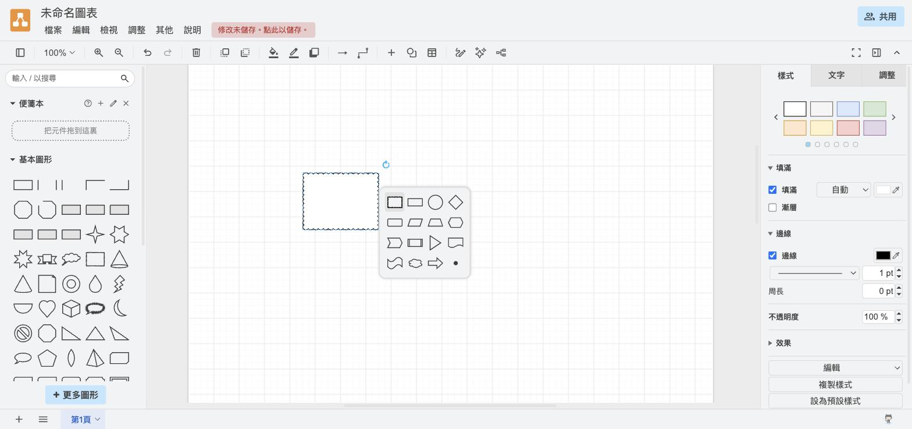

畫一長串直線流程時，這個做法比「複製、拖到定位、再拉線」快很多，而且新框的間距是系統算好的，不用再對齊。第一個框放好之後，主幹剩下三個框可以用這個方式一路點出來。

**B-6 幫線加文字**

在線上**雙擊**，輸入 `發任務`。三條線分別是 `發任務`、`派送任務`、`寫入`。

線上的文字要寫「這條線在做什麼」，不是寫協定名稱。看圖的人想知道的是資料為什麼會從左邊跑到右邊。

**B-7 上色**

選取框，右側切到「樣式」分頁，點色票換填色。同一種角色用同一個顏色：佇列一色、執行者一色、資料庫一色。

> **原則一：先畫主幹。** 主幹是「資料往哪走」，不是「總共有幾個容器」。主幹畫完，整張圖的骨架就定了。

---

### Part C：第二輪——加上監控與管理

這一輪加三個框：**Flower、phpMyAdmin、Metabase**。它們不在資料流上，是給人看的介面。

**C-1 加三個灰框**

一樣用複製的方式做出三個框，填色改成灰色，放在主幹下方。

**C-2 改成虛線連接**

從灰框拉線到它管理的對象（Flower 連 RabbitMQ、phpMyAdmin 和 Metabase 連 MySQL）。

選取線之後，右側「樣式」分頁找到線條樣式，選虛線。

**C-3 對齊**

按住 `Shift` 選取三個灰框 → `調整 → 對齊 → 上` 讓它們在同一水平線上。

拖曳時畫面上出現的藍色細線是參考線，會自動對齊到附近物件的邊或中心。

**C-4 複製樣式**

改好一個框的樣式後，選取它，點右側「樣式」分頁最下方的「複製樣式」，再選取另一個框用 `編輯 → 貼上樣式`——只套用外觀，不動文字。

> **原則二：旁支不要搶主幹的視覺重量。** 灰色加虛線，讀者不必細看就分得出「這條線是人在看，不是資料在流」。

---

### Part D：第三輪——編排層與標註

**D-1 把 Airflow 放到最上面**

新增一個框 `Airflow`，放在 `Producer` 正上方，往下連一條線標 `觸發`。

Airflow 不在資料流上，它是**指揮資料流的那一層**，所以放在上方獨立一層。

**D-2 外部系統用虛線框**

新增 `FinMind API`，邊框改成虛線。從 `Celery Worker` 拉一條虛線上去，標 `呼叫 API 取股價`。

虛線框代表「不是我們維護的東西」。看圖的人才知道這個框壞掉時不能去重開容器。

**D-3 補上 port 與章節**

每個框的文字補第二行，例如 `RabbitMQ` 底下加 `:5672　:15672　訊息佇列（第 1、4、7 章）`。

在框裡換行的方法是編輯文字時按 `Shift+Enter`。

**D-4 加圖例**

畫一個虛線框，裡面放一條實線箭頭和一條虛線箭頭，各自寫上代表什麼。

**D-5 加一個註記框**

用不同底色寫下「這張圖畫 8 個框，但 compose 檔定義了 13 個容器」那段說明。

> **原則三：分層畫，一層一個抽象高度。** 編排層、執行層、觀測層各自成排，加上圖例，看圖的人就不需要再問你。

畫完的結果：

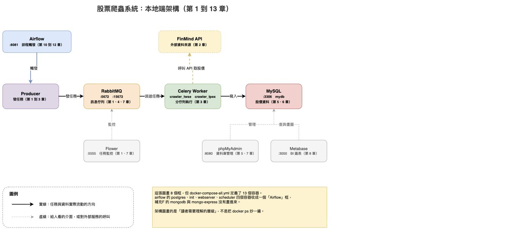

---

### Part E：匯出與版控

**E-1 匯出圖片**

`檔案 → 匯出為 → PNG`。

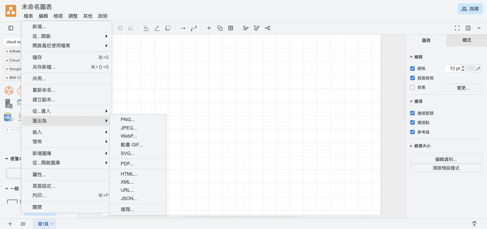

對話框裡三個選項要知道：

| 選項 | 建議 | 理由 |
|---|---|---|
| 縮放 | 要貼投影片就填 200% | 維持 100% 投影出來會糊 |
| 透明背景 | 要貼深色投影片時勾起來 | 不勾的話圖片會帶一塊白底 |
| 包含圖表副本 | 建議一律勾起來 | 勾了會把 XML 藏進 PNG，之後可以把 PNG 拖回 draw.io 繼續改 |

**E-2 原始檔進 repo**

`檔案 → 儲存` 存成 `.drawio`，放到專案的 `課程手冊/drawio/` 底下，跟程式碼一起 commit。

`.drawio` 是 XML，`git diff` 看得出改了哪些節點。

**E-3 用 VS Code 開**

VS Code 安裝 **Draw.io Integration** 擴充後，直接點開 repo 裡的 `.drawio` 檔就能編輯，不用再開瀏覽器。介面跟網頁版一樣。

---

### Part F：雲端版——GCP 圖示庫

**F-1 啟用圖形庫**

左下角「更多圖形」→ 分類捲到「網路」→ 勾選 **Google Cloud Platform** → 套用。

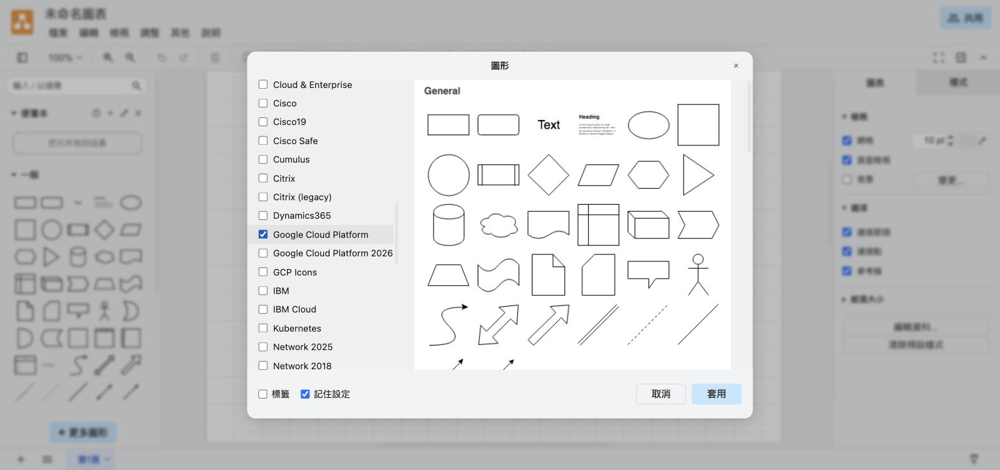

清單裡有三個名字相近的選項，差別是：

| 名稱 | 內容 |
|---|---|
| Google Cloud Platform | 產品層級的圖示，數量最多。本章的範本用這一組 |
| Google Cloud Platform 2026 | 較新的一組，以服務類別為主，產品圖示比較少 |
| GCP Icons | 另一套圖示風格 |

**F-2 不啟用也能找到**

左上角搜尋框直接打 `cloud sql`，搜尋範圍涵蓋所有圖形庫，不必先啟用：

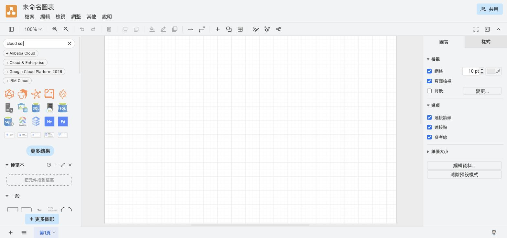

啟用圖形庫的好處是圖示常駐在左側，畫整張雲端圖時比較快。

**F-3 打開範本對照**

開啟 `課程手冊/drawio/GCP雲端架構圖.drawio`：

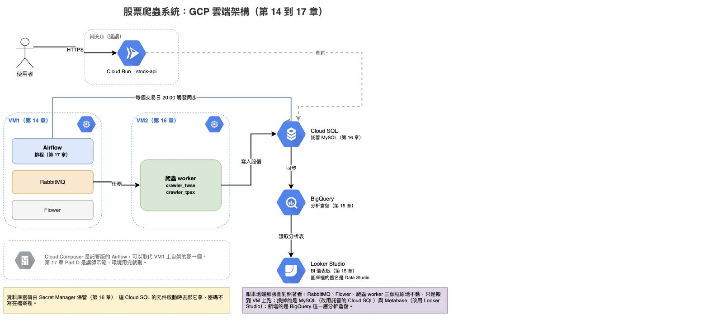

跟本地端那張並排看，三件事：

| 情況 | 元件 |
|---|---|
| 原地不動，只是搬到 VM 上跑 | RabbitMQ、Flower、爬蟲 worker、Airflow |
| 換成託管服務 | MySQL → Cloud SQL、Metabase → Looker Studio |
| 新增的一層 | BigQuery（分析倉儲） |

畫這張圖時會遇到兩個細節：

- **Secret Manager 在圖形庫裡沒有對應圖示**，所以範本用一個註記框說明它的角色，沒有畫成方框。圖庫沒有的東西，用文字講清楚就好，不必硬找一個近似的圖示——用錯圖示比沒有圖示更容易誤導。
- **Looker Studio 在圖庫裡的名字是 Data Studio**，那是它改名前的舊稱。搜尋 `looker` 找不到就改搜 `data studio`。

**F-4 VM 邊界怎麼畫**

VM1 和 VM2 各用一個虛線框把裡面的服務圈起來，框的標題寫 VM 名稱。虛線框把「哪些服務跑在同一台機器上」直接標示出來，這正是第 16 章拆成兩台之後最需要表達的資訊。

---

## Mermaid：寫在文件裡的圖

draw.io 產出的是圖片檔。Mermaid 是另一條路：用文字語法描述圖，讓 Markdown 檔在渲染時自己畫出來。

### 兩者的差別

| | draw.io | Mermaid |
|---|---|---|
| 怎麼畫 | 用滑鼠把圖形拖到畫布上再連線 | 用文字語法描述節點與連線 |
| 版面控制 | 每個框的位置都由你決定 | 位置由排版引擎決定，你只能給方向提示 |
| 放在哪 | 圖檔和原始檔各存一份，共兩個檔案 | 語法直接寫在 `.md` 檔裡，沒有額外檔案 |
| 改一個字 | 要開編輯器改完再匯出一次圖片 | 改完文字存檔就生效 |
| 適合 | 版面要精緻的圖，例如投影片與對外文件 | 跟著程式碼一起改的圖，例如 README 與設計文件 |

判斷方式：**這張圖會不會跟著程式碼一起改？** 會的話用 Mermaid，改程式碼時順手改幾個字就好；不會、而且要拿去簡報的，用 draw.io。

### 本地端架構的 Mermaid 版

````markdown
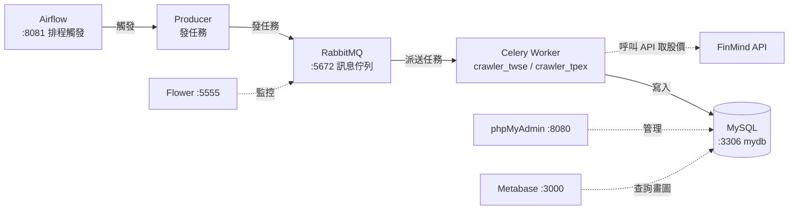
````

語法只有幾個記號：

| 寫法 | 意思 |
|---|---|
| `flowchart LR` | 流程圖，方向由左到右（`TD` 是由上到下）|
| `A --> B` | 實線箭頭 |
| `A -.-> B` | 虛線箭頭 |
| `-->\|文字\|` | 箭頭上加標籤 |
| `A["文字"]` | 方框 |
| `A[("文字")]` | 圓柱形，慣例用來表示資料庫 |
| `<br/>` | 框內換行 |

### 雲端架構的 Mermaid 版

````markdown
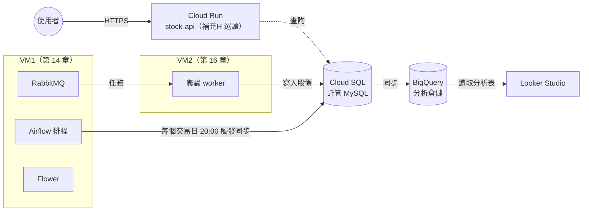
````

`subgraph` 就是 draw.io 裡的那個虛線框，用來把同一台機器上的服務圈在一起。

### 哪裡看得到 Mermaid 的圖

| 環境 | 支援情況 |
|---|---|
| GitHub | `.md` 檔裡的 ```mermaid 區塊直接渲染 |
| VS Code | 內建 Markdown 預覽即可（舊版需裝 Mermaid 擴充）|
| draw.io | `調整 → 插入 → 進階 → Mermaid`，貼語法就轉成可拖曳的圖形 |

最後一項是兩個工具的接點：用 Mermaid 快速把結構打出來，匯進 draw.io 之後再手動調版面。

---

## 想一想

**Q1：為什麼第 13 章的架構圖不把 `airflow-postgres` 畫出來？**

因為它是 Airflow 自己的 metadata 資料庫，存的是 DAG 狀態與執行紀錄，不在股價資料的流動路徑上。看圖的人要理解的是「股價怎麼從 FinMind 進到 MySQL」，多畫一個框只會讓主線變模糊。反過來說，如果今天畫的是「Airflow 為什麼啟動失敗」的排錯圖，那 postgres 就一定要畫。**同一套系統，目的不同，該畫的框就不同。**

**Q2：什麼情況下該用實線、什麼情況該用虛線？**

這張圖的規則是：實線代表任務與資料實際流動的方向，虛線代表人在看的介面或對外部服務的呼叫。規則本身可以自己定，重點是**定了就要一致，而且要寫進圖例**。沒有圖例的線條樣式差異，讀者只會覺得畫圖的人隨手亂畫。

---

## 練習

**練習 1：把 Metabase 換成 Looker Studio**

打開本地端那張圖，另存一份，把 Metabase 那個框換成 Looker Studio，並且改成從 BigQuery 讀資料。畫完之後跟雲端版範本對照，看看差在哪裡。

**練習 2：畫第 16 章的搬家過程**

用兩張並排的圖表達「搬家前」與「搬家後」：搬家前是單台 VM 跑全部服務，搬家後是 VM1／VM2 加 Cloud SQL。重點在讓讀者看得出哪些東西移動了、哪些沒動。

**練習 3：用 Mermaid 重寫**

把練習 2 的兩張圖改用 Mermaid 寫進一個 `.md` 檔，推到 GitHub 上確認渲染正常。比較一下：哪一種畫起來比較快、哪一種版面比較合你的預期。

---

## 排錯

| 你遇到的狀況 | 原因 | 怎麼解 |
|---|---|---|
| 拖不出連線，反而把整個框拖走了 | 滑鼠位置在框的內部，不在邊緣 | 移到框的邊緣，等出現藍色方向箭頭再拖 |
| 移動框之後線的位置變得很奇怪 | 用了固定連接點（藍色 ✕）| 刪掉線重畫，這次對準框中央、等整個框變藍再放開 |
| 框裡的文字沒辦法換行 | 直接按 Enter 會結束編輯 | 編輯文字時用 `Shift+Enter` 換行 |
| 匯出的 PNG 邊緣被切掉 | 匯出範圍設成了「頁面」而框超出頁面邊界 | 匯出對話框把範圍改成「圖表」 |
| 開啟別人的 `.drawio` 時圖示變成空白方框 | 該圖用到的圖形庫檔案沒載入完成 | 重新整理頁面；圖形庫是用到才下載的，不需要事先勾選 |
| 圖庫裡搜不到 Looker Studio | 圖庫用的是改名前的舊稱 | 改搜尋 `data studio` |
| GitHub 上 Mermaid 區塊顯示成純文字 | 程式碼區塊的語言標記沒寫或拼錯 | 確認開頭是 ` ```mermaid `，全小寫 |

---

## 收工

draw.io 網頁版沒有需要關閉的服務。要確認的只有一件事：**`.drawio` 原始檔存起來了嗎？**

只匯出 PNG 而沒存原始檔的話，下次要改就得整張重畫。

---

## 延伸閱讀

- [Draw.io 最佳實作的 5 個小技巧（ChunJen Wang，Medium）](https://medium.com/jimmy-wang/%E6%B5%81%E7%A8%8B%E5%9C%96%E6%9C%80%E4%BD%B3%E5%B7%A5%E5%85%B7-for-free-draw-io%E6%9C%80%E4%BD%B3%E5%AF%A6%E4%BD%9C%E7%9A%84%EF%BC%95%E5%80%8B%E5%B0%8F%E6%8A%80%E5%B7%A7-82955e410e47)——從 BA／SA／SD 文件的角度說明各種圖的用途，本章「圖有很多種」與「點箭頭生出下一個框」兩段參考了這篇。文章寫於 2021 年，介面已有變動（例如現在打開不會先問儲存位置），操作步驟以本章為準。
- [diagrams.net 官方說明文件](https://www.drawio.com/doc/)——圖形庫、快捷鍵、各種整合方式的完整說明。
- [Mermaid 官方文件](https://mermaid.js.org/)——流程圖以外還支援循序圖、甘特圖、ER 圖。

## 本章總結

- 架構圖畫的是讀者需要理解的層級，不是容器清單——畫每個框之前先問「拿掉它，讀者還看得懂嗎」
- 畫的順序是先資料流主幹、再監控旁支、最後疊編排層；一層一個抽象高度
- 線條樣式的規則可以自己定，但整張圖要一致，而且要寫進圖例
- 外部系統與可替換方案用虛線框標示，讀者才知道哪些東西不歸自己管
- `.drawio` 原始檔要進 git，PNG 只是出圖；匯出時勾「包含圖表副本」，PNG 也能拖回 draw.io 繼續編輯
- 雲端圖用官方圖示庫，圖庫沒有的服務用註記說明——拿相近的圖示硬湊比沒有圖示更容易誤導
- 圖會跟著程式碼一起改的用 Mermaid，要拿去簡報的用 draw.io；draw.io 能匯入 Mermaid 語法，兩條路接得起來

回到主線：這兩張圖對應的是第 13 章的本機全系統與第 14 到 17 章的雲端資料線，畫完之後回頭看那兩章的說明會更清楚。
