# 補充K - BigQuery 深入：三個亮點實驗、Studio 功能與五個強項

> 前置：第 15 章做完（raw／stage／app 三層已經蓋好、Looker Studio 儀表板接上了）。本篇是第 15 章的延伸——主線把「資料怎麼流」講完了，這裡回答另一個問題：**除了存資料跟跑 SQL，BigQuery 還能做什麼，以及它憑什麼比 MySQL 適合分析。**
>
> 三個部分可以分開讀：
>
> | 部分 | 回答什麼 | 需要什麼 |
> |------|---------|---------|
> | 一、三個亮點實驗 | 倉儲「非它不可」的證據——用指令量出來 | 第 15 章的 raw 層有資料 |
> | 二、Studio 六項功能 | 查詢編輯器以外的那些東西各自做什麼 | 部分功能要另外啟用 API（各節註明） |
> | 三、五個強項對照 MySQL | 為什麼要多養一個倉儲 | 讀懂即可 |

## 這一篇會用到的東西

| 工具／服務 | 在本篇做什麼 |
|-----------|-------------|
| `bq` CLI | 三個實驗、dry run、排程查詢與連線的操作 |
| BigQuery Studio（Console） | 筆記本、資料畫布、資料準備、管道的操作介面 |
| BigQuery 公開資料集 | 實驗一：拿十四億筆的表看倉儲的規模 |
| Gemini in BigQuery | 資料畫布與資料準備的 AI 功能（要另外啟用） |
| Cloud SQL | 連線那一節的對象——第 16 章建的 `stock-mysql` |

---

## 一、三個亮點實驗

資料已經在倉儲裡了，但「倉儲比 MySQL 強在哪」還只是一句口號。這一步做三個實驗，每個都是 MySQL 做不到或做不好的事。指令部分用 `bq`（VM 或你自己的電腦都能跑；也可以貼進 Console 的查詢編輯器），實驗一另外有一段在 Console 上做。

**實驗一：查詢效率與欄式儲存——它只讀你引用的那幾欄**

先看規模。BigQuery 平台上掛著幾百個**公開資料集**（`bigquery-public-data` 專案），任何人都能直接查。先拿比特幣全鏈交易表暖身：

```bash
bq query --use_legacy_sql=false \
  'SELECT COUNT(*) AS total_rows FROM `bigquery-public-data.crypto_bitcoin.transactions`'
```

```
+------------+
| total_rows |
+------------+
| 1409179437 |
+------------+
```

十四億筆，一兩秒回。再來一個真的要算的：對 StackOverflow 兩千三百萬個問題做逐年統計——

```bash
bq query --use_legacy_sql=false \
  'SELECT EXTRACT(YEAR FROM creation_date) AS yr, COUNT(*) AS questions,
          ROUND(AVG(score),2) AS avg_score
   FROM `bigquery-public-data.stackoverflow.posts_questions`
   GROUP BY yr ORDER BY yr'
```

兩千三百萬列的聚合，幾秒出表。同樣的事拿 MySQL 做：先要想辦法把幾十 GB 資料塞進你的機器，然後由那台機器慢慢掃。這就是儲存與運算分離的直接效果——**算力不在你的機器上，資料也不用搬到你的機器上**。

> 有些公開表大到 BigQuery 會要求先過濾再查（例如維基百科的瀏覽量表 `wikipedia.pageviews_2024`，不帶分區條件直接查會被拒絕）——這是平台在擋住「一個查詢掃掉幾百 GB」的失誤。

**它怎麼做到的：把掃描量叫出來看**

BigQuery 按**掃描量**計費（每月有免費額度，課程的資料量用不完），所以它必須在執行前就算得出「這個查詢要碰多少資料」。把這個估算叫出來，欄式儲存的行為就直接量得到。Console 的查詢編輯器內建這個功能：**SQL 打完、還沒按執行，左下角就顯示「這項查詢會在執行時處理 X 的資料」**——這就是 dry run 的視覺版。

打三段 SQL，只看左下角那行數字怎麼變。

① 全欄：`SELECT * FROM raw.TaiwanStockPrice`


② 只要一欄：`SELECT close FROM raw.TaiwanStockPrice`


③ 只數筆數：`SELECT COUNT(*) FROM raw.TaiwanStockPrice`


2.97 MB → 310.4 KB → 0 B。同一張表、都沒有 `WHERE`，只因為引用到的欄不同，掃描量差了一個數量級：**沒被引用的欄，BigQuery 連讀都不讀**。第三段更極端——整表的筆數存在表的中繼資料裡，回答 `COUNT(*)` 根本不用碰資料。

（你的數字會跟截圖不同，資料量不一樣；不變的是這三段之間的比例關係。）

第二段的數字可以驗算。`close` 是 FLOAT64，BigQuery 定義它是 8 個邏輯位元組；截圖那份資料是 39,731 列：

```
39,731 × 8 = 317,848 bytes = 310.4 KB
```

跟畫面上的數字一致。這說明 BigQuery 的資料量是按「查詢引用到的欄 × 列數」算出來的。三個要跟著記住的注意事項：

1. **邏輯位元組不是實際落地大小**。8 bytes 是 BigQuery 為 FLOAT64 定義的計費值，`DATE` 同樣算 8，但一個日期實際佔用遠少於此。資料在儲存層是壓縮過的，所以不能說「BigQuery 只從磁碟讀了 310 KB」，正確的說法是「只計入 317,848 bytes 的邏輯資料量」。
2. **NULL 計 0 bytes**。算式能精準吻合，同時也說明這一欄沒有 NULL；換一份資料重算對不上時，第一個要檢查的就是 NULL。
3. **按需計費有每查詢 10 MB 的下限**。所以這個查詢的實際計費是 10 MB，不是 310 KB——掃描量的比例關係跟帳單金額不是同一件事。

在指令列用 `--dry_run`——不執行、只回報會掃多少。這也是驗證第二條省錢開關（分區）的方式：

```bash
# 全表全欄
bq query --use_legacy_sql=false --dry_run 'SELECT * FROM raw.TaiwanStockPrice'

# 只選兩欄——欄式儲存：沒引用的欄不讀
bq query --use_legacy_sql=false --dry_run 'SELECT stock_id, close FROM raw.TaiwanStockPrice'

# 兩欄＋分區過濾一個月——只掃那幾天的分區（讀碼段②建的分區在這裡兌現）
bq query --use_legacy_sql=false --dry_run \
  "SELECT stock_id, close FROM raw.TaiwanStockPrice WHERE date BETWEEN '2024-06-01' AND '2024-06-30'"
```

三條的掃描量一路降：**少引用欄位**（欄式儲存）與**分區過濾**（讀碼段②）就是 BigQuery 的兩大省錢開關。前者減少「讀哪幾欄」，後者減少「讀哪幾列」，兩條路互不重疊，可以疊加。

**實驗二：Time Travel——把誤刪的資料撈回來**

BigQuery 每張表自動保留**過去七天的歷史版本**，不用任何設定。

```bash
# ① 刪之前：0050 有幾筆
bq query --use_legacy_sql=false "SELECT COUNT(*) AS n FROM raw.TaiwanStockPrice WHERE stock_id='0050'"
# n = 344

# ② 誤刪！
bq query --use_legacy_sql=false "DELETE FROM raw.TaiwanStockPrice WHERE stock_id='0050'"
# Number of affected rows: 344

# ③ 真的不見了
bq query --use_legacy_sql=false "SELECT COUNT(*) AS n FROM raw.TaiwanStockPrice WHERE stock_id='0050'"
# n = 0

# ④ 但十分鐘前的表還查得到——FOR SYSTEM_TIME AS OF
bq query --use_legacy_sql=false \
  "SELECT COUNT(*) AS n FROM raw.TaiwanStockPrice
   FOR SYSTEM_TIME AS OF TIMESTAMP_SUB(CURRENT_TIMESTAMP(), INTERVAL 10 MINUTE)
   WHERE stock_id='0050'"
# n = 344
```

救回來要走兩步——BigQuery 不允許同一張表在一個 DML 裡同時當「寫入目標」和「另一個時間點的讀取來源」，所以先把快照撈到暫存表，再塞回去：

```bash
# ⑤ 快照 → 暫存表
bq query --use_legacy_sql=false \
  "CREATE OR REPLACE TABLE raw.recovered_0050 AS
   SELECT * FROM raw.TaiwanStockPrice
   FOR SYSTEM_TIME AS OF TIMESTAMP_SUB(CURRENT_TIMESTAMP(), INTERVAL 10 MINUTE)
   WHERE stock_id='0050'"

# ⑥ 暫存表 → 塞回原表，然後清掉暫存表
bq query --use_legacy_sql=false "INSERT INTO raw.TaiwanStockPrice SELECT * FROM raw.recovered_0050"
# Number of affected rows: 344
bq rm -f -t raw.recovered_0050

# ⑦ 確認回來了
bq query --use_legacy_sql=false "SELECT COUNT(*) AS n FROM raw.TaiwanStockPrice WHERE stock_id='0050'"
# n = 344
```

MySQL 這邊要做到同一件事：得有人事先設好備份、然後把備份整份還原。BigQuery 的版本歷史是**內建、零設定**的——「raw 層是證據」這條規矩，平台又多保了七天的可回溯版本。

**實驗三：BQML——一句 SQL 訓練一個模型**

倉儲的算力還能直接拿來做機器學習（BigQuery ML），不用把資料搬出去、不用另外架訓練環境。先開一個放實驗品的 dataset，然後用 `CREATE MODEL` 對 2330 訓練一個線性回歸——用當天的開盤、最高、最低、成交量預測收盤價：

```bash
bq mk --dataset --location=asia-east1 {你的專案ID}:lab

bq query --use_legacy_sql=false \
  "CREATE OR REPLACE MODEL lab.close_model
   OPTIONS(model_type='linear_reg', input_label_cols=['close']) AS
   SELECT open, max, min, Trading_Volume, close
   FROM raw.TaiwanStockPrice WHERE stock_id='2330'"
```

十幾秒後模型就在 `lab` 裡了。看它學得怎麼樣、再讓它預測：

```bash
# 評估：MAE（平均絕對誤差）與 R²
bq query --use_legacy_sql=false \
  "SELECT ROUND(mean_absolute_error,2) AS mae, ROUND(r2_score,4) AS r2
   FROM ML.EVALUATE(MODEL lab.close_model)"
# | mae  |   r2   |
# | 4.12 | 0.9986 |

# 預測最近三列
bq query --use_legacy_sql=false \
  "SELECT ROUND(predicted_close,2) AS predicted_close, close AS actual_close, date
   FROM ML.PREDICT(MODEL lab.close_model,
     (SELECT open, max, min, Trading_Volume, close, date
      FROM raw.TaiwanStockPrice WHERE stock_id='2330' ORDER BY date DESC LIMIT 3))"
```

```
+-----------------+--------------+------------+
| predicted_close | actual_close |    date    |
+-----------------+--------------+------------+
|         1043.85 |       1045.0 | 2025-06-17 |
|         1043.85 |       1045.0 | 2025-06-17 |
|         1043.85 |       1045.0 | 2025-06-17 |
+-----------------+--------------+------------+
```

**先別急著相信這個 r²。** 上面那句 `CREATE MODEL` 沒有指定任何切分方式，而 r² 高達 0.9986——先查一下模型到底怎麼訓練的：

```bash
bq query --use_legacy_sql=false \
  "SELECT training_run, iteration, loss, eval_loss FROM ML.TRAINING_INFO(MODEL lab.close_model)"
```

```
+--------------+-----------+-------------------+-----------+
| training_run | iteration |       loss        | eval_loss |
+--------------+-----------+-------------------+-----------+
|            0 |         0 | 28.41698273996841 |      NULL |
+--------------+-----------+-------------------+-----------+
```

**`eval_loss` 是 `NULL`——這個模型根本沒有評估集。** 原因是 BQML 的預設切分規則 `AUTO_SPLIT`：

| 訓練資料筆數 | AUTO_SPLIT 的行為 |
|---|---|
| **< 500 列** | **全部當訓練資料，不切分** |
| 500 ～ 50,000,000 列 | 隨機抽 20% 當評估集（上限 10,000 列） |
| > 50,000,000 列 | 固定抽 10,000 列當評估集 |

2330 只有三百多個交易日，落在第一格。所以 `ML.EVALUATE` 沒有評估集可用時，量的是**模型在自己讀過的資料上的表現**——這個數字只能說明「模型有把訓練資料學起來」，說不出它對沒看過的資料好不好。這是初學 ML 最常見的誤讀，而 BQML 因為預設值太貼心，反而讓人不容易察覺。

**怎麼指定切分：四個選項**

| `data_split_method` | 怎麼切 | 適合 |
|---|---|---|
| `AUTO_SPLIT`（預設） | 依資料量自動決定，見上表 | 快速試 |
| `RANDOM` | 隨機抽指定比例 | 列與列之間獨立的資料 |
| `SEQ` | 依 `data_split_col` 排序，**排在後面的當評估集** | **時間序列**——用過去預測未來 |
| `CUSTOM` | 自己準備一個 BOOL 欄位，`TRUE` 的那些當評估集 | 要精確控制哪幾筆當測試 |
| `NO_SPLIT` | 全部拿去訓練 | 已經另外準備了測試集 |

股價是時間序列，**不能用隨機切**——隨機切等於「拿明天的資料去預測昨天」，測出來的分數會虛高。正確做法是 `SEQ` 依日期切，前 80% 訓練、後 20% 評估：

```bash
bq query --use_legacy_sql=false \
  "CREATE OR REPLACE MODEL lab.close_model_seq
   OPTIONS(model_type='linear_reg', input_label_cols=['close'],
           data_split_method='SEQ',          -- 依欄位排序切
           data_split_col='date',            -- 用日期排
           data_split_eval_fraction=0.2) AS  -- 後 20% 當評估集
   SELECT open, max, min, Trading_Volume, close, date
   FROM raw.TaiwanStockPrice WHERE stock_id='2330'"
```

> `data_split_col` 指定的欄位**會被排除在特徵之外**，不會拿 `date` 本身去預測。

再查一次訓練資訊，這次 `eval_loss` 有值了——切分確實生效：

```
| training_run | iteration | loss   | eval_loss |
|            0 |         0 | 27.534 |    32.596 |
```

`eval_loss`（32.596）比 `loss`（27.534）高是正常的：模型在沒讀過的資料上表現本來就會差一點。兩個模型的評估數字並排看：

| 模型 | 切分 | mae | r² | 這個數字的意思 |
|------|------|-----|-----|---------------|
| `close_model` | AUTO_SPLIT（349 列 → 不切） | 4.15 | 0.9985 | 在**訓練資料**上的表現 |
| `close_model_seq` | SEQ by date，後 20% 評估 | 4.382 | 0.9912 | 在**沒看過的未來資料**上的表現 |

差距不大，因為「同一天的開高低」跟收盤本來就幾乎連動——這是**示範機制**（模型建在倉儲裡、SQL 就能訓練與預測），不是能拿去交易的模型。但流程要對：**先有正確的切分，評估數字才有意義。**

**新資料進來會怎麼樣？**

這是最容易誤會的地方。答案是：**模型是「訓練那一刻的快照」，raw 之後多了多少資料，它都不知道。** 新資料有三種用途，前兩種不動模型、第三種才會：

**① 當推論的輸入（`ML.PREDICT`）**——模型不變，只是拿新資料算答案。甚至可以餵它從沒看過的股票：

```bash
# 模型只學過 2330，拿 2317 來預測
bq query --use_legacy_sql=false \
  "SELECT stock_id, date, ROUND(predicted_close,2) AS pred, close AS actual
   FROM ML.PREDICT(MODEL lab.close_model_seq,
     (SELECT stock_id, open, max, min, Trading_Volume, close, date
      FROM raw.TaiwanStockPrice WHERE stock_id='2317' ORDER BY date DESC LIMIT 3))"
```

```
+----------+------------+--------+--------+
| stock_id |    date    |  pred  | actual |
+----------+------------+--------+--------+
| 2317     | 2025-06-17 | 157.46 |  155.0 |
| 2317     | 2025-06-16 | 157.81 |  155.0 |
| 2317     | 2025-06-13 | 159.33 |  156.5 |
+----------+------------+--------+--------+
```

會動，是因為特徵是開高低與成交量，跟股票代號無關——模型學的是「這四個數字怎麼推出收盤價」這個關係。

**② 當獨立的測試集（`ML.EVALUATE` 帶第二個參數）**——用完全沒進過訓練的資料驗證：

```bash
bq query --use_legacy_sql=false \
  "SELECT ROUND(mean_absolute_error,3) AS mae, ROUND(r2_score,4) AS r2
   FROM ML.EVALUATE(MODEL lab.close_model_seq,
     (SELECT open, max, min, Trading_Volume, close
      FROM raw.TaiwanStockPrice WHERE stock_id='2317'))"
# | mae   |   r2   |
# | 1.984 | 0.9952 |
```

> **陷阱**：2317 的 mae 1.984 看起來比 2330 的 4.382「更好」，但這是假的——mae 是**絕對誤差**，2317 股價一百多、2330 一千多，量級不同不能直接比。要跨標的比較就看 r²（無單位），或改用百分比誤差。

**③ 讓模型學到新資料——只能重訓**。BQML 沒有「增量學習」，`CREATE OR REPLACE MODEL` 是整份資料重跑一次：

```bash
# 每天雙寫進來的新資料，要進到模型裡就得重訓一次
bq query --use_legacy_sql=false \
  "CREATE OR REPLACE MODEL lab.close_model_seq OPTIONS(...) AS SELECT ... FROM raw.TaiwanStockPrice ..."
```

所以實務上的資料線是這樣接的，跟第 15 章的三層完全同一個形狀：

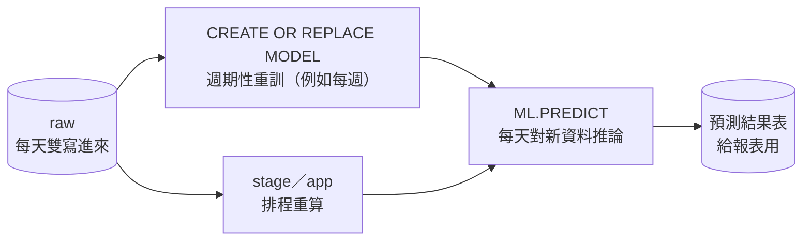

重訓的頻率是成本與新鮮度的取捨：**推論每天做（便宜），重訓週期性做（貴）**。這件事可以直接排進上一節的排程查詢——`CREATE MODEL` 也是 DDL，排程查詢支援。

**還有什麼模型可以用**：除了線性迴歸，BQML 內建邏輯迴歸、K-means 分群、PCA、boosted tree，以及股價這種時間序列真正對得上的 `ARIMA_PLUS`（`time_series_id_col='stock_id'` 一句就能對每支股票各建一個模型，而且它自己處理季節性與假日）。全部同樣是純 SQL。

> 順帶一提：如果你在 raw 有重複列的狀態下跑上面的預測，會看到同一天出現好幾次——那是 append 的天性，模型把重複資料當多筆看。分析要用乾淨資料，這正是下一步 stage 層存在的理由。

raw 層已經由雙寫餵好——**原封不動的原始資料，之後不改它**。接下來兩步在 BigQuery 的查詢編輯器（或 `bq query`）用 SQL 一層一步往上蓋。
---

## 二、BigQuery Studio 不只是查詢編輯器

資料線走完了，回頭盤點一件事：到這裡為止的操作都在查詢編輯器和 `bq` 指令裡完成。但把 Console 左側的資源樹展開，專案底下並列的不只是 dataset——**查詢、筆記本、資料畫布、資料準備作業、管道、連線**各自是一種可以建立的資產：


從 Studio 首頁的「新建」列也看得到同一組東西，「資料工程與分析」下拉裡是管道、資料準備、資料畫布、資料表：


這一節逐項說明它們是什麼、能做什麼、怎麼操作。除了連線與排程查詢可以全程用 `bq` 指令完成，其餘幾項都只有 Console 介面。本課不把它們排進必做步驟，但你要知道它們存在，也要知道它們跟你手寫的 SQL 是什麼關係。

### 筆記本（Notebooks）

**是什麼**：BigQuery 內建的 Colab Enterprise 筆記本，在同一個檔案裡混寫 SQL、Python、Markdown 與圖表。執行環境由 Google 配置，實體是一台 Compute Engine VM。

**能做什麼**：

- SQL cell 與 Python cell 互通，SQL 可以引用 Python 變數
- 用登入的 Google 帳號存取 BigQuery，**不必發服務帳戶金鑰**——對照第 15 章〈補充：在本機雙寫〉那套 `GOOGLE_APPLICATION_CREDENTIALS` 設定，這裡一步都不用做
- `bigframes`（BigQuery DataFrames）API 寫起來像 pandas，但運算下推回 BigQuery 引擎執行，資料不必拉回本機記憶體，因此不受本機記憶體限制
- 直接用 DataFrames、matplotlib、seaborn 畫圖；筆記本以 IAM 共用，並有版本紀錄

**操作舉例**：建一個筆記本，第一個 cell 用 SQL 查 `app.stock_trend_analysis` 並篩出 2330，第二個 cell 用 Python 把 `close`、`ma5`、`ma20` 畫成三線圖。整段流程沒有下載任何 CSV、沒有發任何金鑰——這是 Step 5 之外的另一條「看圖」路徑。

**動手做：兩分鐘畫出 2330 的均線圖**

① Studio 首頁點「**筆記本**」。第一次會先要你選「程式碼資產的預設儲存區域」（選 `asia-east1`，跟第 15 章建的 dataset 同區），接著停在啟用畫面——筆記本要另外啟用 API：

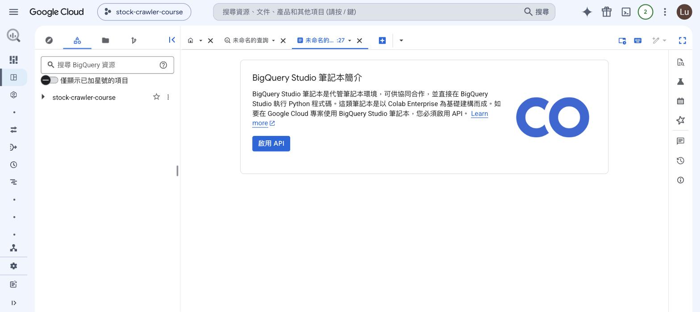

畫面上那句「以 Colab Enterprise 為基礎建構而成」就是它的來歷。按下「啟用 API」（免費，只有實際跑 runtime 才計費），或用指令一次開好：

```bash
gcloud services enable aiplatform.googleapis.com --project={你的專案ID}
```

② 啟用後進到編輯器。左邊是 cell、右邊是 Gemini 面板：

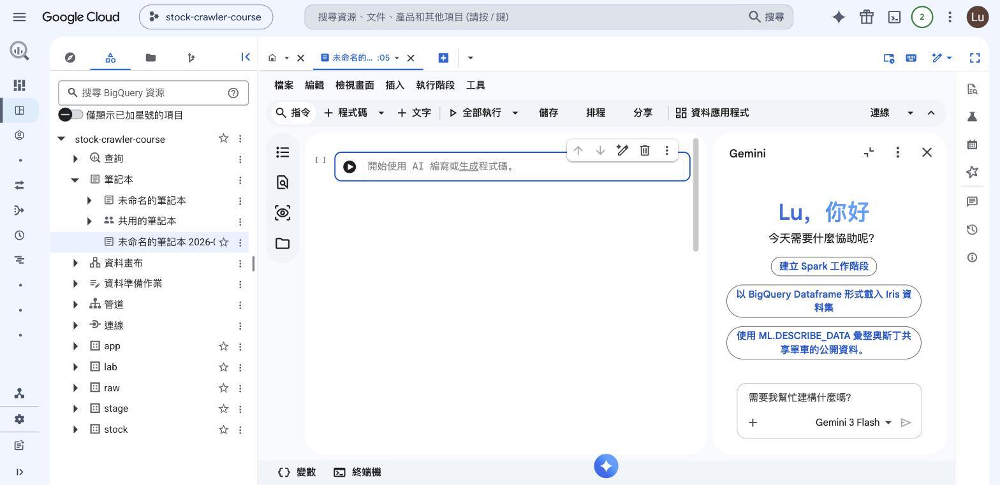

③ 在 cell 裡貼上這四行——**沒有金鑰、沒有連線字串**，`bigquery.Client()` 直接用你登入的身分：

```python
from google.cloud import bigquery
sql = "SELECT trade_date, close, ma5, ma20 FROM `你的專案ID.app.stock_trend_analysis` WHERE stock_id='2330' AND ma20 IS NOT NULL ORDER BY trade_date"
df = bigquery.Client(project='你的專案ID').query(sql).to_dataframe()
df.plot(x='trade_date', y=['close','ma5','ma20'], figsize=(10,4), title='2330 close vs MA5 vs MA20')
```

④ 按 cell 左邊的 ▶。第一次執行右下角會顯示「**正在分配執行階段**」——它在開那台 runtime VM，要等一兩分鐘；之後每次執行就只有幾秒。跑完直接在 cell 下方出圖：

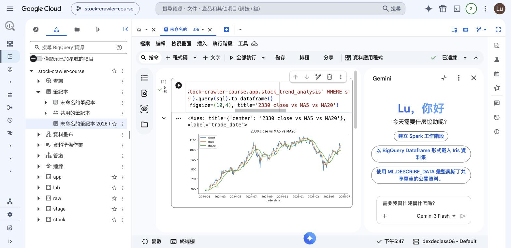

Step 5 的 Looker Studio 是「給別人看的儀表板」，這裡是「自己分析時的工作檯」——同一份 app 層資料，兩種用途。

**要知道的**：runtime 是一台計費的 VM，而且屬於單一使用者，不能多人共用同一個執行環境；閒置一段時間會自動關閉。本機 Jupyter 接 MySQL 也做得到同樣的分析，所以筆記本是方便，不構成「非 BigQuery 不可」的理由。

### 資料畫布（Data Canvas）

**是什麼**：Gemini in BigQuery 的一部分。以有向無環圖（DAG）的形式做分析——畫面上是一個個節點（搜尋、資料表、SQL、視覺化、洞察等），節點連起來就是一條分析流程。

**能做什麼**：用自然語言搜尋資料資產、由自然語言產生 SQL、用自然語言描述要什麼圖並產生視覺化。關鍵是**它產生的 SQL 看得到也可以編輯**——節點裡就是一段 SQL，改完再往下接，不是黑盒子。定位是探索階段的加速器，正式產線的邏輯仍然要落到 SQL 檔或 Dataform。

**使用前提**：沒開 Gemini 之前，點進去看到的是啟用畫面，做不出任何節點：


兩個 API 要開（都免費，實際用到 Gemini 產生內容時才計費）：

```bash
gcloud services enable geminidataanalytics.googleapis.com --project={你的專案ID}
gcloud services enable cloudaicompanion.googleapis.com --project={你的專案ID}
```

**動手做**：開好之後回到「資料畫布 → 建立資料畫布」，左下角出現「向 Canvas Assistant 提問」。點開它——**它會先讀你專案裡的表，然後自己提出問題**：

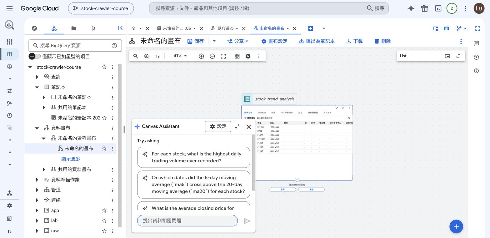

注意中間那一題：「On which dates did the 5-day moving average (`ma5`) cross above the 20-day moving average (`ma20`) for each stock?」——**沒有人告訴它 ma5、ma20 是移動平均**，它是從 Step 4 建的欄位名推出來的，而且問的正好是技術分析的黃金交叉。這就是「Gemini 看得到你的 schema」的意思。

指定資料來源（勾 `app.stock_trend_analysis`）之後，畫布上就會長出第一個節點——表本身，帶完整的結構定義，下方兩個按鈕是接下一個節點用的：

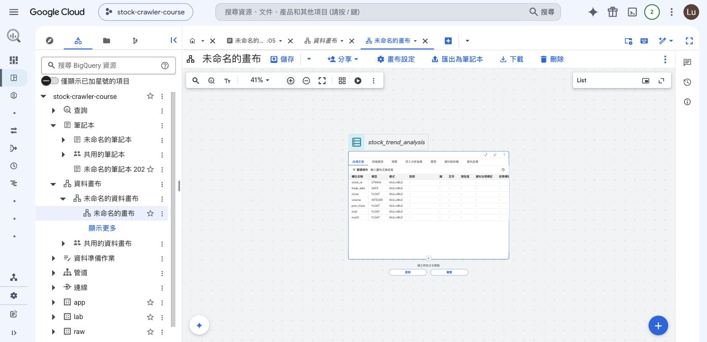

這就是 DAG 式分析的起點：從表節點接查詢、再接視覺化，每一步都是畫面上的一個框。

**要知道的**：Assistant 對中文提問的穩定度不如英文（實際操作時遇過中文 prompt 直接回錯誤、換英文就正常）。另外它對 BigQuery ML、nested／repeated 欄位、複雜型別的自然語言支援不佳，也不支援 geomap 視覺化。定位很明確：**探索階段的加速器**，正式產線的邏輯仍然要落到 SQL 檔或 Dataform。

### 資料準備作業（Data Preparation）

**是什麼**：圖形化的資料清理與轉換編輯器，由 Gemini 依樣本資料給出轉換建議。

**能做什麼**：篩選、**去重**、join、欄位改名（schema mapping）、型別轉換、驗證規則、刪除欄位，有 data／graph／schema 三種檢視。做好的資料準備可以排程自動更新目的地表，也可以當成管道裡的一個 task。


**教學價值在對照**：它做的事你已經手寫過了。Step 3 建 stage view 的那段 SQL，逐項都有圖形化的對應：

| Step 3 的 SQL 做法 | 資料準備的對應操作 |
|---|---|
| `ROW_NUMBER() OVER (PARTITION BY stock_id, date ORDER BY Trading_Volume DESC)` + `WHERE rn = 1` | 去重（deduplication） |
| `Trading_Volume AS volume`、`date AS trade_date` | schema mapping 欄位改名 |
| 型別轉換 | Gemini 建議的型別轉換 |
| `CREATE OR REPLACE VIEW` | 指定目的地表 + 排程重整 |

**動手做**：Studio 首頁「新建 → 資料工程與分析 → 資料準備」，在搜尋框打 `TaiwanStockPrice`，清單會列出所有同名的表（raw 與 stock 兩個 dataset 都有），選 raw 那個按「**新增為來源**」。進到編輯器後，右側「步驟」面板就是 Gemini 給的六種操作：

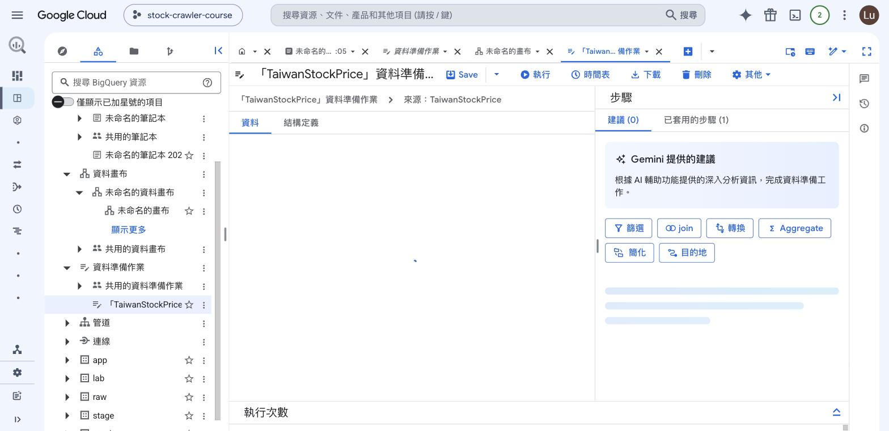

用「篩選」「Aggregate」「轉換」把 Step 3 那段 SQL 一步步點出來，最後用「**目的地**」指定輸出表，再跟 Step 3 的 view 對筆數——兩邊應該一致。整個過程沒有寫 SQL，但做的是同一件事。

**要知道的**：來源與目的地 dataset 必須在同一個 location；Gemini 只看 10k 筆樣本，可能沒涵蓋整份資料的複雜度；而且**它沒有版本控制**。最後這一點正是產線仍然把轉換邏輯寫成程式碼的理由——第 17 章用 DAG 維護 stage/app，那些 SQL 就在 Git 裡，改了什麼、誰改的、要回到哪一版都查得到。

### 管道（Pipelines）

**是什麼**：BigQuery 內建的轉換編排，底層是 **Dataform**。

**能做什麼**：把 SQL 查詢、筆記本、資料準備作業、SQLX task 串成有先後順序與相依關係的流程，並指定時間與頻率自動執行。Dataform 那一層提供 SQLX（擴充 SQL 的語言，內含相依管理與資料品質測試）、`ref()` 函式自動推導 DAG、assertions 做唯一性與非空值檢查，並支援用 Git 協作。

**動手做：把同一套 stage/app 改用管道編排**（Console 專屬，沒有 CLI）

Studio 首頁「**新建 → 資料工程與分析 → 管道**」，先選這個管道用誰的身分執行——登入者的使用者憑證，或指定一個服務帳戶。這又是「人的身分 vs 程式的身分」那條線：要排成每天自動跑就該選服務帳戶，免得建立者離職後排程跟著失效。

進到編輯畫面，上方三個入口對應它的三種能力：**執行**（立刻跑一次）、**觸發條件**（設排程）、**分享**（授權）：

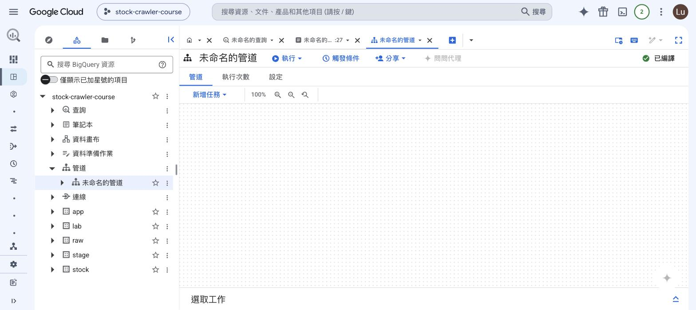

「新增任務」的選單就是它能串的東西——宣告來源、用 SQL 建表或 view、資料準備工作、資料品質測試、查詢、筆記本：

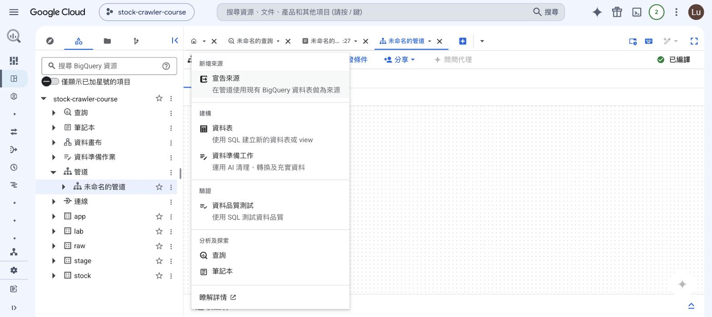

選「資料表」之後，它先問你**輸出成什麼型態**——這四個選項正是 Step 3/4 那個「view 還是 table」的取捨，被做成了選項：

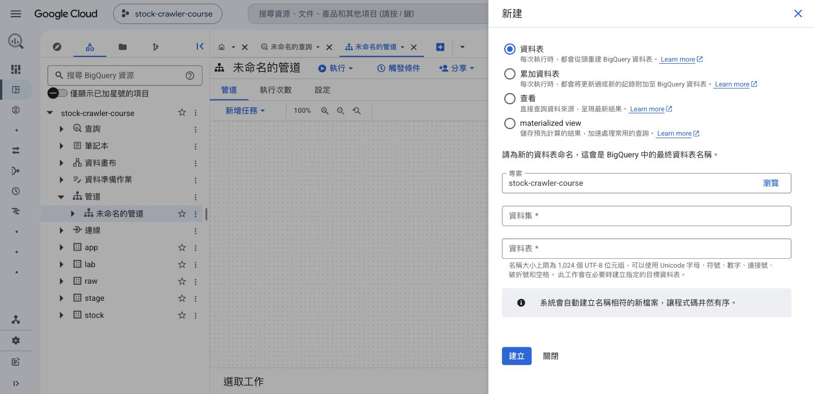

| 選項 | 行為 | 對應第 15 章 |
|------|------|---------|
| 資料表 | 每次執行從頭重建 | Step 4 的 `CREATE OR REPLACE TABLE`（app 層） |
| 累加資料表 | 每次執行把新記錄附加上去 | raw 層的 append 語義 |
| 查看（view） | 不存資料，查詢時才算 | Step 3 的 `CREATE OR REPLACE VIEW`（stage 層） |
| materialized view | 存預先計算的結果 | 〈五個強項〉第四條那個折衷方案 |

填完資料集與表名，畫面下方會出現一行 `definitions/stock_price_daily_pipe.sqlx`——**這就是「底層是 Dataform」的直接證據**：你在 UI 上點的每個任務，實體都是一個 SQLX 檔。建好後右邊的編輯器裡是這樣：

```javascript
config {
  type:"view",
  name:"stock_price_daily_pipe",
}
SELECT stock_id, date AS trade_date, ...   ← config 底下接你的 SQL
```

左邊「**先執行**」下拉就是宣告依賴的地方：建第二個任務（app 層的 CTAS）時，在這裡選 task 1，管道就知道要先跑 stage 再跑 app。這跟 Dataform 的 `ref()` 是同一件事的兩種介面——用 `ref()` 寫在 SQL 裡會自動推導依賴，用下拉選則是手動指定。

> 編輯器預設是唯讀的，要按任務卡片上的「**開啟**」才能編輯 SQL。**只改 `config` 底下那一行提示文字**，不要動 config 區塊本身——它的引號被改壞的話，任務型態會從 `table` 跳回別的型態。

填好 SQL 後按上方「**執行管道 → 執行所有工作**」，跳出「已順利開始執行管道」。切到「**執行次數**」分頁看結果：

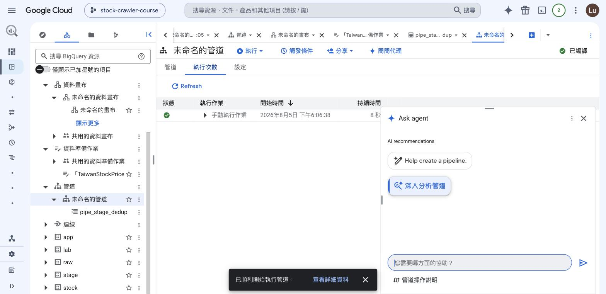

綠勾、8 秒完成。回頭用 `bq` 驗收它真的建出表了：

```bash
bq query --use_legacy_sql=false \
  "SELECT COUNT(*) AS n, COUNT(DISTINCT stock_id) AS stocks FROM lab.pipe_stage_dedup"
```

筆數會跟 Step 3 的 `stage.stock_price_daily` 一模一樣——**同一段去重邏輯，一個寫在 SQL 檔裡、一個包成管道任務**。

**它跟排程查詢差在哪——什麼時候該用誰**

兩者都能「排一段 SQL 定時跑」，功能重疊，但適用的規模不同：

| | 排程查詢（Scheduled Query） | 管道（Pipelines／Dataform） |
|---|---|---|
| 一個排程裡的 SQL | 一段（多段要用分號串成 multi-statement） | 多個任務，各自獨立 |
| 任務之間的依賴 | **沒有**——分號串起來的是「依序執行」，不是依賴關係 | **有**——`ref()` 或「先執行」下拉明確宣告 |
| 某一段失敗了 | 整段中止，後面的不跑，但**已經跑完的不會回復** | 只有下游任務被擋，可以只重跑失敗的那一段 |
| 版本控制 | 沒有，SQL 存在排程設定裡 | Dataform 那層可以接 Git |
| 資料品質檢查 | 自己在 SQL 裡寫 | 內建 assertions（唯一性、非空值） |
| 建立方式 | CLI（`bq mk --transfer_config`）或 Console | **只有 Console** |
| 適合的規模 | 一兩段 SQL、邏輯穩定、改動少 | 十幾張表互相依賴、需要溯源與測試 |

**一句話的選法**：SQL 少、關係簡單，用排程查詢——它有 CLI、可以寫進部署腳本；**表一多、彼此有依賴、而且會常常改**，就值得搬到管道，換來依賴宣告、部分重跑與 Git。本課程的三層只有三段 SQL，排程查詢就夠用，所以動手的那一節放在排程查詢。

**兩者共同的天花板：都只在 BigQuery 內部，取代不了第 17 章的 DAG。** 把「新增任務」那份選單再看一次，沒有任何一項能發任務給外部系統。第 17 章那支 DAG 的六個 task 是 `start → send_crawler_tasks → wait_for_workers → create_stage_layer → create_app_layer → end`，**管道只能接手後面兩個**；前面「把任務發給 Celery worker、等 worker 消化」那一段它碰不到。

| | BigQuery 管道／Dataform | Airflow（第 10-12、17 章） |
|---|---|---|
| 管轄範圍 | 只管 BigQuery 內部的轉換 | 跨系統：爬蟲、Celery、MySQL、BigQuery、通知 |
| 相依表達 | `ref()` 自動推導 DAG | Python 明確定義 task 依賴 |
| 觸發外部系統 | 不行 | 可以（第 12 章的 `apply_async` 打 Celery） |
| 重試與失敗處理 | 有限 | retries、retry_delay、SLA、callback |
| 版本控制 | Dataform 有 Git；資料準備作業沒有 | 就是 Python 檔，本來就在 Git |
| 執行成本 | 只付 BigQuery 查詢費 | Composer 環境常駐計費 |

業界常見的組合是 Airflow 負責跨系統編排，倉儲內部那一段交給 Dataform。

**要知道的**：Console 專屬；建立後不能更改 region；授權只到 pipeline 層級，不能針對個別 task；上一輪排程還沒跑完，下一輪會被略過。

### 連線（Connections）——BigQuery 直接讀 Cloud SQL 的活資料

**是什麼**：BigQuery 對外部資料來源的連線設定。支援的類型包含 Cloud SQL、Spanner、AlloyDB、Cloud Storage、Amazon S3、Blob Storage、Apache Spark。

**能做什麼**：建好連線之後，用 `EXTERNAL_QUERY()` 把一段 SQL 送到外部資料庫執行，結果以暫存表回到 BigQuery。對第 15 章那條資料線的意義很直接——**第 16 章之後 MySQL 那份資料住在 Cloud SQL，BigQuery 不必等任何 ETL，可以直接讀它此刻的內容**。

**操作舉例**（全程 CLI）。下面的指令要有一台 Cloud SQL 實例才跑得動——第 16 章建的 `stock-mysql`（`asia-east1`、資料庫 `mydb`）就是它，做完第 16 章再回來試。第 15 章的 dataset 建在 `asia-east1`，跟它同區，所以連線與 JOIN 都成立（理由見下面的限制）。

① 建立連線，`instanceId` 的格式是「專案ID:區域:實例名」：

```bash
bq mk --connection --connection_type=CLOUD_SQL \
  --properties='{"instanceId":"{你的專案ID}:asia-east1:stock-mysql","database":"mydb","type":"MYSQL"}' \
  --connection_credential='{"username":"root","password":"1234"}' \
  --project_id={你的專案ID} --location=asia-east1 mysql-conn
```

② 連線自己帶一個服務帳戶，要授權它連 Cloud SQL——成員是這個服務帳戶、角色是 `cloudsql.client`、範圍是整個專案（IAM 這套組成方式的完整說明在團體節 T-2）：

```bash
gcloud projects add-iam-policy-binding {你的專案ID} \
  --member="serviceAccount:service-{你的專案編號}@gcp-sa-bigqueryconnection.iam.gserviceaccount.com" \
  --role="roles/cloudsql.client"
```

服務帳戶的完整名稱用 `bq show --connection {專案ID}.{區域}.{連線ID}` 查；Console 的連線詳細資料頁也把它跟其他設定列在一起——連線 ID、資料位置、連線類型、Cloud SQL 連線名稱、資料庫名稱，最後一行就是**服務帳戶 ID**：


③ 查詢。查詢要在跟連線相同的區域執行：

```bash
bq query --location=asia-east1 --use_legacy_sql=false \
  "SELECT * FROM EXTERNAL_QUERY('{你的專案ID}.asia-east1.mysql-conn',
   'SELECT stock_id, COUNT(*) AS n FROM TaiwanStockPrice GROUP BY stock_id LIMIT 5')"
```

回傳的是 Cloud SQL 上此刻的筆數，不是副本。這正好收束第 15 章開頭「一份資料的兩個命運」：雙寫的兩份，過去要分別登入兩個系統比對，現在一句 SQL 就對得起來。

**限制要記住**：

- **連線必須與 Cloud SQL 實例同區**。實例在 `asia-east1`，連線就要建在 `asia-east1`；建在別的位置當下就被擋下：`Cloud SQL instance must be in the same multi-region as the connection`
- **要 JOIN BigQuery 的表，dataset 也得在同一區**。第 15 章的 dataset 建在 `asia-east1`（跟 VM、Cloud SQL 同區），所以上面那個對帳查詢成立。若 dataset 當初建在別的位置（例如 `US`），同一句 SQL 會回 `Not found: Dataset {專案ID}:raw was not found in location asia-east1`——**資源放同一區不只是延遲考量，它決定了哪些查詢寫得出來**
- **`--dry_run` 對 federated query 無效**：官方載明執行前無法計算會處理多少 bytes。實驗一教的「先問價再跑」，到這裡失效
- **唯讀**，不支援 DML 與 DDL；查詢速度取決於 Cloud SQL 那台機器，不會有倉儲的平行加速
- Cloud SQL 實例剛從停用喚醒、狀態還在 MAINTENANCE 時，查詢會回 `MysqlErrorCode(2013): Lost connection to MySQL server during query`——不是設定錯，等實例回到 RUNNABLE 再跑

### 排程查詢（Scheduled Queries）——BigQuery 自己就能排程

**是什麼**：BigQuery 內建的週期性查詢執行，背後是 BigQuery Data Transfer Service 的排程器。支援 GoogleSQL，**包含 DDL 與 DML**。

**能做什麼**：把任何一段 SQL 排成固定頻率自動執行。排程語法不是 crontab 的五個欄位，是類 cron 的英文寫法：`every 24 hours`、`every day 20:30`、`every monday 09:00`、`every hour on mon,tue,wed,thu,fri`。最小間隔 5 分鐘。

**多段 SQL 要有順序怎麼辦**：排程與排程之間沒有相依機制，不能宣告「B 等 A 跑完才跑」。做法是把多段 SQL 用分號串成一段 multi-statement query 送進同一個排程——它們在同一個 job 內依序執行、共享狀態、失敗即中止。把 Step 3 的 stage view 與 Step 4 的兩張 app 表串成一段，就是「raw → stage → app 一條龍」。

**動手做：把 Step 3 與 Step 4 排成每天自動跑**

這一段不是示意，是把你手寫過的 SQL 原封不動搬進排程。三段 SQL 用分號串成一個 multi-statement query：①重建 stage view ②重算 `app.stock_trend_analysis` ③重算 `app.market_daily_summary`。

**兩個必須注意的地方**，不照做會失敗：

| 注意事項 | 為什麼 |
|---|---|
| 表名一律寫**完整三段式**（`` `專案.資料集.表` ``） | 排程執行時沒有「目前所在資料集」這個脈絡，`raw.TaiwanStockPrice` 這種寫法找不到表 |
| 指令**必須帶 `--service_account_name`** | 不帶的話指令會卡在互動式 OAuth 授權，在非互動環境永遠等不到 |

SQL 有換行和引號，直接塞進 `--params` 很容易跳脫錯誤——用檔案傳比較穩：

```bash
# ① 把 SQL 寫成 JSON 參數檔
cat > /tmp/sq_params.json <<'JSON'
{"query": "CREATE OR REPLACE VIEW `你的專案ID.stage.stock_price_daily` AS SELECT stock_id, date AS trade_date, open, max, min, close, spread, Trading_Volume AS volume, Trading_money AS amount FROM (SELECT s.*, ROW_NUMBER() OVER (PARTITION BY stock_id, date ORDER BY Trading_Volume DESC) AS rn FROM `你的專案ID.raw.TaiwanStockPrice` s) WHERE rn = 1; CREATE OR REPLACE TABLE `你的專案ID.app.stock_trend_analysis` AS SELECT stock_id, trade_date, close, volume, LAG(close) OVER (PARTITION BY stock_id ORDER BY trade_date) AS prev_close, AVG(close) OVER (PARTITION BY stock_id ORDER BY trade_date ROWS BETWEEN 4 PRECEDING AND CURRENT ROW) AS ma5, AVG(close) OVER (PARTITION BY stock_id ORDER BY trade_date ROWS BETWEEN 19 PRECEDING AND CURRENT ROW) AS ma20 FROM `你的專案ID.stage.stock_price_daily`; CREATE OR REPLACE TABLE `你的專案ID.app.market_daily_summary` AS SELECT trade_date, COUNT(DISTINCT stock_id) AS active_stocks, SUM(volume) AS total_volume, ROUND(AVG(close),2) AS avg_close, COUNTIF(spread>0) AS up_count, COUNTIF(spread<0) AS down_count FROM `你的專案ID.stage.stock_price_daily` GROUP BY trade_date;"}
JSON

# ② 建立排程（每天 20:30，收盤後）
bq mk --transfer_config --project_id={你的專案ID} \
  --data_source=scheduled_query --display_name="每日重算 stage 與 app" \
  --schedule="every day 20:30" --location=asia-east1 \
  --service_account_name={你的專案編號}-compute@developer.gserviceaccount.com \
  --params="$(cat /tmp/sq_params.json)"
# Transfer configuration 'projects/.../transferConfigs/6a73db86-...' successfully created.
```

不必等到明天 20:30——**手動觸發一次就能驗收**：

```bash
CFG=projects/{專案編號}/locations/asia-east1/transferConfigs/{建立時回傳的ID}

bq mk --transfer_run --run_time="2026-08-05T10:00:00Z" $CFG   # 立刻跑一次
bq --format=prettyjson ls --transfer_run --run_attempt=LATEST --max_results=1 $CFG
#   "state": "SUCCEEDED"
#   "errorStatus": {}
```

跑完回頭查三層筆數，`stage` 與 `app` 就是這個排程重建的：

```bash
bq query --use_legacy_sql=false \
  "SELECT 'raw' AS l, COUNT(*) AS n FROM raw.TaiwanStockPrice
   UNION ALL SELECT 'stage', COUNT(*) FROM stage.stock_price_daily
   UNION ALL SELECT 'app.trend', COUNT(*) FROM app.stock_trend_analysis
   UNION ALL SELECT 'app.summary', COUNT(*) FROM app.market_daily_summary ORDER BY l"
```

**Console 版**：查詢編輯器上方有「**排程**」按鈕，把同一段 SQL 貼進去填表就能建。建好的排程列在 BigQuery →「已排定的查詢」，顯示排程語法、區域與下次執行時間：


點進去的「**執行作業記錄**」分頁是驗收的地方——每一次執行一列，綠勾代表成功，「查看詳細資料」可以追到那次跑的 job：

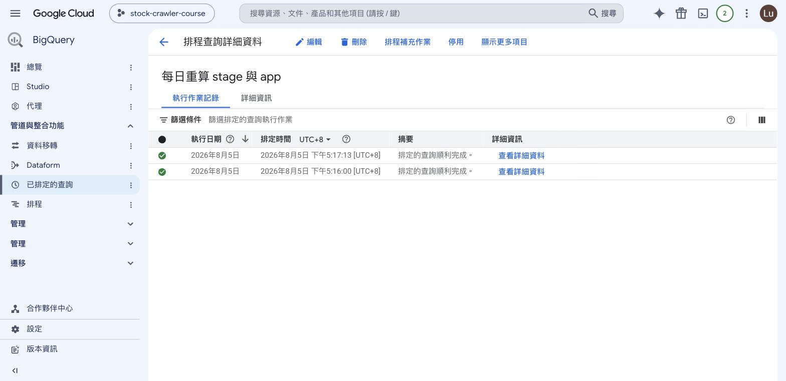

**兩個要知道的**：

- 官方警告**整點觸發可能重複執行**（例如排在 09:00 可能觸發多次，如果 SQL 是 `INSERT` 就會產生重複資料），建議改用 09:03 這類非整點時刻。這回頭印證第 6 章：連雲端託管的排程器都可能重複觸發，冪等寫法不是可選項
- 內建 `@run_time`、`@run_date` 兩個查詢參數，不必自己算日期，很適合「只重算今天分區」這種增量更新

**那為什麼還要 Airflow？** 因為排程查詢只能排 SQL，而且只在 BigQuery 裡面。第 17 章那條每日資料線的起點是「發任務給 Celery worker 去爬」——跨機器、要重試、要等 worker 消化，這一段 BigQuery 碰不到。分工是這樣的：

| 需求 | 排程查詢 | Airflow |
|---|---|---|
| 只重算 BigQuery 內部的 stage/app | 夠用，且不需要常駐服務 | 做得到，但用不到它大部分的能力 |
| 先觸發爬蟲、等 worker 跑完再轉換 | 做不到 | 做得到 |
| retry、失敗通知、SLA | 沒有 | 有 |
| 跨 MySQL／BigQuery／外部 API | 做不到 | 做得到 |
| 常駐成本 | 零 | Composer 環境按時計費 |

---
---

## 三、BigQuery 的五個強項——對照 MySQL／Cloud SQL

把前面兩部分收成五條。每一條都附上「MySQL／Cloud SQL 做得到嗎、做到什麼程度」，這樣「為什麼要多一個倉儲」才有具體的答案。

**一、儲存與運算分離**

資料存在儲存層，查詢執行時才臨時調度平行 worker，兩邊各自獨立擴充。你不必選機器規格，也不會遇到磁碟滿掉的問題。

*MySQL／Cloud SQL*：做不到。Cloud SQL 建實例時要選 CPU、記憶體與磁碟（第 16 章的 `--tier=db-f1-micro`），磁碟會滿、擴容要調整實例、算力上限就是那台機器。要更快只有換更大的機器這一條路。

**二、欄式儲存，而且不用自己建索引**

沒被查詢引用的欄不讀（實驗一量過），分區再從「讀哪幾列」的方向裁一次。整個過程不需要你為分析查詢預先設計索引。

*MySQL／Cloud SQL*：InnoDB 是列式，一列的所有欄值存在一起，除非查詢走得到覆蓋索引，否則整列讀進來。MySQL 8 有分區裁剪（補充 C 教過），能剪分區但不能剪欄；而且分析查詢要快就得為它額外建索引，索引本身又會拖慢寫入。

**三、Time Travel**

每張表自動保留過去七天的版本，零設定；`FOR SYSTEM_TIME AS OF` 一句 SQL 查回任一時點，撈成暫存表再塞回原表就完成復原（實驗二做過）。

*MySQL／Cloud SQL*：Cloud SQL 有時間點復原（PITR），但代價完全不同——它要**還原成一個新的實例**，再從新實例把資料撈回來，範圍是整個實例而不是單一張表，時間以分鐘到小時計。自架 MySQL 則要有人事先設好備份，再把備份整份還原。

**四、Materialized View（具體化視圖）**

寫一個定義，BigQuery 幫你存好結果，並在來源表變動時**背景增量重算**。更關鍵的是 smart tuning——查詢**基礎表**時 BigQuery 會自動改寫查詢去走它，**報表和應用程式一行 SQL 都不用改**就享受到加速。這是 Step 4「app 用實體表還是 view」那個取捨的第三個選項：有實體表的速度，又不必自己排程重算。費用要算三筆：查詢掃描、背景維護、實體化資料的儲存。

*MySQL／Cloud SQL*：沒有 materialized view。要達到同樣效果只能自己建一張彙總表，再用 trigger 或排程維護它的新鮮度，而且應用端必須自己改查詢去指向那張彙總表——沒有 smart tuning 這種自動改寫。

**五、BQML：一句 SQL 訓練模型**

`CREATE MODEL` 訓練、`ML.EVALUATE` 評估、`ML.PREDICT` 預測（實驗三做過），資料完全不必搬出倉儲，也不用另外架訓練環境。訓練／評估的切分也是 OPTIONS 裡的一個參數（`data_split_method`），不必自己寫切分邏輯；模型本身是一個可以查、可以授權、可以排程重建的 BigQuery 物件。

*MySQL／Cloud SQL*：沒有 ML 語法。誠實地說，把資料拉出來用 pandas + scikit-learn 一樣能訓練——差別在你要搬資料、要維護 Python 環境、模型不在資料旁邊，而且每次重訓都得再搬一次。反過來也要承認 BQML 的限制：**沒有增量訓練**（要更新只能整份重跑）、模型種類與超參數的調整空間都比不上專門的 ML 框架。它的定位是「資料已經在倉儲、想快速做出堪用模型」，不是取代 Vertex AI 或 scikit-learn。

> 反過來也要記住：BigQuery **不適合**單筆低延遲讀寫（DML 有配額限制），主鍵點查也比不上 InnoDB 的毫秒級。這正是雙寫要保留 MySQL 的理由——不是誰取代誰，是各自做擅長的事。

---

---

## 收工：把這一篇建立的東西收乾淨

跟著做完之後，專案裡會多出幾樣東西。留著不會產生明顯費用（BigQuery 沒有「開著的機器」），但確定不再用就清掉：

```bash
# 實驗三的模型
bq rm -f -m lab.close_model
bq rm -f -m lab.close_model_seq

# 管道那一節建的表
bq rm -f -t lab.pipe_stage_dedup

# 連線與排程查詢（先用 ls 查出完整名稱再刪）
bq ls --connection --location=asia-east1
bq rm --connection {專案ID}.asia-east1.mysql-conn
bq ls --transfer_config --transfer_location=asia-east1
bq rm --transfer_config {CONFIG_NAME}
```

**筆記本的 runtime 要特別注意**：它是一台計費的 VM，閒置一段時間會自動關閉，但想立刻收掉就在筆記本介面右上角中斷連線。資料畫布、資料準備、管道本身不計費，只有它們**執行查詢**時照 BigQuery 的掃描量計費。

## 本篇總結

- **三個實驗量出來的證據**：掃描量隨引用欄位變化（`SELECT *` → 單欄 → `COUNT(*)`）、Time Travel 七天版本回溯、BQML 一句 SQL 訓練與預測
- **BQML 的兩個關鍵觀念**：預設的 `AUTO_SPLIT` 在資料少於 500 列時不切分（`eval_loss` 是 NULL，那個 r² 量的是訓練資料），時間序列要用 `SEQ` 依日期切；**模型是訓練當下的快照**——新資料可以當推論輸入或測試集，但要讓模型學到它只能重訓
- **省錢兩開關**：少引用欄位（欄式儲存）＋分區過濾；`LIMIT` 不減少掃描量，`COUNT(*)` 靠中繼資料連掃都不用掃
- **Studio 六項功能**：筆記本、資料畫布、資料準備作業（對照你手寫的 stage SQL）、管道（只管倉儲內部，取代不了第 17 章的 DAG）、連線（`EXTERNAL_QUERY` 讀 Cloud SQL 活資料）、排程查詢（SQL 排得動，爬蟲排不動）
- **五個強項對照 MySQL／Cloud SQL**：儲存運算分離、欄式且免建索引、Time Travel、Materialized View、BQML
- 反過來也要記住：BigQuery **不適合**單筆低延遲讀寫，主鍵點查也比不上 InnoDB——這正是第 15 章雙寫要保留 MySQL 的理由
