# 課程手冊14 - GCP 開通與雲端部署

> 本章對應 EP17。課堂教學順序：本章完成 GCP 開通之後，下一堂回頭做第 15 章的 BigQuery 實作——那一章需要的服務帳戶與金鑰，在本章就會發好。
>
> 本章需要一張信用卡（或簽帳金融卡）與一個從未用過 GCP 的 Google 帳號。**課前請準備好這兩樣東西。**

## 做完這一章你會

1. 開通 Google Cloud 的 $300 美元免費試用，並在第一時間設好預算警告
2. 建立課程專用的專案（project），理解專案名稱與專案 ID 的差別
3. 建立服務帳戶（Service Account）並下載 JSON 金鑰——第 15 章 BigQuery 實作的通行證
4. 安裝 gcloud CLI，用指令登入、切換專案、管理雲端資源
5. 開出第一台雲端 VM，SSH 進去安裝 Docker
6. 把整套股票爬蟲系統（`docker-compose-all.yml`）搬上雲端，跑通完整閉環
7. 設定防火牆規則，從自己的瀏覽器打開雲端上的 Airflow、Flower、phpMyAdmin
8. 用停機指令保住試用額度

## 先搞懂：為什麼要上雲

到第 13 章為止，整套系統都跑在你自己電腦的 VM 裡。它能動，但有三個極限：

1. **不能 24 小時跑**：你的電腦關機，排程就停了。每天收盤後自動爬資料的需求做不到
2. **不能對外服務**：你的電腦沒有固定的公網位址，別人連不進來，API 給不了外部使用
3. **規格不能伸縮**：資料量變大、任務變多的時候，筆電的 CPU 和記憶體就是上限

雲端解決這三件事：Google 機房裡的機器 24 小時開著、有公網 IP、規格隨租隨換。代價是按用量付費——所以「用完就關」的習慣跟技術本身一樣重要，本章會一起教。

### GCP 的層級心智圖

```
Google 帳號（你的 Gmail）
 └── 帳單帳戶（綁信用卡，$300 試用額度掛在這裡）
      └── 專案 project（一切資源的容器，費用統計與權限管理的單位）
           └── 資源（VM、資料庫、BigQuery 資料集……都掛在某個專案底下）
```

- 資源開在某個**區域（region）**的某個**可用區（zone）**。本課程用 `asia-east1`（台灣彰化），離我們最近、延遲最低
- 每個服務的 API 要**各自啟用**：第一次用 Compute Engine 要啟用它的 API，第 15 章第一次用 BigQuery 也要啟用它的 API

### 費用的三個事實

1. **試用期間不會被收費**。$300 美元額度、90 天內有效；額度用完或到期，帳戶只會停用，不會扣你的卡
2. **「啟用完整帳戶」按鈕是付費的開關**。只有你主動按下它，超出額度的用量才會真的向卡片收費。課程期間不要按
3. 運算費只在 VM 開機時計；磁碟費開關機都收，但很小（20GB 約每月 NT$25）

## 一步一步

### Part A：開通 $300 免費試用

**A-1 從零到達官網**

1. 準備一個全新的 Google 帳號。試用資格是「這個帳號從未申請過試用、也從未成為 GCP／Google Maps／Firebase 的付費用戶」，**一個帳號只有一次機會**，刪掉重辦也不會重置
2. 在瀏覽器登入這個帳號
3. 網址列輸入 `cloud.google.com`。用 Google 搜尋「Google Cloud」點官方結果也會到同一個地方
4. 先點右上角的圓形頭像，確認顯示的是要開通的帳號；不對就切換
5. 點藍色「**免費試用**」按鈕（右上角和頁面中央各一顆，功能相同）

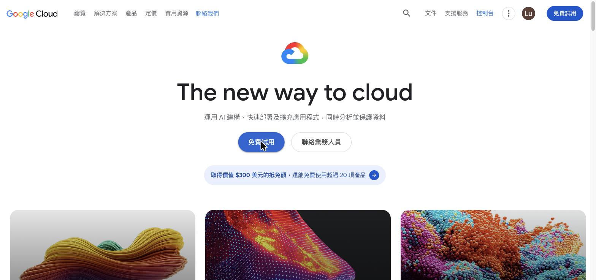

**A-2 註冊步驟 1（共 2 步）：帳戶資訊**

- 「國家/地區」會依帳號自動預選「台灣」，維持不動
- 「最新消息電子郵件」是選填的電子報，可以不勾
- 右側資訊列出三個重點：$300 抵免額、90 天內使用、**不會自動收費**
- 按「**同意並繼續**」，代表同意《Google Cloud Platform 服務條款》與《免費試用增補條款及細則》

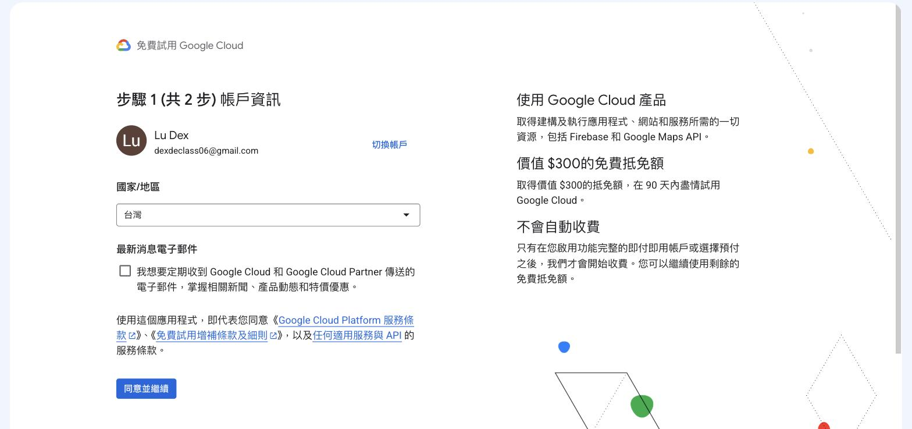

**A-3 註冊步驟 2（共 2 步）：驗證付款資訊**

頁面最上方的官方說明回答了「為什麼要填信用卡」：

> 別擔心，試用期間內不會產生費用。收集付款資訊可協助我們驗證您的身分，減少詐欺活動。您手動啟用功能完整的即付即用帳戶或選擇預付之前，系統都不會向您收費。

這一頁有三個區塊，由上到下填：

1. **聯絡資訊**：帳戶類型選「個人」（公司採購才選商家），填姓名與地址。填完會顯示一組系統自動產生的付款資料 ID，不用理會
2. **稅務資訊（稅籍）**：
   - **未登記**：個人用途選這個。課程學員一律選「未登記稅籍的個人」，不用填任何編號
   - **已登記**：有統一編號、辦過營業登記的公司行號才選。選了要填統編，之後帳單會開立含統編的發票
3. **付款方式**：點「新增付款方式」，在跳出的視窗填卡號、有效期限（月/年）、安全碼（卡片背面三碼）、持卡人姓名；「帳單地址與法定地址相同」預設打勾即可。按「儲存卡片」

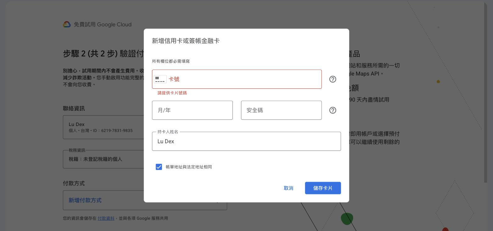

三個區塊都完成後，按最下方的「**開始免費試用**」。

**A-4 開通完成**

按下後自動跳轉到 Google Cloud 控制台，畫面重點：

- 頂部橫幅顯示「免費試用狀態：抵免額剩餘 $9,xxx，試用期還有 90 天」。**金額用新台幣顯示**——$300 美元依匯率換算約九千多元，不是給了你九千美元，也不是縮水
- 系統自動建立了一個專案「My First Project」，ID 是一串亂數
- 藍色「**啟用完整帳戶**」按鈕就是付費的開關，課程期間不要按

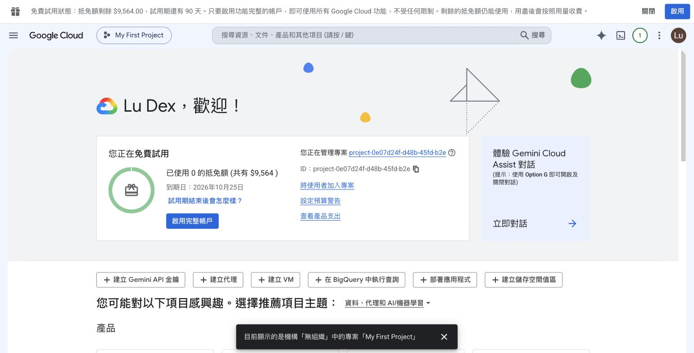

### Part B：第一件事——設定預算警告

預算警告的作用是「額度燒太快時提早收到通知」。把它排在開通後的第一件事，是為了養成「先裝保險絲、再開始用電」的習慣。

**進入設定頁**（兩條路都通）：

- 開通完成頁的卡片上直接點「**設定預算警告**」連結
- 平常的路徑：左上角「≡」選單 → **帳單** → 左側「**預算與警告**」

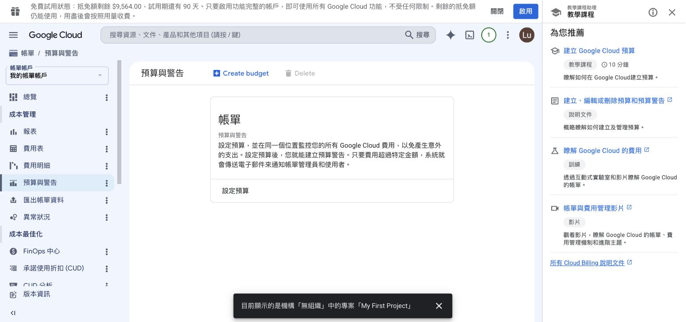

點「**Create budget / 設定預算**」，表單分四段，每段填完按「下一步」：

**① 定義**：型態選「**僅傳送警告（適用於所有服務）**」——超過門檻寄 email，不動任何服務。另一個「強制執行支出上限」標示預覽且只適用部分服務，課程不用。名稱自取，例如「課程預算警戒」

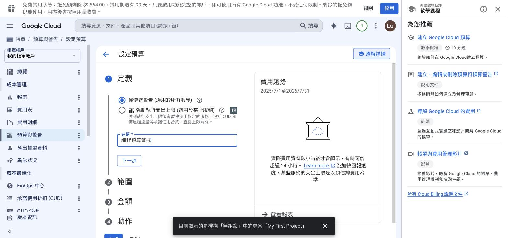

**② 範圍**：全部維持預設值——時間範圍「每月」（每月一日起算、月初重設）、所有專案、所有服務

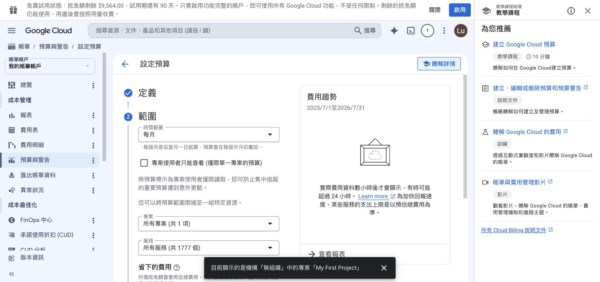

**③ 金額**：預算類型維持「指定的金額」，目標金額填 **3000**（新台幣）。試用額度約九千多元、課程約三個月，單月燒超過三分之一就是異常。
注意：欄位預設有一個 `0`，先全選清掉再輸入，否則會變成 `03000`

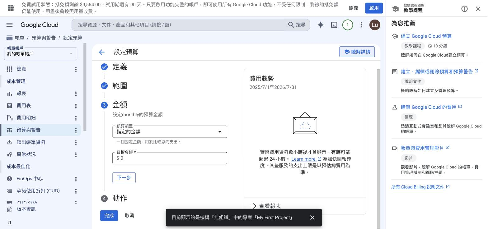

**④ 動作**：警告門檻維持預設三段 50% / 90% / 100%，通知方式維持勾選「透過電子郵件將警告傳送給帳單管理員和使用者」——警告信會寄到你開通用的 Gmail。按「**完成**」

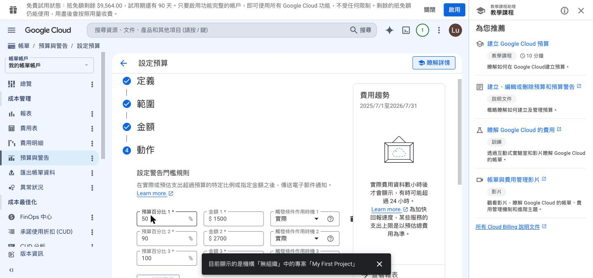

建立後回到清單頁，看得到這筆預算與它的三段臨界值。之後要修改，從同一個路徑（帳單 → 預算與警告）點名稱進去改。

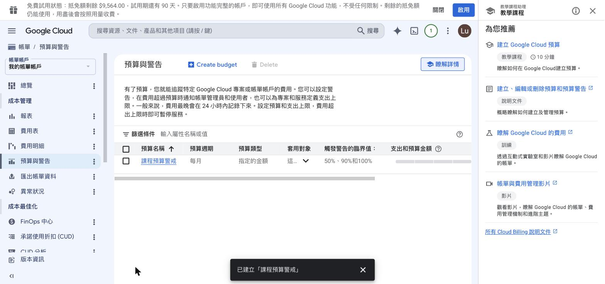

### Part C：建立課程專用專案

先搞懂兩件事：

- **專案是 GCP 一切資源的容器**：VM、資料庫、BigQuery 資料集都掛在專案底下；費用統計、API 啟用、權限管理都以專案為單位
- **專案名稱與專案 ID 是兩回事**：名稱給人看、之後可以改；**ID 給系統用、全球唯一、設定後永遠不能改**。之後指令用的都是 ID

操作步驟：

1. 點控制台頂部列的專案名稱（目前顯示「My First Project」）→ 跳出「選取專案」視窗
   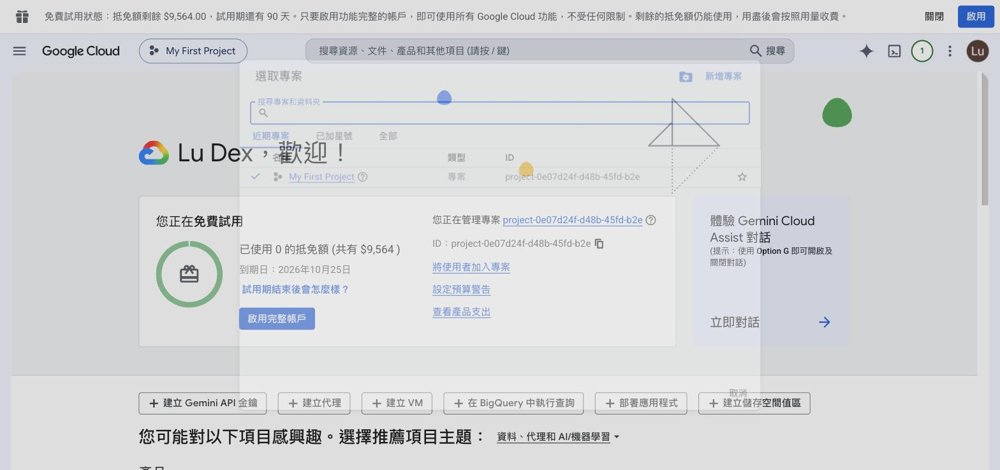
2. 點視窗右上角「**新增專案**」
3. 專案名稱填 `stock-crawler-course`。專案 ID 會跟著名稱自動產生；ID 需要全球唯一，**如果這個名稱被別人用過，系統會自動加亂數後綴——你的 ID 跟講師畫面不同是正常的**。父項資源維持「無組織」
   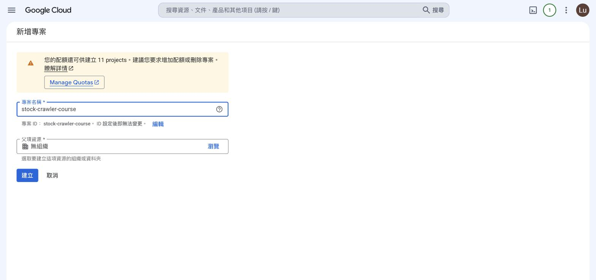
4. 按「**建立**」，幾秒後右上角鈴鐺出現「建立專案：stock-crawler-course」的通知
   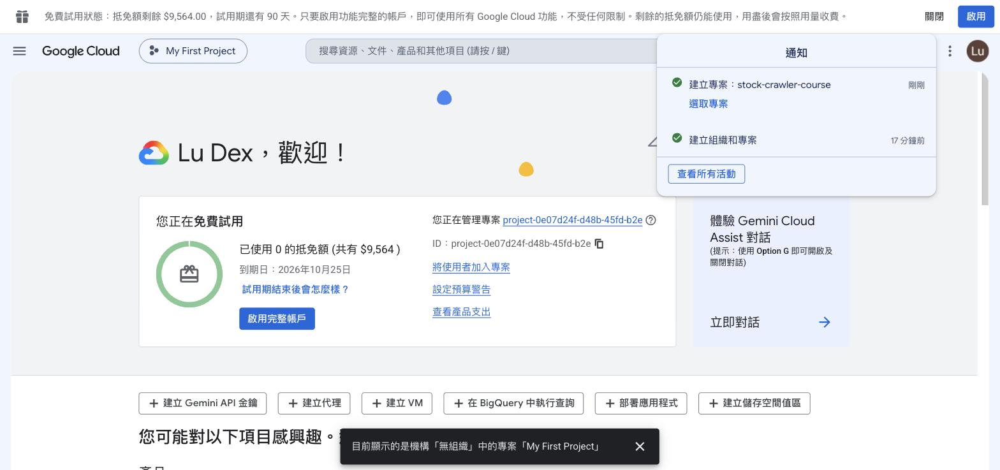
5. **建立完不會自動切換**——頂部列還是「My First Project」。點通知裡的「選取專案」切換過去
6. 確認方法：頂部列與歡迎頁的「您正在管理專案」都顯示 `stock-crawler-course`
   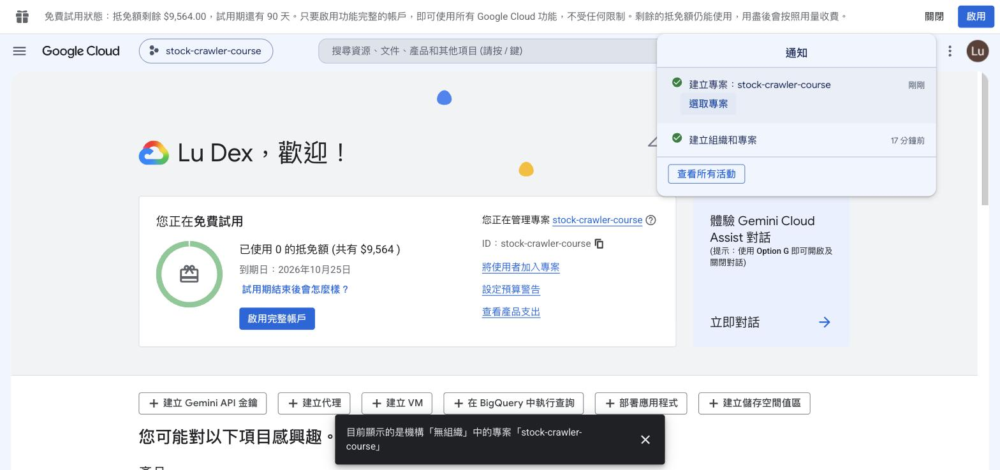

> 之後任何「找不到資源」的問題，第一件事先看頂部列的專案名稱——最常見的原因是站在錯的專案裡找東西。

### Part D：建立服務帳戶與 JSON 金鑰

先搞懂：

- **服務帳戶是「給程式用的帳號」**。你登入 GCP 用的是 Google 帳號（人的身分）；程式要存取 GCP 資源時，不能把你的個人帳密寫進程式碼，而是給程式一個專屬的機器身分
- 服務帳戶的格式像一個 email：`名稱@專案ID.iam.gserviceaccount.com`
- **JSON 金鑰是這個身分的鑰匙**：程式拿著這個檔案向 Google 證明身分。第 15 章的 `GOOGLE_APPLICATION_CREDENTIALS` 環境變數指向的就是它
- **建立時不給任何角色**：權限的原則是「需要什麼、才給什麼」（最小權限）。第 15 章要用 BigQuery 時再加對應角色

**D-1 建立服務帳戶**

1. 左上角「≡」選單 →「**IAM 與管理**」→ 左側「**服務帳戶**」。先確認頂部的專案是 `stock-crawler-course`
2. 點「**+ 建立服務帳戶**」，步驟①填三個欄位：
   - 服務帳戶名稱：`stock-crawler-sa`
   - 服務帳戶 ID：自動跟著名稱產生，下方即時預覽完整 email
   - 服務帳戶說明：填用途，例如「課程用服務帳戶：BigQuery 上傳與查詢」
   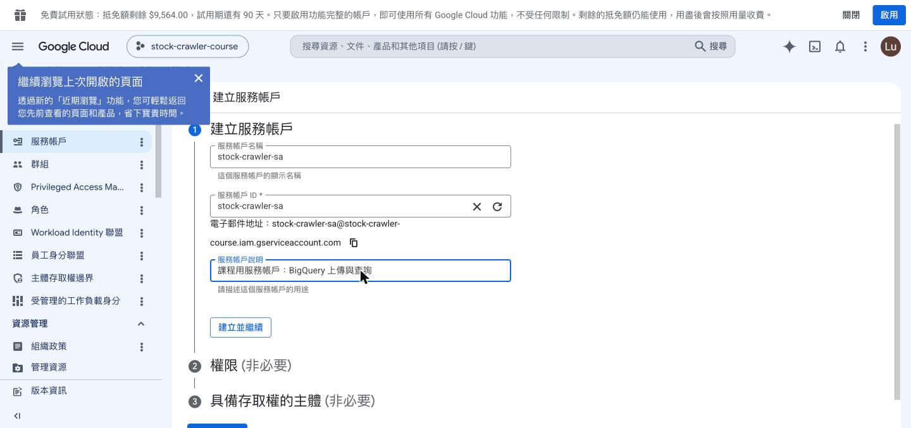
3. 按「**建立並繼續**」
4. 步驟②「權限」**不選任何角色**，直接按「**完成**」（步驟③一併略過）
   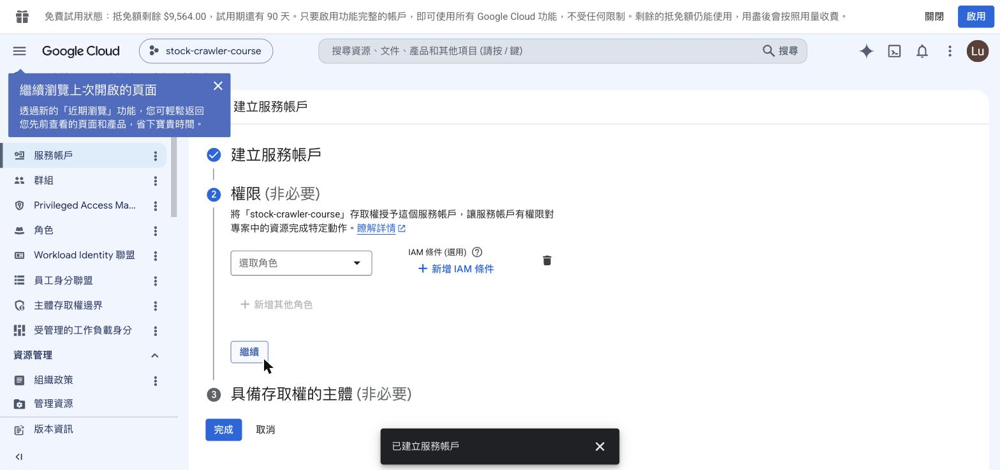
5. 回到清單，確認：狀態「已啟用」、金鑰欄「沒有任何金鑰」

**D-2 建立並下載 JSON 金鑰**

1. 在清單點服務帳戶的 **email 藍色文字連結**（點到最左邊的方框會變成勾選，不是進入）
2. 進入詳細頁後點「**金鑰**」分頁。頁面上兩條官方警告都要當真：
   - 金鑰遭盜用會有安全風險——拿到檔案的人就等於這個服務帳戶
   - **Google 會自動停用在公開存放區偵測到的金鑰**——金鑰推上公開 GitHub 會被掃到並直接停用
   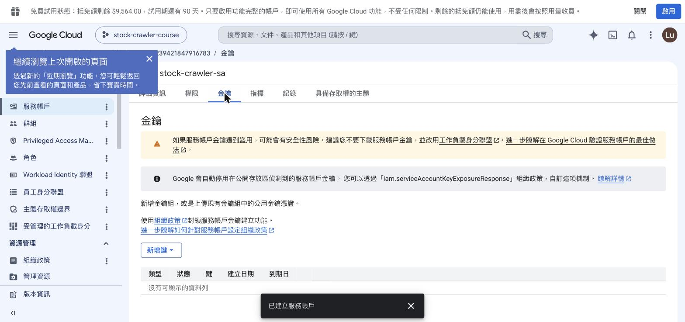
3. 點「**新增鍵**」→「**建立新的金鑰**」→ 格式選 **JSON**（預選的建議值；P12 是舊格式相容用）
   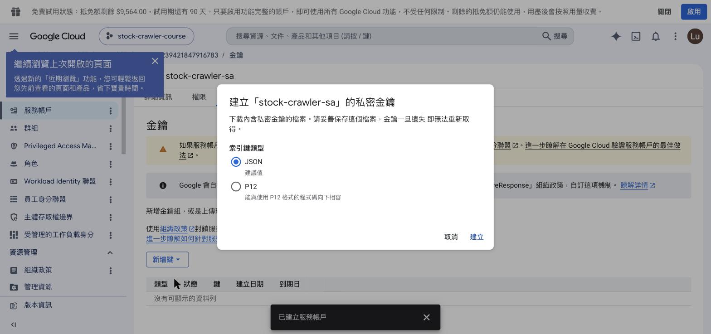
   視窗上的警語：「請妥善保存這個檔案，**金鑰一旦遺失即無法重新取得**」——GCP 只在下載這一刻給你私鑰，之後不留副本
4. 按「**建立**」→ 瀏覽器自動下載金鑰檔到「下載」資料夾，檔名格式 `{專案ID}-{亂數}.json`（約 2-3 KB）
   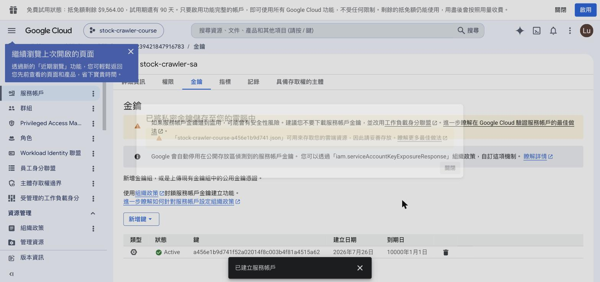

**D-3 金鑰檔的保管**

1. 從「下載」資料夾移到固定位置，並限制讀取權限：
   ```bash
   mkdir -p ~/gcp-keys
   mv ~/Downloads/stock-crawler-course-*.json ~/gcp-keys/
   chmod 600 ~/gcp-keys/stock-crawler-course-*.json
   ```
2. 這個路徑第 15 章會填進 `GOOGLE_APPLICATION_CREDENTIALS`，先記住放在哪
3. 永遠不放進任何 git 專案資料夾
4. 遺失或外洩的處理：回到「金鑰」分頁，用垃圾桶圖示刪掉舊金鑰（立即失效），再建一把新的

### Part E：gcloud CLI

gcloud 是 GCP 的指令列工具，跟 uv、git 一樣是「又一個 CLI 工具」。Console 能做的事 gcloud 幾乎都能做，而且指令可以複製、重跑、寫進腳本——本章之後的操作以 gcloud 為主。

**安裝**

- macOS：`brew install --cask google-cloud-sdk`
- 其他平台照官方安裝頁：https://cloud.google.com/sdk/docs/install
- 驗證：`gcloud --version` 有出現版本號就是裝好了

**登入（會開瀏覽器）**

```bash
gcloud auth login
```

終端機印出授權網址並自動開瀏覽器 → 選你開通 GCP 的那個帳號 → 按「允許」。成功後終端機顯示 `You are now logged in as [你的帳號]`。

**設定預設專案**

```bash
gcloud config set project stock-crawler-course   # 填你自己的專案 ID
```

**驗證三連**

```bash
gcloud auth list        # active 帳號前面有 * 號
gcloud config list      # 確認 account 與 project
gcloud projects list    # 列得出你的專案就通了
```

> 如果在登入前就先設了專案，會出現 `WARNING: You do not appear to have access to project`——設定值有寫入，只是還沒有憑證可查。登入後重跑 `gcloud projects list` 確認即可。

### Part F：開第一台雲端 VM

先搞懂：

- **GCE（Compute Engine）就是租一台雲端電腦**，跟你本機的 VM 概念相同，差別是它在 Google 機房、24 小時在網路上、有公網 IP
- 機型 `e2-standard-2` = e2 系列（經濟型）＋ standard（標準記憶體比）＋ 2 顆 vCPU（8GB RAM）。全套 13 個容器需要 8GB；只跑部分服務可以選更小的機型
- 費用：`e2-standard-2` 開機時約 NT$2.4／小時，停機後歸零

**F-1 啟用 Compute Engine API**

```bash
gcloud services enable compute.googleapis.com
```

新專案第一次用某個服務前都要啟用該服務的 API。執行約一分鐘，結束顯示 `finished successfully`。

**F-2 建立 VM**

```bash
gcloud compute instances create stock-crawler-vm \
  --zone=asia-east1-b \
  --machine-type=e2-standard-2 \
  --image-family=ubuntu-2404-lts-amd64 \
  --image-project=ubuntu-os-cloud \
  --boot-disk-size=20GB
```

參數說明：`create` 後面接 VM 名稱（自取）；`--zone` 放在台灣的機房；`--machine-type` 機型；`--image-family` 作業系統用 Ubuntu 24.04 LTS（跟本機 VM 一致）；`--image-project` 是映像檔的來源專案（固定值）；`--boot-disk-size` 開機磁碟，全套 image 超過 5GB，開 20GB。

成功輸出（重點是最後一行的表格）：

```
NAME              ZONE          MACHINE_TYPE   INTERNAL_IP  EXTERNAL_IP     STATUS
stock-crawler-vm  asia-east1-b  e2-standard-2  10.140.0.2   35.229.xxx.xxx  RUNNING
```

- **EXTERNAL_IP 記下來**，等一下瀏覽器連 Web 介面要用
- 兩條 WARNING 都不用處理：「disk size under 200GB」是大流量環境的效能提醒；「disk larger than image」Ubuntu 會自動擴展分割區

**F-3 SSH 進入 VM**

```bash
gcloud compute ssh stock-crawler-vm --zone=asia-east1-b
```

第一次執行會自動：產生 SSH 金鑰對（存 `~/.ssh/google_compute_engine`）→ 上傳公鑰到專案 → 等待金鑰生效（約 30 秒）。

> 第一次連線可能出現一次 `Permission denied (publickey)` 然後自動重試成功——金鑰還在生效中，不是壞掉。整個指令失敗的話，等 30 秒重跑。

進去之後驗證環境：

```bash
hostname      # stock-crawler-vm...
free -h       # 7.8Gi 記憶體
df -h /       # 19G 磁碟（自動擴展生效）
```

**F-4 VM 上安裝 Docker（重演第 3 章）**

```bash
curl -fsSL https://get.docker.com | sudo sh
sudo usermod -aG docker $USER   # 讓一般使用者能跑 docker，重登 SSH 後生效
docker --version
docker compose version
```

指令跟在本機 VM 裝 Docker 一樣——環境變了，程式沒變。

### Part G：整套系統搬上雲端

**G-1 Clone 專案與準備 .env**

```bash
git clone https://github.com/lu791019/stock-crawler-de-course-materials.git stock-crawler
cd stock-crawler
cp .env.example .env
```

- repo 是公開的，clone 不需要帳號密碼
- `.env` 裡的 `MYSQL_HOST=127.0.0.1` 等值不用改：容器內執行時，compose 檔的 environment 會覆蓋成容器名（第 12 章的 environment > env_file 優先序）

**G-2 Build stock-airflow image**

```bash
sudo docker build -f airflow/Dockerfile -t stock-airflow:latest .
```

compose-all 裡三個 Airflow 容器用的 `stock-airflow:latest` 是課程自製 image，不在 Docker Hub 上，`up` 之前必須先在這台機器 build 出來。耗時約 3-4 分鐘，完成後 `sudo docker images | grep stock-airflow` 看得到（約 3GB）。

**G-3 全套啟動**

```bash
sudo docker compose -f docker-compose-all.yml up -d --build
```

`--build` 順便建好兩個 crawler worker 的 image；其餘 image 自動從 Docker Hub 拉。第一次啟動約 3-5 分鐘。

**G-4 驗證（第 13 章的七步驟，雲端版）**

Step 1 容器狀態：

```bash
sudo docker compose -f docker-compose-all.yml ps -a
```

預期：12 個 Up（rabbitmq／mysql／airflow-postgres 帶 healthy）＋ `airflow-init Exited (0)`（一次性初始化，跑完就退場）。

Step 2 Web 介面（先在 VM 內驗證）：

```bash
for p in 15672 5555 8080 8081 3000 8082; do
  curl -s -o /dev/null -w "$p: %{http_code}\n" http://localhost:$p
done
```

判讀：`200` 正常；8081 回 `302` 是轉登入頁、8082 回 `401` 是要求帳密，都算活著；只有 `000`（連不上）或 `5xx` 才是問題。Metabase（3000）開機要一兩分鐘，回 `000` 先等再試。

Step 3 logs 判讀：

```bash
sudo docker logs crawler_twse 2>&1 | tail -5          # 預期 twse@xxxx ready.
sudo docker logs mysql 2>&1 | grep "ready for connections"
```

Step 4 發任務（VM 上要先裝 uv，重演第 2 章）：

```bash
curl -LsSf https://astral.sh/uv/install.sh | sh
export PATH="$HOME/.local/bin:$PATH"
uv sync
uv run crawler/producer_multi_queue.py    # send task_2330 task、send task_00679b task
```

Step 5 Worker 執行：

```bash
sudo docker logs crawler_twse 2>&1 | grep succeeded | tail -3
sudo docker logs crawler_tpex 2>&1 | grep succeeded | tail -3
```

兩個 worker 各自 `succeeded`——twse 做 2330、tpex 做 00679B，第 3 章的分流在雲端照常運作。

Step 6 DB 驗證：

```bash
sudo docker exec mysql mysql -uroot -p1234 mydb -e \
  "SHOW TABLES; SELECT stock_id, COUNT(*) AS cnt FROM TaiwanStockPrice GROUP BY stock_id;"
```

`TaiwanStockPrice` 存在、兩支股票各有數百筆。任務 succeeded 還不夠，資料在庫裡才算數。

Step 7 Airflow 編排層：

```bash
sudo docker exec airflow-webserver airflow dags list 2>&1 | grep stock
```

列出六個 stock DAG 就代表編排層就緒。

### Part H：防火牆與瀏覽器連線

GCP 預設的防火牆只允許 SSH 等少數流量進 VM——瀏覽器要連 Web 介面，port 要自己開。原則：

- 只開需要的 port
- 來源限制到自己的 IP，不開放全世界
- **3306（MySQL）與 5672（RabbitMQ AMQP）絕不對公網開放**——資料庫和訊息佇列只給系統內部用

```bash
# 查自己的公網 IP
curl -4 ifconfig.me

# 建立規則：六個 Web UI port、來源限自己的 IP、掛標籤
gcloud compute firewall-rules create allow-stock-web \
  --allow=tcp:15672,tcp:5555,tcp:8080,tcp:8081,tcp:3000,tcp:8082 \
  --source-ranges=你的IP/32 \
  --target-tags=stock-web

# 幫 VM 掛上標籤，規則透過標籤生效
gcloud compute instances add-tags stock-crawler-vm --tags=stock-web --zone=asia-east1-b
```

然後在自己電腦的瀏覽器輸入 `http://{VM外部IP}:{port}`：

| Port | 服務 | 帳密 |
|------|------|------|
| 8081 | Airflow | admin / admin |
| 5555 | Flower | 免登入 |
| 15672 | RabbitMQ | worker / worker |
| 8080 | phpMyAdmin | root / 1234 |
| 3000 | Metabase | 首次進入走設定精靈 |
| 8082 | mongo-express | admin / pass |

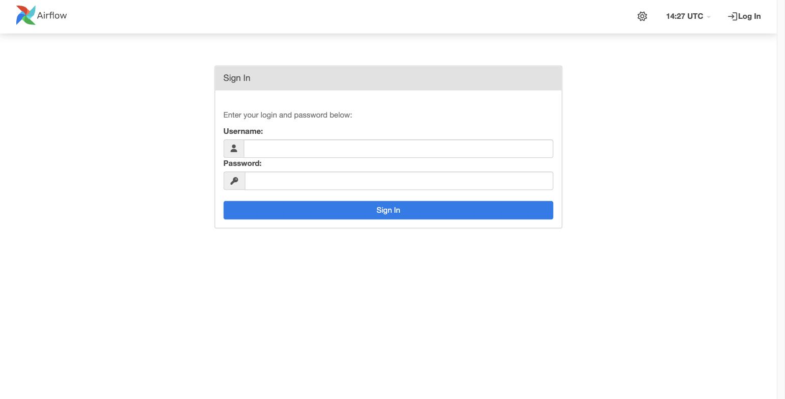

登入 Airflow 之後看到的 DAG 清單，跟第 13 章在本機看到的完全相同——同一份程式碼、同一組容器，只是機器換到了雲端：

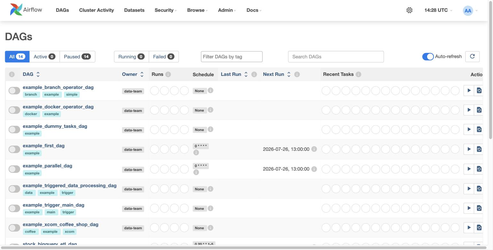

Flower 上兩個 worker Online、各自 Succeeded——剛才發的任務在這裡留下紀錄:

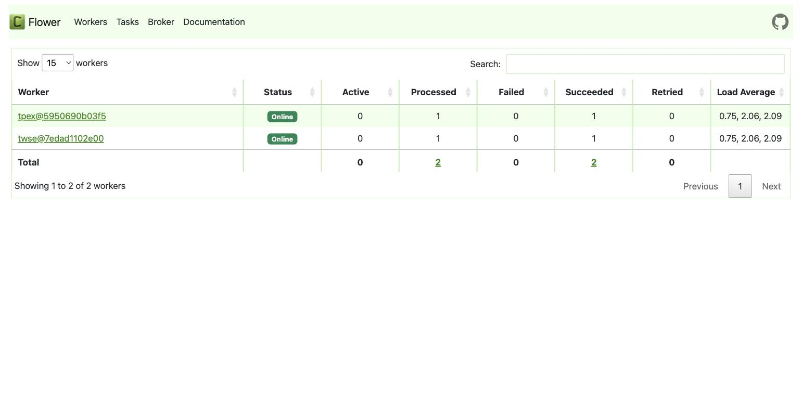

## 收工：停機省額度

**本章結束前一定要做這件事。**

```bash
gcloud compute instances stop stock-crawler-vm --zone=asia-east1-b
gcloud compute instances list
```

`list` 顯示 STATUS 變成 `TERMINATED`、EXTERNAL_IP 欄位變空白——外部 IP 被回收了。

三個指令的差別：

| 指令 | 效果 | 費用 |
|------|------|------|
| `stop` | 關機，磁碟與設定保留 | 運算費歸零，磁碟費照收（20GB 約 NT$25／月） |
| `start` | 重新開機 | 恢復計費；**外部 IP 會換新的**，瀏覽器網址要跟著換 |
| `delete` | 整台刪除，磁碟一併消失 | 全部歸零 |

```bash
# 下次上課前重新開機
gcloud compute instances start stock-crawler-vm --zone=asia-east1-b
gcloud compute instances list    # 記下新的 EXTERNAL_IP
```

防火牆規則綁的是標籤不是 IP，開機後不用重設；要換的只有你瀏覽器裡的網址。

## 檢查：這一章做完的狀態

- [ ] GCP 試用已開通，控制台頂部看得到剩餘抵免額
- [ ] 「帳單 → 預算與警告」有一筆每月預算，三段警示門檻
- [ ] 專案 `stock-crawler-course` 存在且是目前選取的專案
- [ ] 服務帳戶 `stock-crawler-sa` 存在，金鑰 JSON 已下載並移到 `~/gcp-keys/`
- [ ] `gcloud projects list` 列得出專案
- [ ] VM 能開、能 SSH、能跑整套 compose、七步驟驗證全過
- [ ] 瀏覽器連得上雲端的 Airflow／Flower
- [ ] **VM 已停機**（`gcloud compute instances list` 顯示 TERMINATED）

## 想一想

1. 服務帳戶的金鑰檔如果不小心 commit 到公開的 GitHub repo，會發生什麼事？該怎麼補救？
2. 為什麼防火牆規則不開放 3306 和 5672？如果你人在外面想連雲端的 MySQL，正確的做法是什麼？（提示：SSH）
3. VM 停機後外部 IP 會變，對「把網址發給別人用」這件事是什麼問題？固定 IP 可能怎麼做？（第 17 章會回答）

## 練習

1. 用 `gcloud compute instances start` 把 VM 開回來，確認外部 IP 換了，瀏覽器用新 IP 重新打開 Airflow，然後停機
2. 在 Airflow UI（8081）unpause 並 trigger `stock_crawler_dag`，用七步驟的 Step 6 確認資料增加——雲端版的編排閉環
3. 把防火牆規則的 `--source-ranges` 改成另一個網路的 IP（例如手機熱點），驗證原本的網路連不上了——理解來源限制的意義

## 排錯

| 症狀 | 原因 | 處理 |
|------|------|------|
| 註冊時看不到「免費試用」按鈕，直接進控制台 | 這個 Google 帳號已經用過試用資格 | 換一個全新的 Google 帳號 |
| 預算金額變成 03000 | 欄位預設的 0 沒清掉 | 全選清空再輸入 |
| 建立專案後頂部還是 My First Project | 建立不會自動切換 | 點通知的「選取專案」或從頂部清單切換 |
| `config set project` 出現 access 警告 | 還沒 `gcloud auth login` | 先登入，再 `gcloud projects list` 驗證 |
| 服務帳戶清單點不進詳細頁 | 點到列首的勾選框 | 點 email 的藍色文字連結 |
| 第一次 SSH 出現 Permission denied | SSH 金鑰還在生效中 | 等 30 秒重跑 |
| `up` 報 stock-airflow image 不存在 | 還沒在這台 VM build 過 | `sudo docker build -f airflow/Dockerfile -t stock-airflow:latest .` |
| 瀏覽器連 Web 介面轉圈圈到逾時 | 防火牆沒開該 port，或 IP 不在 source-ranges 裡 | 檢查規則的 port 清單與 `curl -4 ifconfig.me` 的目前 IP |
| 瀏覽器連 3000 被拒絕、`docker ps` 沒有 metabase | Metabase 首次啟動時 MySQL 還沒就緒，初始化失敗退出 | `sudo docker start metabase`，等一兩分鐘再連 |
| 停機再開機後原網址連不上 | 外部 IP 換了 | `gcloud compute instances list` 查新 IP |

## 本章總結

- 開通 GCP 的順序是：試用註冊 → **預算警告** → 課程專案 → 服務帳戶與金鑰——保險絲永遠先裝
- 專案 ID 全球唯一且不可變；服務帳戶是給程式用的身分，金鑰檔只發一次、絕不進 git
- gcloud CLI 讓雲端操作可以複製、重跑、寫成腳本；`auth login`、`config set project`、驗證三連是每台新電腦的起手式
- 一台 8GB 的雲端 VM 裝上 Docker 之後，第 13 章的整套系統原封不動搬上去就能跑——環境變了，程式沒變
- 防火牆只開需要的 port、來源限自己的 IP；資料庫與訊息佇列不對公網
- 運算費只在開機時計——**下課前停機**跟寫程式一樣是本課程的必修動作

下一章（第 16 章）把這台「一台裝全部」的機器拆開：多台 VM 分工、資料庫換成託管的 Cloud SQL——系統正式搬家。
