# 課程手冊14 - GCP 開通與雲端部署

> 本章對應 EP17。課堂教學順序：本章完成 GCP 開通之後，下一堂回頭做第 15 章的 BigQuery 詳解——那一章用到的兩種憑證（服務帳戶金鑰、VM 身分）本章都會備好，爬蟲的 BigQuery 雙寫也在本章就開始運轉。
>
> 本章需要一張信用卡（或簽帳金融卡）與一個從未用過 GCP 的 Google 帳號。**課前請準備好這兩樣東西。**

## 本章用到的工具與服務

| 工具／服務 | 類型 | 在本章做什麼 |
|-----------|------|-------------|
| Compute Engine（GCE） | GCP 服務 | 開出第一台雲端 VM，整套系統搬上去跑 |
| VPC 防火牆規則 | GCP 服務 | 對外開放 Web 介面的 port，來源限制在自己的 IP |
| IAM | GCP 服務 | 建立服務帳戶並發金鑰；〈團體專案上雲〉用它把組員加進專案 |
| Cloud Billing 預算與警告 | GCP 服務 | 開通後第一件事，額度用到門檻會寄通知信 |
| Cloud Monitoring／Logging | GCP 服務 | 看 VM 的 CPU、記憶體與機器層日誌 |
| gcloud CLI | 指令工具 | 用指令開關 VM、建防火牆規則、SSH 連線 |
| Docker／Docker Compose | 既有工具 | 跟本機同一套，整組容器在 VM 上重現 |
| Git／GitHub | 既有工具 | 在 VM 上 clone 課程 repo |
| nginx-demo | 示範專案 | Part G 熱身用的最小網頁容器 |

## 做完這一章你會

1. 開通 Google Cloud 的 $300 美元免費試用，並在第一時間設好預算警告
2. 建立課程專用的專案（project），理解專案名稱與專案 ID 的差別
3. 建立服務帳戶（Service Account）並下載 JSON 金鑰——GCP 外的程式呼叫 GCP 服務的通行證，並分清楚它和 VM 身分的分工
4. 安裝 gcloud CLI，用指令登入、切換專案、管理雲端資源
5. 開出第一台雲端 VM（連同寫 BigQuery 需要的 scopes），SSH 進去安裝 Docker
6. 把整套股票爬蟲系統（`docker-compose-all.yml`）搬上雲端，跑通完整閉環——爬蟲每次抓取同時寫 MySQL 與 BigQuery 兩份
7. 設定防火牆規則，從自己的瀏覽器打開雲端上的 Airflow、Flower、phpMyAdmin
8. 規劃團體專案上雲：用 IAM 把組員加進專案、防火牆放行全組 IP、換強密碼並用 .env 帶入，全組共用同一台 VM 協作
9. 用停機指令保住試用額度

## 先搞懂：為什麼要上雲

到第 13 章為止，整套系統都跑在你自己電腦的 VM 裡。它能動，但有三個極限：

1. **不能 24 小時跑**：你的電腦關機，排程就停了。每天收盤後自動爬資料的需求做不到
2. **不能對外服務**：你的電腦沒有固定的公網位址，別人連不進來，API 給不了外部使用
3. **規格不能伸縮**：資料量變大、任務變多的時候，筆電的 CPU 和記憶體就是上限

雲端解決這三件事：Google 機房裡的機器 24 小時開著、有公網 IP、規格隨租隨換。代價是按用量付費——所以「用完就關」的習慣跟技術本身一樣重要，本章會一起教。

### 什麼是雲端運算（Cloud Computing）

定義：透過網路，隨需取得運算資源（伺服器、儲存空間、資料庫、AI 工具）。你不需要購買和管理硬體設備，也不需要自己搭建系統，直接使用包裝好的服務。一句話：**雲端＝你不必買伺服器，隨時租用需要的資源**。

四個核心特性：

| 特性 | 意思 |
|------|------|
| 隨需自助（On-demand self-service） | 要開機器自己按按鈕就有，不用等採購、不用等別人審批 |
| 彈性伸縮（Scalability & Elasticity） | 規格與數量跟著需求放大縮小，尖峰加、離峰減 |
| 按使用量付費（Pay-as-you-go） | 用多少付多少，不用先買下整台機器 |
| 全球可用性（Global availability） | 世界各地的資料中心任你選，把服務放在離用戶近的地方 |

### 傳統 IT vs 雲端

| 面向 | 傳統 IT | 雲端 |
|------|---------|------|
| 成本 | 高額前期投資 | 按需付費 |
| 建置時間 | 需數週到數月 | 幾分鐘可建立 VM / DB |
| 彈性 | 資源固定，升級要買新硬體 | 彈性擴縮，流量高峰加資源 |
| 維運 | 自行管理硬體、冷氣、網路 | 由雲端供應商負責維護 |
| 擴展 | 地區受限、機房空間有限 | 全球資料中心，快速部署 |
| 人力 | 硬體、網路、電源、溫控、資安都要人 | 重心移到 SRE、雲端工程師、雲端架構師 |
| 安全性 | 資料自己掌握、穩定度自行負責 | 由雲端供應商的工程團隊維護基礎設施安全 |

### 三種服務模式：IaaS / PaaS / SaaS

差別在「你管多少、供應商管多少」。三種模式在這門課全都會用到：

| 模式 | 供應商提供 | 你負責 | 課程對應 |
|------|-----------|--------|---------|
| IaaS（Infrastructure as a Service） | 基礎設施：VM、儲存、網路 | OS 以上全部自己來（裝 Docker、跑程式） | **Compute Engine**——本章開的 VM |
| PaaS（Platform as a Service） | 平台與執行環境 | 只管程式和資料，不管底層機器 | **BigQuery**（第 15 章）、**Cloud Composer**（第 17 章） |
| SaaS（Software as a Service） | 完整應用程式，開瀏覽器直接用 | 只管使用，不裝不維護 | **Looker Studio**（第 15 章）、Gmail |

方向感：越往 IaaS 自由度越高、要管的越多；越往 SaaS 越省事、可調整的越少。這個取捨會貫穿整個雲端段——第 16 章「自架 MySQL 容器 vs 託管 Cloud SQL」、第 17 章「自架 Airflow vs Composer」都是同一道選擇題。

### 三朵雲：AWS、Azure、GCP

公有雲市場由三家主導，合計拿下全球約三分之二的市佔（2025 年前後：AWS 約三成、Azure 約四分之一、GCP 約一成多）。三家的出身決定了各自的強項：

| | AWS（Amazon） | Azure（Microsoft） | GCP（Google） |
|---|--------------|-------------------|---------------|
| 出身 | 2006 年最早商轉，把 Amazon 自家電商基礎設施產品化 | 微軟企業軟體生態的雲端延伸 | Google 自家搜尋/YouTube 等服務的基礎架構對外開放 |
| 市場定位 | 市佔第一、服務數量最多最廣，新創到大型企業通吃 | 企業市場最強：與 Windows Server、Active Directory、Microsoft 365 深度整合，混合雲（Azure Arc）成熟 | 資料與 AI 工具最強（BigQuery、Vertex AI）；Kubernetes 發源於 Google（內部系統 Borg 的開源後代），GKE 最成熟 |
| 常見使用者 | 生態與人才市場最大，職缺最多 | 原本就用微軟體系的企業、傳產與金融 | 資料團隊、AI 應用、新創 |
| 台灣在地 | 2025 年開通台北區域（ap-east-2） | 已宣布台灣北部區域 | 彰化資料中心（asia-east1，2013 年啟用，Google 在亞洲的第一座） |
| 免費試用 | 12 個月免費層＋部分永久免費額度 | $200 美元／30 天＋12 個月免費層 | **$300 美元／90 天**＋20 多項永久免費產品（課程用這個） |

其他還有阿里雲（中國市場為主）、Oracle Cloud（資料庫客戶為主）等，概念相同、市佔較小。

**三朵雲的核心概念完全相同**——同一個角色每家都有對應產品，學會一朵、換一朵主要是查服務名稱和改指令語法。下表是完整的同角色對照（**粗體＝本課程會用到的角色**）：

| 角色 | GCP | AWS | Azure |
|------|-----|-----|-------|
| **虛擬機** | Compute Engine | EC2 | Virtual Machines |
| 託管 Kubernetes | GKE | EKS | AKS |
| 容器 Serverless（跑 container 免管機器） | Cloud Run | Fargate／App Runner | Container Apps |
| 函數 Serverless | Cloud Functions | Lambda | Azure Functions |
| **物件儲存** | Cloud Storage | S3 | Blob Storage |
| **託管關聯式資料庫** | Cloud SQL | RDS | Azure Database for MySQL |
| NoSQL 文件資料庫 | Firestore | DynamoDB | Cosmos DB |
| **資料倉儲** | BigQuery | Redshift | Synapse Analytics |
| **訊息佇列**（角色近課程的 RabbitMQ） | Pub/Sub | SQS＋SNS | Service Bus／Event Hubs |
| **託管 Airflow** | Cloud Composer | MWAA | （Data Factory 角色近似） |
| 批次／串流 ETL | Dataflow | Glue／Kinesis | Data Factory／Stream Analytics |
| 託管 Spark／Hadoop | Dataproc | EMR | HDInsight／Databricks |
| **負載平衡** | Cloud Load Balancing | ELB | Load Balancer／App Gateway |
| DNS | Cloud DNS | Route 53 | Azure DNS |
| CDN | Cloud CDN | CloudFront | Front Door／CDN |
| **權限管理** | IAM | IAM | Entra ID＋RBAC |
| **機密管理** | Secret Manager | Secrets Manager | Key Vault |
| 監控與日誌 | Cloud Monitoring／Logging | CloudWatch | Azure Monitor |
| **BI 視覺化** | Looker Studio | QuickSight | Power BI |

**怎麼選雲**（實務上的判斷順序）：

1. **跟著既有生態走**：公司全套微軟體系（AD、M365）→ Azure 整合成本最低；資料與 AI 是主戰場 → GCP；要最大的服務廣度與人才池 → AWS
2. **跟著資料重心走**：資料已經在哪朵雲，運算就靠過去——搬資料出雲（egress）要收費，這是各家共同的「黏性」設計
3. **多雲是業界常態**：很多公司同時用兩朵以上。所以「精通一朵、概念通三朵」正是本課程的目標——這張對照表就是你之後轉換的地圖

課程選 GCP 的理由：$300／90 天試用最適合課程長度、資料中心就在台灣（延遲最低）、本課程的重點服務 BigQuery 是它的招牌、BI 工具 Looker Studio 免費。

### GCP 是什麼、有哪些常見服務

GCP（Google Cloud Platform）是 Google 的雲端服務平台，提供運算、資料、AI、網路、安全等完整解決方案。特色：

- 與 Google 自家服務（YouTube、Search、Gmail）跑在同一套基礎架構上
- 資料中心遍布北美、歐洲、亞洲（含台灣）、南美洲、澳洲，之間用 Google 專屬光纖網路連接
- 資料多區備援，避免單點故障；使用者選離客戶最近的區域來降低延遲

服務分類與課程對應（粗體＝課程會用到）：

| 分類 | 代表服務 | 課程對應 |
|------|---------|---------|
| 運算 Compute | **Compute Engine**（IaaS VM）、GKE（託管 K8s）、**Cloud Run**（跑容器的 Serverless）、App Engine、Cloud Functions | GCE：本章；Cloud Run：補充H |
| 儲存與資料庫 | **Cloud SQL**（託管 MySQL/PostgreSQL/SQL Server）、**Cloud Storage**（物件儲存：檔案、備份）、Firestore（NoSQL，角色近 MongoDB）、Bigtable（超大規模 NoSQL） | Cloud SQL：第 16 章 |
| 資料分析與工程 | **BigQuery**（全託管資料倉儲）、**Cloud Composer**（全託管 Airflow）、**Looker Studio**（免費 BI）、Dataflow（託管 ETL／串流）、Dataproc（託管 Hadoop/Spark）、Pub/Sub（訊息佇列，角色近課程的 RabbitMQ） | BigQuery：第 15 章；Composer：第 17 章；Looker Studio：第 15 章 |
| 網路 | Cloud Load Balancing、**防火牆規則**、Cloud DNS、Cloud CDN | 防火牆：本章（LB 見補充H，說明為什麼你不用自己架） |
| 身分與安全 | **IAM**（誰能做什麼）、**Secret Manager**（機密管理）、KMS | IAM：本章與第 15 章；Secret Manager：第 16 章 |

選型的方向跟第 5 章學過的一樣：物件檔案放 Cloud Storage、交易型資料放 Cloud SQL（OLTP）、分析放 BigQuery（OLAP）、非關聯式選 Firestore／Bigtable——資料庫的分工概念不變，只是每種分工在雲端變成一個獨立產品。

### 全段地圖：本機的每個零件，最後都去哪裡

雲端段（14 到 17 章，另有選讀的補充H）做的事，一句話：**把第 13 章那套本機系統的零件，一格一格換成雲端對應物——程式幾乎不動**。先把整張地圖看過一遍，之後每一章都是在點亮其中幾格：

| 本機的零件（1-13 章） | 雲端去向 | 章節 | 程式要改什麼 | 為什麼要換／換了差在哪 |
|---------------------|---------|------|-------------|----------------------|
| 你電腦上的 VM（Lima/WSL） | **GCE VM**（e2-standard-2） | 本章 | 不改，整套 compose 搬過去 | 24 小時在線、有公網 IP、規格隨租隨換 |
| 進 VM 的方式（limactl shell） | **gcloud compute ssh** | 本章 | — | 金鑰自動管理，從任何電腦都連得上 |
| （本機沒有防火牆概念） | **VPC 防火牆規則** | 本章 | — | 雲端預設全擋，開放的每個 port 都是明確決策（VPC＝專案的私人網路，第 16 章詳談） |
| MySQL 容器 | **Cloud SQL**（託管 MySQL） | 第 16 章 | 只改 `MYSQL_HOST` | 備份、更新、高可用交給 Google；代價是錢——託管 vs 自架的第一題 |
| phpMyAdmin 容器 | 退役（Cloud SQL 用 Console／Cloud SQL Studio 查） | 第 16 章 | — | 託管服務自帶管理介面 |
| RabbitMQ／worker 容器 | 拆到**多台 GCE** 分工 | 第 16 章 | 不改，compose 拆檔 | 補充B 的「分散式」第一次真的跨機器 |
| Metabase 容器 | **Looker Studio**（免費 SaaS BI） | 第 15 章 | 不用程式，滑鼠操作 | 免安裝免維運、內建 BigQuery 連接器——SaaS 的教科書案例 |
| ——（本機沒有這層） | **BigQuery**（分析倉儲，新增） | 本章起雙寫、第 15 章詳講 | 爬蟲多寫一份（程式已內建，本章 H-3 生效） | OLTP／OLAP 分工：分析不再拖累營運資料庫 |
| FastAPI（補充E） | **Cloud Run**（容器託管執行環境） | 補充H（選讀） | 不改，加發佈流程 | 固定 HTTPS 網址、自動擴縮、閒置縮零不計費，不用管機器 |
| 手動 docker build／换版 | **CI/CD**（GitHub Actions：push → 自動測試、自動部署） | 補充I（選讀） | 加 workflow yml | 補充F 寫的測試在這裡成為上線前的檢查關卡 |
| 自架 Airflow 容器 | 主線**仍在 GCE 自架**；**Cloud Composer**（託管 Airflow）認識＋對照示範 | 第 17 章 | DAG 的編排邏輯兩邊通用 | Composer 省維運但每月數百美元起跳，課程用示範讓你看見差異 |
| `.env` 檔 | **Secret Manager** | 第 16 章 | 部署指令注入環境變數 | 機密集中管理、可查詢誰讀過、可換版本——密碼一上雲就改用它 |
| 個人 Google 帳號操作一切 | **IAM 最小權限**（服務帳戶各司其職） | 本章建立、第 15 章授權 | — | 本章的服務帳戶刻意不給角色，第 15 章才補上恰足夠用的兩個 |
| docker logs／Flower 看狀態 | 照用＋**Cloud Monitoring／Logging** 補機器層 | 本章導覽 | — | 容器層工具照舊，機器層（CPU／記憶體／帳單）交給雲端監控 |

**原樣保留、不搬的**：爬蟲程式本體、Celery 任務、佇列分流設計、compose 檔結構、Flower——這正是前十三章「config 中心、分層架構」紀律的效果：換環境時，動的是設定與部署，不是程式。

### 系統的階段：每一章加了什麼

上面那張表是逐項對照，這裡換個角度看——**系統的形狀是怎麼一章一章長出來的**：

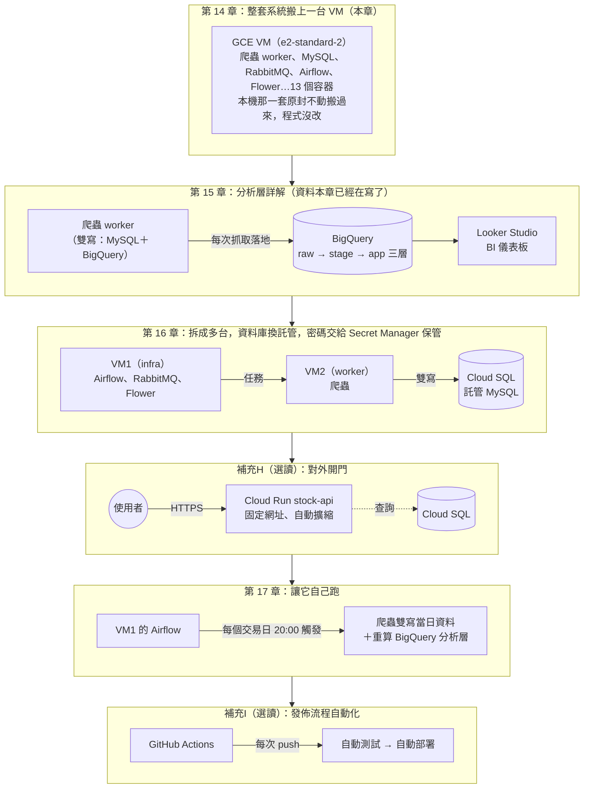
```mermaid
flowchart TB
    subgraph S14["第 14 章：整套系統搬上一台 VM（本章）"]
        VM["GCE VM（e2-standard-2）<br/>爬蟲 worker、MySQL、RabbitMQ、Airflow、Flower…13 個容器<br/>本機那一套原封不動搬過來，程式沒改"]
    end
    subgraph S15["第 15 章：分析層詳解（資料本章已經在寫了）"]
        W15["爬蟲 worker<br/>（雙寫：MySQL＋BigQuery）"] -->|每次抓取落地| BQ15[("BigQuery<br/>raw → stage → app 三層")] --> LS15["Looker Studio<br/>BI 儀表板"]
    end
    subgraph S16["第 16 章：拆成多台，資料庫換託管，密碼交給 Secret Manager 保管"]
        VM1["VM1（infra）<br/>Airflow、RabbitMQ、Flower"] -->|任務| VM2["VM2（worker）<br/>爬蟲"] -->|雙寫| SQL16[("Cloud SQL<br/>託管 MySQL")]
    end
    subgraph SG["補充H（選讀）：對外開門"]
        U(("使用者")) -->|HTTPS| CR["Cloud Run stock-api<br/>固定網址、自動擴縮"] -.->|查詢| SQLG[("Cloud SQL")]
    end
    subgraph S17["第 17 章：讓它自己跑"]
        AF17["VM1 的 Airflow"] -->|每個交易日 20:00 觸發| SY17["爬蟲雙寫當日資料<br/>＋重算 BigQuery 分析層"]
    end
    subgraph SI["補充I（選讀）：發佈流程自動化"]
        GH17["GitHub Actions"] -->|每次 push| T17["自動測試 → 自動部署"]
    end
    S14 --> S15 --> S16 --> SG --> S17 --> SI
```

全部做完之後，系統的完整形態是這樣（括號標的是哪一章建的，補充H 是選讀）：

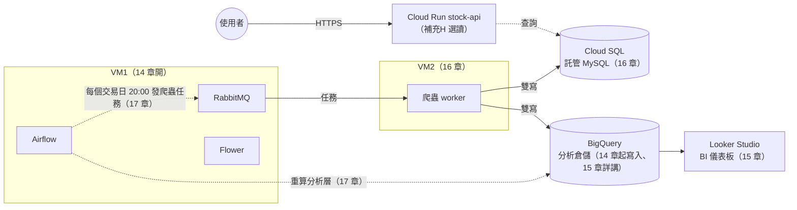
```mermaid
flowchart LR
    U(("使用者")) -->|HTTPS| CR["Cloud Run stock-api<br/>（補充H 選讀）"]
    CR -.->|查詢| SQL
    subgraph VM1["VM1（14 章開）"]
        AF["Airflow"]
        MQ["RabbitMQ"]
        FL["Flower"]
    end
    subgraph VM2["VM2（16 章）"]
        W["爬蟲 worker"]
    end
    MQ -->|任務| W
    W -->|雙寫| SQL[("Cloud SQL<br/>託管 MySQL（16 章）")]
    W -->|雙寫| BQ[("BigQuery<br/>分析倉儲（14 章起寫入、15 章詳講）")]
    AF -.->|"每個交易日 20:00 發爬蟲任務（17 章）"| MQ
    AF -.->|"重算分析層（17 章）"| BQ
    BQ --> LS["Looker Studio<br/>BI 儀表板（15 章）"]
```

資料庫密碼由 Secret Manager 保管（16 章），連到 Cloud SQL 的元件都跟它拿。圖上實線是資料流動的路徑，虛線是觸發與查詢。

> 這張圖也有用 GCP 官方圖示畫的 draw.io 版本：`課程手冊/drawio/GCP雲端架構圖.drawio`。畫法見補充A。

看這張圖時注意兩件事。

**第一，Cloud Run 只用在 API，Airflow 留在 VM 上自架**，這是因為兩種工作的形狀不同：API 是「有人呼叫才做事」，沒人用的時候縮到零最省錢；Airflow 的 scheduler 要**一直醒著**每分鐘檢查有沒有到期的排程，縮到零就不排程了。補充H 會再說明這個判斷。

**第二，本機的東西沒有全部消失。** RabbitMQ 和 Flower 從第 1 章活到最後，只是搬到 VM1 上；爬蟲程式本體一行都沒改過。換掉的只有「有狀態、故障代價最高」的 MySQL，以及「維護成本高於價值」的部分。

### GCP 的層級心智圖

```
Google 帳號（你的 Gmail）
 └── 帳單帳戶（綁信用卡，$300 試用額度掛在這裡）
      └── 專案 project（一切資源的容器，費用統計與權限管理的單位）
           └── 資源（VM、資料庫、BigQuery 資料集……都掛在某個專案底下）
```

- 資源開在某個**區域（region）**的某個**可用區（zone）**。本課程用 `asia-east1`（台灣彰化）
- 每個服務的 API 要**各自啟用**：第一次用 Compute Engine 要啟用它的 API，第 16 章第一次用 Secret Manager 也要啟用它的 API（少數服務例外，例如 BigQuery 的 API 新專案預設就是開的）

### 費用的四個事實

1. **試用期間不會被收費**。$300 美元額度、90 天內有效；額度用完或到期，帳戶只會停用，不會扣你的卡
2. **「啟用完整帳戶」按鈕是付費的開關**。只有你主動按下它，超出額度的用量才會真的向卡片收費。課程期間不要按
3. 運算費只在 VM 開機時計；磁碟費開關機都收，但很小（20GB 約每月 NT$25）
4. 想在開資源前先估價，用官方的 **Pricing Calculator**（cloud.google.com/products/calculator）：選服務、填規格，直接給你每月預估金額

### IAM：整個雲端段都會用到的權限系統

先搞懂的最後一件事是權限。上雲之後，每一個操作——開 VM、寫 BigQuery、讀密碼——都要先通過權限檢查。負責這件事的系統叫 **IAM**（Identity and Access Management，身分與存取管理），它回答的問題只有一句：**誰（身分）可以對哪個資源做什麼（角色與權限）**。

兩個核心觀念先建立：

- **身分和授權是兩件事**。先有身分——人用 Google 帳號、程式用服務帳戶——再談這個身分被允許做什麼。
- **最小權限原則**：需要什麼才給什麼。權限給得越多，金鑰或帳號出事時的災害範圍就越大。

IAM 的內容不集中在單一章，而是分散在雲端段各章——每一站只教當章馬上用得到的那一塊：

| 站 | 章節 | 教什麼 | 當章用在哪裡 |
|---|------|--------|-------------|
| 1 | 本章 Part D／Part F＋〈團體專案上雲〉 | 服務帳戶是給程式用的身分；先建身分、暫不授權（理由見 Part D）；Part F 的 VM 身分與 scopes；〈團體專案上雲〉一節完整規劃——IAM 授權、防火牆、密碼與 .env | 雲端上的程式（含雙寫 BigQuery）用 VM 身分；金鑰發給 GCP 外的程式用；讓全組共用同一台 VM |
| 2 | 第 15 章 | IAM 的三個詞（成員、角色、權限）與第一條授權指令；最小權限的實作 | 讓 GCP 外（本機補充）的金鑰身分也能寫 BigQuery |
| 3 | 第 16 章 | 授權可以細到單一資源 | 讀 Secret Manager 裡的密碼 |
| 4 | 第 17 章 | scopes 回顧：IAM 之外的另一道閘門，兩道都通過才放行（本章 Part F 建機時已給對；舊 VM 補改當排錯） | 排程觸發的爬蟲與分析層重算要寫 BigQuery |
| 選讀 | 補充H | 託管服務用「執行身分」掛服務帳戶 | Cloud Run 要讀密碼連資料庫 |

現在不需要記住每一站的細節。讀到對應章節時回來對照這張表，就知道自己走到這條弧線的哪裡。

## 一步一步

### Part A：開通 $300 免費試用

**A-1 從零到達官網**

1. 準備一個全新的 Google 帳號。試用資格是「這個帳號從未申請過試用、也從未成為 GCP／Google Maps／Firebase 的付費用戶」，**一個帳號只有一次機會**，刪掉重辦也不會重置
2. 在瀏覽器登入這個帳號
3. 網址列輸入 `cloud.google.com`。用 Google 搜尋「Google Cloud」點官方結果也會到同一個地方
4. 先點右上角的圓形頭像，確認顯示的是要開通的帳號；不對就切換
5. 點藍色「**免費試用**」按鈕（右上角和頁面中央各一顆，功能相同）


**A-2 註冊步驟 1（共 2 步）：帳戶資訊**

- 「國家/地區」會依帳號自動預選「台灣」，維持不動
- 「最新消息電子郵件」是選填的電子報，可以不勾
- 右側資訊列出三個重點：$300 抵免額、90 天內使用、**不會自動收費**
- 按「**同意並繼續**」，代表同意《Google Cloud Platform 服務條款》與《免費試用增補條款及細則》


**A-3 註冊步驟 2（共 2 步）：驗證付款資訊**

頁面最上方的官方說明回答了「為什麼要填信用卡」：

> 別擔心，試用期間內不會產生費用。收集付款資訊可協助我們驗證您的身分，減少詐欺活動。您手動啟用功能完整的即付即用帳戶或選擇預付之前，系統都不會向您收費。

這一頁有三個區塊，由上到下填：

1. **聯絡資訊**：帳戶類型選「個人」（公司採購才選商家），填姓名與地址。填完會顯示一組系統自動產生的付款資料 ID，不用理會
2. **稅務資訊（稅籍）**：
   - **未登記**：個人用途選這個。課程學員一律選「未登記稅籍的個人」，不用填任何編號
   - **已登記**：有統一編號、辦過營業登記的公司行號才選。選了要填統編，之後帳單會開立含統編的發票
3. **付款方式**：點「新增付款方式」，在跳出的視窗填卡號、有效期限（月/年）、安全碼（卡片背面三碼）、持卡人姓名；「帳單地址與法定地址相同」預設打勾即可。按「儲存卡片」


三個區塊都完成後，按最下方的「**開始免費試用**」。

**A-4 開通完成**

按下後自動跳轉到 Google Cloud 控制台，畫面重點：

- 頂部橫幅顯示「免費試用狀態：抵免額剩餘 $9,xxx，試用期還有 90 天」。**金額用新台幣顯示**——$300 美元依匯率換算約九千多元，不是給了你九千美元，也不是縮水
- 系統自動建立了一個專案「My First Project」，ID 是一串亂數
- 藍色「**啟用完整帳戶**」按鈕就是付費的開關，課程期間不要按


### 先認識 Console 本身

從下一段（Part B）開始，很多操作都在網頁上進行。Console（console.cloud.google.com）是 GCP 的網頁控制台，頂部列從左到右：

- 「**≡**」導覽選單：所有服務的入口，本章用過的 Compute Engine、IAM、帳單都從這裡進
- **專案選擇器**：顯示目前所在的專案，點它切換——排錯第一步永遠先看這裡
- **搜尋框**：直接打服務名或資源名跳過去（快捷鍵 `/`）
- **Cloud Shell 圖示**（>_）：瀏覽器裡的終端機，已預裝 gcloud——臨時在別台電腦上沒有 CLI 環境時可以用它
- **鈴鐺**：通知中心，建立專案、建立 VM 的完成通知都在這

本章教 gcloud 指令的每個操作，在 Console 網頁上也全部做得到——對應的滑鼠版操作放在各 Part 末尾的「補充」段。兩者的關係：**指令能複製、能重跑、能寫進腳本；介面能看到所有選項和即時費用**。建議第一次用介面建立來理解每個欄位，之後日常操作用指令。

### Part B：第一件事——設定預算警告

預算警告的作用是「額度燒太快時提早收到通知」。把它排在開通後的第一件事，是為了養成「先裝保險絲、再開始用電」的習慣。

**進入設定頁**（兩條路都通）：

- 開通完成頁的卡片上直接點「**設定預算警告**」連結
- 平常的路徑：左上角「≡」選單 → **帳單** → 左側「**預算與警告**」


點「**Create budget / 設定預算**」，表單分四段，每段填完按「下一步」：

**① 定義**：型態選「**僅傳送警告（適用於所有服務）**」——超過門檻寄 email，不動任何服務。另一個「強制執行支出上限」標示預覽且只適用部分服務，課程不用。名稱自取，例如「課程預算警戒」


**② 範圍**：全部維持預設值——時間範圍「每月」（每月一日起算、月初重設）、所有專案、所有服務


**③ 金額**：預算類型維持「指定的金額」，目標金額填 **3000**（新台幣）。試用額度約九千多元、課程約三個月，單月燒超過三分之一就是異常。
注意：欄位預設有一個 `0`，先全選清掉再輸入，否則會變成 `03000`


**④ 動作**：警告門檻維持預設三段 50% / 90% / 100%，通知方式維持勾選「透過電子郵件將警告傳送給帳單管理員和使用者」——警告信會寄到你開通用的 Gmail。按「**完成**」


建立後回到清單頁，看得到這筆預算與它的三段臨界值。之後要修改，從同一個路徑（帳單 → 預算與警告）點名稱進去改。


### Part C：建立課程專用專案

先搞懂兩件事：

- **專案是 GCP 一切資源的容器**（先搞懂的層級心智圖畫過這一層）：VM、資料庫、BigQuery 資料集都掛在專案底下；費用統計、API 啟用、權限管理都以專案為單位
- **專案名稱與專案 ID 是兩回事**：名稱給人看、之後可以改；**ID 給系統用、全球唯一、設定後永遠不能改**。之後指令用的都是 ID

操作步驟：

1. 點控制台頂部列的專案名稱（目前顯示「My First Project」）→ 跳出「選取專案」視窗
   
2. 點視窗右上角「**新增專案**」
3. 專案名稱填 `stock-crawler-course`。專案 ID 會跟著名稱自動產生；ID 需要全球唯一，**如果這個名稱被別人用過，系統會自動加亂數後綴——你的 ID 跟講師畫面不同是正常的**。父項資源維持「無組織」
   
4. 按「**建立**」，幾秒後右上角鈴鐺出現「建立專案：stock-crawler-course」的通知
   
5. **建立完不會自動切換**——頂部列還是「My First Project」。點通知裡的「選取專案」切換過去
6. 確認方法：頂部列與歡迎頁的「您正在管理專案」都顯示 `stock-crawler-course`
   

> 之後任何「找不到資源」的問題，第一件事先看頂部列的專案名稱——最常見的原因是站在錯的專案裡找東西。

### Part D：建立服務帳戶與 JSON 金鑰

先搞懂：

- **服務帳戶是「給程式用的帳號」**。你登入 GCP 用的是 Google 帳號（人的身分）；程式要存取 GCP 資源時，不能把你的個人帳密寫進程式碼，而是給程式一個專屬的機器身分
- 服務帳戶的格式像一個 email：`名稱@專案ID.iam.gserviceaccount.com`
- **JSON 金鑰是這個身分的鑰匙**：程式拿著這個檔案向 Google 證明身分。`GOOGLE_APPLICATION_CREDENTIALS` 環境變數指向的就是它——用在**跑在 GCP 外面**的程式（例如第 15 章本機補充）
- **建立時不給任何角色**：權限的原則是「需要什麼、才給什麼」（最小權限）。第 15 章要讓它寫 BigQuery 時再加對應角色

**D-1 建立服務帳戶**

1. 左上角「≡」選單 →「**IAM 與管理**」→ 左側「**服務帳戶**」。先確認頂部的專案是 `stock-crawler-course`
2. 點「**+ 建立服務帳戶**」，步驟①填三個欄位：
   - 服務帳戶名稱：`stock-crawler-sa`
   - 服務帳戶 ID：自動跟著名稱產生，下方即時預覽完整 email
   - 服務帳戶說明：填用途，例如「課程用服務帳戶：BigQuery 上傳與查詢」
   
3. 按「**建立並繼續**」
4. 步驟②「權限」**不選任何角色**，直接按「**完成**」（步驟③一併略過）
   
5. 回到清單，確認：狀態「已啟用」、金鑰欄「沒有任何金鑰」

**D-2 建立並下載 JSON 金鑰**

1. 在清單點服務帳戶的 **email 藍色文字連結**（點到最左邊的方框會變成勾選，不是進入）
2. 進入詳細頁後點「**金鑰**」分頁。頁面上兩條官方警告都要當真：
   - 金鑰遭盜用會有安全風險——拿到檔案的人就等於這個服務帳戶
   - **Google 會自動停用在公開存放區偵測到的金鑰**——金鑰推上公開 GitHub 會被掃到並直接停用
   
3. 點「**新增鍵**」→「**建立新的金鑰**」→ 格式選 **JSON**（預選的建議值；P12 是舊格式相容用）
   
   視窗上的警語：「請妥善保存這個檔案，**金鑰一旦遺失即無法重新取得**」——GCP 只在下載這一刻給你私鑰，之後不留副本
4. 按「**建立**」→ 瀏覽器自動下載金鑰檔到「下載」資料夾，檔名格式 `{專案ID}-{亂數}.json`（約 2-3 KB）
   

**D-3 金鑰檔的保管**

1. 從「下載」資料夾移到固定位置，並限制讀取權限：
   ```bash
   mkdir -p ~/gcp-keys
   mv ~/Downloads/stock-crawler-course-*.json ~/gcp-keys/
   chmod 600 ~/gcp-keys/stock-crawler-course-*.json
   ```
2. 這個路徑之後會填進 `GOOGLE_APPLICATION_CREDENTIALS`（第 15 章本機補充用），先記住放在哪
3. 永遠不放進任何 git 專案資料夾
4. 遺失或外洩的處理：回到「金鑰」分頁，用垃圾桶圖示刪掉舊金鑰（立即失效），再建一把新的

> **這把金鑰在本章接下來完全用不到**——它是「在你自己電腦上跑 GCP 程式」的身分證（第 15 章本機補充會用）。本章先發好，是為了把所有要動 Console 的行政手續集中在這一堂辦完。跑在 GCP **裡面**的程式（Part F 開的 VM，含容器）用的是機器自己附掛的服務帳戶身分，**連金鑰都不需要**——金鑰只給「GCP 外面的機器」用。兩者的完整對照在 Part F。

### Part E：gcloud CLI

gcloud 是 GCP 的指令列工具，跟 uv、git 一樣是「又一個 CLI 工具」。Console 能做的事 gcloud 幾乎都能做，而且指令可以複製、重跑、寫進腳本——本章之後的操作以 gcloud 為主。

**安裝**

- macOS：`brew install --cask google-cloud-sdk`
- 其他平台照官方安裝頁：https://cloud.google.com/sdk/docs/install
- 驗證：`gcloud --version` 有出現版本號就是裝好了

**登入（會開瀏覽器）**

```bash
gcloud auth login
```

終端機印出授權網址並自動開瀏覽器 → 選你開通 GCP 的那個帳號 → 按「允許」。成功後終端機顯示 `You are now logged in as [你的帳號]`。

**設定預設專案**

```bash
gcloud config set project stock-crawler-course   # 填你自己的專案 ID
```

**驗證三連**

```bash
gcloud auth list        # active 帳號前面有 * 號
gcloud config list      # 確認 account 與 project
gcloud projects list    # 列得出你的專案就通了
```

> 如果在登入前就先設了專案，會出現 `WARNING: You do not appear to have access to project`——設定值有寫入，只是還沒有憑證可查。登入後重跑 `gcloud projects list` 確認即可。

**同一台電腦有多個 Google 帳號的人，請照這份隔離清單做**（例如你有原本的個人帳號＋課程新帳號；只有一個帳號的人可跳過）：

1. 幫課程身分建獨立的設定檔：`gcloud config configurations create course` → `gcloud auth login`（選課程帳號）
2. 每次操作前先確認身分：`gcloud config configurations list`——course 那列的 IS_ACTIVE 要是 True、專案要是你的課程專案 ID。不是的話 `gcloud config configurations activate course` 切換
3. 瀏覽器用獨立的 Chrome 設定檔（或無痕視窗）只登入課程帳號——同一個 Chrome 登入多帳號時，Console 網址的 `/u/0`、`/u/1` 指向不同帳號，點舊連結可能跑錯帳號
4. 金鑰與專案 ID 一律用「這個帳號自己的」：`GOOGLE_APPLICATION_CREDENTIALS` 指向這個帳號下載的金鑰檔、`GCP_PROJECT_ID` 填這個帳號的專案 ID——拿別的帳號的金鑰或 ID 會得到 403 或 404

一句話：**指令看 configurations、網頁看 Chrome profile、程式看金鑰與專案 ID——三邊都對準同一個帳號，就不會混。**

### Part F：開第一台雲端 VM

先搞懂：

- **GCE（Compute Engine）就是租一台雲端電腦**，跟你本機的 VM 概念相同，差別是它在 Google 機房、24 小時在網路上、有公網 IP
- 機型 `e2-standard-2` = e2 系列（經濟型）＋ standard（標準記憶體比）＋ 2 顆 vCPU（8GB RAM）。全套容器需要 8GB（compose 定義 13 個，雲端不跑 Metabase，實際起 12 個）；只跑部分服務可以選更小的機型
- 費用：`e2-standard-2` 開機時約 NT$2.4／小時，停機後歸零

**F-1 啟用 Compute Engine API**

```bash
gcloud services enable compute.googleapis.com
```

新專案第一次用某個服務前都要啟用該服務的 API。執行約一分鐘，結束顯示 `finished successfully`。

**F-2 建立 VM**

```bash
gcloud compute instances create stock-crawler-vm \
  --zone=asia-east1-b \
  --machine-type=e2-standard-2 \
  --image-family=ubuntu-2404-lts-amd64 \
  --image-project=ubuntu-os-cloud \
  --boot-disk-size=20GB \
  --scopes=cloud-platform
```

參數說明：`create` 後面接 VM 名稱（自取）；`--zone` 放在台灣的機房；`--machine-type` 機型；`--image-family` 作業系統用 Ubuntu 24.04 LTS（跟本機 VM 一致）；`--image-project` 是映像檔的來源專案（固定值）；`--boot-disk-size` 開機磁碟，全套 image 超過 5GB，開 20GB；`--scopes=cloud-platform` 是這台 VM 的**存取範圍**——說明如下。

**`--scopes=cloud-platform` 在做什麼：VM 自己也有身分**

每台 GCE VM 都附掛一個服務帳戶（預設是專案的 Compute Engine 預設服務帳戶）。在 VM 上執行的程式可以**不帶任何金鑰檔**，直接以這個身分呼叫 GCP 服務——Google 的用戶端程式庫找不到金鑰時，會自動向 VM 內建的 metadata server 拿憑證。但這條路有一道閘門叫 **scopes（存取範圍）**：VM 建立時沒指定的話，預設 scopes 只涵蓋少數服務（讀 Storage、寫 Logging 等），呼叫 BigQuery 會被擋下。`--scopes=cloud-platform` 把範圍開到全部 GCP API，之後第 15 章爬蟲往 BigQuery 寫資料就直接用 VM 身分，不需要金鑰檔。scopes 只能在**建機時**指定或**停機後**修改（`gcloud compute instances set-service-account`），所以建機這一步就把它給對。

成功輸出（重點是最後一行的表格）：

```
NAME              ZONE          MACHINE_TYPE   INTERNAL_IP  EXTERNAL_IP     STATUS
stock-crawler-vm  asia-east1-b  e2-standard-2  10.140.0.2   35.229.xxx.xxx  RUNNING
```

- **EXTERNAL_IP 記下來**，等一下瀏覽器連 Web 介面要用
- 兩條 WARNING 都不用處理：「disk size under 200GB」是大流量環境的效能提醒；「disk larger than image」Ubuntu 會自動擴展分割區

**F-3 SSH 進入 VM**

```bash
gcloud compute ssh stock-crawler-vm --zone=asia-east1-b
```

第一次執行會自動：產生 SSH 金鑰對（存 `~/.ssh/google_compute_engine`）→ 上傳公鑰到專案 → 等待金鑰生效（約 30 秒）。產生金鑰時會被問兩次 passphrase——**直接按 Enter 兩次留空**。這裡設了密語的話，之後每次 SSH 都要再輸入一次（見排錯表）。

> 第一次連線可能出現一次 `Permission denied (publickey)` 然後自動重試成功——金鑰還在生效中，不是壞掉。整個指令失敗的話，等 30 秒重跑。

進去之後驗證環境：

```bash
hostname      # stock-crawler-vm...
free -h       # 7.8Gi 記憶體
df -h /       # 19G 磁碟（自動擴展生效）
```

**兩種憑證的分工：JSON 金鑰 vs VM 身分**

到這裡你手上有兩種讓程式通過 GCP 認證的方式——Part D 下載的 JSON 金鑰檔，和剛才建 VM 時給的 VM 身分。分工原則只有一條：**看程式跑在哪裡**。

| | JSON 金鑰檔 | VM 附掛身分 |
|---|---|---|
| 適用場景 | 程式跑在 **GCP 外面**（自己的電腦、公司機房） | 程式跑在 **GCP 裡面**（這台 VM 上，含容器內） |
| 憑證來源 | 金鑰檔＋環境變數 `GOOGLE_APPLICATION_CREDENTIALS` | VM 內建的 metadata server，自動取得 |
| 需要管理的東西 | 檔案本身：不能進 git、外洩要撤銷、建議定期輪替 | 沒有檔案；權限由服務帳戶角色＋ VM scopes 決定 |
| 風險 | 金鑰檔就是通行證，拿到檔案的人都能用 | 憑證離不開這台 VM，沒有可外洩的檔案 |

兩邊底層是同一套機制：程式庫啟動時按固定順序找憑證（環境變數指到的金鑰檔 → metadata server），這個機制叫 **ADC（Application Default Credentials）**。所以同一支程式不用改任何一行——在你電腦上跑就吃金鑰，搬上 VM 就吃 VM 身分。原則：**進得了 GCP 的程式用 VM 身分（少一個要保管的機密），出不去的才用金鑰**。

**F-4 VM 上安裝 Docker（重演 EP03 的安裝手冊）**

指令跟 EP03 的「Docker 安裝教學手冊」Step 2 到 Step 5 完全相同——環境變了，指令沒變。全新的 VM 上沒有舊版 Docker，該手冊的 Step 1（移除舊套件）可以省略。

```bash
# 必要工具
sudo apt-get update
sudo apt-get install -y ca-certificates curl

# Docker 官方 GPG key
sudo install -m 0755 -d /etc/apt/keyrings
sudo curl -fsSL https://download.docker.com/linux/ubuntu/gpg \
  -o /etc/apt/keyrings/docker.asc
sudo chmod a+r /etc/apt/keyrings/docker.asc

# Docker 官方 apt repository
echo "deb [arch=$(dpkg --print-architecture) \
  signed-by=/etc/apt/keyrings/docker.asc] \
  https://download.docker.com/linux/ubuntu \
  $(. /etc/os-release && echo "$VERSION_CODENAME") stable" | \
  sudo tee /etc/apt/sources.list.d/docker.list > /dev/null

# Docker Engine + Compose + BuildKit——五個套件都要列出
sudo apt-get update
sudo apt-get install -y docker-ce docker-ce-cli containerd.io \
  docker-buildx-plugin docker-compose-plugin

# 讓一般使用者能跑 docker，重登 SSH 後生效
sudo usermod -aG docker $USER

# 啟動服務並設開機自動啟動
sudo systemctl start docker
sudo systemctl enable docker

docker --version     # Docker version 29.x
docker compose version    # v5.x
```

最後兩條 systemctl 是跟本機 WSL 唯一的不同：**GCE 的 Ubuntu 有完整的 systemd**，服務用 `systemctl` 管理，不是 WSL 那套 `service` 指令。Ubuntu 上 `docker-ce` 套件裝完會自動啟動並設好開機自啟，所以這兩條通常沒有額外效果——照打不會出錯，當作保險。確認狀態：

```bash
sudo systemctl status docker    # active (running)，且 enabled
```

**補充：用 Console 建立 VM**

1. 左上角「≡」選單 →「**Compute Engine**」→「**VM 執行個體**」。這一頁就是 `gcloud compute instances list` 的介面版——VM 清單、狀態、內外部 IP 都在表格裡

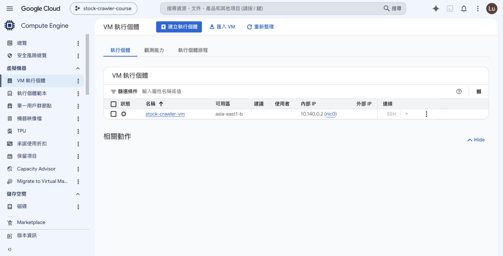

2. 點上方「**建立執行個體**」進入表單。左側是設定分類（機器設定、OS 和儲存空間、網路……），**右側是即時費用預估**——每改一個選項，預估每月費用立刻更新，這是介面版最大的優點：先看到價錢再決定

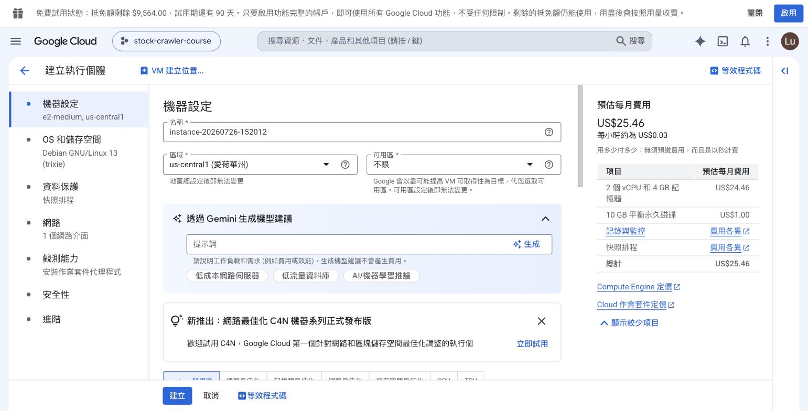

3. 「機器設定」段逐欄對照 CLI 參數：
   - **名稱** = VM 名稱（CLI 的第一個參數）
   - **區域／可用區** = `--zone`。選「asia-east1（台灣）」——注意選完右側費用馬上變動，不同區域價格不同，畫面直接告訴你

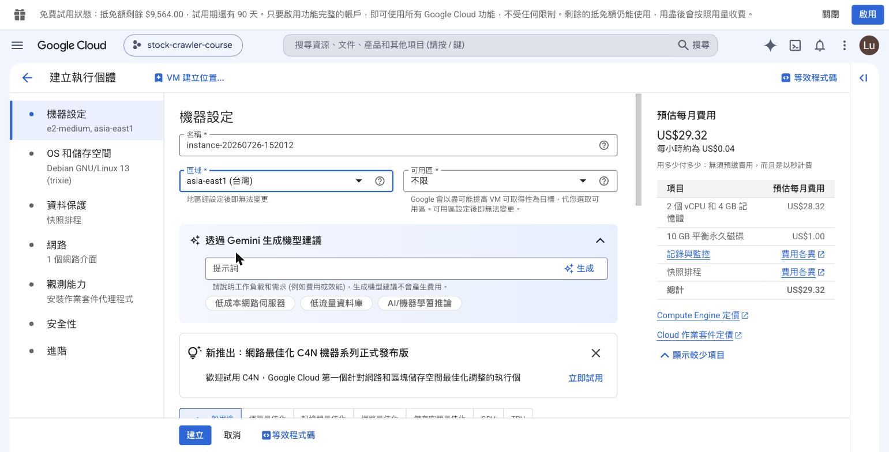

   - **機器系列表** = `--machine-type` 的前半。表格列出所有系列（C4、N4、E2……），課程用的 **E2 標示「低成本，適合日常運算」**；選 E2 後在下方「機器類型」下拉挑 `e2-standard-2`

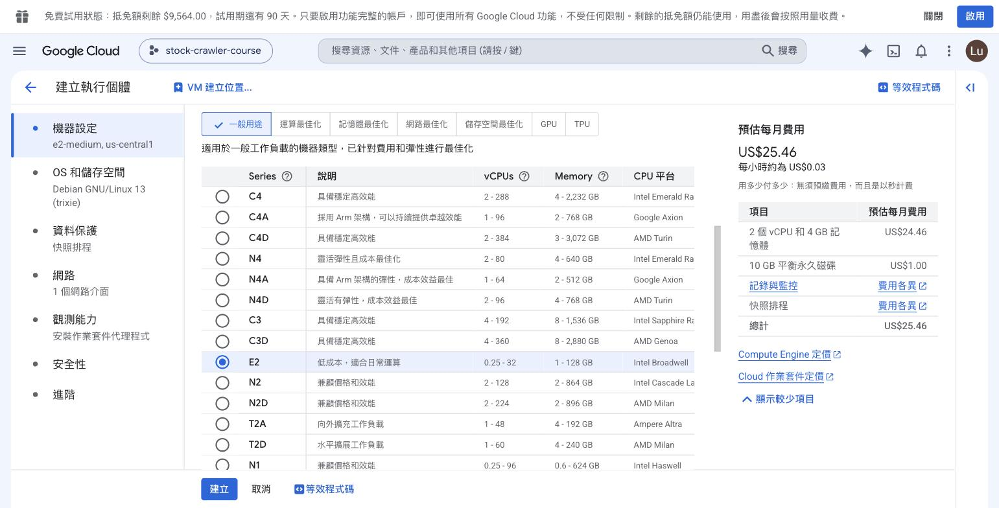

4. 左側點「**OS 和儲存空間**」→「變更」，跳出「開機磁碟」視窗：作業系統選 Ubuntu、版本選 24.04 LTS（= `--image-family`），開機磁碟類型維持「已平衡的永久磁碟」，大小填 20GB（= `--boot-disk-size`），按「選取」

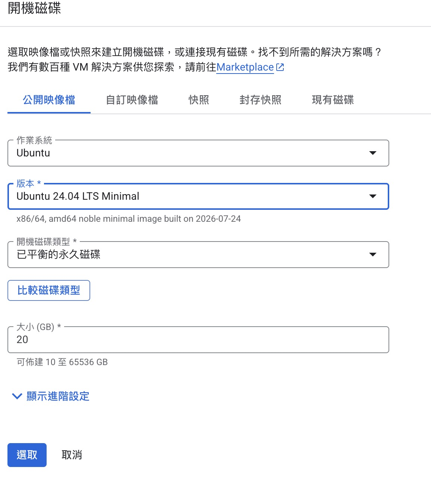
5. 左側「安全性」分類裡有「身分與 API 存取權」：服務帳戶維持預設，「存取範圍」選「**允許所有 Cloud API 的完整存取權**」——這就是 CLI 的 `--scopes=cloud-platform`
6. 其餘分類維持預設。**這裡示範到此為止就好，按「取消」離開**——機器已經用 CLI 建過，再按「建立」會多開一台、多花一份錢
7. 表單最下方還有一個「**等效程式碼**」按鈕：Console 會把你在表單上點的所有設定翻譯成一條 gcloud 指令——這正是「介面和指令是同一件事的兩種寫法」的直接證明，也是從介面學指令的捷徑

### Part G：熱身——第一條防火牆規則

下一段會把整套系統的容器全部搬上來。搬之前先用**一個**最小的容器，把雲端跟本機最大的差異弄清楚：**服務起來了，不代表連得到**。

**G-1 下載 nginx-demo 專案**

```bash
git clone https://github.com/DataEngCamp/nginx-demo.git
cd nginx-demo
cat docker-compose.yaml
```

這個專案只有一個服務：nginx 網頁伺服器，port 映射 `8080:80`，掛一頁靜態網頁。跟課程系統無關，就是一個最小的「有網頁介面的容器」。

**G-2 啟動，並在 VM 裡面先驗一次**

```bash
sudo docker compose -f docker-compose.yaml up -d

curl -s -o /dev/null -w "%{http_code}\n" http://localhost:8080   # 200
```

VM 裡面自己連自己，一次就通。**防火牆管的是從外面進來的流量，VM 內部的連線不經過它**——這句話記住，等一下會再用到。

**G-3 從自己電腦連——連不上**

換到你自己電腦的終端機（不是 VM 的 SSH），拿外部 IP 敲同一個 port：

```bash
nc -vz -w 5 {VM外部IP} 8080
# nc: connectx to {VM外部IP} port 8080 (tcp) failed: Operation timed out
```

瀏覽器開 `http://{VM外部IP}:8080` 也是轉圈到逾時。服務明明是 Up 的，`curl localhost` 也通，但從外面就是進不去。

原因在 VM 詳細頁看得到（Console → Compute Engine → 點 VM 名稱，往下捲到網路區塊）：

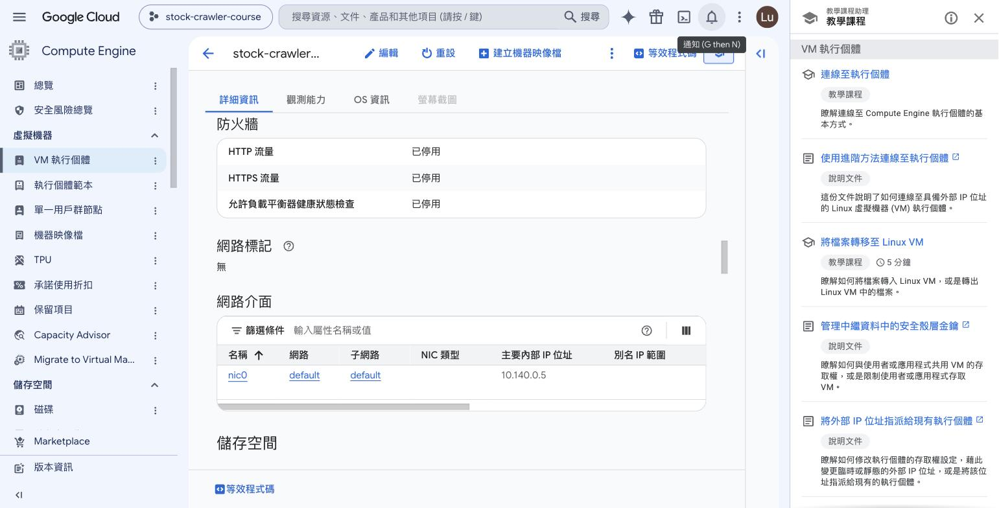

三個資訊：「防火牆」區塊的 HTTP／HTTPS 流量**已停用**（那兩個勾選框只管 80 和 443，我們建 VM 時沒勾）；「網路標記」是**無**；預設規則只放行了 SSH 等少數流量。GCP 的進站流量**預設全部拒絕**——「沒開」不用做任何事，它本來就是關的。8080 沒有任何規則放行，所以逾時。

**G-4 用 Console 建第一條防火牆規則**

左上 ≡ 選單 → 「網路安全性」→「防火牆政策」（舊版選單叫「虛擬私有雲網路 → 防火牆」，開的是同一頁）→ 上方「建立防火牆規則」，五個欄位：

| 欄位 | 填什麼 | 意思 |
|------|--------|------|
| 名稱 | `allow-nginx-8080` | 規則名，自取 |
| 流量方向／動作 | 輸入／允許 | 管「進來」的流量，符合就放行 |
| 目標 | 指定的目標標記 → `nginx-demo` | 這條規則只套用在掛了這個標記的 VM 上 |
| 來源 IPv4 範圍 | `你的IP/32`（`curl -4 ifconfig.me` 查） | 只有你家的 IP 進得來，不開放全世界 |
| 通訊協定和通訊埠 | 勾 TCP、填 `8080` | 只開這一個 port |

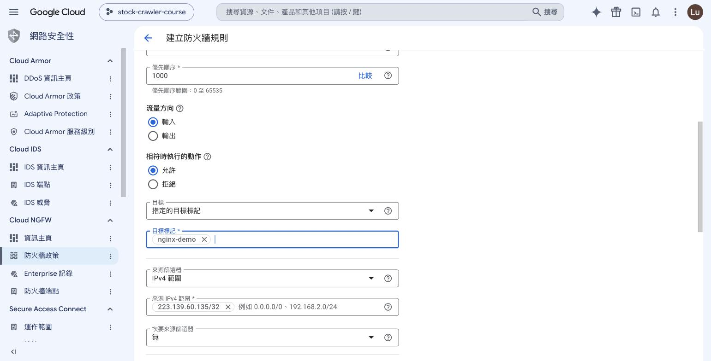

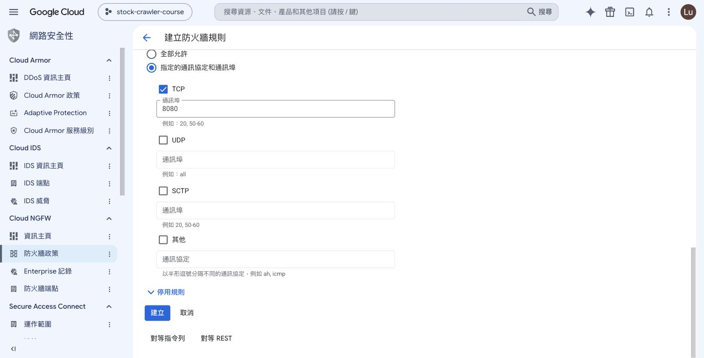

按「建立」。然後把標記掛到 VM 上（規則是透過標記找到 VM 的）：

```bash
gcloud compute instances add-tags stock-crawler-vm --tags=nginx-demo --zone=asia-east1-b
```

**G-5 再連一次——通了**

```bash
nc -vz -w 5 {VM外部IP} 8080
# Connection to {VM外部IP} port 8080 [tcp/http-alt] succeeded!
```

瀏覽器重新整理：


一條規則的四個要素——**方向、目標（誰）、來源（給誰連）、埠（開哪個門）**——你都親自填過一次了。Part I 開整套系統的五個 port 時，用的是同一套概念，只是換成指令一次開完。

**G-6 熱身收尾**

```bash
# VM 上：收掉 nginx——8080 這個 port 等一下 phpMyAdmin 要用
sudo docker compose -f docker-compose.yaml down

# 自己電腦上：刪掉熱身規則，正式規則 Part I 再建
gcloud compute firewall-rules delete allow-nginx-8080 --quiet
```

### Part H：整套系統搬上雲端

**H-1 Clone 專案與準備 .env**

```bash
git clone https://github.com/lu791019/stock-crawler-de-course-materials.git stock-crawler
cd stock-crawler
cp .env.example .env
```

- repo 是公開的，clone 不需要帳號密碼
- `.env` 裡的 `MYSQL_HOST=127.0.0.1` 等值不用改：容器內執行時，compose 檔的 environment 會覆蓋成容器名（第 12 章的 environment > env_file 優先序）

**H-1b 安裝 uv 與 Python 環境**

容器裡的程式不需要這一步（image 自帶環境），但**直接在 VM 上跑 Python 程式**的場景會一路用到：平常排錯要臨時跑個腳本、第 15 章的本機補充版也用得到。跟 F-4 裝 Docker 一樣，這是 VM 的一次性環境準備——重演第 2 章在自己電腦做過的事：

```bash
# ① 安裝 uv（官方安裝腳本，裝到 ~/.local/bin）
curl -LsSf https://astral.sh/uv/install.sh | sh

# ② 讓目前的 shell 找得到它（安裝腳本會寫進 ~/.bashrc，下次登入自動生效；
#    這次登入要手動加）
export PATH="$HOME/.local/bin:$PATH"

# ③ 驗證
uv --version
# uv x.y.z (x86_64-unknown-linux-gnu)
```

**Python 不用另外裝**：Ubuntu 24.04 自帶 Python 3.12，滿足專案 `pyproject.toml` 的 `requires-python = ">=3.11"`，uv 會直接用它（萬一系統版本太舊，uv 也會自動下載一個合用的，不用手動處理）。

接著在 repo 目錄把依賴裝起來：

```bash
cd ~/stock-crawler
uv sync
# Using CPython 3.12.3 interpreter at: /usr/bin/python3.12
# Creating virtual environment at: .venv
# Resolved 80 packages in ...
# Installed 78 packages in ...
```

`uv sync` 做三件事：找到合用的 Python → 在 repo 底下建 `.venv` 虛擬環境 → 照 `pyproject.toml`／`uv.lock` 把依賴裝進去。之後所有 `uv run ...` 都自動用這個環境，不用手動 activate。

```bash
# 驗證環境好了
uv run python -c "import celery, pandas; print('ok')"
# ok
```

**H-2 Build stock-airflow image**

```bash
sudo docker build -f airflow/Dockerfile -t stock-airflow:latest .
```

compose-all 裡三個 Airflow 容器用的 `stock-airflow:latest` 是課程自製 image，不在 Docker Hub 上，`up` 之前必須先在這台機器 build 出來。耗時約 3-4 分鐘，完成後 `sudo docker images | grep stock-airflow` 看得到（約 3GB）。

**H-3 全套啟動（雲端不跑 Metabase）**

```bash
GCP_PROJECT_ID=$(gcloud config get-value project) \
sudo -E docker compose -f docker-compose-all.yml up -d --build --scale metabase=0
```

- 第一行把**專案 ID 塞進環境變數**再執行 up（`sudo -E` 讓 sudo 保留這個變數），compose 檔會把它轉交給 worker 容器。為什麼需要它：這套系統的爬蟲是**雙寫**的——每次抓完資料，同一份會寫進 MySQL，**同時**寫一份到 BigQuery（GCP 的資料倉儲服務）。worker 靠 `GCP_PROJECT_ID` 知道要寫進哪個專案；前面 1-13 章在本機沒設這個變數，worker 就印一行「BQ 未設定，略過雲端寫入」只寫 MySQL。BigQuery 那份是幹嘛用的，第 15 章詳細介紹——這一章先知道「雲端上的爬蟲會多寫一份」就夠
- 這裡用「指令前綴」把變數帶進去；第 16 章之後改成寫在各機器自己的 `.env` 裡——**兩種都是餵給同一個 compose 插值**，shell 環境與 `.env` 它都吃
- **這個變數在程式碼裡的完整路徑**（打開檔案就能對照，一行程式都不用改）：
  1. `docker-compose-all.yml`：worker 服務的 environment 有一行 `GCP_PROJECT_ID: ${GCP_PROJECT_ID:-}`——compose 的變數插值，把「up 當下 shell 環境的值」轉交給容器；shell 沒設就給空字串
  2. `crawler/config.py`：`GCP_PROJECT_ID = os.environ.get("GCP_PROJECT_ID", "")`——程式從容器的環境變數讀進來，沒有就是空字串（第 6 章 config 集中管理的老規矩）
  3. `crawler/tasks_crawler_finmind.py`：`upload_data_to_bigquery_raw()` 函式開頭 `if not GCP_PROJECT_ID:` ——空字串就印「BQ 未設定，略過雲端寫入」直接返回，MySQL 那份照寫。這段程式碼第 15 章會逐行拆解
- `--build` 順便建好兩個 crawler worker 的 image；其餘 image 自動從 Docker Hub 拉。第一次啟動約 3-5 分鐘
- `--scale metabase=0` 的意思是「metabase 這個服務這次開 0 份」＝完全不啟動它。**雲端段不跑 Metabase**，原因有二：
  1. BI 的角色在雲端段由 **Looker Studio** 接手（第 15 章 Step 5 會教，它有內建的 BigQuery 連接器）。第 8 章的本機 Metabase 保留不動，正好形成「自架 BI vs 託管 BI」的對照
  2. Metabase 是 Java 應用，一個容器就要 1GB 記憶體，而且啟動時常搶不到還沒就緒的 MySQL 而失敗——雲端 demo 用不到它，就不花這個資源

**H-4 起飛前檢查（系統活著沒？）**

> 發任務之前先確認系統起得來。這一段用指令驗（`docker ps`／`curl`／`logs`）；**發任務留到 Part I 開完防火牆之後**——用瀏覽器上 Airflow 的介面觸發，跟之後每天操作它的方式一致。

Step 1 容器狀態：

```bash
sudo docker compose -f docker-compose-all.yml ps -a
```

預期：11 個 Up（rabbitmq／mysql／airflow-postgres 帶 healthy）＋ `airflow-init Exited (0)`（一次性初始化，跑完就退場）。metabase 因為 `--scale metabase=0` 不在清單裡是正常的。

Step 2 Web 介面（先在 VM 內驗證）：

```bash
for p in 15672 5555 8080 8081 8082; do
  curl -s -o /dev/null -w "$p: %{http_code}\n" http://localhost:$p
done
```

判讀：`200` 正常；8081 回 `302` 是轉登入頁、8082 回 `401` 是要求帳密，都算活著；只有 `000`（連不上）或 `5xx` 才是問題。

Step 3 logs 判讀：

```bash
sudo docker logs crawler_twse 2>&1 | tail -5          # 預期 twse@xxxx ready.
sudo docker logs mysql 2>&1 | grep "ready for connections"
```

Step 3b Airflow 編排層就緒：

```bash
sudo docker exec airflow-webserver airflow dags list 2>&1 | grep stock
```

列出六個 stock DAG 就代表編排層就緒——發任務的入口等防火牆開完，從瀏覽器進去按。

### Part I：防火牆與瀏覽器連線

Part G 的熱身開過一個 port，現在整套系統有五個 Web 介面要開。概念完全相同，換用 gcloud 一次開完——CLI 和 Console 操作的是**同一份規則**，滑鼠建的和指令建的會出現在同一張清單裡。

原則先講清楚：

- 只開需要的 port
- 來源限制到自己的 IP，不開放全世界
- **3306（MySQL）與 5672（RabbitMQ AMQP）絕不對公網開放**——資料庫和訊息佇列只給系統內部用（等一下教你怎麼驗證「真的沒開」）

```bash
# 查自己的公網 IP
curl -4 ifconfig.me

# 建立規則：五個 Web UI port、來源限自己的 IP、掛標籤
gcloud compute firewall-rules create allow-stock-web \
  --allow=tcp:15672,tcp:5555,tcp:8080,tcp:8081,tcp:8082 \
  --source-ranges=你的IP/32 \
  --target-tags=stock-web

# 幫 VM 掛上標籤，規則透過標籤生效
gcloud compute instances add-tags stock-crawler-vm --tags=stock-web --zone=asia-east1-b
```

建好之後到 Console 的防火牆頁面看（≡ → 網路安全性 → 防火牆政策，Part G 建規則的同一頁），這條規則跟四條 `default-` 開頭的預設規則並列：

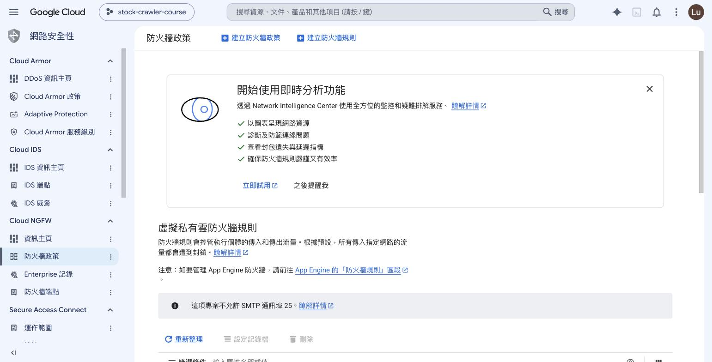

這張清單值得逐條看懂：

| 規則 | 放行什麼 | 說明 |
|------|---------|------|
| `allow-stock-web` | tcp:15672, 5555, 8080, 8081, 8082，來源是你的 IP | 剛才建的，只套用在掛 `stock-web` 標記的 VM |
| `default-allow-ssh` | tcp:22，來源 0.0.0.0/0 | 預設規則——`gcloud compute ssh` 連得上就是靠它 |
| `default-allow-internal` | tcp/udp 全 port，來源限**內部網段**（10.140.0.0/20） | 同一個 VPC 裡的機器互連全放行——第 16 章 VM2 連 VM1 的 RabbitMQ 就是走這條，**不用另外開 5672** |
| `default-allow-icmp` / `default-allow-rdp` | ping／遠端桌面 | 用不到，放著 |

然後在自己電腦的瀏覽器輸入 `http://{VM外部IP}:{port}`：

| Port | 服務 | 帳密 |
|------|------|------|
| 8081 | Airflow | admin / admin |
| 5555 | Flower | 免登入 |
| 15672 | RabbitMQ | worker / worker |
| 8080 | phpMyAdmin | root / 1234 |
| 8082 | mongo-express | admin / pass |


登入 Airflow 之後看到的 DAG 清單，跟第 13 章在本機看到的完全相同——同一份程式碼、同一組容器，只是機器換到了雲端：


**補充：在 Console 檢視與修改防火牆規則**

- 路徑：「≡」選單 →「**網路安全性**」→「**防火牆政策**」，頁面下方的「**虛擬私有雲防火牆規則**」清單就是 CLI 建立的規則所在——看得到 `allow-stock-web`（目標 stock-web、通訊埠 tcp:5555, 8080, 8081, 8082, 15672、動作允許）。點規則名稱進去可以改 port、來源 IP 範圍、目標標籤，每個欄位對應 `firewall-rules create` 的一個參數
- 頁面開頭的官方說明值得念一次：「根據預設，所有傳入指定網路的流量都會遭到封鎖」——這就是 Part G 熱身遇過、Part I 開頭講的「port 要自己開」

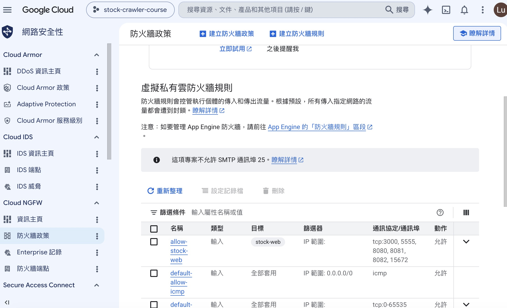

### 確認 3306 與 5672 真的沒開

「絕不對公網開放」不是做了什麼設定，而是**沒有任何規則放行它**——GCP 進站流量預設全擋，不開就是關的。但「應該是關的」和「驗證過是關的」是兩回事，驗證有兩層：

**第一層：稽核規則清單。** 看所有規則的放行清單裡有沒有出現 3306 或 5672：

```bash
gcloud compute firewall-rules list \
  --format="table(name,sourceRanges.list(),allowed[].map().firewall_rule().list(),targetTags.list())"
```

輸出裡逐條看 `ALLOWED` 欄：`allow-stock-web` 只有五個 Web port，四條 `default-` 規則裡放行全 port 的那條（`default-allow-internal`）來源限定內部網段 `10.140.0.0/20`，公網進不來。清單裡沒有任何一條把 3306/5672 開向公網來源——這就是「沒開」的證據。

**第二層：從外面實際敲。** 規則清單可能看錯，實際連線測試不會。在自己電腦上：

```bash
nc -vz -w 5 {VM外部IP} 3306
# nc: connectx to {VM外部IP} port 3306 (tcp) failed: Operation timed out   ← 防火牆擋下，連 TCP 都建不起來

nc -vz -w 5 {VM外部IP} 8080
# Connection to {VM外部IP} port 8080 [tcp/http-alt] succeeded!             ← 對照組：有開的 port 一敲就通

nc -vz -w 5 {VM外部IP} 22
# Connection to {VM外部IP} port 22 [tcp/ssh] succeeded!                    ← default-allow-ssh 放行的
```

3306 的逾時跟 8080 的 succeeded 對照，就是防火牆在工作的樣子。注意逾時不是「MySQL 沒在跑」——MySQL 容器好好地開著，是流量根本到不了它。


### Part J：發任務——從 Airflow 出發

門開了，接著把 H-4 沒做完的驗證做完。發任務的方式從這章起固定走 **Airflow**——它本來就在系統裡（第 10 章起的編排層），之後 16、17 章的雲端操作全部從它出發。

Step 4 觸發 producer DAG（第 12 章串法二：Airflow 只發任務，爬蟲交給 worker）。在 DAG 清單找到 `stock_crawler_producer_dag`，左側開關 unpause，按最右邊的 ▶ 觸發；或用指令：

```bash
sudo docker exec airflow-scheduler airflow dags unpause stock_crawler_producer_dag
sudo docker exec airflow-scheduler airflow dags trigger stock_crawler_producer_dag
```

Graph 上會看到交易日分支走 `send_tasks` 那條路、十個發任務 task 全綠（假日觸發則走 `skip_no_trading`，整批粉紅色 skipped——第 12 章教過的守門行為）。**DAG 全綠只代表任務發出去了**，爬蟲的成敗看下面兩步。

Step 5 Worker 執行（十支股票都發到 twse 佇列，單一 worker 逐筆處理約一兩分鐘）：

```bash
sudo docker logs crawler_twse 2>&1 | grep -c succeeded    # 期望 10
```

Flower（`http://{VM外部IP}:5555`）上同一件事用介面看：兩個 worker Online、twse 的 Processed 與 Succeeded 累加——執行層的帳都記在這裡：

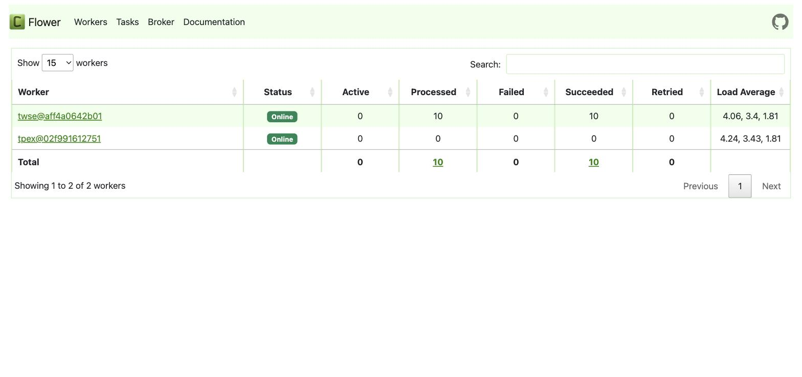

Step 6 DB 驗證：

```bash
sudo docker exec mysql mysql -uroot -p1234 mydb -e \
  "SHOW TABLES; SELECT stock_id, COUNT(*) AS cnt FROM TaiwanStockPrice GROUP BY stock_id;"
```

`TaiwanStockPrice` 存在、十支股票都有資料列。任務 succeeded 還不夠，資料在庫裡才算數。phpMyAdmin（`http://{VM外部IP}:8080`，root/1234）選 `mydb` → `TaiwanStockPrice`，同一批資料用滑鼠就看得到：

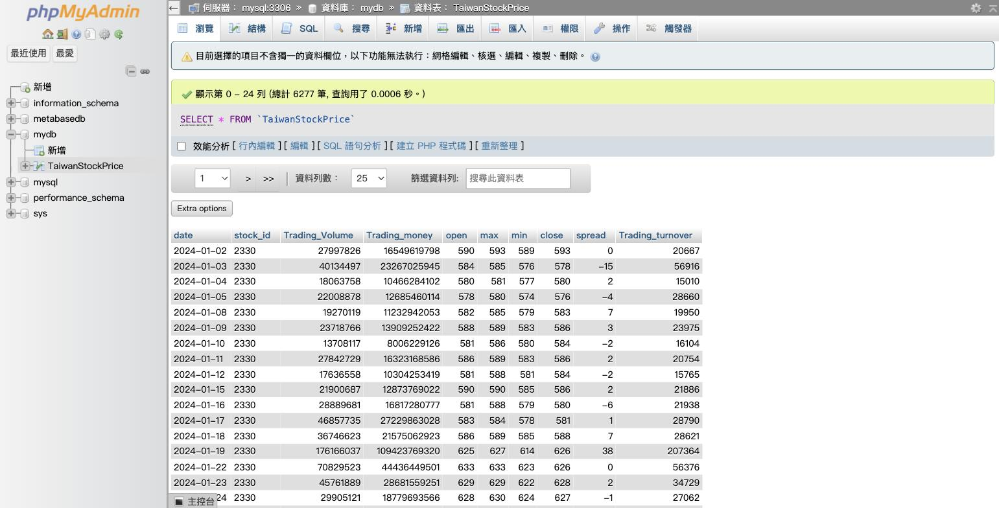

Step 7 BigQuery 那份也落地了（雲端限定）：

```bash
bq query --use_legacy_sql=false "SELECT COUNT(*) AS cnt FROM raw.TaiwanStockPrice"
```

`bq` 是 BigQuery 的指令列工具，VM 上隨 gcloud 一起裝好了，用的同樣是 VM 身分。回傳的筆數大於 0，代表 H-3 說的雙寫真的發生：worker 抓完資料，MySQL（Step 6）和 BigQuery 的 `raw` 資料集**同時**各有一份。這兩份資料的角色差在哪、`raw` 這個名字是什麼意思，第 15 章開場就講。

**再多跑一支：分支 DAG 的雲端版**。第 12 章的分組爬蟲 DAG 也在清單裡，不帶參數觸發，兩組市場都跑：

```bash
sudo docker exec airflow-webserver airflow dags unpause stock_crawler_twse_tpex_dag
sudo docker exec airflow-webserver airflow dags trigger stock_crawler_twse_tpex_dag
```

Graph 上 `choose_market` 之後兩條分支同時走、全部綠色，沒有任何 skipped——分支 DAG 預設就是全跑，只有觸發時主動帶 `--conf '{"market": "twse"}'` 指定單邊，另一邊才會變成粉紅色的 skipped（第 12 章教過的行為，在雲端一模一樣）：

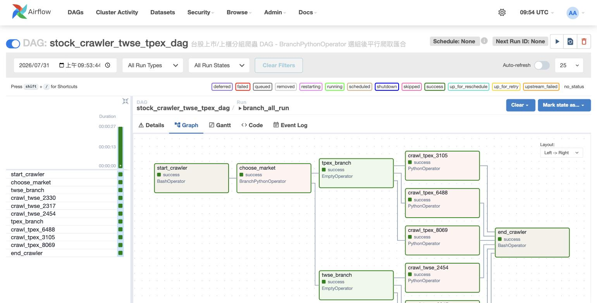

### 那內部要怎麼連？

port 不對公網開，系統自己人要用怎麼辦——分兩種情況，都不用碰防火牆：

1. **同一台 VM 上的容器互連**：worker 連 MySQL 走的是 Docker 的 compose 網路（用容器名互找，第 7 章的老規矩），流量從頭到尾**沒有離開這台機器**，GCP 防火牆管的是進出 VM 的流量，根本管不到它。Part G 的 `curl localhost:8080` 能通就是同一個道理。
2. **跨 VM 互連（第 16 章）**：VM2 的 worker 連 VM1 的 RabbitMQ，走**內部 IP**（10.140.0.x），被 `default-allow-internal` 這條預設規則放行——所以第 16 章拆機器時，5672 一樣不用開任何新規則。

一句話收束：**對外的每個 port 都是明確決策，對內的互連走 Docker 網路或內部網段**。

### 把本機系統開上雲端前的注意事項

上面這套做法對應四個常見的檢查點，每一條在課程裡的處理方式：

| 檢查點 | 為什麼要注意 | 本課程的做法 |
|--------|-------------|-------------|
| MySQL 的 root／user 密碼 | 弱密碼＋port 對外＝資料庫直接被掃走 | 課程沿用 `root/1234`，防線是 **3306 不對公網開**＋phpMyAdmin 只給自己的 IP；第 16 章換 Cloud SQL 後密碼進 Secret Manager。正式環境兩層都要做：改強密碼＋不開 port |
| worker 連線的 host | 跨機器後 localhost 連不到服務 | 第 16 章在 VM2 的 `.env` 把 `RABBITMQ_HOST` 改成 VM1 的**內部 IP** |
| 防火牆規則 | 預設全擋，Web 介面要自己開 | Part G 熱身＋本段 `allow-stock-web`，來源一律限自己的 IP |
| GitHub 連線 | 私有 repo 在 VM 上 clone 要另外處理認證 | 課程 repo 是公開的，`git clone` 免帳密；反過來記住：**金鑰與 .env 絕不 push 上公開 repo**（Part D 講過，Google 會自動停用被掃到的金鑰） |

## 團體專案上雲：IAM、防火牆、密碼與 .env

**先說這一節在做什麼。** Part A 到 Part I 你把課程系統搬上了雲——但那是**一個人的流程**：專案是你的帳號開的、防火牆只放你的 IP、SSH 進去的是你自己的 VM。期末專題是三五個人一組，要把**你們自己的系統**搬上雲。搬法完全一樣（開一台 VM，Part F 到 Part I 照做），但「多人」會讓五個問題冒出來，每一個都是一個人操作時不存在的：

1. **專案要開在誰的帳號下？**——GCP 專案綁著一個人的 $300 試用額度，全組的花費都算在這個人頭上，開工前就要講好 →（步驟 1）
2. **其他組員怎麼取得操作權？**——專案是 A 開的，B 的 Google 帳號對這個專案沒有任何權限，連 VM 的存在都看不到。這就是 IAM 要解的問題 →（步驟 2、3）
3. **組員 SSH 進了 VM，為什麼還動不了 docker？**——GCP 層的權限（能連進來）跟 Linux 層的權限（進來之後能做什麼）是兩回事 →（步驟 4）
4. **組員的瀏覽器為什麼打不開 Flower？**——Part I 的防火牆規則來源只填了你的 IP，組員的封包在門口就被丟掉 →（步驟 5）
5. **root/1234 還能繼續用嗎？**——課程能用弱密碼，前提是「門只開給一個人」；多人共用、白名單變長、開機時間變長，這個前提被稀釋了 →（步驟 6）
6. **有人手滑刪了東西怎麼辦？**——步驟 2 給的角色讓每位組員都有刪 VM、刪磁碟的權力，而全組的系統與資料都在這顆磁碟上 →（步驟 8 備份）

六個問題對應六層設定，這張表就是團體專案上雲的檢查清單，下面逐步展開：

| 層 | 解決的問題 | 要做什麼 | 誰做 | 段落 |
|----|-----------|---------|------|------|
| GCP 專案 | 帳單歸屬 | 講好誰開專案、設預算警告 | 一位組員（下稱開專案者） | 步驟 1 |
| IAM | 組員沒有操作權 | 把組員加進專案，給兩個角色 | 開專案者 | 步驟 2、3 |
| 機器 | 進得來但動不了 docker | 組員帳號加進 docker 群組 | 開專案者 | 步驟 4 |
| 網路 | 組員開不了 Web 介面 | 防火牆來源加全組 IP | 開專案者 | 步驟 5 |
| 機密 | 弱密碼前提消失 | 換強密碼、.env 存放規矩 | 全組約定 | 步驟 6 |
| 資料 | 誤刪無法復原 | 定期磁碟快照 | 開專案者或輪值 | 步驟 8 |

設定完之後用步驟 7 的檢查表逐層驗證，最後用步驟 8 加上保險。以下每一步都以課程系統當範例；換成你們的專案時，對應到相同的位置即可。

**步驟 1：專案與預算——一人開、全組知**

- 專案由一位組員建立（Part C 流程），**所有費用算在這個人的試用額度上**——這是分組時要先講好的事
- Part B 的預算警告在多人環境更重要：警告信只會寄給開專案者，設定完成後把「額度剩多少」放進小組的固定回報事項，全組都要知道
- VM 規格照 Part F 的 `e2-standard-2` 估算即可；一台 VM 跑整組的系統，跟課程系統同一個量級

**步驟 2：在 Console 授予組員存取權**

左上 ≡ 選單 →「IAM 與管理」→「身分與存取權管理」→ 上方「**授予存取權**」。表單兩個欄位：

1. 「新增主體」填組員的 Gmail
2. 「指派角色」用搜尋找角色——輸入「執行個體管理員」，選 **Compute 執行個體管理員 (v1)**：

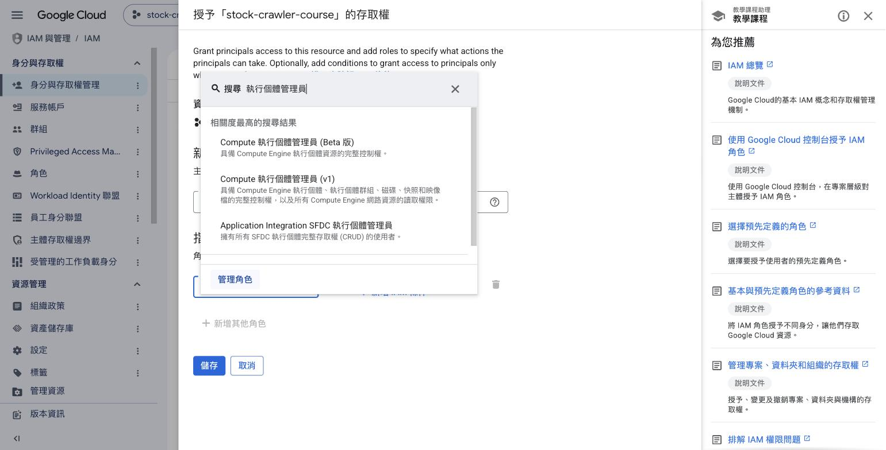

3. 按「＋新增其他角色」，再加一個 **服務帳戶使用者**（Service Account User），然後儲存：

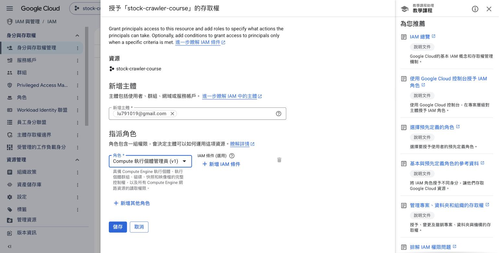

為什麼是這兩個角色：

| 角色 | 給組員的能力 | 少了它會怎樣 |
|------|-------------|-------------|
| Compute 執行個體管理員 (v1) | 開關機、SSH、管理 VM 與磁碟 | 看不到也連不進任何 VM |
| 服務帳戶使用者 | SSH 時以 VM 附掛的服務帳戶身分執行 | SSH 會被拒絕——VM 是掛著服務帳戶跑的，操作它的人要有「使用這個身分」的權限 |

不直接給「編輯者（Editor）」的理由，就是第 15 章之後反覆用到的最小權限原則：組員需要的是操作 VM，不是刪 BigQuery 資料集或改 IAM 設定的能力。授權完成後，成員清單會多出一列：

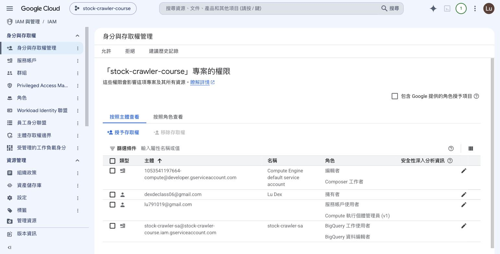

同一件事的指令版（開專案者在自己電腦執行）：

```bash
gcloud projects add-iam-policy-binding {你的專案ID} \
  --member="user:組員的Gmail" --role="roles/compute.instanceAdmin.v1" --condition=None
gcloud projects add-iam-policy-binding {你的專案ID} \
  --member="user:組員的Gmail" --role="roles/iam.serviceAccountUser" --condition=None
```

**步驟 3：組員第一次連進 VM**

組員在**自己的電腦**上裝 gcloud（Part E 同一套流程），登入自己的 Google 帳號、指向這個專案，然後 SSH：

```bash
gcloud auth login
gcloud config set project {專案ID}
gcloud compute ssh stock-crawler-vm --zone=asia-east1-b
```

進去之後先看三件事：

```bash
whoami            # 顯示的是組員自己電腦的使用者名稱，不是開專案者的
ls -ld /home/*    # 每個連過線的人各有一個 home 目錄，權限 drwxr-x---（750）
cd /home/{開專案者}   # bash: cd: Permission denied——進不去別人的家目錄
docker ps             # permission denied——還不在 docker 群組裡
```

兩個現象都是預設行為：`gcloud compute ssh` 用「你自己電腦的使用者名稱」在 VM 上建帳號，所以每個組員有自己的家目錄，彼此隔離；docker 群組則要 VM 上既有的人開通。

**步驟 4：開專案者開通 docker 權限**

開專案者 SSH 進 VM，把組員的帳號加進 docker 群組（組員重新登入 SSH 後生效）：

```bash
sudo usermod -aG docker {組員的VM使用者名稱}
```

組員重連後 `docker ps` 就會列出全部容器——**容器、volume 裡的 MySQL 資料、跑起來的整套系統都是機器層級共用的**，家目錄的隔離只影響個人檔案。組員從這一刻起就能看 log、觸發 DAG、操作跟開專案者完全相同的系統。

**步驟 5：防火牆——來源加全組的 IP**

這裡是「IAM 給了為什麼還是連不上」最常見的答案。IAM 管的是「能不能操作 GCP」（開關機、SSH）；防火牆的 source-ranges 管的是「封包進不進得了 port」——**兩層各自獨立**。Part I 的規則來源只填了開專案者的 IP，所以組員 SSH 連得進（port 22 的預設規則對全世界開，靠金鑰驗證擋人），瀏覽器開 Flower 卻會逾時。把全組的 IP 都加進來（IP 之間用逗號）：

```bash
# 每位組員先查自己的 IP：curl -4 ifconfig.me
gcloud compute firewall-rules update allow-stock-web \
  --source-ranges={開專案者IP}/32,{組員A IP}/32,{組員B IP}/32
```

兩件維運上的事：

- `update --source-ranges` 是**整個覆蓋**不是追加——每次更新都要把全組的 IP 完整列一遍
- 任何一位組員換了網路（回家、換 Wi-Fi、隔天重連），那個人就要重查 IP、由開專案者重跑一次 update——組員「昨天還連得上今天不行」，先想這裡

**步驟 6：密碼與 .env——換掉 1234**

課程系統一路用 `root/1234`，前提是 Part I 的防線——3306 不對公網開、Web 介面只放白名單 IP。這個前提在團體專案**依然成立，但不再足夠**：白名單裡的 IP 從一個變成一組，而且家用 IP 會被 ISP 回收再發給別人。人越多、開機時間越長，弱密碼殘存的風險就越大。**團體專案上雲前，把資料庫密碼換成自己的強密碼**。

時機很重要：**在第一次 `up` 之前就把 .env 設好**。MySQL 容器只在 volume 第一次初始化時讀 `MYSQL_ROOT_PASSWORD`，之後這個變數再怎麼改都不會生效。做法三步：

```bash
# ① 產生一組強密碼（在任何一台電腦上執行，記下輸出）
openssl rand -base64 18
# QxVy8v7V8+N7kaurKryNU7uJ   ← 每次執行都不同

# ② 在 VM 上把它寫進 .env（compose 讀密碼的地方；變數名以你們專案的 compose 檔為準）
cd ~/stock-crawler
cp .env.example .env    # 已有 .env 就直接編輯
nano .env               # MYSQL_ROOT_PASSWORD=剛產生的強密碼

# ③ 起 MySQL 容器（全新 volume，密碼在初始化時生效）
sudo docker compose -f docker-compose-local.yml up -d mysql

# 驗證：強密碼登入成功、1234 被拒
sudo docker exec mysql mysql -uroot -p'{強密碼}' -N -e "SELECT 1;"
# 1
sudo docker exec mysql mysql -uroot -p1234 -N -e "SELECT 1;"
# ERROR 1045 (28000): Access denied for user 'root'@'localhost' (using password: YES)
```

compose 檔裡的 `${MYSQL_ROOT_PASSWORD:-1234}` 是「有 .env 就用 .env 的值，沒有才退回 1234」——這套變數帶入機制在補充G 有完整一章，這裡是它第一次派上實戰用場。

**如果系統已經跑起來才要換密碼**：改 .env 之後 `up -d --force-recreate` **沒有用**——volume 已經用舊密碼初始化，容器重建後讀的還是 volume 裡的舊設定（新密碼登入失敗、舊密碼照樣通）。兩條路：

| 情境 | 做法 |
|------|------|
| 資料可以重灌（專案剛起步） | `docker compose -f docker-compose-local.yml down mysql -v` 刪掉容器與 volume → 改 .env → 重新 `up`（資料重新灌入） |
| 資料要保留 | 進容器用 SQL 改：`ALTER USER 'root'@'%' IDENTIFIED BY '{新密碼}';`，然後同步改 .env——兩邊都要動，這正是第 16 章 Secret Manager 要解決的「密碼散在多處」問題 |

.env 的存放與傳遞規矩：

| 規矩 | 做法 | 理由 |
|------|------|------|
| .env 不進 git | 確認 `.gitignore` 有 `.env` 這行，`git status` 看不到它才對 | 進了 repo 等於密碼公開（Part D 金鑰同一條規則） |
| 不用通訊軟體傳明文密碼 | 密碼只存在 VM 上的 `.env`；組員 SSH 進 VM 就讀得到，不需要另外傳 | 一台 VM 共用的架構讓「傳遞」這件事直接消失 |
| 換密碼只改一個地方 | 改 VM 上的 `.env` → 重建容器 | 集中管理；第 16 章 Secret Manager 是它的下一階 |
| 金鑰檔比照辦理 | Part D 的 JSON 金鑰放 VM 指定路徑，不進 repo、不走聊天室 | 金鑰被掃到會被 Google 自動停用（Part D 講過） |

**步驟 7：驗證——每一層都真的通了**

| # | 組員應該做到 | 證明了什麼 |
|---|-------------|-----------|
| 1 | `gcloud compute ssh` 連進 VM | 兩個 IAM 角色都生效 |
| 2 | `docker ps` 列出容器 | docker 群組開通、操作的是同一套系統 |
| 3 | 瀏覽器開 `http://{VM外部IP}:5555` 看到 Flower | 防火牆來源加對了 |
| 4 | 用新密碼連進 MySQL（`docker exec -it mysql mysql -uroot -p`） | 強密碼生效、.env 帶入成功 |

**步驟 8：備份——手滑的保險**

步驟 2 給組員的 `instanceAdmin.v1` 包含刪除 VM 與磁碟的權力；再加上像 `docker system prune` 這種清理指令會把「沒在用」的東西整批帶走——多人環境裡，誤刪不是會不會發生的問題，是發生時有沒有退路的問題。退路就是**磁碟快照**：把整顆磁碟當下的狀態存起來，程式、volume 裡的資料庫、設定檔全部包含在內。

```bash
# 拍一張快照（VM 開著關著都能拍；名稱帶日期方便辨識）
gcloud compute disks snapshot stock-crawler-vm --zone=asia-east1-b \
  --snapshot-names=team-backup-0803

# 看快照清單
gcloud compute snapshots list
# NAME              DISK_SIZE_GB  STATUS
# team-backup-0803  20            READY
```

- **時機**：每週固定一張＋大改動前（demo 前一天必拍）；誰拍寫進步驟 1 的小組分工
- **費用**：快照採差異儲存，20GB 磁碟的快照每月費用遠低於一杯飲料，保留最近兩三張、更舊的刪掉即可（`gcloud compute snapshots delete {名稱}`）
- **還原**：從快照建一顆新磁碟、掛到新 VM——`gcloud compute disks create {新磁碟名} --source-snapshot=team-backup-0803 --zone=asia-east1-b`，再用 Part F 的指令開 VM 時加 `--disk` 掛上。誤刪發生時，損失的只有上次快照之後的變更

**補充：想讓全組共用同一份程式碼資料夾**

家目錄互相進不去，所以組員拿程式碼的預設做法是各自 `git clone`（程式碼本來就該用 git 共享）。如果小組想直接共同編輯同一份，把 repo 放到共用位置並開群組權限：

```bash
# 開專案者執行：建群組、把成員加進去
sudo groupadd stock
sudo usermod -aG stock {開專案者}
sudo usermod -aG stock {組員}

# 把 repo 放到 /opt 並交給群組（2775 的 2 是 setgid：之後新增的檔案自動繼承 stock 群組）
sudo git clone https://github.com/lu791019/stock-crawler-de-course-materials.git /opt/stock-crawler
sudo chgrp -R stock /opt/stock-crawler
sudo chmod -R 2775 /opt/stock-crawler
```

之後全組都在 `/opt/stock-crawler` 工作，任何人建的檔案其他人都能改。採用這個做法的小組，後續章節指令裡的 `~/stock-crawler` 一律讀作 `/opt/stock-crawler`；沒有要共同編輯的話，不做這一段也完全不影響。

**協作的四件注意事項**

- **費用全部算在開專案者的帳上**——Part B 的預算警告在多人使用時更重要，全組都該知道額度剩多少
- **指定收工負責人**——「下課前停機」在多人環境會變成「大家都以為別人會關」；指定一位組員負責每天最後跑 `instances stop`，其他人負責提醒
- 專題結束要收回權限：成員清單該列點「移除存取權」，或 `gcloud projects remove-iam-policy-binding` 同參數反向執行
- 加組員不需要共用任何密碼或金鑰——每個人用自己的 Google 帳號登入，這正是 IAM 身分制的意義；資料庫密碼這類機密不歸 IAM 管，步驟 6 用 .env 處理，第 16 章再交給 Secret Manager

## 收工：停機省額度

**本章結束前一定要做這件事。**

```bash
gcloud compute instances stop stock-crawler-vm --zone=asia-east1-b
gcloud compute instances list
```

`list` 顯示 STATUS 變成 `TERMINATED`、EXTERNAL_IP 欄位變空白——外部 IP 被回收了。

三個指令的差別：

| 指令 | 效果 | 費用 |
|------|------|------|
| `stop` | 關機，磁碟與設定保留 | 運算費歸零，磁碟費照收（20GB 約 NT$25／月） |
| `start` | 重新開機 | 恢復計費；**外部 IP 會換新的**，瀏覽器網址要跟著換 |
| `delete` | 整台刪除，磁碟一併消失 | 全部歸零 |

```bash
# 下次上課前重新開機
gcloud compute instances start stock-crawler-vm --zone=asia-east1-b
gcloud compute instances list    # 記下新的 EXTERNAL_IP
```

防火牆規則綁的是標籤不是 IP，開機後不用重設；要換的只有你瀏覽器裡的網址。

**補充：用 Console 停機／開機**

- 回到「VM 執行個體」清單，勾選 VM 後上方浮出「**啟動／繼續**」「**停止**」「**暫停**」「**重設**」按鈕；或點每列最右邊的「⋮」選單操作。效果跟 `instances stop` / `start` 完全相同，停止前會跳出確認視窗
- 按鈕會跟著 VM 狀態變化：VM 已停機時「停止」是灰色不能按的，滑鼠移上去會提示「這個 VM 執行個體並非處於執行中……因此無法停止」——看到這個提示就代表機器確實停了

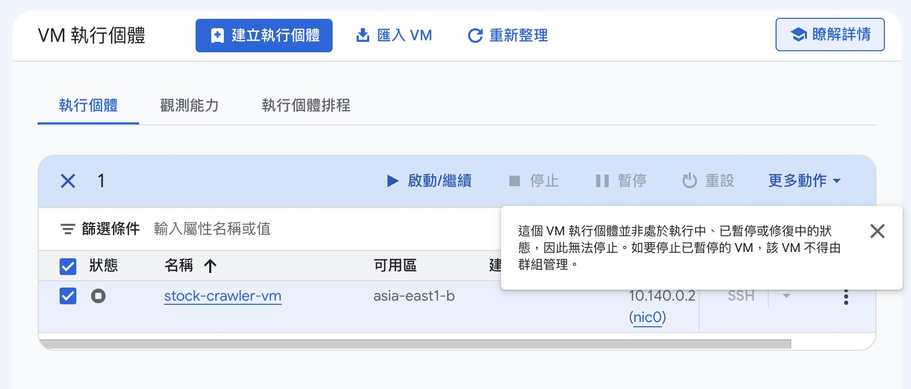

## 補充：從帳單看花費，並對應到停止動作

停機是動作，帳單是驗證——錢有沒有真的停止流出，要回帳單頁確認。兩個頁面各看一件事。

**① 總覽頁：額度還剩多少**。「≡」選單 →「帳單」→「總覽」：

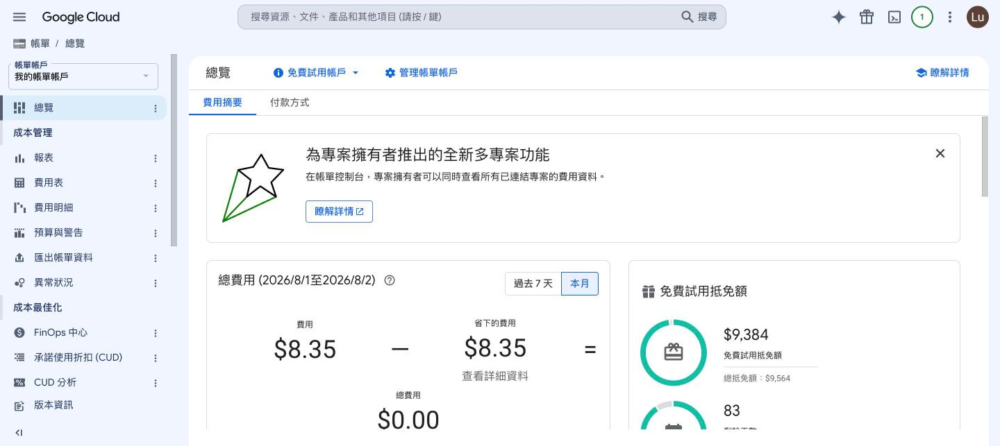

- 右側「免費試用抵免額」是最重要的數字：剩餘額度與剩餘天數（兩者先到期的算）
- 左側「總費用」顯示本期費用與被抵免的金額——試用期間「費用 − 省下的費用 = $0」是正常畫面

**② 報表頁：錢花在哪個服務**。左側「成本管理」→「報表」，「分組依據」選**服務**、時間範圍切到**上個月**（本月剛開始時數字太少看不出結構）：

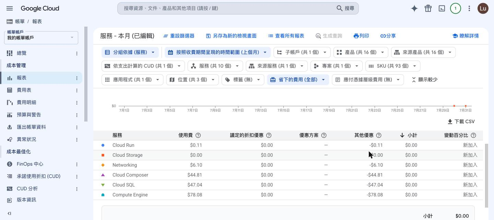

表格照費用大小排序，這就是「該先停什麼」的優先順序。每一列對應的停止動作：

| 報表上的服務 | 費用來源 | 停止動作 |
|-------------|---------|---------|
| Compute Engine | VM 開著就計費（每台分開列在 SKU） | `gcloud compute instances stop`——磁碟費照收但很小 |
| Cloud SQL | 實例存在＋運轉 | `--activation-policy=NEVER` 停轉；確定不用就 `delete` |
| Cloud Composer | 環境存在就計費、**無停機選項** | `environments delete`——它通常是表上最大的一筆 |
| Cloud Run | 按請求計費，閒置自動縮零 | 平時不用管；結束專案才 `services delete` |
| Networking | 對外流量，跟著 VM 的使用走 | VM 停了它就跟著停 |
| BigQuery／Cloud Storage | 儲存費（免費層內通常是 $0） | 結束專案 `bq rm -r -d`／刪 bucket |

**讀報表的一個陷阱**：試用期間每列的「其他優惠」都是負值、小計 $0——這不是「沒花錢」，是**抵免額在替你付**。「使用費」欄才是真實的燃燒速度；照上圖的量級（一個月 $170 左右），$300 試用額度撐不到兩個月全程開機——這就是「下課停機」必修的原因，數字自己會說話。

**週期建議**：把「開報表確認使用費」加進每週的固定動作（團體專案由開專案者負責，見〈團體專案上雲〉步驟 1）；預算警告（Part B）是被動保險，主動看報表才會知道錢流向哪裡。

## 補充：試用結束後的永久免費機器（Always Free）

$300 試用是 90 天，但 GCP 另有一個**不會過期的永久免費方案（Always Free）**——條件嚴格，三個都要中：

1. 機型只能是 **e2-micro**（2 顆共享 vCPU、1GB 記憶體），而且每個帳號**每月只有一台**的額度
2. 區域只限美國三區：**us-west1（奧勒岡）、us-central1（愛荷華）、us-east1（南卡羅來納）**——台灣區不適用
3. 開機磁碟要用**標準永久磁碟（pd-standard）**、總量 30GB 內——**注意：不指定的話預設給的是平衡磁碟（pd-balanced），會被收費**

完整的免費額度清單與限制以官方文件為準：[GCP 免費方案的用量限制](https://docs.cloud.google.com/free/docs/free-cloud-features?hl=zh_tw#free-tier-usage-limits)——條件會變動，開機器前先對一次。

一條指令開出符合資格的機器（跟本章 F-2 的差異就是粗體三個參數）：

```bash
gcloud compute instances create free-vm \
  --zone=us-west1-a \
  --machine-type=e2-micro \
  --image-family=ubuntu-2404-lts-amd64 \
  --image-project=ubuntu-os-cloud \
  --boot-disk-size=30GB \
  --boot-disk-type=pd-standard
```

Console 建立時的三個對應點選：區域選 us-west1、機器類型在 E2 系列選 e2-micro、「OS 和儲存空間」的開機磁碟類型改選「標準永久磁碟」。

**期望管理**：1GB 記憶體跑不動課程全套（連 Airflow 一個都吃不下），它適合的是——跑一支 API、跑單一 worker、掛個人小專案或排程腳本。另外每月只有 1GB 的北美出站流量免費，超過照算。

**課程其他服務的「試用後」狀況**：BigQuery 有永久免費層（10GB 儲存＋每月 1TB 查詢，第 15 章的用量遠在額度內）、Looker Studio 本來就免費——**資料倉儲和 BI 這條線試用結束照樣能用**；Cloud SQL 沒有免費層（第 16 章的實例試用後留著就會扣試用外的錢，記得停用或刪除）。


## 檢查：這一章做完的狀態

- [ ] GCP 試用已開通，控制台頂部看得到剩餘抵免額
- [ ] 「帳單 → 預算與警告」有一筆每月預算，三段警示門檻
- [ ] 專案 `stock-crawler-course` 存在且是目前選取的專案
- [ ] 服務帳戶 `stock-crawler-sa` 存在，金鑰 JSON 已下載並移到 `~/gcp-keys/`
- [ ] `gcloud projects list` 列得出專案
- [ ] VM 能開、能 SSH、能跑整套 compose；H-4 起飛前檢查＋Part J 從 Airflow 發任務的驗證全過（含 Step 7：BigQuery 的 `raw.TaiwanStockPrice` 有筆數）
- [ ] 瀏覽器連得上雲端的 Airflow／Flower
- [ ] **VM 已停機**（`gcloud compute instances list` 顯示 TERMINATED）

## 想一想

1. 服務帳戶的金鑰檔如果不小心 commit 到公開的 GitHub repo，會發生什麼事？該怎麼補救？
2. 為什麼防火牆規則不開放 3306 和 5672？如果你人在外面想連雲端的 MySQL，正確的做法是什麼？（提示：SSH）
3. VM 停機後外部 IP 會變，對「把網址發給別人用」這件事是什麼問題？固定的對外網址可能怎麼做？（補充H 會回答）

## 練習

1. 用 `gcloud compute instances start` 把 VM 開回來，確認外部 IP 換了，瀏覽器用新 IP 重新打開 Airflow，然後停機
2. 在 Airflow UI（8081）unpause 並 trigger `stock_crawler_dag`（串法一：Airflow 自己爬），用 Part J 的 Step 6 確認資料增加——跟 producer DAG（串法二）對照兩種串法
3. 把防火牆規則的 `--source-ranges` 改成另一個網路的 IP（例如手機熱點），驗證原本的網路連不上了——理解來源限制的意義

## 排錯

| 症狀 | 原因 | 處理 |
|------|------|------|
| 註冊時看不到「免費試用」按鈕，直接進控制台 | 這個 Google 帳號已經用過試用資格 | 換一個全新的 Google 帳號 |
| 預算金額變成 03000 | 欄位預設的 0 沒清掉 | 全選清空再輸入 |
| 建立專案後頂部還是 My First Project | 建立不會自動切換 | 點通知的「選取專案」或從頂部清單切換 |
| `config set project` 出現 access 警告 | 還沒 `gcloud auth login` | 先登入，再 `gcloud projects list` 驗證 |
| 服務帳戶清單點不進詳細頁 | 點到列首的勾選框 | 點 email 的藍色文字連結 |
| 第一次 SSH 出現 Permission denied | SSH 金鑰還在生效中 | 等 30 秒重跑 |
| SSH 時被問 `Enter passphrase for .../.ssh/google_compute_engine` | 第一次跑 `gcloud compute ssh` 產生金鑰時設了 passphrase——問的是那串自訂密語，跟服務帳戶的 JSON 金鑰無關 | 輸入當時設的 passphrase；不記得就刪掉 `~/.ssh/google_compute_engine`（連同 `.pub`）重跑 SSH，這次直接按 Enter 兩次留空 |
| 剛建好的 VM SSH 出現 `port 22: Connection refused` | VM 顯示 RUNNING 但裡面的 sshd 還沒啟動完 | 等半分鐘重跑同一條指令；跟上一條的差別是連線直接被拒、還輪不到驗金鑰 |
| `up` 報 stock-airflow image 不存在 | 還沒在這台 VM build 過 | `sudo docker build -f airflow/Dockerfile -t stock-airflow:latest .` |
| 瀏覽器連 Web 介面轉圈圈到逾時 | 防火牆沒開該 port，或 IP 不在 source-ranges 裡 | 檢查規則的 port 清單與 `curl -4 ifconfig.me` 的目前 IP |
| 原本連得上的 Web 介面，換個地方（或隔天）突然逾時 | 你的對外 IP 換了，規則裡還是舊 IP | `curl -4 ifconfig.me` 查新 IP，`gcloud compute firewall-rules update allow-stock-web --source-ranges={新IP}/32` |
| 停機再開機後原網址連不上 | 外部 IP 換了 | `gcloud compute instances list` 查新 IP |

## 本章總結

- 開通 GCP 的順序是：試用註冊 → **預算警告** → 課程專案 → 服務帳戶與金鑰——保險絲永遠先裝
- 專案 ID 全球唯一且不可變；服務帳戶是給程式用的身分，金鑰檔只發一次、絕不進 git
- gcloud CLI 讓雲端操作可以複製、重跑、寫成腳本；`auth login`、`config set project`、驗證三連是每台新電腦的起手式
- 一台 8GB 的雲端 VM 裝上 Docker 之後，第 13 章的整套系統原封不動搬上去就能跑——環境變了，程式沒變；上雲後爬蟲多做一件事：每次抓取同時寫 MySQL 與 BigQuery 各一份（憑 VM 身分，不用金鑰）
- 防火牆只開需要的 port、來源限自己的 IP；資料庫與訊息佇列不對公網
- 運算費只在開機時計——**下課前停機**跟寫程式一樣是本課程的必修動作

下一章（第 15 章）回頭把本章已經在寫的 BigQuery 講清楚：資料倉儲是什麼、雙寫的程式碼長什麼樣、raw/stage/app 三層怎麼分工，最後接上 Looker Studio 做出儀表板；第 16 章再把這台「一台裝全部」的機器拆開：多台 VM 分工、資料庫換成託管的 Cloud SQL——系統正式搬家。
