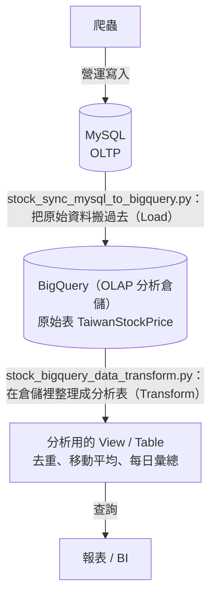
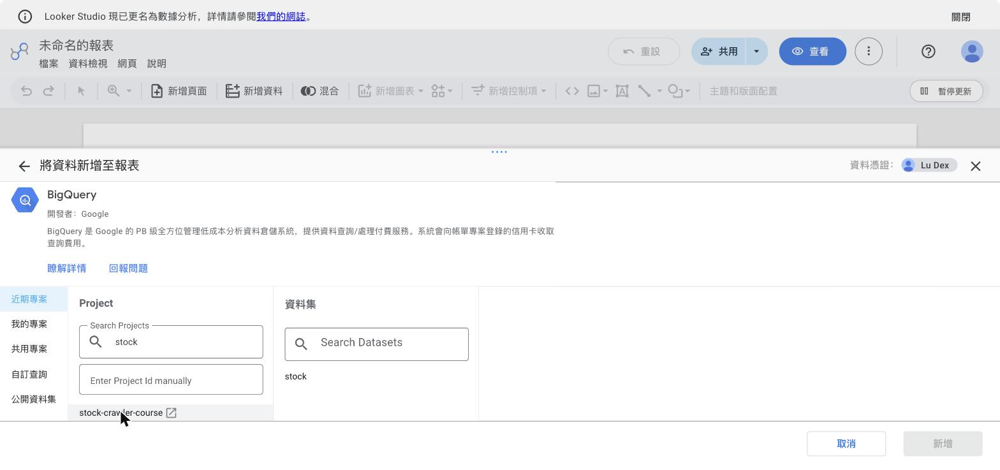
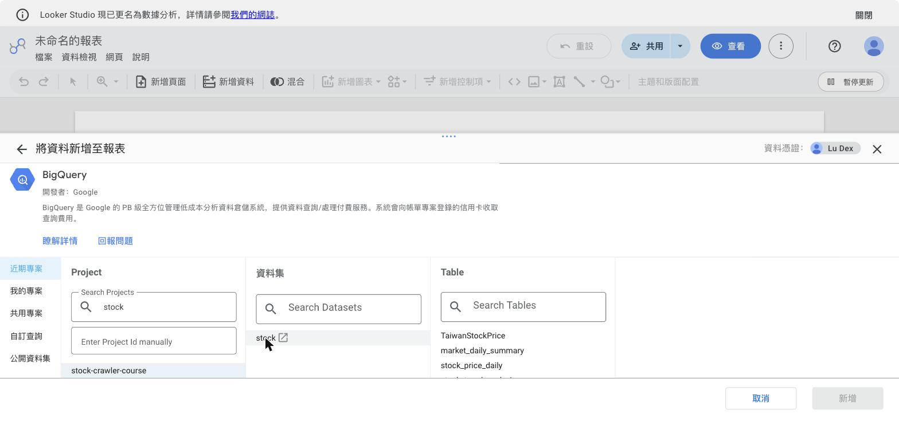
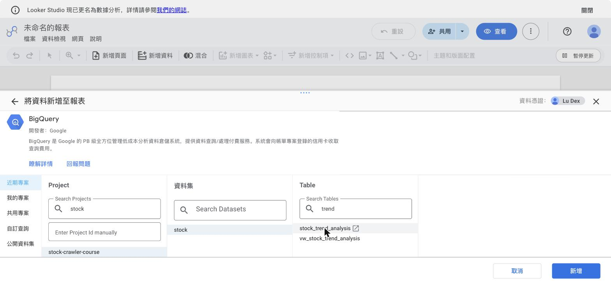
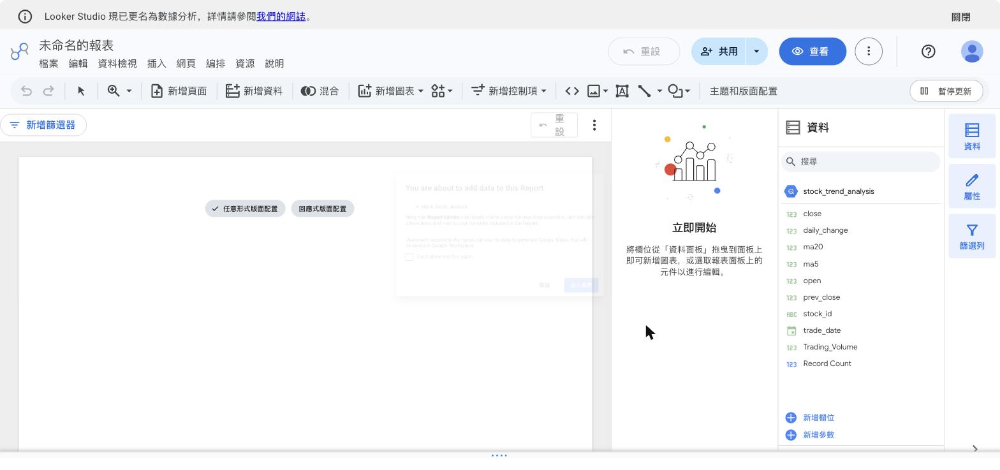
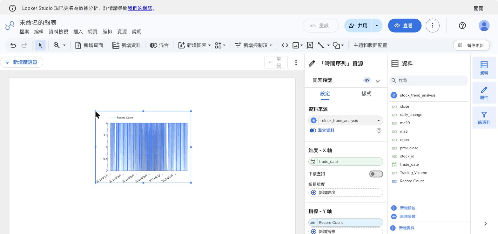
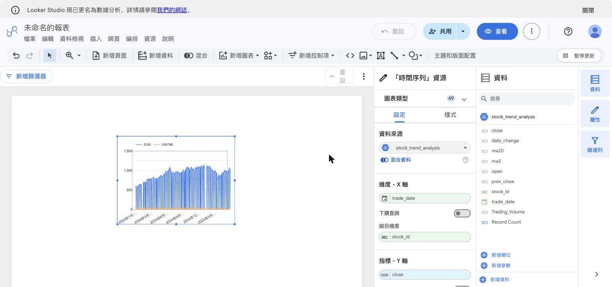
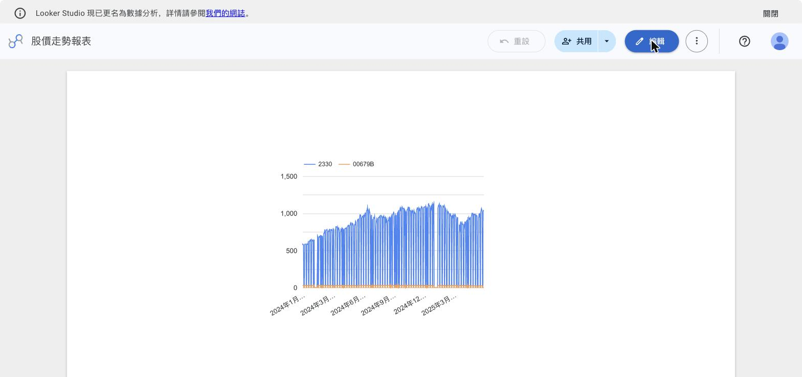

# 課程手冊15 - BigQuery 資料倉儲：MySQL → BigQuery（OLTP → OLAP）

> 這一章教「為什麼 MySQL 不夠」。你會把股價同步進雲端資料倉儲 BigQuery，並在上面做真正的分析（算移動平均、每日漲跌統計）。

> ⚠️ 本章的實作需要 GCP 帳號與憑證，第 14 章已經全部發好（專案、服務帳戶與金鑰、費用警示）。還沒完成第 14 章的話，先讀懂「資料怎麼流」和觀念段，開通後再回來做實作。

---

## 本章用到的工具與服務

| 工具／服務 | 類型 | 在本章做什麼 |
|-----------|------|-------------|
| BigQuery | GCP 服務 | 資料倉儲：接收 MySQL 同步來的股價，用視窗函數算分析表 |
| IAM | GCP 服務 | 給服務帳戶補上兩個 BigQuery 角色——課程的第一條授權指令 |
| Looker Studio | Google 免費 SaaS | Bonus 段接 BigQuery 畫收盤走勢圖 |
| JSON 金鑰 | 憑證 | 本機程式對 GCP 的身分，`GOOGLE_APPLICATION_CREDENTIALS` 指向它 |
| gcloud／bq CLI | 指令工具 | 開 API、授權、用查詢驗證資料落地 |
| uv | 既有工具 | 在本機執行同步與轉換兩支程式 |

## 做完這一章你會

1. 說得出 OLTP（交易型）和 OLAP（分析型）資料庫的差別。
2. 看懂怎麼把 MySQL 的資料同步進 BigQuery。
3. 看懂怎麼在 BigQuery 上用 SQL 做分析（去重、移動平均、每日彙總）。
4. 理解 ELT 這個流程。
5. （Bonus）用 Looker Studio 接 BigQuery，畫出兩支股票的收盤走勢圖。

---

## 先搞懂：OLTP vs OLAP

| | OLTP（例：MySQL）| OLAP（例：BigQuery）|
|---|---|---|
| 用途 | 即時、頻繁的小筆讀寫 | 大範圍的分析查詢 |
| 典型操作 | 寫入今天的股價、查一支股票 | 掃描三年、上千支股票算相關性 |
| 比喻 | 收銀機 | 財報分析室 |

前面你把股價寫進 MySQL——那是**營運資料庫（OLTP）**，擅長「一筆一筆即時寫入」。但當你要「一次掃三年、上千支股票做統計」，讓這種分析查詢**直接打在 MySQL 上**，會拖慢正在寫入的爬蟲，兩邊互相影響。

**解法：把資料另外同步一份到資料倉儲（OLAP）**，分析都在倉儲做，MySQL 專心負責寫入。BigQuery 就是 Google Cloud 上的資料倉儲，擅長「掃大量歷史資料」。

---

## 這一章會用到的檔案

| 檔案 | 角色 | 說明 |
|------|------|------|
| `crawler/bigquery.py` | 工具模組 | 封裝 BigQuery 連線、建表、上傳、建 View |
| `crawler/stock_sync_mysql_to_bigquery.py` | 同步 | 把 MySQL 資料搬到 BigQuery |
| `crawler/stock_bigquery_data_transform.py` | 轉換 | 在 BigQuery 上建分析用的 View / Table |

---

## 資料怎麼流（先看全貌）



這就是資料工程常說的 **ELT**：先把資料 **L**oad（載入）進倉儲，再在倉儲裡 **T**ransform（轉換）。跟傳統「先轉換再載入」的 ETL 相反——雲端倉儲夠強，所以偏好先搬進去、再用它的算力轉換。

---

## 一行一行讀懂關鍵片段

### ① 上傳到 BigQuery（`bigquery.py`）

```python
def upload_data_to_bigquery(table_name, df, dataset_id=DATASET_ID, mode="replace"):
    client = get_bigquery_client()
    table_id = f"{PROJECT_ID}.{dataset_id}.{table_name}"
    # replace = 整張覆蓋；append = 附加
    write_disp = WriteDisposition.WRITE_TRUNCATE if mode == "replace" else WriteDisposition.WRITE_APPEND
    job_config = LoadJobConfig(write_disposition=write_disp, autodetect=True)
    job = client.load_table_from_dataframe(df, table_id, job_config=job_config)
    job.result()   # 等這個批次載入 job 跑完
```

重點：

- `table_id` 是 BigQuery 的三段式命名：`專案.資料集.表`。
- `WRITE_TRUNCATE`（覆蓋）vs `WRITE_APPEND`（附加）：對應你在第 5 章學過的 `if_exists`，概念一樣。
- `load_table_from_dataframe`：用「批次載入 job」把 DataFrame 匯進 BigQuery。專案註解特別提到一個實務重點——**這種批次 load job 是免費的**（只算儲存費），而另一種 streaming insert（逐筆即時寫入）會依寫入量計費。所以「每日整批股價」這種場景用批次 load 最划算。
- `job.result()`：因為 load 是**非同步**的，這行是「等它做完」（是不是想到第 1 章的 `.delay()` + 之後 `.get()`？概念相通）。

### ② 用日期做分區（partition）

```python
table.time_partitioning = bigquery.TimePartitioning(
    type_=bigquery.TimePartitioningType.DAY,
    field="date",
)
```

**分區**是資料倉儲省錢又加速的關鍵。它把大表依 `date` 切成一天一塊，之後你查「只看某個月」時，BigQuery 只掃那幾塊、不用掃整張表——BigQuery 依掃描量計費，掃得少就便宜又快。

### ③ 在 BigQuery 上做分析（`stock_bigquery_data_transform.py`）

這正是 OLAP 的核心用途——用 SQL 的**視窗函數（window function）**算技術指標。看這段建「趨勢分析 View」的 SQL：

```sql
SELECT
  stock_id, trade_date, close,
  -- 昨天的收盤價
  LAG(close) OVER (PARTITION BY stock_id ORDER BY trade_date) AS prev_close,
  -- 5 日移動平均（含今天往前 4 天）
  AVG(close) OVER (
    PARTITION BY stock_id ORDER BY trade_date
    ROWS BETWEEN 4 PRECEDING AND CURRENT ROW
  ) AS ma5,
  -- 20 日移動平均
  AVG(close) OVER (
    PARTITION BY stock_id ORDER BY trade_date
    ROWS BETWEEN 19 PRECEDING AND CURRENT ROW
  ) AS ma20
FROM vw_stock_price_daily
```

白話：

- `PARTITION BY stock_id ORDER BY trade_date`：對「每一支股票、按日期排序」分別計算。
- `LAG(close)`：抓「上一列（昨天）」的收盤價，用來算漲跌。
- `AVG(close) OVER (... ROWS BETWEEN 4 PRECEDING AND CURRENT ROW)`：算「今天往前含 4 天」共 5 天的平均，也就是股市常說的 **5 日均線（MA5）**；20 天就是 MA20。

這種「一整支股票的時間序列分析」正是 OLAP 的強項，也是為什麼要把資料搬進 BigQuery——在 MySQL 上對整個歷史做這種計算會很吃力。

---

## 一步一步

### Step 0：確認資料來源（本機 MySQL）

本章的同步來源是**本機的容器 MySQL**（第 5 章起累積股價資料的那顆；第 16 章搬家後，同一支程式的來源會換成 Cloud SQL，只差一個 `MYSQL_HOST`）。開始前確認兩件事：

```bash
# MySQL 容器在跑
docker compose -f docker-compose-local.yml up -d mysql

# 表裡有資料（沒有的話：起 rabbitmq + worker，跑一次 producer_multi_queue.py 灌入）
docker exec mysql mysql -uroot -p1234 -N -e "SELECT COUNT(*) FROM mydb.TaiwanStockPrice;"
```

### Step 1：準備 GCP 環境

GCP 帳號註冊、建立專案、建立服務帳戶（Service Account）與下載 JSON 金鑰，這些**在第 14 章都已經完成**。本章補上 BigQuery 專屬的四件事，全部用 gcloud 指令：

**1. 開啟 BigQuery API**（第 14 章開的是 Compute Engine 的 API，每個服務的 API 要各自啟用）：

```bash
gcloud services enable bigquery.googleapis.com
```

**2. 幫服務帳戶加上 BigQuery 權限**

第 14 章〈團體專案上雲〉用 Console 給組員授過權；這裡改用指令做同一件事。打指令之前，先認識 **IAM** 的三個詞——它們就是下面那條指令的三個部分：

| 詞 | 白話 | 這次的值 |
|----|------|---------|
| **成員（誰）** | 人（Google 帳號）或程式（服務帳戶） | `stock-crawler-sa@…`——第 14 章建的那個服務帳戶 |
| **角色（能做什麼）** | 一組權限的包裝，名字長得像 `roles/服務.動作` | `bigquery.dataEditor`（讀寫資料、建表）＋`bigquery.jobUser`（執行查詢工作） |
| **資源（在哪生效）** | 權限的作用範圍：整個專案、或單一資源 | `stock-crawler-course`——整個專案 |

一句話：**把「某個角色」綁在「某個成員」身上，在「某個資源範圍」內生效**——指令名稱 `add-iam-policy-binding` 的 binding（綁定）就是這個意思。

**角色分兩類，差在涵蓋範圍的大小：**

- **基本角色（Owner／Editor／Viewer）**：GCP 早期的設計，一個角色涵蓋很多權限。給 Editor 的話，這個服務帳戶連刪 VM、改設定都做得到
- **預定義角色**：每個服務各自定義的細顆粒角色，名稱格式是 `roles/服務.動作`。這次要給的 `bigquery.dataEditor` 和 `bigquery.jobUser` 都是這類

**這裡給兩個預定義角色，而不是一個 Editor**，理由是**最小權限原則：需要什麼、才給什麼**。第 14 章建服務帳戶時刻意一個角色都不給，就是為了在這一步只補上恰足夠用的權限。金鑰萬一外流，對方能做的事就限縮在 BigQuery 這個範圍內。實務原則：**能用預定義角色就不要用基本角色**。

這條原則第 16 章還會再遇到一次：把授權範圍從整個專案縮到單一資源。

```bash
SA="stock-crawler-sa@stock-crawler-course.iam.gserviceaccount.com"   # 換成你的服務帳戶 email
gcloud projects add-iam-policy-binding stock-crawler-course \
  --member="serviceAccount:$SA" --role="roles/bigquery.dataEditor" --condition=None
gcloud projects add-iam-policy-binding stock-crawler-course \
  --member="serviceAccount:$SA" --role="roles/bigquery.jobUser" --condition=None

# 驗證：應列出剛加的兩個角色
gcloud projects get-iam-policy stock-crawler-course \
  --flatten="bindings[].members" --filter="bindings.members:stock-crawler-sa" \
  --format="value(bindings.role)"
```

**3. 設定兩個環境變數**——憑證指向第 14 章下載的金鑰、專案 ID 指向你的專案：

```bash
export GOOGLE_APPLICATION_CREDENTIALS="$HOME/gcp-keys/你的金鑰檔名.json"
export GCP_PROJECT_ID="stock-crawler-course"   # 換成你的專案 ID
```

**4. 取消程式裡的兩處註解**（兩處都要改，只改一處會用到預設值 "your-project-id" 而報錯）：

- `crawler/config.py`：把 `# GCP_PROJECT_ID = os.environ.get(...)` 那行的 `#` 拿掉
- `crawler/bigquery.py` 開頭：把 `# from crawler.config import GCP_PROJECT_ID as PROJECT_ID` 取消註解，並刪掉下一行的 `PROJECT_ID = "your-project-id"` 佔位

> 如果你沒有跟課、自己有現成的 GCP 帳號：建一個專案、開 BigQuery API、建一個服務帳戶並下載金鑰，再照第 3、4 步設定即可。

### Step 2：把 MySQL 同步進 BigQuery

```bash
uv run crawler/stock_sync_mysql_to_bigquery.py
```

這支會：建立 BigQuery dataset（如果沒有）→ 從 MySQL `SELECT * FROM TaiwanStockPrice` 讀成 DataFrame → 建好帶分區的 BQ 表 → 覆蓋上傳。成功的輸出長這樣：

```
開始執行 MySQL 到 BigQuery 的同步...
Created dataset stock
表格 {專案ID}.stock.TaiwanStockPrice 建立成功
查詢執行成功，返回 DataFrame，共 XXX 筆記錄
資料已上傳到 BigQuery 表 'TaiwanStockPrice'，共 XXX 筆記錄
MySQL 到 BigQuery 的同步完成
```

### Step 3：在 BigQuery 上建分析 View / Table

```bash
uv run crawler/stock_bigquery_data_transform.py
```

這支會建立三組「View＋實體 Table」：去重的每日股價（`vw_stock_price_daily`／`stock_price_daily`）、含 MA5/MA20 的趨勢分析（`vw_stock_trend_analysis`／`stock_trend_analysis`）、每日市場彙總（`vw_market_daily_summary`／`market_daily_summary`）。每建一組會各印一行「成功」訊息。

---

## Bonus：用 Looker Studio 把 BigQuery 畫成走勢圖

第 8 章用 Metabase 接本機 MySQL 畫圖；雲端這一段的 BI 角色由 **Looker Studio** 接手——Google 的免費 SaaS BI 工具，不用安裝任何東西，內建 BigQuery 連接器。

先分清楚兩個工具誰做什麼——這是本機「MySQL → Metabase」關係的雲端翻版：

| | BigQuery | Looker Studio |
|---|---|---|
| 角色 | 倉儲＋查詢引擎：存資料、跑 SQL、算 View | BI 視覺化：拉圖表、拼儀表板 |
| 你操作它的方式 | SQL（查詢編輯器／bq／Python） | 滑鼠拖拉，不用寫程式 |
| 誰連誰 | 被連的資料源 | 用內建連接器去連 BigQuery |
| 費用 | 按掃描量計費（有免費額度） | 工具本身免費；它發出的查詢照左邊計費 |

BigQuery 的 Console 查詢介面只能看表格結果、畫不了儀表板——要圖表就交給 Looker Studio。這正是第 14 章講的 SaaS：打開瀏覽器就能用，你只管使用、不管維護。

> 注意：Looker Studio 已更名為「數據分析」，介面上兩個名字都會看到，是同一個東西。

**Bonus-1 首次使用的帳戶設定**（只有第一次要做）

1. 開 `lookerstudio.google.com`，確認右上角是你開通 GCP 的 Google 帳號
2. 跳出「授權 數據分析 API」→ 按「繼續」
   
3. 點「建立報表」會先進入帳戶設定（共 2 步）：
   - 步驟 1：國家/地區選「台灣」（下拉選單要捲動找，不支援打字搜尋）、**公司欄必填**（填了「繼續」才會亮，而且提示「公司名稱一經設定即無法更改」，填個人或單位名稱即可）、勾服務條款
     
   - 步驟 2：三個電子報訂閱問題，都選「否」即可
     

**Bonus-2 連接 BigQuery 資料**

1. 回到首頁點「**建立報表**」→ 出現「將資料新增至報表」的連接器清單
   
2. 點 **BigQuery** → 第一次會再要求一次授權（「數據分析必須先取得授權，才能與您的 BigQuery 專案連結」）→ 按「授權」
   
3. 依序點選：Project 搜「stock」→ 你的專案
   
4. 資料集選「stock」→ 右欄列出這個資料集底下的表與 View
   
5. Table 搜「trend」→ 選 **stock_trend_analysis**（選實體 Table 而非 View，載入較快）
   
6. 右下角「**新增**」→ 確認視窗按「**加入報表**」
   
7. 進入編輯器後，右側「資料」面板列出所有欄位（close、ma5、ma20、stock_id、trade_date……）——這就是你在 Step 3 建的分析表
   

**Bonus-3 畫兩支股票的收盤走勢**

1. 上方工具列「**新增圖表**」→「時間序列」的第一個樣式 → 在畫布上點一下放置
2. 圖表預設用 Record Count 當指標，畫出來是一條沒有意義的水平線：
   
3. 改右側設定面板三個欄位：
   - **維度-X 軸**：`trade_date`（通常自動選好）
   - **細目維度**：點「新增維度」→ 選 `stock_id`（讓每支股票各畫一條線）
   - **指標-Y 軸**：點預設的 Record Count → 換成 `close`
   
4. 左上角把「未命名的報表」改名，按右上角「**查看**」切到檢視模式——兩支股票的收盤價走勢線完成
   

**跟第 8 章 Metabase 的對照**（這就是雲端段的 BI 交接）：

| | Metabase（第 8 章） | Looker Studio（本章） |
|---|---|---|
| 部署 | 自己跑一個容器（吃 1GB 記憶體） | 免安裝，開瀏覽器就用（SaaS） |
| 資料源 | 本機 MySQL | BigQuery（內建連接器） |
| 費用 | 軟體免費、機器自己出 | 工具免費；查詢照 BigQuery 計費（課程資料量在免費額度內） |
| 適合 | 資料在自家、想全部自管 | 資料已在 GCP、想省維運 |

**Bonus 排錯**：

| 狀況 | 原因 | 怎麼解 |
|------|------|--------|
| 走勢線鋸齒狀、頻繁掉到 0 | 非交易日（週末）沒有資料，時間序列預設把缺值畫成 0 | 選取圖表 → 右側「樣式」分頁 → 「缺漏資料」改成「線條中斷」 |
| 連接器清單找不到專案 | Looker Studio 登入的 Google 帳號跟 GCP 不同 | 右上角頭像確認帳號，必要時切換 |

---

## 團體專案上雲：本章設定的團隊版

> 前置：第 14 章〈團體專案上雲〉做完（組員已加進專案、密碼與 .env 規矩已建立）。

**先說這一節在做什麼。** 本章你完成的 BigQuery 流程也是**一個人的**：用你的服務帳戶金鑰跑同步、用你自己的 Owner 身分查資料、報表建在你自己的 Looker Studio 裡。換成團體專題，會遇到三個問題：

1. **同步程式的授權，每位組員都要做一次嗎？**——不用。授權綁的是服務帳戶（程式的身分），跟哪個人操作無關 →（T-1 說明為什麼）
2. **組員想自己查 BigQuery 驗證資料，直接查會怎樣？**——會被拒。組員的個人帳號沒有任何 BigQuery 權限，要另外給 →（T-2 實作）
3. **組員看得到你建的 Looker Studio 報表嗎？**——看不到。報表是個人帳號的資產，要用共用機制開放 →（T-3）

一句話總結本節：**程式的權限（服務帳戶）全組共用一份、不用重做；人的權限（個人帳號）各自要給**。分清楚這兩條線，三個問題就都有答案。

**T-1 服務帳戶的授權不用重做——先搞懂為什麼**

本章給 `bigquery.dataEditor`＋`jobUser` 兩個角色時，`--member` 填的是**服務帳戶**。程式用這個身分跑同步，不管是哪位組員觸發的，身分都是同一個——所以這條授權指令開專案者跑一次就好，組員不需要各自再授權。金鑰檔也比照第 14 章步驟 6 的規矩：全組共用同一把、放在共用 VM 上、不進 repo 不走聊天室。

**T-2 組員要自己查 BigQuery，先看清楚「沒授權會發生什麼」**

服務帳戶的權限是程式的，組員的 Google 帳號沒有跟著取得任何 BigQuery 權限。組員直接跑查詢會被拒：

```bash
# 組員在自己電腦上執行（已 gcloud auth login 自己的帳號）
bq query --project_id={專案ID} --nouse_legacy_sql "SELECT COUNT(*) AS n FROM stock.TaiwanStockPrice"
# BigQuery error in query operation: Access Denied: Project {專案ID}:
# User does not have bigquery.jobs.create permission in project {專案ID}.
```

開專案者給組員兩個個人角色（第 14 章步驟 2 同一條指令，換角色）：

```bash
gcloud projects add-iam-policy-binding {專案ID} \
  --member="user:組員的Gmail" --role="roles/bigquery.user" --condition=None       # 能執行查詢
gcloud projects add-iam-policy-binding {專案ID} \
  --member="user:組員的Gmail" --role="roles/bigquery.dataViewer" --condition=None  # 能讀資料表
```

組員重跑同一條查詢，這次通了：

```
+------+
|  n   |
+------+
| 1396 |
+------+
```

授權完成後，IAM 成員清單會看到組員掛著四個角色（第 14 章的兩個＋這裡的兩個），服務帳戶則是它自己的兩個 BigQuery 角色——**人跟程式的權限是分開的兩條線**：


查詢需求少的小組可以省掉 T-2：組員 SSH 進共用 VM，用 VM 上的 `bq` 查（走的是操作者自己的 gcloud 登入身分或 VM 服務帳戶，視 VM 上的設定）。

**T-3 Looker Studio 報表用共用機制，不經過 IAM**

報表是個人 Google 帳號建的，組員看不到別人的報表。用 Looker Studio 右上角的「共用」把報表開給組員的 Gmail（檢視或編輯），跟 Google 文件同一套邏輯。注意分工：**資料層的權限歸 GCP IAM（T-2），報表層的權限歸 Looker Studio 共用**——組員能看報表不代表能查底層資料，反過來也一樣。

## 檢查：這一章做完的狀態

| # | 你應該看到 | 它證明了什麼 |
|---|-----------|-------------|
| 1 | GCP Console 的 BigQuery 出現 `stock` 資料集與 `TaiwanStockPrice` 表 | 同步成功 |
| 2 | 出現 `vw_stock_trend_analysis` 等 View | 轉換成功 |
| 3 | 查詢時只掃到相關分區 | 分區生效、省錢 |
| 4 | （Bonus）Looker Studio 報表出現兩條走勢線 | BI 接上倉儲，資料線最後一格點亮 |

在 GCP Console 看（≡ 選單 → BigQuery）：左側樹狀展開專案 → `stock` 資料集，四張表、三個 View 都在：


點 `TaiwanStockPrice` 開表格頁——上方有一行提示「**這是分區資料表**」，結構定義列出每個欄位的型別（date 是 DATE，就是分區用的欄位）：


點上方「查詢」開查詢編輯器，貼下面這段 SQL、按「執行」（快捷鍵 Cmd/Ctrl+Enter）：

```sql
SELECT stock_id, trade_date, ROUND(close, 2) AS close,
       ROUND(ma5, 2) AS ma5, ROUND(ma20, 2) AS ma20
FROM `你的專案ID.stock.stock_trend_analysis`
WHERE ma20 IS NOT NULL
ORDER BY trade_date DESC, stock_id
LIMIT 10
```

`WHERE ma20 IS NOT NULL` 是必要的：每支股票最早的 19 個交易日還湊不滿 20 天，`ma20` 那幾列會是 NULL。`ORDER BY` 補上 `stock_id` 當第二排序條件，同一天的多支股票才會有固定的順序。

結果表直接列出收盤價與均線——順帶注意 Console 跳出的「控管費用」專家提示，講的正是本章的省錢觀念：


不開網頁也能驗，用 gcloud 附帶安裝的 `bq` 指令：

```bash
# 列出 stock 資料集的所有表和 View——TaiwanStockPrice 的分區欄會顯示 DAY (field: date)
bq ls stock

# 直接查趨勢分析 View：每支股票最近三天的收盤價與均線
bq query --nouse_legacy_sql \
  'SELECT stock_id, trade_date, close, ROUND(ma5,2) AS ma5, ROUND(ma20,2) AS ma20
   FROM `你的專案ID.stock.vw_stock_trend_analysis`
   WHERE stock_id="2330" ORDER BY trade_date DESC LIMIT 3'
```

---

## 想再深入一點

- **load job vs streaming insert（費用差很大）。** 批次 load job（本專案用的）免費、只算儲存；streaming insert 逐筆即時寫入要依量計費。每日整批股價這種場景，批次 load 又便宜又適合。這是實務上很重要的成本觀念。
- **分區（partition）為什麼能省錢？** BigQuery 依「掃描的資料量」收費。把表依日期分區後，查「某個月」只掃那個月的分區，不用掃整張三年的表。所以查得少 = 便宜 + 快。
- **View vs Table 差在哪？** View 是「一段存起來的查詢」，每次查它才即時算；Table 是把結果實體存下來。專案兩者都建：View 保持即時、Table 加速重複查詢。
- **這裡的「去重」跟第 6 章不一樣。** 第 6 章是在寫入時用主鍵 upsert 去重；這裡是在查詢時用 `ROW_NUMBER() ... WHERE rn = 1` 只留每組第一筆。兩種都是去重，但一個發生在「寫入端」、一個發生在「分析端」，適用情境不同。

---

## 想一想

**Q1：用一句話說出 OLTP 和 OLAP 的差別，各舉一個場景。**

OLTP 擅長「即時、頻繁的小筆讀寫」（例如爬蟲每天寫入股價、查單一支股票），MySQL 是代表；OLAP 擅長「大範圍的分析查詢」（例如掃三年全市場算移動平均），BigQuery 是代表。一個像收銀機，一個像分析室。

**Q2：為什麼不直接讓分析查詢打在 MySQL 上？會有什麼副作用？**

因為大範圍分析查詢很吃資源，直接打在 MySQL 上會拖慢它正在做的即時寫入（爬蟲），兩邊互相影響。把分析移到 BigQuery，MySQL 就能專心負責營運寫入，各司其職。

**Q3：ELT 和傳統 ETL 差在哪個字母的順序？為什麼雲端倉儲時代偏好 ELT？**

差在 T（Transform）和 L（Load）的順序。傳統 ETL 是「先轉換、再載入」；ELT 是「先載入進倉儲、再用倉儲的算力轉換」。因為雲端倉儲（如 BigQuery）算力很強，先把原始資料整批搬進去、再用 SQL 轉換，比在外面慢慢轉再載入更有效率也更彈性。

---

## 練習

> 以下需要 GCP 環境；沒有的話，改成「讀懂 SQL 並用自己的話解釋它在算什麼」。

**練習 1：讀懂 MA5 的 SQL**

看趨勢分析 View 裡算 `ma5` 的那段 `AVG(close) OVER (... ROWS BETWEEN 4 PRECEDING AND CURRENT ROW)`，用自己的話解釋「為什麼是往前 4 天加今天，合計 5 天」。這讓你搞懂視窗函數的「範圍」是怎麼界定的。

**練習 2：自己加一個 MA10**

模仿 MA5、MA20 的寫法，加一個 10 日均線 `ma10`（提示：`ROWS BETWEEN 9 PRECEDING AND CURRENT ROW`）。這讓你確認你真的看懂了移動平均的寫法，而不只是複製貼上。

**練習 3：想一個「分區」能省錢的查詢**

假設你只想看 2024 年 6 月的資料。寫出一段會「只掃到那個月分區」的 `WHERE` 條件（提示：對分區欄位 `date` 加範圍過濾）。想一想：如果不加這個條件、直接 `SELECT *`，BigQuery 會掃多少資料、花多少錢？

---

## 排錯

| 你遇到的狀況 | 原因 | 怎麼解 |
|-------------|------|--------|
| 憑證錯誤 / 權限不足 | `GOOGLE_APPLICATION_CREDENTIALS` 沒設對，或服務帳戶少權限 | 確認金鑰路徑；照 Step 1-2 給服務帳戶兩個 BigQuery 角色 |
| 報錯訊息裡出現 your-project-id | `config.py` 或 `bigquery.py` 的註解只改了一處 | 兩個檔案都要改（Step 1 第 4 點） |
| 同步顯示 0 筆記錄 | 本機 MySQL 的 TaiwanStockPrice 是空的 | 照 Step 0 起 worker、跑一次 producer 灌資料 |
| 查詢很貴 | 用了 `SELECT *` 全表掃描 | 加分區過濾、只選需要的欄位 |
| schema 型別對不上 | MySQL 與 BigQuery 型別對應問題 | 用 `bigquery.py` 裡定義好的 schema，或注意日期/數值精度 |

---

## 本章總結

- OLTP 負責即時寫入、OLAP 負責大規模分析，兩者分工。
- 資料倉儲（BigQuery）讓分析不拖累營運資料庫。
- 用批次 load + 分區省錢，用視窗函數在倉儲裡算技術指標。
- ELT：先搬進倉儲，再用倉儲算力轉換。
- Looker Studio（免費 SaaS BI）用內建連接器直接接 BigQuery 畫圖——雲端段的 BI 角色由它接手 Metabase。

到這裡，本機主線加上第一個雲端出口都完成了：**抓取（Celery + 分流 + 失敗處理）→ 落地（MySQL + 冪等）→ 視覺化（Metabase）→ 排程（APScheduler → Airflow）→ 一鍵整合，再把資料送進雲端倉儲 BigQuery。**「爬蟲 → 佇列 → 落地 → 編排 → 倉儲」這條路，就是資料工程的基本功。

雲端段的其餘章節會把整套系統搬上 GCP：第 16 章把資料庫換成 Cloud SQL、把系統拆到多台機器、密碼交給 Secret Manager；第 17 章用 Airflow 排程把本章的同步變成每個交易日自動執行。你在這一章手動跑的那一次同步，到時候會變成一條自己會跑的資料線。
