# 課程手冊15 - BigQuery 資料倉儲：一份資料的兩個命運（OLTP → OLAP）

> 第 14 章收工時，爬蟲已經在做一件你還沒細看的事：**每次抓取，同一份資料寫兩邊**——MySQL 一份、BigQuery 一份。這一章回頭把它講清楚：為什麼要兩份、BigQuery 憑什麼算「資料倉儲」（欄式儲存與儲存運算分離）、三個現場實驗量出它的強項、倉儲裡的資料怎麼分層整理成報表，以及 BigQuery Studio 那些不在查詢編輯器裡的功能各自做什麼。

> ⚠️ 本章的實作需要 GCP 帳號，第 14 章已經全部開通（專案、VM、費用警示）。還沒完成第 14 章的話，先讀懂「資料怎麼流」和觀念段，開通後再回來做實作。

---

## 本章用到的工具與服務

| 工具／服務 | 類型 | 在本章做什麼 |
|-----------|------|-------------|
| BigQuery | GCP 服務 | 資料倉儲：接收爬蟲雙寫的股價；三個亮點實驗；用視窗函數算分析表 |
| BigQuery Studio | GCP 服務 | 筆記本、資料畫布、資料準備作業、管道、連線、排程查詢的操作介面 |
| IAM | GCP 服務 | 理解 VM 身分為什麼能寫 BigQuery；團體節給組員授權——課程的第一條授權指令 |
| Looker Studio | Google 免費 SaaS | Step 5 接 app 層拼四區塊儀表板 |
| gcloud／bq CLI | 指令工具 | 查詢、dry run、建 dataset、驗證資料落地 |
| BigQuery 公開資料集 | 公共資源 | 亮點實驗一：拿十四億筆的表看倉儲的規模 |
| JSON 金鑰 | 憑證 | 主線用不到；〈補充：在本機雙寫〉讓 GCP 外的程式取得身分 |

## 做完這一章你會

1. 說得出 OLTP（交易型）和 OLAP（分析型）資料庫的差別，以及同一筆股價在 MySQL 和 BigQuery 裡各自的用途。
2. 說得出 BigQuery 憑什麼算資料倉儲：欄式儲存與 InnoDB 列式的差別各自適合什麼查詢、儲存與運算分離帶來什麼。
3. 逐行看懂爬蟲的雙寫程式碼：怎麼寫進 raw 層、沒設定時怎麼降級、失敗時為什麼不能擋住 MySQL。
4. 用三個現場實驗說出 BigQuery 非它不可的地方：dry run 量出欄式儲存的掃描量差、Time Travel 救回誤刪、BQML 一句 SQL 跑回歸。
5. 用 SQL 從 raw 整理出 stage（去重）、再算出 app 的成品表（移動平均、每日彙總），說得出每一層的職責與排錯路徑。
6. 說得出 BigQuery Studio 六項功能（筆記本、資料畫布、資料準備、管道、連線、排程查詢）各自做什麼，以及哪些是 MySQL 生態做不到的。
7. （Step 5，Bonus）用 Looker Studio 接 app 層，拼出計分卡＋均線疊圖＋走勢＋成交量的四區塊儀表板。

---

## 先搞懂：OLTP vs OLAP——同一筆資料的兩個命運

| | OLTP（例：MySQL）| OLAP（例：BigQuery）|
|---|---|---|
| 用途 | 即時、頻繁的小筆讀寫 | 大範圍的分析查詢 |
| 典型操作 | 寫入今天的股價、查一支股票 | 掃描三年、上千支股票算相關性 |
| 比喻 | 收銀機 | 財報分析室 |

前面你把股價寫進 MySQL——那是**營運資料庫（OLTP）**，擅長「一筆一筆即時寫入」。但當你要「一次掃三年、上千支股票做統計」，讓這種分析查詢**直接打在 MySQL 上**，會拖慢正在寫入的爬蟲，兩邊互相影響。

**解法：讓每筆資料一出生就有兩個副本**——爬蟲抓完，同一個 DataFrame 寫進 MySQL（營運用），也 append 進 BigQuery（分析用）。這就是第 14 章 H-3 開始運轉的**雙寫（dual write）**。從此分析都在倉儲做，MySQL 專心負責營運。

把「同一筆股價」的兩個命運攤開對照——這也是 Cloud SQL（第 16 章 MySQL 的託管版）與 BigQuery 的概念級分工：

| 同一筆 2330 的日線 | 在 MySQL／Cloud SQL（OLTP 側） | 在 BigQuery（OLAP 側） |
|---|---|---|
| 誰在查它 | 應用程式、API（補充H 的 stock-api） | 分析師、BI 報表、排程的統計工作 |
| 典型查詢 | 「2330 今天收多少」——毫秒級點查 | 「全市場三年的 MA20 趨勢」——秒級全掃 |
| 寫入方式 | 一筆一筆 upsert（第 6 章的冪等） | 批次 append 進 raw，不改舊資料 |
| 儲存組織 | 列式（row-based）：InnoDB 把一列的所有欄值放一起 | 欄式（columnar）：同一欄的值放一起，查兩欄就只讀兩欄 |
| 計費思維 | 機器開多久（第 16 章詳談） | 掃描多少資料（本章亮點實驗一） |

兩邊不是誰取代誰，是**分工**。第 16 章搬家時你會看到這個設計的直接好處：MySQL 換成 Cloud SQL 只動 `MYSQL_HOST`，BigQuery 那條線一根手指都不用動。

### BigQuery 憑什麼算「資料倉儲」

「資料倉儲」不是「比較大的資料庫」，它有兩個定義性的特徵：

- **為分析而生**：預設要處理的查詢形狀是「掃過大量列、只引用少數欄、最後做聚合」，而不是「取出某一列的全部欄位」
- **非揮發**：資料寫進去之後不再逐筆改寫，而是持續累積成可回溯的歷史。本章 raw 層「只 append、不修改」的規矩就是這個特徵的落實

要做到這兩件事，BigQuery 靠的是兩個架構選擇。

**一、欄式儲存**

BigQuery 以欄式格式儲存資料，每一欄分開存放；MySQL 使用的 **InnoDB 引擎**則把一列的所有欄值存在一起（clustered index 節點）。第 16 章換成 Cloud SQL 之後這個差異仍然成立——Cloud SQL for MySQL 只支援 InnoDB 這一種儲存引擎。

這個差異決定了兩者擅長的查詢型態，不是誰比誰快：

- 對「掃過幾千萬列、但只用到兩三欄、最後做聚合」的分析型查詢，欄式只需讀取被引用的欄，資料量比列式少一到兩個數量級
- 對「用主鍵取出一列的全部欄位」的點查，InnoDB 的 B-tree 索引幾次頁讀取就定位並取回整列，效率反而優於欄式——欄式要從各欄分別讀一次再把列重組回來

所以雙寫不是把資料備份兩份，是把兩種查詢型態各自送到擅長它的引擎。Step 2 的實驗一會用 dry run 把欄式的行為直接量出來。

> MySQL 生態另有 HeatWave 這類方案，但它是記憶體中的欄式加速層，資料落地仍然是 InnoDB 列式，而且 Cloud SQL for MySQL 不提供。

**二、儲存與運算分離**

MySQL 的資料與算力綁在同一台機器上：資料放在那台機器的磁碟，查詢也由那台機器的 CPU 執行。要更快只有一條路——換一台更大的機器（第 16 章建 Cloud SQL 時的 `--tier` 就是在選這台機器的規格）。

BigQuery 把兩者拆開：資料存在儲存層，查詢執行時由查詢引擎臨時調度大量平行的 worker 去讀它、算完就釋放。你不必選機器規格，也不會遇到磁碟滿掉要擴容的問題。實驗一查十四億筆的公開資料表時，**算力不在你的機器上，資料也不用搬到你的機器上**。

欄式負責減少要讀的欄，平行執行負責縮短處理時間，兩者相乘才是實際的效能差距——把功勞全歸給欄式並不完整。

---

## 這一章會用到的檔案

| 檔案 | 角色 | 說明 |
|------|------|------|
| `crawler/tasks_crawler_finmind.py` | 雙寫本體 | `crawler_finmind` 任務寫完 MySQL 後呼叫 `upload_data_to_bigquery_raw()`——本章讀碼主角 |
| `crawler/bigquery.py` | 工具模組 | 封裝 BigQuery 連線、建 dataset、建分區表、上傳、建 View |
| `crawler/stock_bigquery_data_transform.py` | 轉換（程式版） | 讀碼教材＋第 17 章排程 DAG 用；主線的 stage/app 用 Step 3/4 的 SQL 手動建 |

> repo 裡還有一支 `stock_sync_mysql_to_bigquery.py`（把 MySQL 整批搬進 BigQuery）。雙寫上線後它退居**回填（backfill）工具**——只有「開始雙寫之前累積的歷史資料」需要用它搬一次，不在本章流程內。

---

## 資料怎麼流（先看全貌）

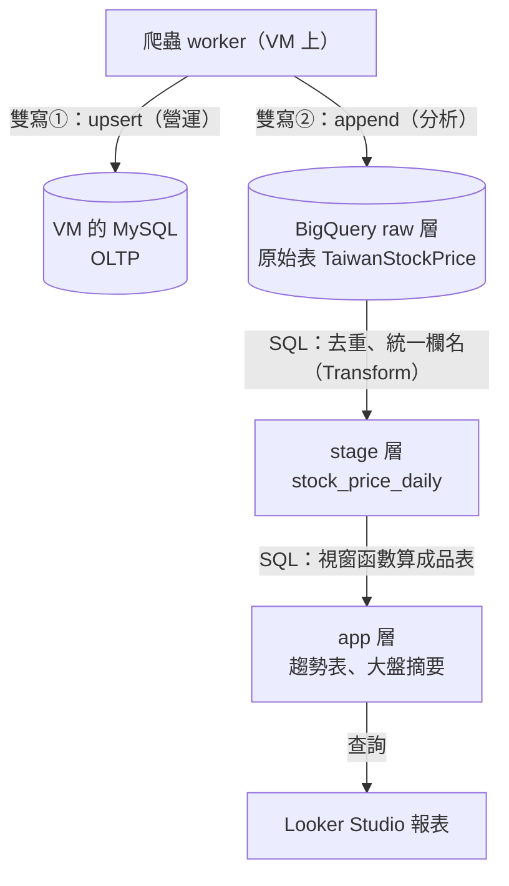
```mermaid
flowchart TD
    C["爬蟲 worker（VM 上）"] -->|"雙寫①：upsert（營運）"| M[("VM 的 MySQL<br/>OLTP")]
    C -->|"雙寫②：append（分析）"| R[("BigQuery raw 層<br/>原始表 TaiwanStockPrice")]
    R -->|"SQL：去重、統一欄名（Transform）"| S["stage 層<br/>stock_price_daily"]
    S -->|"SQL：視窗函數算成品表"| A["app 層<br/>趨勢表、大盤摘要"]
    A -->|查詢| BI["Looker Studio 報表"]
```

這是資料工程常說的 **ELT** 的雙寫版本：**E**xtract（抓取）和 **L**oad（載入倉儲）在爬蟲執行的當下一起完成——資料落地 raw 層不再需要一個獨立的「搬運」步驟；**T**ransform（轉換）留在倉儲裡用 SQL 做。跟傳統「先轉換再載入」的 ETL 相反——雲端倉儲夠強，偏好先把原始資料放進去、再用它的算力轉換。

### 倉儲的三層習慣：raw／stage／app

上面那條 ELT 線，業界通常會用**分層**把它組織起來，最常見的三層命名：

| 層 | 職責 | 規矩 | 對應本章 |
|----|------|------|---------|
| **raw** | 原始資料照原樣落地，一個欄位都不改 | 只寫入、不修改——它是「發生過什麼」的證據 | 爬蟲雙寫直接 append 的 `TaiwanStockPrice` |
| **stage** | 清理與整理：去重、改欄位名、轉型別 | 從 raw 算出來，隨時可以重建 | 去重後的每日股價 |
| **app** | 給人與報表用的成品表 | 從 stage 算出來，BI 工具只讀這一層 | MA5/MA20 趨勢表、大盤摘要 |

分層的價值在**出問題時知道去哪找**：報表數字怪 → 查 app 的計算；app 沒錯 → 查 stage 的清理；stage 也沒錯 → 回 raw 對原始資料。每一層只對上一層負責，這跟第 6 章把設定集中在 config、第 16 章讓每台機器的 .env 各自給值是同一種思路——**關注點分離**。本章的三層是這樣蓋的：**raw 由爬蟲的雙寫直接餵**（第 14 章 H-3 起每次抓取都在寫），Step 3 整理出 stage、Step 4 建 app。

---

## 一行一行讀懂關鍵片段

### ⓪ 雙寫的本體（`tasks_crawler_finmind.py`）

第 5 章讀過 `crawler_finmind`：抓資料 → 寫 MySQL → 存 CSV。現在它的處理段多了一行：

```python
        # 雙寫: 同一份資料寫 MySQL（營運用）＋ BigQuery raw 層（分析用）
        upload_data_to_mysql(df)
        upload_data_to_bigquery_raw(df)
```

`upload_data_to_bigquery_raw` 就定義在同一個檔案裡，每一行都有設計理由：

```python
def upload_data_to_bigquery_raw(df: pd.DataFrame):
    # 沒設 GCP_PROJECT_ID（本機環境）就明確略過, MySQL 那份不受影響
    if not GCP_PROJECT_ID:
        print("BQ 未設定，略過雲端寫入")
        return
    try:
        from crawler.bigquery import (
            create_dataset_if_not_exists,
            create_table_if_not_exists,
            taiwan_stock_price_bq_schema,
            upload_data_to_bigquery,
        )

        bq_df = df.copy()
        # to_sql 可以吃字串日期, BigQuery 的 DATE 欄位要先轉成 date 型別
        bq_df["date"] = pd.to_datetime(bq_df["date"]).dt.date
        # 第一次寫入前把 dataset 與帶日期分區的表準備好, 之後每次都只是 append
        create_dataset_if_not_exists("raw")
        create_table_if_not_exists(
            "TaiwanStockPrice", taiwan_stock_price_bq_schema(),
            dataset_id="raw", partition_key="date",
        )
        upload_data_to_bigquery("TaiwanStockPrice", bq_df, dataset_id="raw", mode="append")
    except Exception as e:
        # 分析副本寫入失敗不能擋住爬蟲主職（MySQL 已寫完）, 印明確錯誤方便排查
        print(f"BigQuery 寫入失敗（MySQL 不受影響）: {e}")
```

四個設計決定，每個都值得停下來看：

1. **開關是環境變數，不是程式碼**。`GCP_PROJECT_ID` 沒設（1-13 章的本機）就印一行「BQ 未設定，略過雲端寫入」直接返回——同一支程式在本機與雲端行為不同，差別全在部署時給了什麼環境變數，這是第 6 章 config 中心思想的延伸。注意它是**明確印出來的降級**，不是靜默跳過——維運上「沒做而且說了」跟「沒做卻裝作有做」是兩回事
2. **寫 MySQL 在前、寫 BigQuery 在後，而且 BigQuery 失敗不往外丟**。爬蟲的主職是營運資料，分析副本壞了不能把主職拖下水——`except` 裡印錯誤但不 raise，任務照樣 succeeded。反過來想：如果 MySQL 失敗，任務就該直接失敗重試（第 4 章的 retry 邏輯管這件事）
3. **落地前先把地基準備好**。`create_dataset_if_not_exists` 與 `create_table_if_not_exists` 讓第一次寫入自動建好 raw dataset 和**帶日期分區**的表（分區是什麼、為什麼重要，見小節②③）；之後每次呼叫它們都只是確認一下就跳過
4. **`mode="append"` 而不是覆蓋**。raw 層的規矩是只追加不修改；同一天重跑會疊出重複列——這不是 bug，是 raw 的天性，stage 層（Step 3）負責把它整理乾淨

> 對照第 6 章：MySQL 那邊用主鍵 upsert 在**寫入端**去重；BigQuery 這邊 append 進 raw、在**分析端**（stage）去重。同一個問題，OLTP 和 OLAP 給出兩種答案。

### ① 上傳到 BigQuery（`bigquery.py`）

```python
def upload_data_to_bigquery(table_name, df, dataset_id=DATASET_ID, mode="replace"):
    client = get_bigquery_client()
    table_id = f"{PROJECT_ID}.{dataset_id}.{table_name}"
    # replace = 整張覆蓋；append = 附加
    write_disp = WriteDisposition.WRITE_TRUNCATE if mode == "replace" else WriteDisposition.WRITE_APPEND
    job_config = LoadJobConfig(write_disposition=write_disp, autodetect=True)
    job = client.load_table_from_dataframe(df, table_id, job_config=job_config)
    job.result()   # 等這個批次載入 job 跑完
```

重點：

- `table_id` 是 BigQuery 的三段式命名：`專案.資料集.表`。
- `WRITE_TRUNCATE`（覆蓋）vs `WRITE_APPEND`（附加）：對應你在第 5 章學過的 `if_exists`，概念一樣。
- `load_table_from_dataframe`：用「批次載入 job」把 DataFrame 匯進 BigQuery。專案註解特別提到一個實務重點——**這種批次 load job 是免費的**（只算儲存費），而另一種 streaming insert（逐筆即時寫入）會依寫入量計費。所以「每日整批股價」這種場景用批次 load 最划算。
- `job.result()`：因為 load 是**非同步**的，這行是「等它做完」（是不是想到第 1 章的 `.delay()` + 之後 `.get()`？概念相通）。

### ② 用日期做分區（partition）

```python
table.time_partitioning = bigquery.TimePartitioning(
    type_=bigquery.TimePartitioningType.DAY,
    field="date",
)
```

**分區**是資料倉儲省錢又加速的關鍵。它把大表依 `date` 切成一天一塊，之後你查「只看某個月」時，BigQuery 只掃那幾塊、不用掃整張表——BigQuery 依掃描量計費，掃得少就便宜又快。⓪的 `create_table_if_not_exists` 在第一次雙寫時建的就是這種帶分區的表（`partition_key="date"` 一路傳到這段程式碼），Step 2 的實驗一會讓你看到分區省錢的實際數字。

### ③ 在 BigQuery 上做分析（`stock_bigquery_data_transform.py`）

這正是 OLAP 的核心用途——用 SQL 的**視窗函數（window function）**算技術指標。這支程式是轉換的「程式版」（第 17 章的排程 DAG 會用它）；**主線 Step 3/4 會把同一套 SQL 邏輯親自跑一遍**，這裡先讀懂它。看這段建「趨勢分析 View」的 SQL：

```sql
SELECT
  stock_id, trade_date, close,
  -- 昨天的收盤價
  LAG(close) OVER (PARTITION BY stock_id ORDER BY trade_date) AS prev_close,
  -- 5 日移動平均（含今天往前 4 天）
  AVG(close) OVER (
    PARTITION BY stock_id ORDER BY trade_date
    ROWS BETWEEN 4 PRECEDING AND CURRENT ROW
  ) AS ma5,
  -- 20 日移動平均
  AVG(close) OVER (
    PARTITION BY stock_id ORDER BY trade_date
    ROWS BETWEEN 19 PRECEDING AND CURRENT ROW
  ) AS ma20
FROM vw_stock_price_daily
```

白話：

- `PARTITION BY stock_id ORDER BY trade_date`：對「每一支股票、按日期排序」分別計算。
- `LAG(close)`：抓「上一列（昨天）」的收盤價，用來算漲跌。
- `AVG(close) OVER (... ROWS BETWEEN 4 PRECEDING AND CURRENT ROW)`：算「今天往前含 4 天」共 5 天的平均，也就是股市常說的 **5 日均線（MA5）**；20 天就是 MA20。

這種「一整支股票的時間序列分析」正是 OLAP 的強項，也是為什麼要把資料搬進 BigQuery——在 MySQL 上對整個歷史做這種計算會很吃力。

---

## 一步一步

### Step 0：確認雙寫的資料已經落地

本章不需要「把資料搬進 BigQuery」——第 14 章 H-3 起，爬蟲每次抓取就同時寫兩邊了。開始前 SSH 進 VM，確認兩邊都有筆數：

```bash
# SSH 進 VM（VM 停機中先 start）
gcloud compute ssh stock-crawler-vm --zone=asia-east1-b

# MySQL 那份（雙寫①）
sudo docker exec mysql mysql -uroot -p1234 -N -e "SELECT COUNT(*) FROM mydb.TaiwanStockPrice;"

# BigQuery 那份（雙寫②）——第 14 章 Part J Step 7 驗過同一件事
bq query --use_legacy_sql=false "SELECT COUNT(*) AS cnt FROM raw.TaiwanStockPrice"
```

兩邊都是 0 的話：照第 14 章 H-3 把整套系統 up 起來（記得指令前的 `GCP_PROJECT_ID=...` 注入），再從 Airflow 觸發 `stock_crawler_producer_dag` 灌資料（第 14 章 Part J 的做法）。

> 沒跟到第 14 章、想在自己電腦上把整條流程做完的話，看本章最後的〈補充：在本機雙寫（金鑰用法）〉——程式同一支，差別只在憑證怎麼給。

### Step 1：搞懂爬蟲憑什麼寫得進去（VM 身分與兩道閘門）

回想一下：第 14 章你沒有把任何金鑰放進 VM 或容器，雙寫卻直接成功了。這一步把「憑什麼」講清楚——它會用到第 14 章 Part F 的兩個佈置：

1. **BigQuery 的 API 不用另外開**：它在新專案預設就是啟用的（第 14 章開 Compute Engine API 是因為那個要手動啟用）
2. **程式的身分**：worker 跑在 VM 上，而**這台機器沒有設定任何指向金鑰的路徑**（第 14 章下載的金鑰檔留在你自己電腦的 `~/gcp-keys/`，從來沒有送上 VM），Google 的程式庫就往下走到 metadata server，取得 **VM 附掛的服務帳戶**憑證（第 14 章 Part F 的「兩種憑證的分工」表）
3. **兩道閘門都是開的**：
   - **IAM 角色**：VM 預設附掛的 Compute Engine 服務帳戶帶著專案的 Editor 角色，涵蓋 BigQuery 讀寫
   - **scopes**：第 14 章建 VM 時 `--scopes=cloud-platform` 給足了存取範圍

**所以本章主線一條授權指令都不用打**——VM 身分本來就寫得進去。要打授權指令的是另外兩個場景：團體節 T-2（讓組員的**個人帳號**能查 BigQuery）與〈補充：在本機雙寫〉（給第 14 章那把金鑰的服務帳戶補角色，它建立時刻意一個角色都沒給）。IAM 是怎麼組成的、最小權限原則怎麼落實，放在 T-2 一起講——那裡才真的要動手打指令。

### Step 2：BigQuery 亮點三連發——倉儲非它不可的證據

資料已經在倉儲裡了，但「倉儲比 MySQL 強在哪」還只是一句口號。這一步做三個實驗，每個都是 MySQL 做不到或做不好的事。指令部分用 `bq`（VM 或你自己的電腦都能跑；也可以貼進 Console 的查詢編輯器），實驗一另外有一段在 Console 上做。

**實驗一：查詢效率與欄式儲存——它只讀你引用的那幾欄**

先看規模。BigQuery 平台上掛著幾百個**公開資料集**（`bigquery-public-data` 專案），任何人都能直接查。先拿比特幣全鏈交易表暖身：

```bash
bq query --use_legacy_sql=false \
  'SELECT COUNT(*) AS total_rows FROM `bigquery-public-data.crypto_bitcoin.transactions`'
```

```
+------------+
| total_rows |
+------------+
| 1409179437 |
+------------+
```

十四億筆，一兩秒回。再來一個真的要算的：對 StackOverflow 兩千三百萬個問題做逐年統計——

```bash
bq query --use_legacy_sql=false \
  'SELECT EXTRACT(YEAR FROM creation_date) AS yr, COUNT(*) AS questions,
          ROUND(AVG(score),2) AS avg_score
   FROM `bigquery-public-data.stackoverflow.posts_questions`
   GROUP BY yr ORDER BY yr'
```

兩千三百萬列的聚合，幾秒出表。同樣的事拿 MySQL 做：先要想辦法把幾十 GB 資料塞進你的機器，然後由那台機器慢慢掃。這就是儲存與運算分離的直接效果——**算力不在你的機器上，資料也不用搬到你的機器上**。

> 有些公開表大到 BigQuery 會要求先過濾再查（例如維基百科的瀏覽量表 `wikipedia.pageviews_2024`，不帶分區條件直接查會被拒絕）——這是平台在擋住「一個查詢掃掉幾百 GB」的失誤。

**它怎麼做到的：把掃描量叫出來看**

BigQuery 按**掃描量**計費（每月有免費額度，課程的資料量用不完），所以它必須在執行前就算得出「這個查詢要碰多少資料」。把這個估算叫出來，欄式儲存的行為就直接量得到。Console 的查詢編輯器內建這個功能：**SQL 打完、還沒按執行，左下角就顯示「這項查詢會在執行時處理 X 的資料」**——這就是 dry run 的視覺版。

打三段 SQL，只看左下角那行數字怎麼變。

① 全欄：`SELECT * FROM raw.TaiwanStockPrice`


② 只要一欄：`SELECT close FROM raw.TaiwanStockPrice`

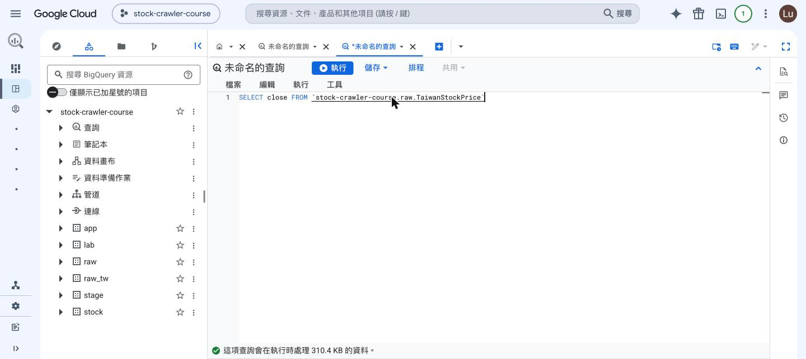

③ 只數筆數：`SELECT COUNT(*) FROM raw.TaiwanStockPrice`

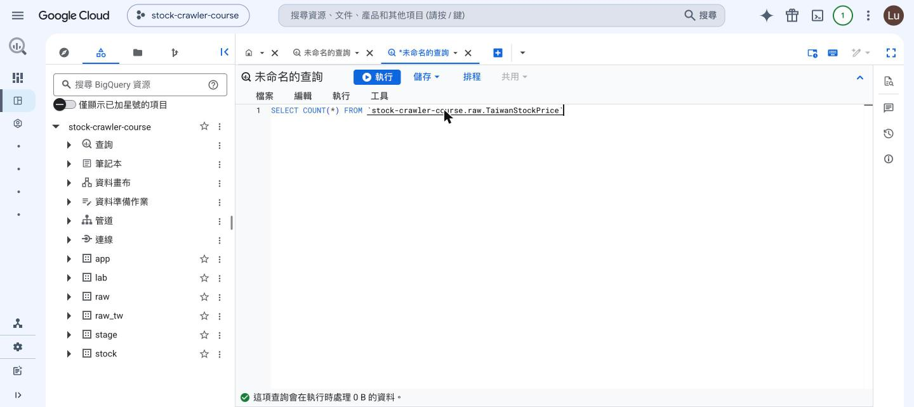

2.97 MB → 310.4 KB → 0 B。同一張表、都沒有 `WHERE`，只因為引用到的欄不同，掃描量差了一個數量級：**沒被引用的欄，BigQuery 連讀都不讀**。第三段更極端——整表的筆數存在表的中繼資料裡，回答 `COUNT(*)` 根本不用碰資料。

（你的數字會跟截圖不同，資料量不一樣；不變的是這三段之間的比例關係。）

第二段的數字可以驗算。`close` 是 FLOAT64，BigQuery 定義它是 8 個邏輯位元組；截圖那份資料是 39,731 列：

```
39,731 × 8 = 317,848 bytes = 310.4 KB
```

跟畫面上的數字一致。這說明 BigQuery 的資料量是按「查詢引用到的欄 × 列數」算出來的。三個要跟著記住的注意事項：

1. **邏輯位元組不是實際落地大小**。8 bytes 是 BigQuery 為 FLOAT64 定義的計費值，`DATE` 同樣算 8，但一個日期實際佔用遠少於此。資料在儲存層是壓縮過的，所以不能說「BigQuery 只從磁碟讀了 310 KB」，正確的說法是「只計入 317,848 bytes 的邏輯資料量」。
2. **NULL 計 0 bytes**。算式能精準吻合，同時也說明這一欄沒有 NULL；換一份資料重算對不上時，第一個要檢查的就是 NULL。
3. **按需計費有每查詢 10 MB 的下限**。所以這個查詢的實際計費是 10 MB，不是 310 KB——掃描量的比例關係跟帳單金額不是同一件事。

還有一個反直覺的點順手試掉：`SELECT * FROM raw.TaiwanStockPrice LIMIT 10` 的掃描量跟不加 `LIMIT` 完全一樣。`LIMIT` 限制的是回傳幾列，不是讀取多少資料——**要減少掃描量只有兩條路：少引用欄位，或用 `WHERE` 過濾掉分區**。

> 計入的是「查詢引用到的所有欄」，不只 `SELECT` 清單裡的那幾欄。`SELECT close FROM t WHERE stock_id='2330'` 會同時算上 `close` 與 `stock_id` 兩欄。

同一件事在指令列用 `--dry_run`——不執行、只回報會掃多少。這也是驗證第二條省錢開關（分區）的方式：

```bash
# 全表全欄
bq query --use_legacy_sql=false --dry_run 'SELECT * FROM raw.TaiwanStockPrice'

# 只選兩欄——欄式儲存：沒引用的欄不讀
bq query --use_legacy_sql=false --dry_run 'SELECT stock_id, close FROM raw.TaiwanStockPrice'

# 兩欄＋分區過濾一個月——只掃那幾天的分區（讀碼段②建的分區在這裡兌現）
bq query --use_legacy_sql=false --dry_run \
  "SELECT stock_id, close FROM raw.TaiwanStockPrice WHERE date BETWEEN '2024-06-01' AND '2024-06-30'"
```

三條的掃描量一路降：**少引用欄位**（欄式儲存）與**分區過濾**（讀碼段②）就是 BigQuery 的兩大省錢開關。前者減少「讀哪幾欄」，後者減少「讀哪幾列」，兩條路互不重疊，可以疊加。

**實驗二：Time Travel——把誤刪的資料撈回來**

BigQuery 每張表自動保留**過去七天的歷史版本**，不用任何設定。現場闖一次禍：

```bash
# ① 刪之前：0050 有幾筆
bq query --use_legacy_sql=false "SELECT COUNT(*) AS n FROM raw.TaiwanStockPrice WHERE stock_id='0050'"
# n = 344

# ② 誤刪！
bq query --use_legacy_sql=false "DELETE FROM raw.TaiwanStockPrice WHERE stock_id='0050'"
# Number of affected rows: 344

# ③ 真的不見了
bq query --use_legacy_sql=false "SELECT COUNT(*) AS n FROM raw.TaiwanStockPrice WHERE stock_id='0050'"
# n = 0

# ④ 但十分鐘前的表還查得到——FOR SYSTEM_TIME AS OF
bq query --use_legacy_sql=false \
  "SELECT COUNT(*) AS n FROM raw.TaiwanStockPrice
   FOR SYSTEM_TIME AS OF TIMESTAMP_SUB(CURRENT_TIMESTAMP(), INTERVAL 10 MINUTE)
   WHERE stock_id='0050'"
# n = 344
```

救回來要走兩步——BigQuery 不允許同一張表在一個 DML 裡同時當「寫入目標」和「另一個時間點的讀取來源」，所以先把快照撈到暫存表，再塞回去：

```bash
# ⑤ 快照 → 暫存表
bq query --use_legacy_sql=false \
  "CREATE OR REPLACE TABLE raw.recovered_0050 AS
   SELECT * FROM raw.TaiwanStockPrice
   FOR SYSTEM_TIME AS OF TIMESTAMP_SUB(CURRENT_TIMESTAMP(), INTERVAL 10 MINUTE)
   WHERE stock_id='0050'"

# ⑥ 暫存表 → 塞回原表，然後清掉暫存表
bq query --use_legacy_sql=false "INSERT INTO raw.TaiwanStockPrice SELECT * FROM raw.recovered_0050"
# Number of affected rows: 344
bq rm -f -t raw.recovered_0050

# ⑦ 確認回來了
bq query --use_legacy_sql=false "SELECT COUNT(*) AS n FROM raw.TaiwanStockPrice WHERE stock_id='0050'"
# n = 344
```

MySQL 這邊要做到同一件事：得有人事先設好備份、然後把備份整份還原。BigQuery 的版本歷史是**內建、零設定**的——「raw 層是證據」這條規矩，平台又多保了七天的可回溯版本。

**實驗三：BQML——一句 SQL 訓練一個模型**

倉儲的算力還能直接拿來做機器學習（BigQuery ML），不用把資料搬出去、不用另外架訓練環境。先開一個放實驗品的 dataset，然後用 `CREATE MODEL` 對 2330 訓練一個線性回歸——用當天的開盤、最高、最低、成交量預測收盤價：

```bash
bq mk --dataset --location=asia-east1 {你的專案ID}:lab

bq query --use_legacy_sql=false \
  "CREATE OR REPLACE MODEL lab.close_model
   OPTIONS(model_type='linear_reg', input_label_cols=['close']) AS
   SELECT open, max, min, Trading_Volume, close
   FROM raw.TaiwanStockPrice WHERE stock_id='2330'"
```

十幾秒後模型就在 `lab` 裡了。看它學得怎麼樣、再讓它預測：

```bash
# 評估：MAE（平均絕對誤差）與 R²
bq query --use_legacy_sql=false \
  "SELECT ROUND(mean_absolute_error,2) AS mae, ROUND(r2_score,4) AS r2
   FROM ML.EVALUATE(MODEL lab.close_model)"
# | mae  |   r2   |
# | 4.12 | 0.9986 |

# 預測最近三列
bq query --use_legacy_sql=false \
  "SELECT ROUND(predicted_close,2) AS predicted_close, close AS actual_close, date
   FROM ML.PREDICT(MODEL lab.close_model,
     (SELECT open, max, min, Trading_Volume, close, date
      FROM raw.TaiwanStockPrice WHERE stock_id='2330' ORDER BY date DESC LIMIT 3))"
```

```
+-----------------+--------------+------------+
| predicted_close | actual_close |    date    |
+-----------------+--------------+------------+
|         1043.85 |       1045.0 | 2025-06-17 |
|         1043.85 |       1045.0 | 2025-06-17 |
|         1043.85 |       1045.0 | 2025-06-17 |
+-----------------+--------------+------------+
```

兩個誠實的提醒：

- R² 高是因為「同一天的開高低」跟收盤本來就幾乎連動——這是**示範機制**（模型建在倉儲裡、SQL 就能訓練與預測），不是能拿去交易的模型
- 預測結果同一天出現三次？**raw 層有重複列**（append 的天性），模型把重複資料當三筆看——分析要用乾淨資料，這正是下一步 stage 層存在的理由。順勢進 Step 3
- 除了線性迴歸，BQML 內建的還有邏輯迴歸、K-means 分群、PCA，以及股價這種時間序列真正對得上的 `ARIMA_PLUS`（`time_series_id_col='stock_id'` 一句就能對每支股票各建一個模型），全部同樣是純 SQL

raw 層已經由雙寫餵好——**原封不動的原始資料，之後不改它**。接下來兩步在 BigQuery 的查詢編輯器（或 `bq query`）用 SQL 一層一步往上蓋。

### Step 3：整理出 stage 層——去重與統一欄名

先建 stage 的 dataset（在你自己的電腦或 VM 跑都可以，`--location` 要跟 raw 同區——課程一律用 `asia-east1`，跟 VM、Cloud SQL 放在一起）：

```bash
bq mk --dataset --location=asia-east1 {你的專案ID}:stage
```

同一支股票同一天若有重複列（雙寫 append 跑過幾次就疊幾層——實驗三的預測結果已經讓你看到它了），留成交量最大的那筆；順手把欄位名整理成一致的小寫：

```sql
CREATE OR REPLACE VIEW stage.stock_price_daily AS
SELECT stock_id, date AS trade_date, open, max, min, close, spread,
       Trading_Volume AS volume, Trading_money AS amount
FROM (
  SELECT s.*, ROW_NUMBER() OVER (PARTITION BY stock_id, date ORDER BY Trading_Volume DESC) AS rn
  FROM raw.TaiwanStockPrice s
) WHERE rn = 1;
```

用 view 而不是實體表：stage 的邏輯（去重、改名）隨時可能調整，view 改了定義就即時生效，不用重新灌資料。

### Step 4：建 app 層——給報表用的成品表

```bash
bq mk --dataset --location=asia-east1 {你的專案ID}:app
```

從 stage 算出兩張成品表——趨勢分析（LAG 抓前一天收盤、視窗函數算 MA5/MA20）與大盤每日摘要：

```sql
CREATE OR REPLACE TABLE app.stock_trend_analysis AS
SELECT stock_id, trade_date, close, volume,
  LAG(close) OVER (PARTITION BY stock_id ORDER BY trade_date) AS prev_close,
  AVG(close) OVER (PARTITION BY stock_id ORDER BY trade_date ROWS BETWEEN 4 PRECEDING AND CURRENT ROW) AS ma5,
  AVG(close) OVER (PARTITION BY stock_id ORDER BY trade_date ROWS BETWEEN 19 PRECEDING AND CURRENT ROW) AS ma20
FROM stage.stock_price_daily;

CREATE OR REPLACE TABLE app.market_daily_summary AS
SELECT trade_date,
  COUNT(DISTINCT stock_id) AS active_stocks,
  SUM(volume) AS total_volume,
  ROUND(AVG(close), 2) AS avg_close,
  COUNTIF(spread > 0) AS up_count,
  COUNTIF(spread < 0) AS down_count
FROM stage.stock_price_daily
GROUP BY trade_date;
```

app 用實體表（CTAS）而不是 view：報表每次開啟都會查它，實體表不用重算、快而且省掃描量。代價是它不會自己更新——要靠排程重跑這段 CTAS（第 17 章的 DAG 就在做這件事）。這個取捨其實還有第三個選項，見本章後面〈BigQuery 的五個強項〉的 Materialized View。

**4-1 驗證——各層筆數自己會說話**：

```sql
SELECT "raw" AS layer, COUNT(*) AS n FROM raw.TaiwanStockPrice
UNION ALL SELECT "stage", COUNT(*) FROM stage.stock_price_daily
UNION ALL SELECT "app.trend", COUNT(*) FROM app.stock_trend_analysis
UNION ALL SELECT "app.summary", COUNT(*) FROM app.market_daily_summary
ORDER BY layer;
```

左側資源樹會有 raw／stage／app 三個 dataset，查詢結果就是分層的證據——raw 的筆數比 stage 多，多出來的就是重複列（append 的痕跡），**stage 的去重把它清掉了，而 raw 原封不動留著這個事實**：

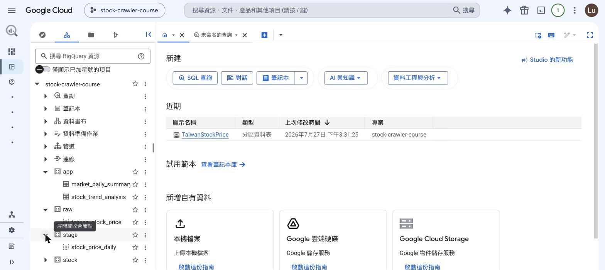

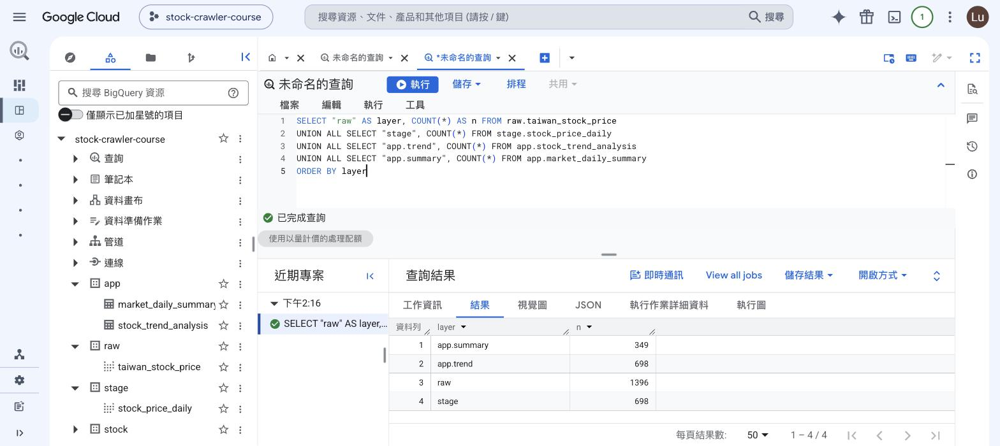

之後排錯的路徑照著層走：報表怪 → 查 app、app 沒錯 → 查 stage、stage 沒錯 → 回 raw。

> **那 `stock_bigquery_data_transform.py` 是什麼？** repo 裡有一支程式版的轉換，「一行一行讀懂」段③拆解的就是它——它的 SQL 跟 Step 3/4 是同一套邏輯。第 17 章的排程 DAG 會用程式維護這三層（自動化時程式比手動 SQL 好排）：每天爬蟲雙寫完新資料，transform task 跟著重算 stage 與 app。

---

## Step 5（Bonus）：用 Looker Studio 把倉儲拼成四區塊儀表板

三層蓋完了，資料線的最後一格是把 app 層畫成圖。第 8 章用 Metabase 接本機 MySQL 畫圖；雲端這一段的 BI 角色由 **Looker Studio** 接手——Google 的免費 SaaS BI 工具，不用安裝任何東西，內建 BigQuery 連接器。

這一步會做出一張四區塊儀表板，資料**全部來自 Step 4 的 app 層**——這正是三層規矩的落實：BI 只讀 app，不直接碰 raw/stage：

| 區塊 | 圖表類型 | 資料來源 | 欄位 |
|------|---------|---------|------|
| 大盤總成交量 | 計分卡 | `app.market_daily_summary` | total_volume（加總） |
| 大盤平均收盤價 | 計分卡 | `app.market_daily_summary` | avg_close（平均） |
| 收盤＋MA5＋MA20 疊線 | 時間序列 | `app.stock_trend_analysis` | close、ma5、ma20（篩單一股票） |
| 雙股收盤走勢＋成交量長條 | 時間序列 | `app.stock_trend_analysis` | close（按 stock_id 分線）、volume |

先分清楚兩個工具誰做什麼——這是本機「MySQL → Metabase」關係的雲端翻版：

| | BigQuery | Looker Studio |
|---|---|---|
| 角色 | 倉儲＋查詢引擎：存資料、跑 SQL、算 View | BI 視覺化：拉圖表、拼儀表板 |
| 你操作它的方式 | SQL（查詢編輯器／bq／Python） | 滑鼠拖拉，不用寫程式 |
| 誰連誰 | 被連的資料源 | 用內建連接器去連 BigQuery |
| 費用 | 按掃描量計費（有免費額度） | 工具本身免費；它發出的查詢照左邊計費 |

BigQuery 的 Console 查詢介面只能看表格結果、畫不了儀表板——要圖表就交給 Looker Studio。這正是第 14 章講的 SaaS：打開瀏覽器就能用，你只管使用、不管維護。

> 注意：Looker Studio 已更名為「數據分析」，介面上兩個名字都會看到，是同一個東西。

**5-1 首次使用的帳戶設定**（只有第一次要做）

1. 開 `lookerstudio.google.com`，確認右上角是你開通 GCP 的 Google 帳號
2. 跳出「授權 數據分析 API」→ 按「繼續」
   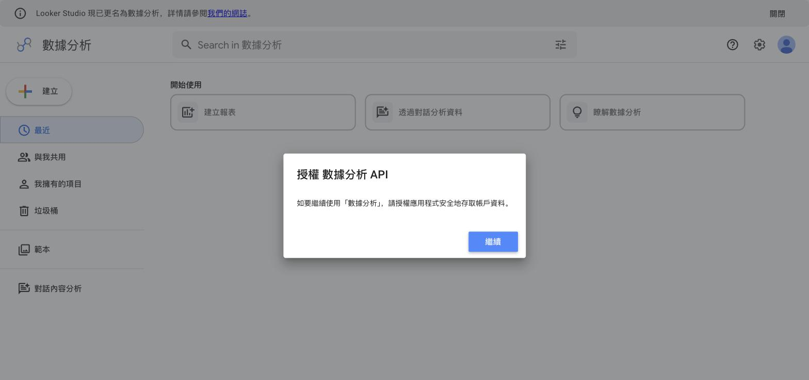
3. 點「建立報表」會先進入帳戶設定（共 2 步）：
   - 步驟 1：國家/地區選「台灣」（下拉選單要捲動找，不支援打字搜尋）、**公司欄必填**（填了「繼續」才會亮，而且提示「公司名稱一經設定即無法更改」，填個人或單位名稱即可）、勾服務條款
     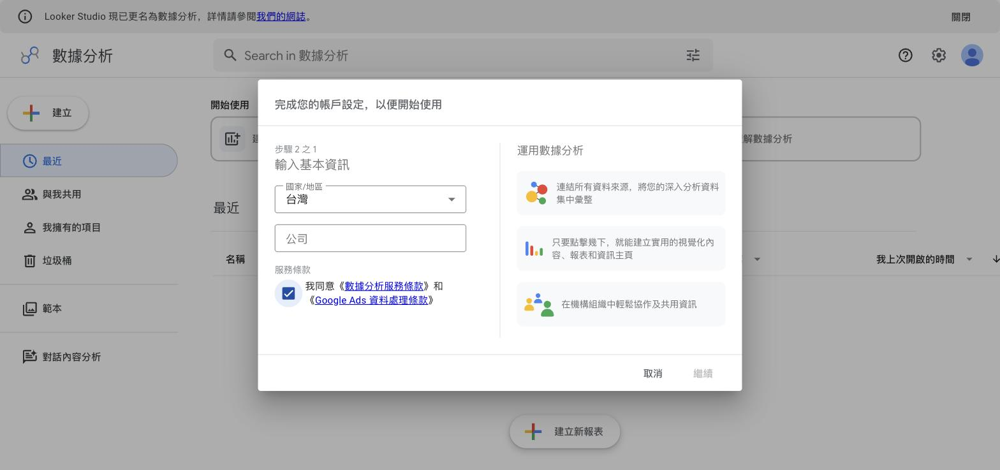
   - 步驟 2：三個電子報訂閱問題，都選「否」即可
     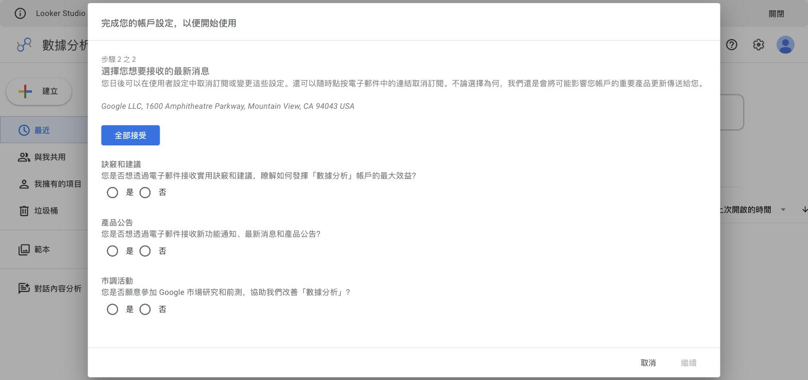

**5-2 連接第一個資料來源：app 層的 stock_trend_analysis**

1. 回到首頁點「**建立報表**」→ 出現「將資料新增至報表」的連接器清單
   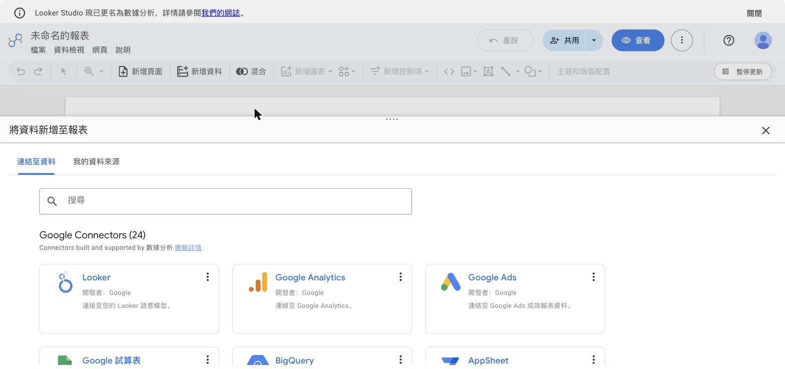
2. 點 **BigQuery** → 第一次會再要求一次授權（「數據分析必須先取得授權，才能與您的 BigQuery 專案連結」）→ 按「授權」
   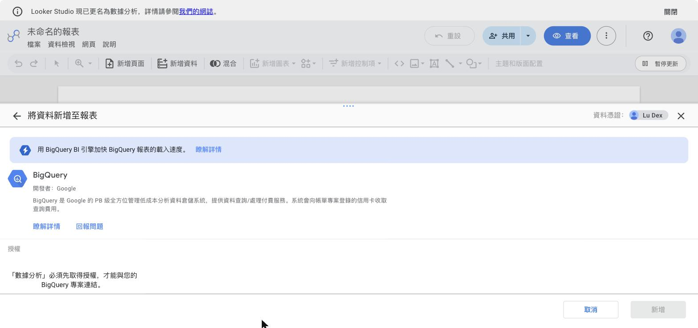
3. 依序點選：Project 選你的專案 → 資料集清單會列出 Step 2–4 蓋好的三層：**app、raw、stage**
4. 資料集點 **app** → Table 欄出現 `market_daily_summary` 和 `stock_trend_analysis` → 選 **stock_trend_analysis**
   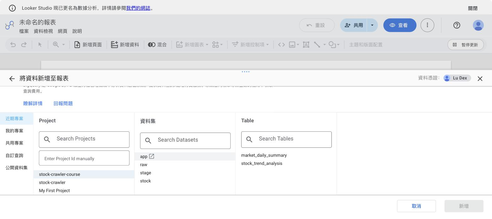
5. 右下角「**新增**」→ 確認視窗按「**加入報表**」
   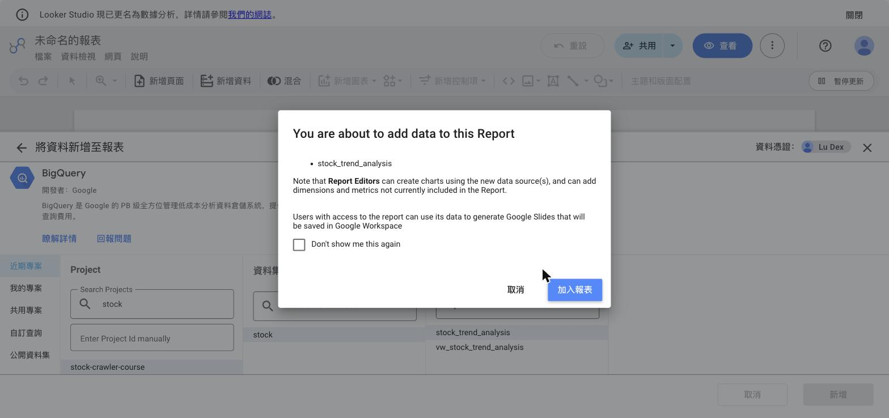
6. 進入編輯器後，右側「資料」面板列出欄位（close、ma5、ma20、prev_close、stock_id、trade_date、volume）——這就是 Step 4 建的 app 層趨勢表
7. 左上角點「未命名的報表」，改名（例：`股價儀表板-app層`）後按 Enter

**5-3 加入第二個資料來源：market_daily_summary**

一份報表可以掛多個資料來源，之後每張圖表各自選要用哪一個。

1. 右側「資料」面板最下方點「**新增資料**」→ 再走一次連接器流程：BigQuery → 你的專案 → **app** → **market_daily_summary** → 「新增」→「加入報表」
2. 完成後「資料」面板同時列出兩個來源：`stock_trend_analysis` 和 `market_daily_summary`

**5-4 兩張大盤計分卡**

1. 上方選單「**插入**」→「**評量表**」→ 在畫布左上角拖出一個方框放置
2. 右側「設定」分頁確認**資料來源**是 `market_daily_summary`（不是的話點資料來源欄位切換）；**指標**點預設的 Record Count → 換成 `total_volume`——卡片顯示全市場成交量總和
3. 選取這張卡片按 Cmd/Ctrl+C、Cmd/Ctrl+V 複製一張，拖到下方；把複製卡的**指標**換成 `avg_close`
4. `avg_close` 預設匯總是 SUM（把每天的平均價全部加起來，數字沒有意義）——點指標欄位左側的 **SUM 標記** → 「匯總」下拉改成「**平均**」，卡片變成合理的平均收盤價（指標左側標記變 AVG）

**5-5 收盤＋MA5＋MA20 疊線圖（單一股票）**

1. 「插入」→「**時序圖**」→ 拖放在右上區。圖表會沿用上一張圖的資料來源，**設定分頁把資料來源切回 `stock_trend_analysis`**
2. **指標-Y 軸**：預設指標換成 `close`，再點「新增指標」兩次，加入 `ma5`、`ma20`——三條線疊在同一張圖
3. 兩支股票混在一起時 MA 線沒有意義，要篩出單一股票：設定分頁最下方「這張圖表的篩選器」→「**新增篩選器**」→「**建立篩選條件**」：
   - 名稱填 `只看2330`
   - 條件列：「包含」＋欄位選 `stock_id`＋運算子選「等於 (=)」＋值輸入 `2330`（會跳建議值可直接點）
   - 按「**儲存**」
4. 走勢線在非交易日（週末）會掉到 0 呈鋸齒狀：切「樣式」分頁 → 「**缺少資料**」下拉從「空值歸零」改成「**線性插值**」——線就連起來了

**5-6 雙股收盤走勢圖**

1. 再插入一張時序圖放左下區，資料來源同樣用 `stock_trend_analysis`，指標 `close`
2. 設定分頁「**細目維度**」→「新增維度」→ 選 `stock_id`——每支股票各畫一條線，圖例出現 2330 與 00679B
3. 同 5-5 把樣式的「缺少資料」改「線性插值」

**5-7 成交量長條圖**

1. 再插入一張時序圖放右下區，指標換成 `volume`
2. 切「樣式」分頁 → 「系列 #1」的**系列類型**從「線條」改「**長條**」——成交量改以柱狀呈現，量能高峰比線圖容易辨識
3. 完成後按右上角「**查看**」切到檢視模式，四區塊儀表板完成：

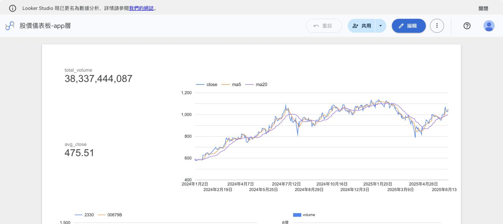
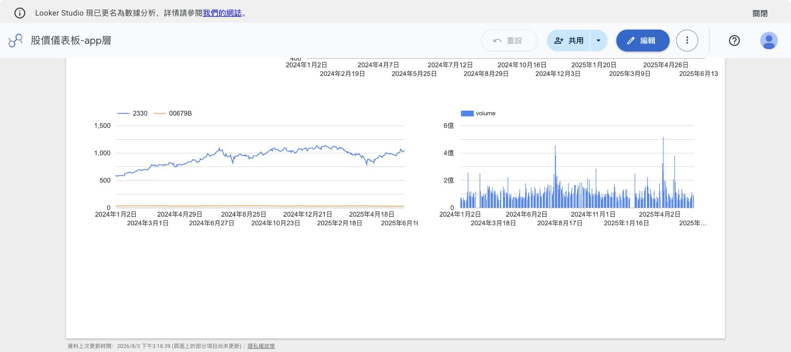

> 首次連接與基礎單圖流程的完整截圖（選專案、Record Count 預設值、細目維度設定）在舊版流程圖 B06～B13，操作路徑相同，差別只在資料集從 stock 換成 app。

**跟第 8 章 Metabase 的對照**（這就是雲端段的 BI 交接）：

| | Metabase（第 8 章） | Looker Studio（本章） |
|---|---|---|
| 部署 | 自己跑一個容器（吃 1GB 記憶體） | 免安裝，開瀏覽器就用（SaaS） |
| 資料源 | 本機 MySQL | BigQuery（內建連接器） |
| 費用 | 軟體免費、機器自己出 | 工具免費；查詢照 BigQuery 計費（課程資料量在免費額度內） |
| 適合 | 資料在自家、想全部自管 | 資料已在 GCP、想省維運 |

**Step 5 排錯**：

| 狀況 | 原因 | 怎麼解 |
|------|------|--------|
| 走勢線鋸齒狀、頻繁掉到 0 | 非交易日（週末）沒有資料，時間序列預設把缺值畫成 0 | 選取圖表 → 右側「樣式」分頁 → 「缺少資料」改「線性插值」（要斷開不補值就選「線條中斷」） |
| avg_close 計分卡數字大到不合理 | 指標預設匯總是 SUM，把每天的平均價加總 | 點指標左側 SUM 標記 → 匯總改「平均」 |
| 新圖表撈不到要的欄位 | 圖表綁到另一個資料來源（報表掛了兩個） | 設定分頁最上方「資料來源」切換 |
| 連接器清單找不到專案 | Looker Studio 登入的 Google 帳號跟 GCP 不同 | 右上角頭像確認帳號，必要時切換 |
| 網址列變成 datastudio.google.com | `lookerstudio.google.com` 會自動轉址到舊網域 | 是同一個服務，不影響操作 |

---

## BigQuery Studio 不只是查詢編輯器

資料線走完了，回頭盤點一件事：到這裡為止的操作都在查詢編輯器和 `bq` 指令裡完成。但把 Console 左側的資源樹展開，專案底下並列的不只是 dataset——**查詢、筆記本、資料畫布、資料準備作業、管道、連線**各自是一種可以建立的資產：

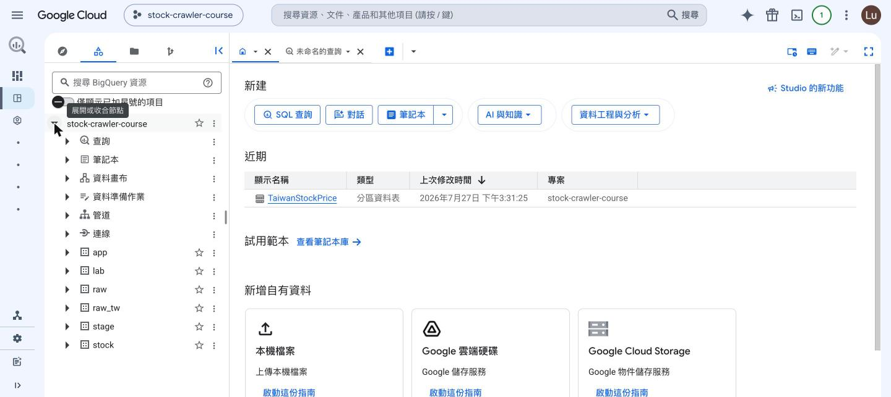

從 Studio 首頁的「新建」列也看得到同一組東西，「資料工程與分析」下拉裡是管道、資料準備、資料畫布、資料表：

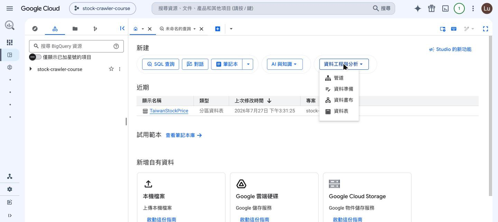

這一節逐項說明它們是什麼、能做什麼、怎麼操作。除了連線與排程查詢可以全程用 `bq` 指令完成，其餘幾項都只有 Console 介面。本課不把它們排進必做步驟，但你要知道它們存在，也要知道它們跟你手寫的 SQL 是什麼關係。

### 筆記本（Notebooks）

**是什麼**：BigQuery 內建的 Colab Enterprise 筆記本，在同一個檔案裡混寫 SQL、Python、Markdown 與圖表。執行環境由 Google 配置，實體是一台 Compute Engine VM。

**能做什麼**：

- SQL cell 與 Python cell 互通，SQL 可以引用 Python 變數
- 用登入的 Google 帳號存取 BigQuery，**不必發服務帳戶金鑰**——對照本章〈補充：在本機雙寫〉那套 `GOOGLE_APPLICATION_CREDENTIALS` 設定，這裡一步都不用做
- `bigframes`（BigQuery DataFrames）API 寫起來像 pandas，但運算下推回 BigQuery 引擎執行，資料不必拉回本機記憶體，因此不受本機記憶體限制
- 直接用 DataFrames、matplotlib、seaborn 畫圖；筆記本以 IAM 共用，並有版本紀錄

**操作舉例**：建一個筆記本，第一個 cell 用 SQL 查 `app.stock_trend_analysis` 並篩出 2330，第二個 cell 用 Python 把 `close`、`ma5`、`ma20` 畫成三線圖。整段流程沒有下載任何 CSV、沒有發任何金鑰——這是 Step 5 之外的另一條「看圖」路徑。

**要知道的**：runtime 是一台計費的 VM，而且屬於單一使用者，不能多人共用同一個執行環境。本機 Jupyter 接 MySQL 也做得到同樣的分析，所以筆記本是方便，不構成「非 BigQuery 不可」的理由。

### 資料畫布（Data Canvas）

**是什麼**：Gemini in BigQuery 的一部分。以有向無環圖（DAG）的形式做分析——畫面上是一個個節點（搜尋、資料表、SQL、視覺化、洞察等），節點連起來就是一條分析流程。

**能做什麼**：用自然語言搜尋資料資產、由自然語言產生 SQL、用自然語言描述要什麼圖並產生視覺化。關鍵是**它產生的 SQL 看得到也可以編輯**——節點裡就是一段 SQL，改完再往下接，不是黑盒子。定位是探索階段的加速器，正式產線的邏輯仍然要落到 SQL 檔或 Dataform。

**操作舉例**：在畫布輸入「找出 stage.stock_price_daily 裡 2330 最近 30 個交易日的收盤價，畫成折線圖」，看它產生的 SQL，再跟 Step 4 手寫的視窗函數版本並列比較。結論通常是：自然語言適合探索，複雜的視窗函數還是自己寫。

**使用前提**：第一次點進去看到的是啟用畫面——要先啟用資料畫布 API，而且專案必須已啟用 Gemini in BigQuery（由管理員在專案層級開啟，Gemini 的計價獨立於 BigQuery）：

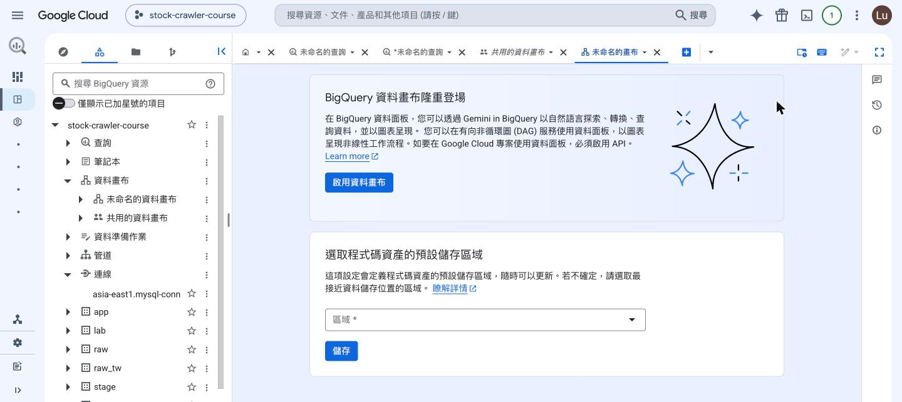

課堂上沒有開這兩項，畫布就停在這一頁，做不出任何節點——這也是它不排進必做步驟的原因。另外它對 BigQuery ML、nested／repeated 欄位、複雜型別的自然語言支援不佳，也不支援 geomap 視覺化。

### 資料準備作業（Data Preparation）

**是什麼**：圖形化的資料清理與轉換編輯器，由 Gemini 依樣本資料給出轉換建議。

**能做什麼**：篩選、**去重**、join、欄位改名（schema mapping）、型別轉換、驗證規則、刪除欄位，有 data／graph／schema 三種檢視。做好的資料準備可以排程自動更新目的地表，也可以當成管道裡的一個 task。

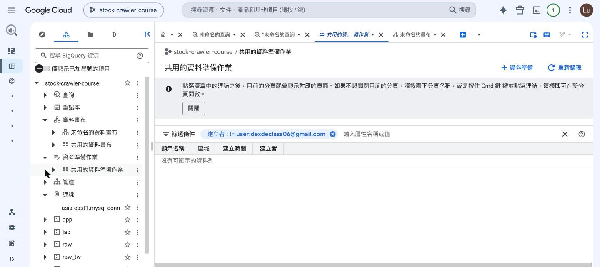

**教學價值在對照**：它做的事你已經手寫過了。Step 3 建 stage view 的那段 SQL，逐項都有圖形化的對應：

| Step 3 的 SQL 做法 | 資料準備的對應操作 |
|---|---|
| `ROW_NUMBER() OVER (PARTITION BY stock_id, date ORDER BY Trading_Volume DESC)` + `WHERE rn = 1` | 去重（deduplication） |
| `Trading_Volume AS volume`、`date AS trade_date` | schema mapping 欄位改名 |
| 型別轉換 | Gemini 建議的型別轉換 |
| `CREATE OR REPLACE VIEW` | 指定目的地表 + 排程重整 |

**操作舉例**：對 `raw.TaiwanStockPrice` 開一個資料準備作業，用去重操作以 `stock_id + date` 為鍵去重，把 `Trading_Volume` 改名為 `volume`，輸出到一張新表，再跟 Step 3 的 view 對筆數——兩邊應該一致。

**要知道的**：來源與目的地 dataset 必須在同一個 location；Gemini 只看 10k 筆樣本，可能沒涵蓋整份資料的複雜度；而且**它沒有版本控制**。最後這一點正是產線仍然把轉換邏輯寫成程式碼的理由——第 17 章用 DAG 維護 stage/app，那些 SQL 就在 Git 裡，改了什麼、誰改的、要回到哪一版都查得到。

### 管道（Pipelines）

**是什麼**：BigQuery 內建的轉換編排，底層是 **Dataform**。

**能做什麼**：把 SQL 查詢、筆記本、資料準備作業、SQLX task 串成有先後順序與相依關係的流程，並指定時間與頻率自動執行。Dataform 那一層提供 SQLX（擴充 SQL 的語言，內含相依管理與資料品質測試）、`ref()` 函式自動推導 DAG、assertions 做唯一性與非空值檢查，並支援用 Git 協作。

**操作舉例**：建一個管道，task 1 是重建 stage view 的 SQL、task 2 是重算 app 兩張表的 SQL，設定 task 2 依賴 task 1，排每天 09:05，跑一次看執行紀錄。

**分工要講清楚——它取代不了第 17 章的 DAG**。管道只管 BigQuery 內部的轉換，觸發不了外部系統。第 17 章那支 DAG 的六個 task 是 `start → send_crawler_tasks → wait_for_workers → create_stage_layer → create_app_layer → end`，**管道只能接手後面兩個**；前面「把任務發給 Celery worker、等 worker 消化」那一段它碰不到。

| | BigQuery 管道／Dataform | Airflow（第 10-12、17 章） |
|---|---|---|
| 管轄範圍 | 只管 BigQuery 內部的轉換 | 跨系統：爬蟲、Celery、MySQL、BigQuery、通知 |
| 相依表達 | `ref()` 自動推導 DAG | Python 明確定義 task 依賴 |
| 觸發外部系統 | 不行 | 可以（第 12 章的 `apply_async` 打 Celery） |
| 重試與失敗處理 | 有限 | retries、retry_delay、SLA、callback |
| 版本控制 | Dataform 有 Git；資料準備作業沒有 | 就是 Python 檔，本來就在 Git |
| 執行成本 | 只付 BigQuery 查詢費 | Composer 環境常駐計費 |

業界常見的組合是 Airflow 負責跨系統編排，倉儲內部那一段交給 Dataform。

**要知道的**：Console 專屬；建立後不能更改 region；授權只到 pipeline 層級，不能針對個別 task；上一輪排程還沒跑完，下一輪會被略過。

### 連線（Connections）——BigQuery 直接讀 Cloud SQL 的活資料

**是什麼**：BigQuery 對外部資料來源的連線設定。支援的類型包含 Cloud SQL、Spanner、AlloyDB、Cloud Storage、Amazon S3、Blob Storage、Apache Spark。

**能做什麼**：建好連線之後，用 `EXTERNAL_QUERY()` 把一段 SQL 送到外部資料庫執行，結果以暫存表回到 BigQuery。對本章的意義很直接——**第 16 章之後 MySQL 那份資料住在 Cloud SQL，BigQuery 不必等任何 ETL，可以直接讀它此刻的內容**。

**操作舉例**（全程 CLI）。下面的指令要有一台 Cloud SQL 實例才跑得動——第 16 章建的 `stock-mysql`（`asia-east1`、資料庫 `mydb`）就是它，做完第 16 章再回來試。本章的 dataset 建在 `asia-east1`，跟它同區，所以連線與 JOIN 都成立（理由見下面的限制）。

① 建立連線，`instanceId` 的格式是「專案ID:區域:實例名」：

```bash
bq mk --connection --connection_type=CLOUD_SQL \
  --properties='{"instanceId":"{你的專案ID}:asia-east1:stock-mysql","database":"mydb","type":"MYSQL"}' \
  --connection_credential='{"username":"root","password":"1234"}' \
  --project_id={你的專案ID} --location=asia-east1 mysql-conn
```

② 連線自己帶一個服務帳戶，要授權它連 Cloud SQL——成員是這個服務帳戶、角色是 `cloudsql.client`、範圍是整個專案（IAM 這套組成方式的完整說明在團體節 T-2）：

```bash
gcloud projects add-iam-policy-binding {你的專案ID} \
  --member="serviceAccount:service-{你的專案編號}@gcp-sa-bigqueryconnection.iam.gserviceaccount.com" \
  --role="roles/cloudsql.client"
```

服務帳戶的完整名稱用 `bq show --connection {專案ID}.{區域}.{連線ID}` 查；Console 的連線詳細資料頁也把它跟其他設定列在一起——連線 ID、資料位置、連線類型、Cloud SQL 連線名稱、資料庫名稱，最後一行就是**服務帳戶 ID**：

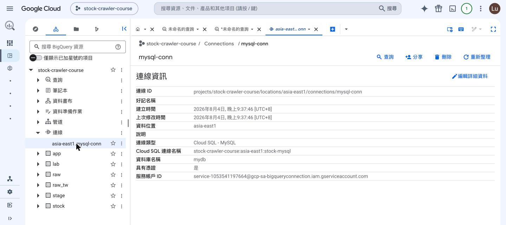

③ 查詢。查詢要在跟連線相同的區域執行：

```bash
bq query --location=asia-east1 --use_legacy_sql=false \
  "SELECT * FROM EXTERNAL_QUERY('{你的專案ID}.asia-east1.mysql-conn',
   'SELECT stock_id, COUNT(*) AS n FROM TaiwanStockPrice GROUP BY stock_id LIMIT 5')"
```

回傳的是 Cloud SQL 上此刻的筆數，不是副本。這正好收束本章開頭「一份資料的兩個命運」：雙寫的兩份，過去要分別登入兩個系統比對，現在一句 SQL 就對得起來。

**限制要記住**：

- **連線必須與 Cloud SQL 實例同區**。實例在 `asia-east1`，連線就要建在 `asia-east1`；建在別的位置當下就被擋下：`Cloud SQL instance must be in the same multi-region as the connection`
- **要 JOIN BigQuery 的表，dataset 也得在同一區**。本章的 dataset 建在 `asia-east1`（跟 VM、Cloud SQL 同區），所以上面那個對帳查詢成立。若 dataset 當初建在別的位置（例如 `US`），同一句 SQL 會回 `Not found: Dataset {專案ID}:raw was not found in location asia-east1`——**資源放同一區不只是延遲考量，它決定了哪些查詢寫得出來**
- **`--dry_run` 對 federated query 無效**：官方載明執行前無法計算會處理多少 bytes。實驗一教的「先問價再跑」，到這裡失效
- **唯讀**，不支援 DML 與 DDL；查詢速度取決於 Cloud SQL 那台機器，不會有倉儲的平行加速
- Cloud SQL 實例剛從停用喚醒、狀態還在 MAINTENANCE 時，查詢會回 `MysqlErrorCode(2013): Lost connection to MySQL server during query`——不是設定錯，等實例回到 RUNNABLE 再跑

### 排程查詢（Scheduled Queries）——BigQuery 自己就能排程

**是什麼**：BigQuery 內建的週期性查詢執行，背後是 BigQuery Data Transfer Service 的排程器。支援 GoogleSQL，**包含 DDL 與 DML**。

**能做什麼**：把任何一段 SQL 排成固定頻率自動執行。排程語法不是 crontab 的五個欄位，是類 cron 的英文寫法：`every 24 hours`、`every day 20:30`、`every monday 09:00`、`every hour on mon,tue,wed,thu,fri`。最小間隔 5 分鐘。

**多段 SQL 要有順序怎麼辦**：排程與排程之間沒有相依機制，不能宣告「B 等 A 跑完才跑」。做法是把多段 SQL 用分號串成一段 multi-statement query 送進同一個排程——它們在同一個 job 內依序執行、共享狀態、失敗即中止。把 Step 3 的 stage view 與 Step 4 的兩張 app 表串成一段，就是「raw → stage → app 一條龍」。

**操作舉例**（CLI）。**必須帶 `--service_account_name`**——不帶的話指令會卡在互動式 OAuth 授權，在非互動環境永遠等不到：

```bash
bq mk --transfer_config --project_id={你的專案ID} \
  --data_source=scheduled_query --display_name="每日重算app層" \
  --target_dataset=app --schedule="every day 20:30" \
  --service_account_name={你的專案編號}-compute@developer.gserviceaccount.com \
  --params='{"query": "CREATE OR REPLACE TABLE ... AS SELECT ..."}'
```

查看設定、手動觸發一次驗證：

```bash
bq show --transfer_config {CONFIG_NAME}       # 看 state、schedule、nextRunTime
bq mk --transfer_run --run_time="2026-08-04T13:40:00Z" {CONFIG_NAME}
bq ls --transfer_run --run_attempt=LATEST --max_results=1 {CONFIG_NAME}
```

Console 上不必記指令：查詢編輯器上方有「**排程**」按鈕，填表就能建。建好的排程列在 BigQuery →「已排定的查詢」，顯示排程語法、區域、目的地資料集與下次執行時間：

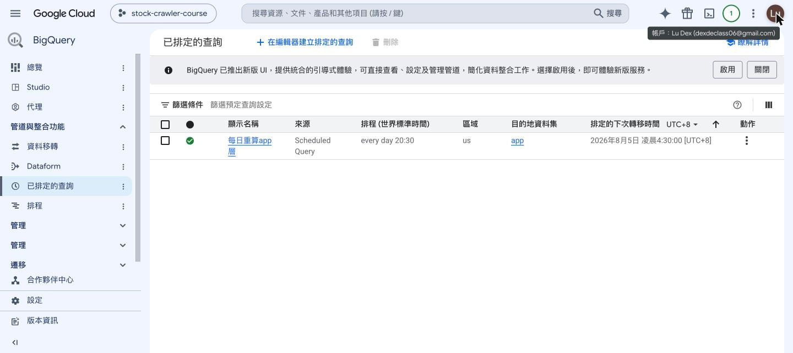

**兩個要知道的**：

- 官方警告**整點觸發可能重複執行**（例如排在 09:00 可能觸發多次，如果 SQL 是 `INSERT` 就會產生重複資料），建議改用 09:03 這類非整點時刻。這回頭印證第 6 章：連雲端託管的排程器都可能重複觸發，冪等寫法不是可選項
- 內建 `@run_time`、`@run_date` 兩個查詢參數，不必自己算日期，很適合「只重算今天分區」這種增量更新

**那為什麼還要 Airflow？** 因為排程查詢只能排 SQL，而且只在 BigQuery 裡面。第 17 章那條每日資料線的起點是「發任務給 Celery worker 去爬」——跨機器、要重試、要等 worker 消化，這一段 BigQuery 碰不到。分工是這樣的：

| 需求 | 排程查詢 | Airflow |
|---|---|---|
| 只重算 BigQuery 內部的 stage/app | 夠用，且不需要常駐服務 | 做得到，但用不到它大部分的能力 |
| 先觸發爬蟲、等 worker 跑完再轉換 | 做不到 | 做得到 |
| retry、失敗通知、SLA | 沒有 | 有 |
| 跨 MySQL／BigQuery／外部 API | 做不到 | 做得到 |
| 常駐成本 | 零 | Composer 環境按時計費 |

---

## BigQuery 的五個強項——對照 MySQL／Cloud SQL

把本章的內容收成五條。每一條都附上「MySQL／Cloud SQL 做得到嗎、做到什麼程度」，這樣「為什麼要多一個倉儲」才有具體的答案。

**一、儲存與運算分離**

資料存在儲存層，查詢執行時才臨時調度平行 worker，兩邊各自獨立擴充。你不必選機器規格，也不會遇到磁碟滿掉的問題。

*MySQL／Cloud SQL*：做不到。Cloud SQL 建實例時要選 CPU、記憶體與磁碟（第 16 章的 `--tier=db-f1-micro`），磁碟會滿、擴容要調整實例、算力上限就是那台機器。要更快只有換更大的機器這一條路。

**二、欄式儲存，而且不用自己建索引**

沒被查詢引用的欄不讀（實驗一量過），分區再從「讀哪幾列」的方向裁一次。整個過程不需要你為分析查詢預先設計索引。

*MySQL／Cloud SQL*：InnoDB 是列式，一列的所有欄值存在一起，除非查詢走得到覆蓋索引，否則整列讀進來。MySQL 8 有分區裁剪（補充 C 教過），能剪分區但不能剪欄；而且分析查詢要快就得為它額外建索引，索引本身又會拖慢寫入。

**三、Time Travel**

每張表自動保留過去七天的版本，零設定；`FOR SYSTEM_TIME AS OF` 一句 SQL 查回任一時點，撈成暫存表再塞回原表就完成復原（實驗二做過）。

*MySQL／Cloud SQL*：Cloud SQL 有時間點復原（PITR），但代價完全不同——它要**還原成一個新的實例**，再從新實例把資料撈回來，範圍是整個實例而不是單一張表，時間以分鐘到小時計。自架 MySQL 則要有人事先設好備份，再把備份整份還原。

**四、Materialized View（具體化視圖）**

寫一個定義，BigQuery 幫你存好結果，並在來源表變動時**背景增量重算**。更關鍵的是 smart tuning——查詢**基礎表**時 BigQuery 會自動改寫查詢去走它，**報表和應用程式一行 SQL 都不用改**就享受到加速。這是 Step 4「app 用實體表還是 view」那個取捨的第三個選項：有實體表的速度，又不必自己排程重算。費用要算三筆：查詢掃描、背景維護、實體化資料的儲存。

*MySQL／Cloud SQL*：沒有 materialized view。要達到同樣效果只能自己建一張彙總表，再用 trigger 或排程維護它的新鮮度，而且應用端必須自己改查詢去指向那張彙總表——沒有 smart tuning 這種自動改寫。

**五、BQML：一句 SQL 訓練模型**

`CREATE MODEL` 訓練、`ML.EVALUATE` 評估、`ML.PREDICT` 預測（實驗三做過），資料完全不必搬出倉儲，也不用另外架訓練環境。

*MySQL／Cloud SQL*：沒有 ML 語法。誠實地說，把資料拉出來用 pandas + scikit-learn 一樣能訓練——差別在你要搬資料、要維護 Python 環境、模型不在資料旁邊，而且每次重訓都得再搬一次。

> 反過來也要記住：BigQuery **不適合**單筆低延遲讀寫（DML 有配額限制），主鍵點查也比不上 InnoDB 的毫秒級。這正是雙寫要保留 MySQL 的理由——不是誰取代誰，是各自做擅長的事。

---

## 團體專案上雲：本章設定的團隊版

> 前置：第 14 章〈團體專案上雲〉做完（組員已加進專案、密碼與 .env 規矩已建立）。

**先說這一節在做什麼。** 本章你完成的 BigQuery 流程也是**一個人的**：雙寫用的是 VM 的身分、查資料用你自己的 Owner 身分、報表建在你自己的 Looker Studio 裡。換成團體專題，會遇到三個問題：

1. **雙寫的授權，每位組員都要做一次嗎？**——不用，而且什麼都不用做。寫入身分是 VM 的，跟哪個人操作無關 →（T-1 說明為什麼）
2. **組員想自己查 BigQuery 驗證資料，直接查會怎樣？**——會被拒。組員的個人帳號沒有任何 BigQuery 權限，要另外給 →（T-2 實作）
3. **組員看得到你建的 Looker Studio 報表嗎？**——看不到。報表是個人帳號的資產，要用共用機制開放 →（T-3）

一句話總結本節：**程式的權限（VM 身分）全組共用一份、不用設定；人的權限（個人帳號）各自要給**。分清楚這兩條線，三個問題就都有答案。

| 層 | 解決的問題 | 要做什麼 | 誰做 | 段落 |
|----|-----------|---------|------|------|
| 程式的權限 | 雙寫授權要不要每人做 | 什麼都不用做——理解身分是機器的 | 沒有人（第 14 章建 VM 時就到位） | T-1 |
| 人的權限 | 組員查不了 BigQuery | 給組員兩個 BigQuery 個人角色 | 開專案者 | T-2 |
| 報表層 | 組員看不到報表 | Looker Studio 共用給組員 | 建報表的人 | T-3 |

**T-1 雙寫的授權不用任何人做——先搞懂為什麼**

雙寫的身分是 **VM 附掛的服務帳戶**（Step 1 講過的兩道閘門）。不管哪位組員 SSH 進 VM、觸發了幾次 producer，worker 容器對 BigQuery 的身分都是同一個機器身分——授權跟「人」完全脫鉤，所以這一層沒有任何per-組員的設定。順帶一提：主線流程裡**沒有任何金鑰檔需要傳來傳去**，這正是「程式在 GCP 裡就用機器身分」的團隊面優勢（要在自己電腦上跑才需要金鑰，見〈補充：在本機雙寫〉）。

**T-2 組員要自己查 BigQuery，先看清楚「沒授權會發生什麼」**

服務帳戶的權限是程式的，組員的 Google 帳號沒有跟著取得任何 BigQuery 權限。組員直接跑查詢會被拒：

```bash
# 組員在自己電腦上執行（已 gcloud auth login 自己的帳號）
bq query --project_id={專案ID} --nouse_legacy_sql "SELECT COUNT(*) AS n FROM raw.TaiwanStockPrice"
# BigQuery error in query operation: Access Denied: Project {專案ID}:
# User does not have bigquery.jobs.create permission in project {專案ID}.
```

這是課程的第一條授權指令，動手前先認識 **IAM** 的三個詞——之後每一條授權指令都由它們組成：

| 詞 | 白話 | 例子 |
|----|------|---------|
| **成員（誰）** | 人（Google 帳號）或程式（服務帳戶） | 組員的 Gmail、`stock-crawler-sa@…` |
| **角色（能做什麼）** | 一組權限的包裝，名字長得像 `roles/服務.動作` | `bigquery.dataEditor`（讀寫資料、建表）、`bigquery.jobUser`（執行查詢工作） |
| **資源（在哪生效）** | 權限的作用範圍：整個專案、或單一資源 | `stock-crawler-course`——整個專案 |

一句話：**把「某個角色」綁在「某個成員」身上，在「某個資源範圍」內生效**——授權指令 `add-iam-policy-binding` 的 binding（綁定）就是這個意思。

**角色分兩類，差在涵蓋範圍的大小：**

- **基本角色（Owner／Editor／Viewer）**：GCP 早期的設計，一個角色涵蓋很多權限。Step 1 說的 VM 預設身分帶的 Editor 就是這類——它讓課程「不設定就能雙寫」，但它連刪 VM、改設定都做得到
- **預定義角色**：每個服務各自定義的細顆粒角色，名稱格式是 `roles/服務.動作`，例如 `bigquery.dataEditor`

課程的 VM 身分走 Editor 是**方便優先**的選擇；實務上會替程式建專屬服務帳戶、只給預定義角色——**最小權限原則：需要什麼、才給什麼**。下面給組員的兩個角色就是這個原則的第一次落實（能查詢、能讀資料，但不能寫、不能刪）；〈補充：在本機雙寫〉給金鑰服務帳戶授權時再做一次；第 16 章更進一步，把授權範圍從整個專案縮到單一資源。

開專案者給組員兩個個人角色（第 14 章步驟 2 同一條指令，換角色）：

```bash
gcloud projects add-iam-policy-binding {專案ID} \
  --member="user:組員的Gmail" --role="roles/bigquery.user" --condition=None       # 能執行查詢
gcloud projects add-iam-policy-binding {專案ID} \
  --member="user:組員的Gmail" --role="roles/bigquery.dataViewer" --condition=None  # 能讀資料表
```

組員重跑同一條查詢，這次通了（筆數是你們自己資料的數量）：

```
+------+
|  n   |
+------+
| 6277 |
+------+
```

授權完成後，IAM 成員清單會看到組員掛著四個角色（第 14 章的兩個＋這裡的兩個），服務帳戶則是它自己的兩個 BigQuery 角色——**人跟程式的權限是分開的兩條線**：

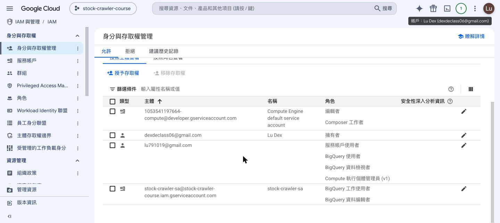

查詢需求少的小組可以省掉 T-2：組員 SSH 進共用 VM，用 VM 上的 `bq` 查（走的是操作者自己的 gcloud 登入身分或 VM 服務帳戶，視 VM 上的設定）。

**T-3 Looker Studio 報表用共用機制，不經過 IAM**

報表是個人 Google 帳號建的，組員看不到別人的報表。共用步驟：

1. 開啟報表（編輯或查看模式都可以）→ 右上角「**共用**」
2. 對話框輸入組員的 Gmail，右側權限選「**檢視者**」（只看）或「編輯者」（可改圖表）
3. 按「**傳送**」——組員信箱會收到報表連結

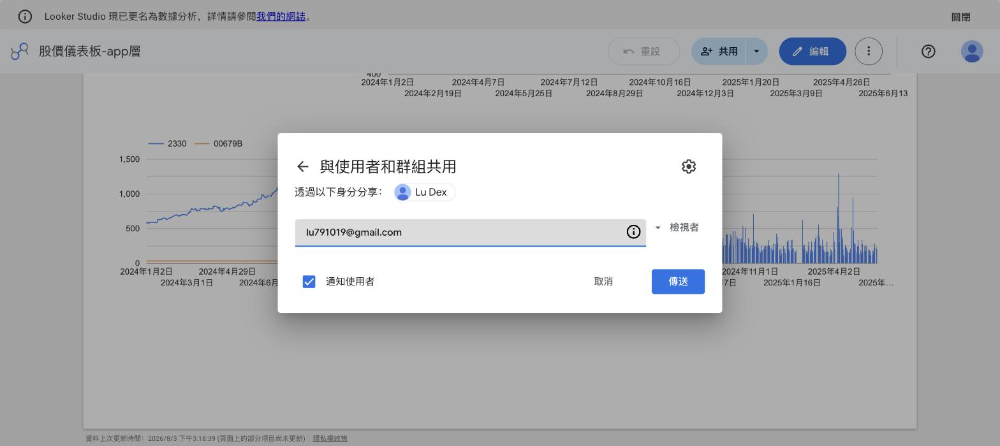

跟 Google 文件同一套邏輯。注意分工：**資料層的權限歸 GCP IAM（T-2），報表層的權限歸 Looker Studio 共用**——組員能看報表不代表能查底層資料，反過來也一樣。組員開報表時看到的資料，走的是**建報表者**連進 BigQuery 的憑證（畫面上「資料憑證」欄顯示擁有者名字），所以檢視者不需要任何 GCP 權限。

## 檢查：這一章做完的狀態

| # | 你應該看到 | 它證明了什麼 |
|---|-----------|-------------|
| 1 | BigQuery 的 `raw.TaiwanStockPrice` 有資料，且筆數隨每次爬蟲執行增加 | 雙寫在運轉，raw 層持續落地 |
| 2 | 三個亮點實驗都跑過：公開資料集查詢與三段掃描量對照、Time Travel 刪除與復原、`lab.close_model` 存在 | 說得出倉儲非它不可的證據 |
| 3 | `stage.stock_price_daily`（view）與 `app` 的兩張實體表都在 | Step 3/4 的 SQL 建層成功 |
| 4 | 驗證查詢的各層筆數對得上（raw ≥ stage ＝ app.trend） | 去重生效、層與層對得上 |
| 5 | 查詢帶分區條件時 dry run 掃描量遠小於全表 | 分區生效、省錢 |
| 6 | 說得出 Studio 左側六項功能各做什麼，以及管道為什麼取代不了第 17 章的 DAG | 知道倉儲的能力邊界在哪 |
| 7 | （Step 5）Looker Studio 四區塊儀表板成形，資料全來自 app 層 | BI 接上倉儲，資料線最後一格點亮 |

在 GCP Console 看（≡ 選單 → BigQuery）：左側樹狀展開專案，raw／stage／app 三個 dataset 與各自的物件都在（下圖是資料集樹的樣子，dataset 名稱以你自己建的為準）：

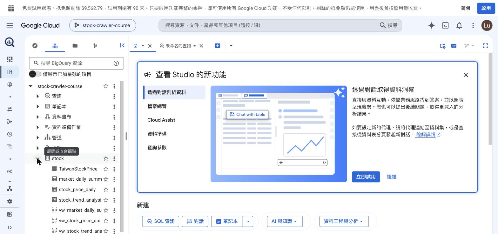

點 `TaiwanStockPrice` 開表格頁——上方有一行提示「**這是分區資料表**」，結構定義列出每個欄位的型別（date 是 DATE，就是分區用的欄位）：

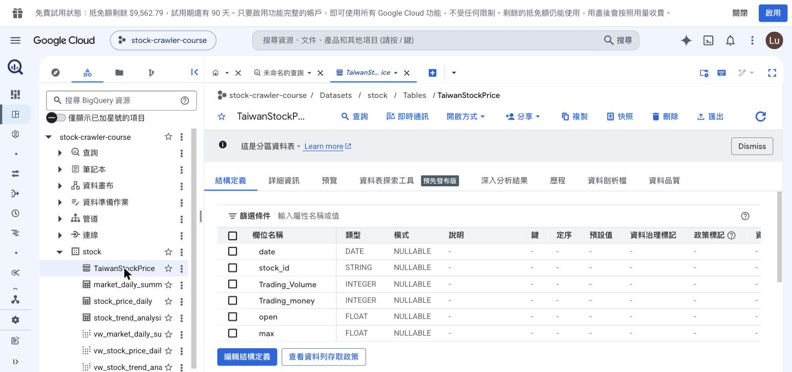

點上方「查詢」開查詢編輯器，貼下面這段 SQL、按「執行」（快捷鍵 Cmd/Ctrl+Enter）：

```sql
SELECT stock_id, trade_date, ROUND(close, 2) AS close,
       ROUND(ma5, 2) AS ma5, ROUND(ma20, 2) AS ma20
FROM `你的專案ID.app.stock_trend_analysis`
WHERE ma20 IS NOT NULL
ORDER BY trade_date DESC, stock_id
LIMIT 10
```

`WHERE ma20 IS NOT NULL` 是必要的：每支股票最早的 19 個交易日還湊不滿 20 天，`ma20` 那幾列會是 NULL。`ORDER BY` 補上 `stock_id` 當第二排序條件，同一天的多支股票才會有固定的順序。

結果表直接列出收盤價與均線——順帶注意 Console 跳出的「控管費用」專家提示，講的正是本章的省錢觀念：

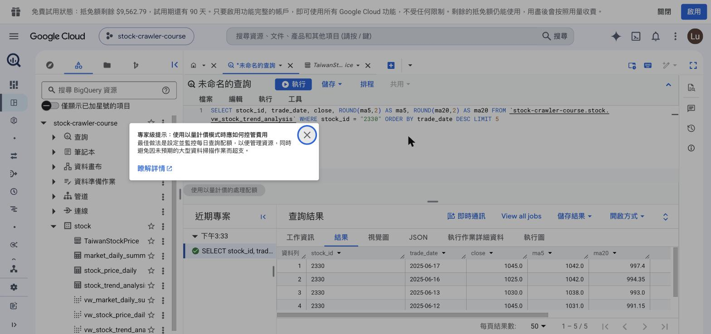

不開網頁也能驗，用 gcloud 附帶安裝的 `bq` 指令：

```bash
# 列出 raw 資料集——TaiwanStockPrice 的分區欄會顯示 DAY (field: date)
bq ls raw

# 直接查 app 層的趨勢表：每支股票最近三天的收盤價與均線
bq query --nouse_legacy_sql \
  'SELECT stock_id, trade_date, close, ROUND(ma5,2) AS ma5, ROUND(ma20,2) AS ma20
   FROM `你的專案ID.app.stock_trend_analysis`
   WHERE stock_id="2330" AND ma20 IS NOT NULL ORDER BY trade_date DESC LIMIT 3'
```

---

## 想再深入一點

- **load job vs streaming insert（費用差很大）。** 批次 load job（雙寫用的）免費、只算儲存；streaming insert 逐筆即時寫入要依量計費。每日整批股價這種場景，批次 load 又便宜又適合。這是實務上很重要的成本觀念。
- **分區（partition）為什麼能省錢？** BigQuery 依「掃描的資料量」收費。把表依日期分區後，查「某個月」只掃那個月的分區，不用掃整張三年的表。所以查得少 = 便宜 + 快。
- **View vs Table 差在哪？** View 是「一段存起來的查詢」，每次查它才即時算；Table 是把結果實體存下來。專案兩者都建：View 保持即時、Table 加速重複查詢。
- **這裡的「去重」跟第 6 章不一樣。** 第 6 章是在寫入時用主鍵 upsert 去重；這裡是在查詢時用 `ROW_NUMBER() ... WHERE rn = 1` 只留每組第一筆。兩種都是去重，但一個發生在「寫入端」、一個發生在「分析端」，適用情境不同。

亮點實驗之外，還有兩個功能可以直接動手試：

- **Materialized View（實體化檢視）**：〈BigQuery 的五個強項〉第四條講過它的定位——介於 View 和 Table 之間，寫個定義，BigQuery 存好結果並在來源表變動時自動增量更新。試一個（有語法限制，例如聚合不能用 `COUNT(DISTINCT)`）：

  ```bash
  bq query --use_legacy_sql=false \
    "CREATE MATERIALIZED VIEW lab.mv_daily_volume AS
     SELECT date, SUM(Trading_Volume) AS total_volume, COUNT(*) AS rows_cnt
     FROM raw.TaiwanStockPrice GROUP BY date"
  bq query --use_legacy_sql=false "SELECT * FROM lab.mv_daily_volume ORDER BY date DESC LIMIT 3"
  ```

- **INFORMATION_SCHEMA：用 SQL 查自己的花費**。每個查詢 job 的掃描量都記在系統表裡——「這個月誰跑了最貴的查詢」一句 SQL 就有答案：

  ```bash
  bq query --use_legacy_sql=false \
    "SELECT FORMAT_TIMESTAMP('%H:%M', creation_time, 'Asia/Taipei') AS t,
            LEFT(query, 45) AS query_head, total_bytes_processed
     FROM \`region-us\`.INFORMATION_SCHEMA.JOBS_BY_PROJECT
     WHERE job_type='QUERY' ORDER BY creation_time DESC LIMIT 5"
  ```

  順帶會看到一件事：實驗一那句 `COUNT(*)` 的 `total_bytes_processed` 是 **0**——整表筆數存在表的中繼資料裡，BigQuery 不用掃資料就能回答，這跟截圖上顯示的 0 B 是同一件事。

---

## 想一想

**Q1：用一句話說出 OLTP 和 OLAP 的差別，各舉一個場景。**

OLTP 擅長「即時、頻繁的小筆讀寫」（例如爬蟲每天寫入股價、查單一支股票），MySQL 是代表；OLAP 擅長「大範圍的分析查詢」（例如掃三年全市場算移動平均），BigQuery 是代表。一個像收銀機，一個像分析室。

**Q2：為什麼不直接讓分析查詢打在 MySQL 上？會有什麼副作用？**

因為大範圍分析查詢很吃資源，直接打在 MySQL 上會拖慢它正在做的即時寫入（爬蟲），兩邊互相影響。把分析移到 BigQuery，MySQL 就能專心負責營運寫入，各司其職。

**Q3：ELT 和傳統 ETL 差在哪個字母的順序？為什麼雲端倉儲時代偏好 ELT？**

差在 T（Transform）和 L（Load）的順序。傳統 ETL 是「先轉換、再載入」；ELT 是「先載入進倉儲、再用倉儲的算力轉換」。因為雲端倉儲（如 BigQuery）算力很強，先把原始資料整批搬進去、再用 SQL 轉換，比在外面慢慢轉再載入更有效率也更彈性。

**Q4：欄式儲存一定比列式快嗎？舉一個列式贏的情境。**

不一定。欄式的優勢有條件——要掃大量列、只引用少數欄、做聚合，這三件事同時成立時才明顯。反過來，「用主鍵取出一列的全部欄位」這種點查是 InnoDB 贏：clustered index 的 B-tree 幾次頁讀取就定位，而且一列的所有欄值本來就存在一起，一次取回；欄式反而要從各欄分別讀再把列重組。這也是雙寫保留 MySQL 的理由。

**Q5：BigQuery 自己就能排程 SQL，為什麼第 17 章還要學 Airflow？**

因為排程查詢只能排 SQL，而且只在 BigQuery 內部。第 17 章那條每日資料線的起點是「發爬蟲任務給 Celery worker」——跨機器、要等 worker 消化、要重試，這一段 BigQuery 碰不到。分工是 Airflow 管跨系統那條線，倉儲內部那一段可以交給排程查詢或 Dataform。

---

## 練習

> 以下需要 GCP 環境；沒有的話，改成「讀懂 SQL 並用自己的話解釋它在算什麼」。

**練習 0：dry run 估價再動手**

把你在 Step 3/4 寫的任何一段 SQL 拿去 `--dry_run`，記下掃描量；然後改寫它（少選欄位、加分區條件）讓掃描量下降。這讓你養成「先問價再跑」的習慣——免費額度是給省著用的人的。

**練習 1：讀懂 MA5 的 SQL**

看趨勢分析 View 裡算 `ma5` 的那段 `AVG(close) OVER (... ROWS BETWEEN 4 PRECEDING AND CURRENT ROW)`，用自己的話解釋「為什麼是往前 4 天加今天，合計 5 天」。這讓你搞懂視窗函數的「範圍」是怎麼界定的。

**練習 2：自己加一個 MA10**

模仿 MA5、MA20 的寫法，加一個 10 日均線 `ma10`（提示：`ROWS BETWEEN 9 PRECEDING AND CURRENT ROW`）。這讓你確認你真的看懂了移動平均的寫法，而不只是複製貼上。

**練習 3：想一個「分區」能省錢的查詢**

假設你只想看 2024 年 6 月的資料。寫出一段會「只掃到那個月分區」的 `WHERE` 條件（提示：對分區欄位 `date` 加範圍過濾）。想一想：如果不加這個條件、直接 `SELECT *`，BigQuery 會掃多少資料、花多少錢？

---

## 排錯

| 你遇到的狀況 | 原因 | 怎麼解 |
|-------------|------|--------|
| worker log 印「BQ 未設定，略過雲端寫入」 | 容器沒拿到 `GCP_PROJECT_ID`——up 指令沒帶注入前綴，或忘了 `sudo -E` | 照第 14 章 H-3 的指令重新 up；`sudo docker exec crawler_twse env \| grep GCP` 驗證容器內的值 |
| worker log 印「BigQuery 寫入失敗（MySQL 不受影響）」 | 專案 ID 打錯、VM 身分缺角色、或 scopes 不足 | 看訊息後半的實際錯誤：`Not found: Project` → 專案 ID 錯；`Access Denied` → 查 VM 服務帳戶的角色與 scopes（第 14 章 Part F） |
| raw 有資料但一直長重複列 | 雙寫 append 的天性，同一天重跑就疊 | 不是 bug；分析走 stage（已去重）。介意 raw 體積可定期清理舊分區 |
| `bq query` 報 `ProjectId must be non-empty` | 這台機器的 gcloud 沒設定預設專案 | `gcloud config set project {你的專案ID}`，或指令加 `--project_id=` |
| 查詢很貴 | 用了 `SELECT *` 全表掃描 | 加分區過濾、只選需要的欄位（實驗一） |
| Materialized View 建立被拒 | 語法限制，例如聚合用了 `COUNT(DISTINCT ...)` | 改用允許的聚合（`COUNT(*)`、`SUM`…），詳見官方的 MV 限制清單 |
| BQ 寫入報 403 `Quota exceeded: ... partition modifications` | 分區表有**每日分區修改配額**——課程爬蟲一次抓一年半，一個 load job 就觸碰數百個日分區；同一天反覆重跑會累積超標 | 等隔天配額重置；正式環境每天只 append 當日資料、一次只碰一個分區，不會觸及此配額——這正是「教學用全量重抓」與「生產用增量」的差異 |
| 誤刪了表裡的資料 | DML 沒帶 WHERE 或條件寫錯 | 七天內用 Time Travel 兩步復原（實驗二）；超過七天只能認賠——這也是 raw 「只寫入不修改」規矩的由來 |
| 本機跑補充版報憑證錯誤 | `GOOGLE_APPLICATION_CREDENTIALS` 沒設對或金鑰路徑錯 | `ls ~/gcp-keys/`、`echo $GOOGLE_APPLICATION_CREDENTIALS` 核對；重開終端機要重新 export |

---

## 補充：在本機雙寫（金鑰用法）

沒跟到第 14 章、或想在自己電腦上把整條流程做完的話，同一支雙寫程式也能在本機跑。本機在 GCP **外面**，拿不到 metadata server 的機器身分——這正是第 14 章 Part D 那把 **JSON 金鑰**的用途（「兩種憑證的分工」表的左欄）。

**① 先給金鑰的服務帳戶授權**（第 14 章建它時刻意一個角色都不給；用 T-2 學過的三個詞組一條 binding 指令，只給恰足夠的兩個預定義角色）：

```bash
SA="stock-crawler-sa@{你的專案ID}.iam.gserviceaccount.com"
gcloud projects add-iam-policy-binding {你的專案ID} \
  --member="serviceAccount:$SA" --role="roles/bigquery.dataEditor" --condition=None
gcloud projects add-iam-policy-binding {你的專案ID} \
  --member="serviceAccount:$SA" --role="roles/bigquery.jobUser" --condition=None

# 驗證：應列出剛加的兩個角色
gcloud projects get-iam-policy {你的專案ID} \
  --flatten="bindings[].members" --filter="bindings.members:stock-crawler-sa" \
  --format="value(bindings.role)"
```

Console 也能核對：IAM 與管理 → IAM，服務帳戶那列掛著 `BigQuery 資料編輯者`＋`BigQuery 工作使用者`：


**② 兩個環境變數＋照常跑本機系統**：

```bash
# 金鑰讓程式在 GCP 外取得身分；專案 ID 打開雙寫
export GOOGLE_APPLICATION_CREDENTIALS="$HOME/gcp-keys/你的金鑰檔名.json"
export GCP_PROJECT_ID="{你的專案ID}"

# 本機系統照第 13 章的方式起，worker 跑在容器裡的話，
# 要把兩個變數與金鑰檔一起帶進容器（環境變數＋volume 掛載），
# 比較簡單的做法是直接在本機 shell 跑一次任務驗證：
uv run python -c "
from crawler.tasks_crawler_finmind import crawler_finmind
crawler_finmind('2330')
"
```

worker log（或上面指令的輸出）會出現「資料已上傳到 BigQuery 表 'TaiwanStockPrice'」——本機的雙寫也通了。之後的 Step 2 亮點、Step 3/4（stage、app）與 Step 5（儀表板）全在 BigQuery／Looker Studio 上操作，跟資料從哪裡寫進來無關，照主線做即可。

> 這個版本順便說明了金鑰的本質：`GOOGLE_APPLICATION_CREDENTIALS` 帶著金鑰，程式在 GCP 外面拿到的身分跟在 GCP 裡面用機器身分是同一套 ADC 機制的兩條路——程式碼一行都不用改。
>
> 開始雙寫之前累積的歷史資料想補進 BigQuery？repo 的 `stock_sync_mysql_to_bigquery.py` 就是做這件事的回填工具（設 `BQ_DATASET=raw` 跑一次即可），不在本章主線內。

## 本章總結

- OLTP 負責即時寫入、OLAP 負責大規模分析——**雙寫讓同一筆資料一出生就有兩個副本**，各走各的命運。
- BigQuery 憑什麼算倉儲：欄式儲存（對照 InnoDB 的列式）讓分析查詢只讀被引用的欄，儲存與運算分離讓算力不必跟資料綁在同一台機器上。兩者各有適合的查詢型態，點查仍然是 InnoDB 贏。
- 雙寫的三條設計紀律：環境變數當開關（明確降級）、分析副本失敗不擋營運主職、raw 只 append 不修改。
- 三個實驗量出來的證據：掃描量隨引用欄位變化（`SELECT *` → 單欄 → `COUNT(*)`）、Time Travel 七天版本回溯、BQML 一句 SQL 訓練與預測。
- 省錢兩開關：少引用欄位（欄式儲存）＋分區過濾；`LIMIT` 不減少掃描量，`COUNT(*)` 靠中繼資料連掃都不用掃。
- 三層 raw／stage／app：爬蟲餵 raw，SQL 蓋 stage（去重 view）與 app（成品表），排錯照層走。
- BigQuery Studio 的六項功能：筆記本、資料畫布、資料準備作業（對照你手寫的 stage SQL）、管道（只管倉儲內部，取代不了第 17 章的 DAG）、連線（`EXTERNAL_QUERY` 讀 Cloud SQL 活資料）、排程查詢（SQL 排得動，爬蟲排不動）。
- 五個強項對照 MySQL／Cloud SQL：儲存運算分離、欄式且免建索引、Time Travel、Materialized View、BQML。
- Looker Studio（免費 SaaS BI）用內建連接器直接接 BigQuery 畫圖——雲端段的 BI 角色由它接手 Metabase。

到這裡，資料線已經完整成形：**抓取（Celery + 分流 + 失敗處理）→ 雙寫落地（MySQL 營運＋BigQuery 分析）→ 分層整理（raw/stage/app）→ 視覺化（Looker Studio）**。「爬蟲 → 佇列 → 雙寫 → 分層 → 報表」這條路，就是資料工程的基本功。

雲端段的其餘章節接著把系統本身升級：第 16 章把 MySQL 換成託管的 Cloud SQL（雙寫之下只改一個環境變數）、把系統拆到多台機器、密碼交給 Secret Manager，還會開一台 Spanner 感受另一種分散式資料庫；第 17 章用 Airflow 排程讓「爬蟲雙寫＋重算分析層」變成每個交易日自動執行的一條線。
