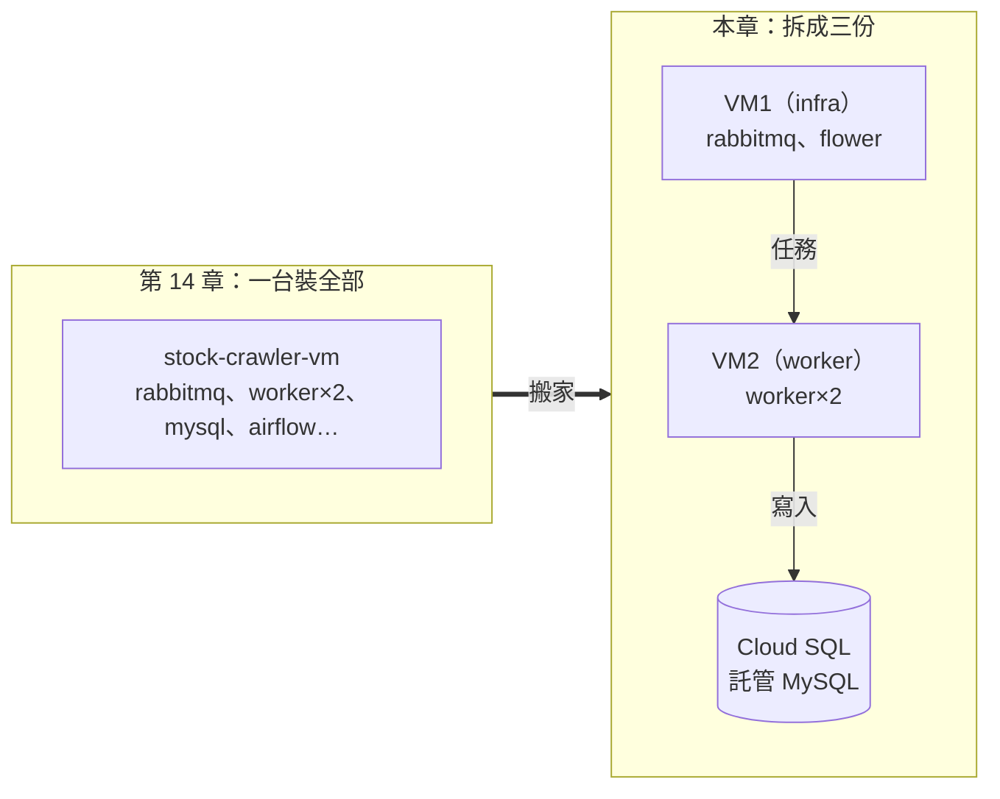

# 課程手冊16 - 系統搬家：多台 VM 與 Cloud SQL

> 本章對應 EP18。前置：第 14、15 章做完（有 GCP 專案、gcloud 可用、stock-crawler-vm 存在且會開關機、服務帳戶已有 BigQuery 權限）。
>
> 第 14 章把整套系統塞進一台 VM——能動，但所有服務擠在一起：資料庫跟 worker 搶記憶體、一台掛全部掛。本章把它拆開：**資料庫換成託管的 Cloud SQL、worker 搬到第二台 VM**——補充B 講的「分散式」，這次真的跨機器。

## 本章用到的工具與服務

| 工具／服務 | 類型 | 在本章做什麼 |
|-----------|------|-------------|
| Cloud SQL | GCP 服務 | 託管 MySQL，取代 VM 上的 MySQL 容器 |
| Secret Manager | GCP 服務 | 保管資料庫密碼，程式啟動時向它取用 |
| Compute Engine（GCE） | GCP 服務 | 開第二台 VM，worker 獨立成一台機器 |
| VPC 內部網路 | GCP 服務 | 跨 VM 用內部 IP 互連，`default-allow-internal` 預設放行 |
| Cloud SQL Studio | Console 功能 | 在 Console 直接查 Cloud SQL 裡的資料表 |
| gcloud CLI | 指令工具 | 建實例、設授權網路、建 secret 並授權 |
| compose override 檔 | 既有工具 | 只改連線變數，就把同一套系統接上新的後端 |

## 做完這一章你會

1. 說得出「託管服務 vs 自架」的取捨——雲的核心交易
2. 用 gcloud 建立一個 Cloud SQL（MySQL 8.0）實例，設定授權網路
3. 分清楚內部 IP 與外部 IP，知道同一個 VPC 裡的機器怎麼互相溝通
4. 用 Secret Manager 保管資料庫密碼，讓程式不必把密碼寫在檔案裡
5. 開第二台 VM 專跑 worker，用 compose override 檔讓它連到別台機器的服務
6. 跑通跨機器的完整閉環：VM1 發任務 → VM2 消化 → 資料落進 Cloud SQL
7. 說得出 Swarm 與 Kubernetes 是什麼、為什麼本課程用 compose 就夠

## 先搞懂

### 託管服務 vs 自架：雲的核心交易

到上一章為止，MySQL 是你自己跑的容器：版本升級你來、備份你來、掛了半夜也是你來。**Cloud SQL 是 Google 幫你跑的 MySQL**——備份、更新、故障轉移、高可用全包，代價是錢。這就是雲的核心交易：**用錢買維運**。

| | 自架 MySQL 容器（第 5 章至今） | Cloud SQL |
|---|---|---|
| 誰負責備份／升級／修機器 | 你 | Google |
| 費用 | 機器錢（VM 反正開著＝近乎零） | 實例按時計費（課程用最小規格 db-f1-micro） |
| 控制權 | 完全（任何參數、任何版本） | 部分（參數白名單內可調） |
| 連線方式 | 容器名（同 compose 網路） | IP＋授權網路（或私有連線） |
| 什麼時候選它 | 學習、預算敏感、要完全控制 | 資料重要到「掛了會出事」、沒有專職 DBA |

判斷的口訣：**資料庫是最不適合自己扛的零件**——它有狀態、故障代價最高，所以它通常是系統裡第一個換成託管的零件。

### 這一章的搬家藍圖



- **VM1（既有的 stock-crawler-vm）**：收斂成 infra 角色，只跑 RabbitMQ 與 Flower
- **VM2（本章新開）**：只跑兩個 worker——爬蟲的勞力工作獨立成一台，之後要加速就再開 VM3、VM4（第 7 章 `--scale` 的跨機器版）
- **Cloud SQL**：取代 MySQL 容器。程式端只改 `MYSQL_HOST`——第 6 章把設定集中在 config 的做法，效果在這裡顯現

### 內部 IP vs 外部 IP（跨機器前必懂）

第 14 章開 VM 時你看過兩個 IP，本章開始它們有不同的用途：

| | 內部 IP（10.140.0.x） | 外部 IP（35.x.x.x） |
|---|---|---|
| 誰配的 | VPC（專案的私人網路）自動配 | 共用池借給你的 |
| 誰連得到 | 同一個 VPC 裡的其他 VM | 全世界 |
| 停機後 | **不變** | 回收，下次 start 換新的 |
| 費用 | 內部流量免費 | 對外流量計費 |
| 本章用途 | **VM2 連 VM1 的 RabbitMQ** | 你 SSH 連線用它；Cloud SQL 授權網路填的也是它 |

兩個推論：
1. **機器之間講話用內部 IP**——免費、停機不變、而且 VPC 預設規則 `default-allow-internal` 放行內部互連，不用另開防火牆（對照第 14 章：對外開 port 才要寫規則）
2. 外部 IP 是回收再發的共用池——VM2 有可能拿到 VM1 上次停機被回收的那一顆。所以任何寫死外部 IP 的設定，重開機後都要檢查

## 一步一步

> 本章的 IP 每個人都不同。開工前先開好 VM1 並把三個值抄下來，後面指令照抄你自己的：
>
> | 值 | 查法 | 你的值 |
> |----|------|--------|
> | VM1 內部 IP | `gcloud compute instances list`（INTERNAL_IP 欄） | ______ |
> | VM1 外部 IP | 同上（EXTERNAL_IP 欄） | ______ |
> | VM2 外部 IP | 建好 VM2 後同上 | ______ |
> | Cloud SQL IP | Part A 建好後 `gcloud sql instances list` | ______ |

### Part A：建立 Cloud SQL 實例

**A-1 啟用 API**（每個服務第一次用都要）：

```bash
gcloud services enable sqladmin.googleapis.com
```

**A-2 建立實例**：

```bash
gcloud sql instances create stock-mysql \
  --database-version=MYSQL_8_0 \
  --tier=db-f1-micro \
  --region=asia-east1 \
  --root-password=1234
```

參數說明：`stock-mysql` 是實例名稱（自取）；`--database-version` 跟課程一路用的 MySQL 8.0 對齊；`--tier=db-f1-micro` 是最小最便宜的規格（教學夠用）；`--region` 跟 VM 同區（連線最快）；`--root-password` 刻意設 `1234`——**跟 `.env.example` 的預設一致，這是等一下「程式一行都不用改帳密」的關鍵**。

- **建立要等約 10 分鐘**（Google 在幫你準備一台帶備份機制的資料庫伺服器），比開 VM 慢很多是正常的
- 完成後查狀態與 IP：

```bash
gcloud sql instances list
# NAME         DATABASE_VERSION  TIER         PRIMARY_ADDRESS   STATUS
# stock-mysql  MYSQL_8_0         db-f1-micro  35.xxx.xxx.xxx    RUNNABLE
```

`PRIMARY_ADDRESS` 就是 Cloud SQL 的 IP，抄進上面的表。

Console 上也看得到（≡ → SQL）：狀態綠勾＝RUNNABLE，公開 IP 位址就是剛才的 `PRIMARY_ADDRESS`：


**A-3 授權網路＋建資料庫**：

Cloud SQL 預設誰都連不進來（跟 VM 防火牆同一個哲學）。把兩台 VM 的**外部 IP** 加進授權清單，並建立課程用的資料庫：

```bash
gcloud sql instances patch stock-mysql \
  --authorized-networks={VM1外部IP}/32,{VM2外部IP}/32

gcloud sql databases create mydb --instance=stock-mysql
```

> 為什麼授權的是「外部 IP」？VM 連 Cloud SQL 的公網位址時，流量是從 VM 的外部 IP 出去的，Cloud SQL 看到的來源就是它。也因此：**VM 重開機換了外部 IP，就要回來重跑一次 patch**——這是本章排錯表的第一名。

patch 的結果在 Console 看得到：≡ → SQL → stock-mysql → 左側「連線設定」→「網路連線」分頁。「已授權網路」列出的兩筆 /32，就是兩台 VM 的外部 IP（之後想用滑鼠加 IP，也是在這頁按「新增網路」）：


### Part B：把資料庫密碼交給 Secret Manager 保管

上一步建立 Cloud SQL 時，密碼 `1234` 直接寫在指令裡。這在本機沒問題（第 1 到 13 章都是這樣用的），但資料已經上雲，密碼的處理方式也該跟著調整。原因有三個：

1. 指令歷史會留下這個密碼（`history` 指令查得到）
2. 等一下 Part E 的 override 檔如果要填密碼，那個檔案就會明碼放在 VM 的磁碟上
3. 之後要換密碼，每台機器的檔案都要各改一次

**Secret Manager 是 GCP 的密碼保管服務**：你把密碼存進去，程式執行時再跟它要。這是 `.env` 做法的雲端版本——`.env` 解決的是「密碼不進 git」，Secret Manager 再往前一步解決「密碼不留在機器上」。

補充G 教 `.env` 時就預告過這個服務，現在資料庫上雲了，正好是換過來的時機。

**B-1 啟用 API 並建立 secret**：

```bash
gcloud services enable secretmanager.googleapis.com

# 建立一顆名叫 mysql-password 的 secret，內容是 1234
# printf 不會在字串後面加換行；--data-file=- 表示「內容從管線讀進來」
# 這樣寫的好處是密碼不會出現在指令的參數裡，指令歷史不會留下它
printf "1234" | gcloud secrets create mysql-password \
  --data-file=- --replication-policy=automatic
```

**B-2 授權兩台 VM 讀取這顆 secret**：

VM 上的程式要讀 secret，得先取得權限。這裡用第 15 章學過的 IAM 授權，但範圍不一樣。VM2 要到 Part D 才會建立，不影響這一步——兩台 VM 用同一個 Compute Engine 預設服務帳戶，授權一次就涵蓋兩台：

```bash
# 先查出專案編號（跟專案 ID 不同，是一串數字）
gcloud projects describe {你的專案ID} --format="value(projectNumber)"

# 授權 VM 的預設服務帳戶讀取這顆 secret
gcloud secrets add-iam-policy-binding mysql-password \
  --member="serviceAccount:{專案編號}-compute@developer.gserviceaccount.com" \
  --role="roles/secretmanager.secretAccessor"
```

跟第 15 章的授權比較，差別在**範圍**：

| | 第 15 章 | 這裡 |
|---|---------|------|
| 指令 | `gcloud projects add-iam-policy-binding` | `gcloud secrets add-iam-policy-binding` |
| 後面接的對象 | 專案名稱 | `mysql-password` 這一顆 secret |
| 權限生效範圍 | 整個專案 | 只有這顆 secret |

這是最小權限原則更精確的做法：**角色收到最小**（`secretAccessor` 只能讀取內容，不能修改、刪除，也不能列出其他 secret），**範圍也收到最小**（單一資源，不是整個專案）。

要注意的是，VM 的預設服務帳戶雖然掛著 Editor 這個涵蓋很廣的角色，但 **Editor 不包含讀取 secret 內容的權限**。不做這一步授權，程式讀 secret 會被 403 拒絕。

**B-3 驗證**：

```bash
# 在你自己的電腦上（你是專案 Owner，本來就讀得到）
gcloud secrets versions access latest --secret=mysql-password
# 1234

# SSH 進 VM1 再執行一次（這次用的是 VM 服務帳戶的身分，證明 B-2 的授權生效）
gcloud compute ssh stock-crawler-vm --zone=asia-east1-b
gcloud secrets versions access latest --secret=mysql-password
# 1234
```

**B-4 讓程式去讀 secret**：

打開 `crawler/config.py`，把 Secret Manager 區塊的註解取消（連同上面的 `GCP_PROJECT_ID` 那行，第 15 章取消過的話它已經是開的）。取消後的邏輯是：

```python
def _password_from_secret_manager():
    """讀 Secret Manager 的 mysql-password；任何原因失敗就回 None，讓呼叫端用原本的值"""
    try:
        from google.cloud import secretmanager
        client = secretmanager.SecretManagerServiceClient()
        name = f"projects/{GCP_PROJECT_ID}/secrets/mysql-password/versions/latest"
        return client.access_secret_version(name=name).payload.data.decode()
    except Exception:
        return None

MYSQL_PASSWORD = _password_from_secret_manager() or MYSQL_PASSWORD
```

這種寫法叫 **fallback（後備）設計**：先跟 Secret Manager 要密碼，要不到就用環境變數的值。這樣同一份程式碼，在有授權的 VM 上會用雲端的密碼、在你自己的電腦上會用 `.env` 的預設值——換部署環境時程式碼不用改。這跟第 6 章把設定集中在 config 的做法是同一個原則。

在 VM1 上驗證。這裡會遇到一個問題：secret 的值和 `.env` 的預設值都是 1234，印出來看不出密碼是從哪邊來的。解法是利用 Secret Manager 的**版本**功能，先加一個容易辨識的值，測完再換回來：

```bash
# 在你自己的電腦上：新增一個版本，內容改成好辨識的字串
# versions add 是新增版本，latest 會指向最新的這一版
printf "sm-test-42" | gcloud secrets versions add mysql-password --data-file=-

# 在 VM1 的 ~/stock-crawler 目錄下：
export PATH="$HOME/.local/bin:$PATH"
GCP_PROJECT_ID={你的專案ID} uv run python -c \
  "from crawler.config import MYSQL_PASSWORD; print('password =', MYSQL_PASSWORD)"
# password = sm-test-42      ← 值來自 Secret Manager，不是 .env

# 再驗證 fallback：故意給一個不存在的專案 ID，讀取會失敗
GCP_PROJECT_ID=no-such-project uv run python -c \
  "from crawler.config import MYSQL_PASSWORD; print('password =', MYSQL_PASSWORD)"
# password = 1234            ← 退回 .env 的預設值

# 在你自己的電腦上：再新增一個版本把密碼換回 1234
printf "1234" | gcloud secrets versions add mysql-password --data-file=-
```

上面這三個動作就是**密碼輪替**的完整流程：新增一個版本，所有讀 `latest` 的程式下次啟動就會拿到新值，不需要逐台修改檔案。

Console 上可以看到剛才產生的所有版本（≡ → 安全性 → Secret Manager → 點 mysql-password → 版本分頁）。每個版本都保留著，可以停用、也可以切回舊版：


### Part C：VM1 收斂成 infra 角色

```bash
gcloud compute ssh stock-crawler-vm --zone=asia-east1-b
cd stock-crawler
sudo docker compose -f docker-compose-all.yml down    # 收掉上一章的全套
sudo docker compose -f docker-compose-local.yml up -d rabbitmq flower
sudo docker ps --format '{{.Names}}\t{{.Status}}'      # 只剩 rabbitmq、flower
```

同一份 repo、同一批 compose 檔——**機器的「角色」由你 up 哪些服務決定**。VM1 從「全能機」變「訊息中樞」，只花兩條指令。

### Part D：開 VM2 並準備 worker

worker 不需要 8GB，開小台的就好：

```bash
gcloud compute instances create stock-crawler-vm2 \
  --zone=asia-east1-b \
  --machine-type=e2-small \
  --image-family=ubuntu-2404-lts-amd64 \
  --image-project=ubuntu-os-cloud \
  --boot-disk-size=20GB
```

建好後 Console 的 VM 清單（≡ → Compute Engine → VM 執行個體）會有兩台並列。注意兩欄 IP：內部 IP 是連號的 `10.140.0.x`（同一個 VPC 依序配發），外部 IP 則是兩顆不相干的公網位址——這張圖就是「先搞懂」那張內外部 IP 對照表的實景：


SSH 進 VM2，重演第 14 章的環境準備（裝 Docker → clone → build worker image）：

```bash
gcloud compute ssh stock-crawler-vm2 --zone=asia-east1-b

curl -fsSL https://get.docker.com | sudo sh
sudo usermod -aG docker $USER
git clone https://github.com/lu791019/stock-crawler-de-course-materials.git stock-crawler
cd stock-crawler && cp .env.example .env
sudo docker compose -f docker-compose-local.yml build worker_twse worker_tpex
```

### Part E：override 檔——「只改 HOST」的實作

worker 在 compose 檔裡寫的是 `RABBITMQ_HOST=rabbitmq`、`MYSQL_HOST=mysql`——那是「大家都在同一台的容器名」。現在 RabbitMQ 在別台、MySQL 在 Cloud SQL，**用一個 override 檔蓋掉這兩個值**（在 VM2 的 `~/stock-crawler` 下建立）：

```bash
cat > gcp-worker-override.yml <<'YML'
# worker 上雲的 override：覆蓋兩個 HOST 加上專案 ID，其餘沿用 docker-compose-local.yml
services:
  worker_twse:
    environment:
      - RABBITMQ_HOST={VM1內部IP}       # 例：10.140.0.2——同 VPC 用內部 IP
      - MYSQL_HOST={CloudSQL IP}        # 例：35.229.208.220
      - GCP_PROJECT_ID={你的專案ID}     # config.py 要用它去 Secret Manager 拿密碼
  worker_tpex:
    environment:
      - RABBITMQ_HOST={VM1內部IP}
      - MYSQL_HOST={CloudSQL IP}
      - GCP_PROJECT_ID={你的專案ID}
YML
```

注意這裡**沒有寫密碼**。密碼由 Part B 的 Secret Manager 提供：容器裡的 `config.py` 會拿 `GCP_PROJECT_ID` 去讀 secret。容器本身不需要金鑰檔——它跑在 VM 上，會用 VM 的服務帳戶身分去讀，這正是 Part B-2 授權的那個帳戶。

用「兩個 -f」啟動——compose 會把兩份檔案**合併**，後面的蓋前面的：

```bash
sudo docker compose -f docker-compose-local.yml -f gcp-worker-override.yml \
  up -d --no-deps worker_twse worker_tpex

sudo docker logs crawler_twse --tail 5
```

預期看到兩行關鍵 log：

```
Connected to amqp://worker:**@{VM1內部IP}:5672//
twse@xxxx ready.
```

worker 跨機器連上了 VM1 的 RabbitMQ。`--no-deps` 的意思是「只啟動我指定的服務」——不加的話，compose 會照 `depends_on` 把本機的 rabbitmq 也一起啟動（worker 實際連的是 VM1，本機這顆只會佔用記憶體）。

注意這裡沒有動任何防火牆設定，內部 IP 互連走的是 `default-allow-internal` 這條預設規則。**整次搬家，程式碼一行都沒改，設定的改動就是 override 檔裡那三個值。**

確認密碼真的來自 Secret Manager（而不是退回 `.env` 的預設值）：

```bash
# 在 VM2 上，看容器裡讀到的密碼從哪來
sudo docker exec crawler_twse python -c \
  "from crawler.config import MYSQL_PASSWORD; print(MYSQL_PASSWORD)"
```

搭配 Part B-4 的測試手法（先把 secret 換成 `sm-test-42` 再看這裡印出什麼），就能確認容器是去 Secret Manager 拿的。

### Part F：跨機器端到端

回 VM1 發任務（producer 在 VM1 上跑，連的是本機的 RabbitMQ）：

```bash
# 在 VM1 上
cd stock-crawler && export PATH="$HOME/.local/bin:$PATH"
uv run crawler/producer_multi_queue.py
# send task_2330 task / send task_00679b task
```

到 VM2 確認 worker 消化：

```bash
# 在 VM2 上
sudo docker logs crawler_twse 2>&1 | grep succeeded | tail -2
```

驗資料真的進了 Cloud SQL（用一次性的 mysql 客戶端容器，用完即丟）：

```bash
# 在 VM2 上
sudo docker run --rm mysql:8.0 \
  mysql -h{CloudSQL IP} -uroot -p1234 -N \
  -e "SELECT COUNT(*) FROM mydb.TaiwanStockPrice;"
```

有筆數（兩支股票都有資料列）就是全通：**任務從 VM1 出發、在 VM2 被執行、資料落在 Cloud SQL**——三個零件在三個地方，協作靠的是第 1 章就認識的訊息佇列。表是 to_sql 自動建的，跟第 5 章在本機第一次寫入時一模一樣。

跨機分工在 Flower 上也看得到：瀏覽器開 `http://{VM1外部IP}:5555`——Flower 跑在 VM1，列出的兩個 worker 卻是 VM2 上的容器（worker 名稱 @ 後面的主機碼跟 VM1 不同台），各自 Succeeded 1 筆：


**用 Console 的圖形介面查資料——Cloud SQL Studio**：≡ → SQL → stock-mysql → 左側「Cloud SQL Studio」。這裡有個坑：登入對話框的使用者下拉裡，**root 是灰色不可選的**（顯示「不支援 'root'@'%'」）——Studio 不開放 root 帳號登入，這是它的安全限制。解法是先用 gcloud 建一個一般使用者（`--host=%` 要明確給，不給的話 host 是空值，Studio 一樣拒收）：

```bash
gcloud sql users create studio --instance=stock-mysql --password=1234 --host=%
```

回到 Studio 重新整理頁面，登入資料庫選 `mydb`、使用者選 `studio`、密碼 `1234` → 驗證。左側 Explorer 會列出 mydb 的資料表，開一個 SQL 編輯器分頁直接下查詢：


託管服務自帶管理介面，phpMyAdmin 在雲端段就退役了。

## Swarm 一頁＋K8s 簡介

現在你有兩台機器手動分工，自然的下一個問題：機器更多的時候，誰來管「哪個容器跑在哪台」？這類工具叫**容器編排（orchestration）**：

- **Docker Swarm**：Docker 原生的編排，指令跟 compose 很像、上手最快。但業界大勢已定——**Kubernetes（K8s）成為標準，Swarm 沒落**，知道它存在即可
- **Kubernetes**：解決大規模容器的調度、自癒（容器掛了自動重啟補位）、滾動更新、水平擴縮。發源於 Google 內部系統 Borg 的經驗，GCP 上的託管版就是第 14 章對照表裡的 GKE
- **為什麼本課程不教 K8s**：它的內容量相當於一整門課；而且概念上你已經有基礎——compose 管一台機器上的容器，K8s 管一群機器上的容器。**先把 compose 練熟，是學 K8s 的合理順序**。課程規模（兩三台 VM、十來個容器）用 compose 加手動分工就足夠

## 收工：三個東西都要停

```bash
# Cloud SQL 停止（activation-policy 設 NEVER＝停用；之後要用改回 ALWAYS）
gcloud sql instances patch stock-mysql --activation-policy=NEVER

# 兩台 VM 一起停
gcloud compute instances stop stock-crawler-vm stock-crawler-vm2 --zone=asia-east1-b
```

| 資源 | 停了之後 | 還會收的錢 |
|------|---------|-----------|
| VM ×2 | TERMINATED，外部 IP 回收 | 磁碟費（兩顆 20GB 合計每月約 NT$50） |
| Cloud SQL | 停用，資料保留 | 儲存費（少量） |

重新開工的順序：Cloud SQL `--activation-policy=ALWAYS` → VM start → **查新的外部 IP → 重跑 authorized-networks 的 patch**（IP 換了，舊授權就失效——別忘了這步）。

## 檢查：這一章做完的狀態

- [ ] `gcloud sql instances list` 看得到 stock-mysql，STATUS 是 RUNNABLE（收工後 STOPPED）
- [ ] 授權網路含兩台 VM 的外部 IP；mydb 資料庫存在
- [ ] VM1 只跑 rabbitmq＋flower；VM2 只跑兩個 worker
- [ ] VM2 worker log 有 `Connected to amqp://...{VM1內部IP}` 與 `ready`
- [ ] VM1 發任務後，Cloud SQL 的 `mydb.TaiwanStockPrice` 查得到資料
- [ ] 三個資源全部停止

## 想一想

1. 為什麼 VM2 連 RabbitMQ 用內部 IP、連 Cloud SQL 卻用外部 IP？（提示：Cloud SQL 不在你的 VPC 裡——它是 Google 託管專案裡的機器。進階解法叫「私人服務存取」，課程不會用到但值得知道名字）
2. 如果爬蟲量變大，下一台該加的是 VM3 跑更多 worker，還是把 VM1 換大台？這跟第 7 章 `--scale` 的水平擴充是同一題嗎？
3. 建立 Cloud SQL 時密碼 1234 寫在指令裡，Part B 把它移進 Secret Manager 之後，這個密碼還有哪些地方留著明碼？（提示：查一下 `history`）
4. 密碼輪替時，正在執行的 worker 用的還是它啟動時讀到的舊密碼。什麼時候才會真的換成新密碼？這對「舊密碼何時可以停用」有什麼影響？

## 練習

1. 把 VM2 的 worker `--scale worker_twse=2`（override 檔加 `container_name` 要先拿掉），看 Flower（VM1 外部 IP:5555）出現兩個 twse worker——跨機器版的第 7 章實驗
2. 故意把 override 檔的 `MYSQL_HOST` 改錯一碼再發任務，觀察 worker log 的錯誤長相，再改回來——練排錯手感
3. 全部停機再全部開機，走一遍「查新 IP → 重 patch 授權網路」的復原流程，直到端到端再次全通

## 排錯

| 症狀 | 原因 | 處理 |
|------|------|------|
| worker 連 Cloud SQL 逾時 | VM 重開後外部 IP 換了，授權網路還是舊 IP | `instances list` 查新 IP → 重跑 `sql instances patch --authorized-networks` |
| worker 連不上 RabbitMQ | override 檔的內部 IP 抄錯，或 VM1 的 rabbitmq 沒起 | 核對 `instances list` 的 INTERNAL_IP；VM1 `docker ps` |
| Access denied for user 'root' | Cloud SQL root 密碼跟 `.env` 對不上 | 建實例時 `--root-password=1234`；或 `gcloud sql users set-password` 重設 |
| 建實例卡很久 | Cloud SQL 建立本來就要約 10 分鐘 | `gcloud sql instances list` 看 STATUS 從 PENDING_CREATE 變 RUNNABLE |
| Unknown database 'mydb' | 忘了建資料庫 | `gcloud sql databases create mydb --instance=stock-mysql` |
| VM2 上莫名多一個 rabbitmq 容器 | up 沒加 `--no-deps`，depends_on 連帶啟動 | `docker rm -f rabbitmq`，之後 up 記得加 `--no-deps` |
| Cloud SQL Studio 的使用者下拉 root 是灰的 | Studio 不開放 root 登入；gcloud 建的使用者沒給 `--host=%` 也會被拒 | `gcloud sql users create studio --password=1234 --host=%` 後重新整理頁面 |
| 兩台 VM 內部 IP 一樣？ | 不可能——同 VPC 內部 IP 唯一；你看到的多半是外部 IP 回收再發 | 分清楚兩欄：INTERNAL_IP vs EXTERNAL_IP |
| 程式讀 secret 回 403 Permission denied | 沒做 B-2 的授權，或 member 填錯（要填 VM 用的那個服務帳戶） | 用 `gcloud secrets get-iam-policy mysql-password` 檢查授權對象 |
| config.py import 時報 GCP_PROJECT_ID 未定義 | Secret Manager 區塊取消註解了，但上面的 `GCP_PROJECT_ID` 那行還註解著 | 兩處要一起取消註解 |
| 容器讀到的密碼還是 .env 的預設值 | override 檔沒給 `GCP_PROJECT_ID`，或 secret 名稱打錯，fallback 就退回預設值 | 檢查 override 檔；用 B-4 的辨識值測試法確認來源 |

## 本章總結

- 託管 vs 自架是雲的核心交易：用錢買維運。資料庫最有資格先換成託管——有狀態、故障代價最高
- 內部 IP 給機器互連（免費、不變、免防火牆），外部 IP 給對外（會回收、要授權）——分清楚這兩個，跨機器架構就通了
- Secret Manager 保管密碼：集中儲存、可查詢誰讀過、每個版本都保留；程式端用 fallback 設計，讓同一份程式碼在雲端讀 secret、在本機讀 `.env`
- 授權可以綁在單一資源上（`gcloud secrets add-iam-policy-binding`），範圍比第 15 章的專案層級更精確
- 在 VM 上執行的容器不需要金鑰檔，它用 VM 的服務帳戶身分讀 Secret Manager
- compose override 檔讓「搬家」縮小成三個值的差異，這是設定集中管理與分層設計帶來的效果
- 跨機器閉環：VM1 發 → VM2 做 → Cloud SQL 存。把零件放到三個地方，協作靠訊息佇列
- Swarm 已少人使用、K8s 是目前的標準但屬於另一門課的範圍——compose 練熟就是學 K8s 的基礎
- 收工三停：VM ×2＋Cloud SQL；重開要記得「新 IP → 重 patch 授權」

下一章（第 17 章）是最後一章：用 Airflow 排程把「Cloud SQL → BigQuery」的同步變成每個交易日自動執行，並對照託管版的 Cloud Composer。

如果你也想把 API 開到網路上讓別人查詢，可以看選讀的補充H——用 Artifact Registry 與 Cloud Run 把 FastAPI 部署成一個固定的 HTTPS 網址。
