# 課程手冊16 - 系統搬家：多台 VM 與 Cloud SQL

> 本章對應 EP18。前置：第 14、15 章做完（有 GCP 專案、gcloud 可用、stock-crawler-vm 存在且會開關機、雙寫已在運轉）。
>
> 第 14 章把整套系統塞進一台 VM——能動，但所有服務擠在一起：資料庫跟 worker 搶記憶體、一台掛全部掛。本章把它拆開：**資料庫換成託管的 Cloud SQL、worker 搬到第二台 VM**——補充B 講的「分散式」，這次真的跨機器。搬家只動雙寫的 OLTP 半邊；BigQuery 那條分析線一個字都不用改，你會親自驗證這件事。最後的 Bonus 節再開一台 **Cloud Spanner** 試用機，看看「分散式資料庫」跟託管 MySQL 差在哪。

## 本章用到的工具與服務

| 工具／服務 | 類型 | 在本章做什麼 |
|-----------|------|-------------|
| Cloud SQL | GCP 服務 | 託管 MySQL，取代 VM 上的 MySQL 容器 |
| Secret Manager | GCP 服務 | 保管資料庫密碼，程式啟動時向它取用 |
| Compute Engine（GCE） | GCP 服務 | 開第二台 VM，worker 獨立成一台機器 |
| VPC 內部網路 | GCP 服務 | 跨 VM 用內部 IP 互連，`default-allow-internal` 預設放行 |
| Cloud SQL Studio | Console 功能 | 在 Console 直接查 Cloud SQL 裡的資料表 |
| Airflow | 既有工具 | 留在 VM1 上，本章的發任務都從它觸發（第 14 章 Part J 的做法延續） |
| Cloud Spanner | GCP 服務 | 開 90 天免費試用機體驗分散式資料庫，與 Cloud SQL 對照 |
| gcloud CLI | 指令工具 | 建實例、設授權網路、建 secret 並授權 |
| compose 插值＋`.env` | 既有工具 | 只改 `.env` 三行，就把同一套系統接上新的後端 |

## 做完這一章你會

1. 說得出「託管服務 vs 自架」的取捨——雲的核心交易
2. 用 gcloud 建立一個 Cloud SQL（MySQL 8.0）實例，設定授權網路
3. 分清楚內部 IP 與外部 IP，知道同一個 VPC 裡的機器怎麼互相溝通
4. 用 Secret Manager 保管資料庫密碼，讓程式不必把密碼寫在檔案裡
5. 開第二台 VM 專跑 worker，用 `.env` 三行讓它連到別台機器的服務
6. 跑通跨機器的完整閉環：VM1 發任務 → VM2 消化 → 雙寫同時落進 Cloud SQL 與 BigQuery
7. 說得出 Cloud SQL 與 BigQuery 在營運面的差異（連線、授權、計費、停機模式）
8. （Bonus）開一台 Spanner 免費試用機動手操作，說得出它跟 Cloud SQL 的分工，以及 GCP 五種資料庫服務各自的適用場景
9. 說得出 Swarm 與 Kubernetes 是什麼、為什麼本課程用 compose 就夠

## 先搞懂

### 託管服務 vs 自架：雲的核心交易

到上一章為止，MySQL 是你自己跑的容器：版本升級你來、備份你來、掛了半夜也是你來。**Cloud SQL 是 Google 幫你跑的 MySQL**——備份、更新、故障轉移、高可用全包，代價是錢。這就是雲的核心交易：**用錢買維運**。

| | 自架 MySQL 容器（第 5 章至今） | Cloud SQL |
|---|---|---|
| 誰負責備份／升級／修機器 | 你 | Google |
| 費用 | 機器錢（VM 反正開著＝近乎零） | 實例按時計費（課程用最小規格 db-f1-micro） |
| 控制權 | 完全（任何參數、任何版本） | 部分（參數白名單內可調） |
| 連線方式 | 容器名（同 compose 網路） | IP＋授權網路（或私有連線） |
| 什麼時候選它 | 學習、預算敏感、要完全控制 | 資料重要到「掛了會出事」、沒有專職 DBA |

判斷的口訣：**資料庫是最不適合自己扛的零件**——它有狀態、故障代價最高，所以它通常是系統裡第一個換成託管的零件。

### 這一章的搬家藍圖

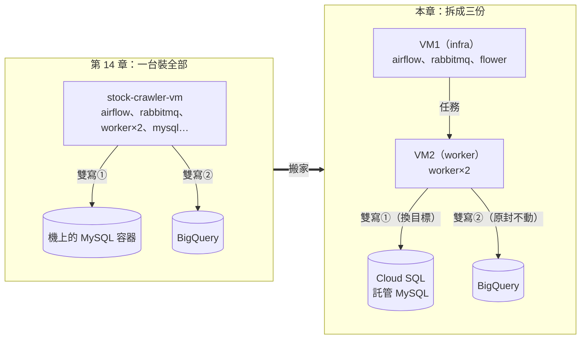
```mermaid
flowchart LR
    subgraph BEFORE["第 14 章：一台裝全部"]
        ALL["stock-crawler-vm<br/>airflow、rabbitmq、worker×2、mysql…"] -->|"雙寫①"| M0[("機上的 MySQL 容器")]
        ALL -->|"雙寫②"| BQ0[("BigQuery")]
    end
    subgraph AFTER["本章：拆成三份"]
        VM1["VM1（infra）<br/>airflow、rabbitmq、flower"] -->|任務| VM2["VM2（worker）<br/>worker×2"]
        VM2 -->|"雙寫①（換目標）"| SQL[("Cloud SQL<br/>託管 MySQL")]
        VM2 -->|"雙寫②（原封不動）"| BQ[("BigQuery")]
    end
    BEFORE ==>|搬家| AFTER
```

- **VM1（既有的 stock-crawler-vm）**：收斂成 infra 角色——排程與訊息的中樞，只跑 Airflow、RabbitMQ、Flower。發任務從這章起固定由 **Airflow 觸發**（第 14 章 Part J 的做法延續），不再手動跑 producer
- **VM2（本章新開）**：只跑兩個 worker——爬蟲的勞力工作獨立成一台，之後要加速就再開 VM3、VM4（第 7 章 `--scale` 的跨機器版）
- **Cloud SQL**：取代 MySQL 容器。程式端只改 `MYSQL_HOST`——第 6 章把設定集中在 config 的做法，效果在這裡顯現
- **BigQuery 完全不在搬家清單上**：雙寫的分析半邊憑 VM 身分直寫 BigQuery，跟 MySQL 在哪一台毫無關係——第 15 章「兩個命運」對照表的分工，在搬家這天兌現

### 內部 IP vs 外部 IP（跨機器前必懂）

第 14 章開 VM 時你看過兩個 IP，本章開始它們有不同的用途：

| | 內部 IP（10.140.0.x） | 外部 IP（35.x.x.x） |
|---|---|---|
| 誰配的 | VPC（專案的私人網路）自動配 | 共用池借給你的 |
| 誰連得到 | 同一個 VPC 裡的其他 VM | 全世界 |
| 停機後 | **不變** | 回收，下次 start 換新的 |
| 費用 | 內部流量免費 | 對外流量計費 |
| 本章用途 | **VM2 連 VM1 的 RabbitMQ** | 你 SSH 連線用它；Cloud SQL 授權網路填的也是它 |

兩個推論：
1. **機器之間講話用內部 IP**——免費、停機不變、而且 VPC 預設規則 `default-allow-internal` 放行內部互連，不用另開防火牆（對照第 14 章：對外開 port 才要寫規則）
2. 外部 IP 是回收再發的共用池——VM2 有可能拿到 VM1 上次停機被回收的那一顆。所以任何寫死外部 IP 的設定，重開機後都要檢查

## 一步一步

拆家的順序照「**機器 → 資料庫 → 密碼 → 接線 → 驗收**」走：

| Part | 做什麼 | 為什麼排在這個位置 |
|------|--------|------------------|
| A | VM1 收斂成 infra 角色 | 先把既有那台的角色定下來 |
| B | 開 VM2、準備 worker | 兩台機器都在了，才有 IP 可用 |
| C | 建 Cloud SQL | 授權網路要填兩台 VM 的 IP——**機器不先開好就沒有 IP 可填** |
| D | 密碼交給 Secret Manager | 資料庫存在了才有密碼要保管 |
| E | `.env` 三行接線 | 前面的 IP 與位址到齊，worker 才知道要連去哪 |
| F | 跨機器端到端驗收 | 零件都就位，最後跑一次完整閉環 |

> 本章的 IP 每個人都不同。做到哪、抄到哪，後面指令照抄你自己的值：
>
> | 值 | 什麼時候拿到 | 查法 | 你的值 |
> |----|------------|------|--------|
> | VM1 內部 IP | 開工時（VM1 開機後） | `gcloud compute instances list`（INTERNAL_IP 欄） | ______ |
> | VM1 外部 IP | 同上 | 同上（EXTERNAL_IP 欄） | ______ |
> | VM2 外部 IP | Part B 建好後 | 同上 | ______ |
> | Cloud SQL IP | Part C 建好後 | `gcloud sql instances list` | ______ |

### Part A：VM1 收斂成 infra 角色

第 14 章的 VM1 一台裝全部；搬家的第一步是把它**收斂成中樞**——排程（Airflow）、佇列（RabbitMQ）、監控（Flower）留下，勞力（worker）與資料（MySQL）搬走：

```bash
gcloud compute ssh stock-crawler-vm --zone=asia-east1-b
cd stock-crawler
sudo docker compose -f docker-compose-all.yml down    # 收掉上一章的全套

# 只把中樞的服務起回來（airflow 三容器＋rabbitmq＋flower）
sudo docker compose -f docker-compose-all.yml up -d \
  rabbitmq flower airflow-postgres airflow-init airflow-webserver airflow-scheduler

sudo docker ps --format '{{.Names}}\t{{.Status}}'
# rabbitmq、flower、airflow-postgres、airflow-webserver、airflow-scheduler
#（airflow-init 跑完 Exited(0) 退場）
```

同一份 repo、同一批 compose 檔——**機器的「角色」由你 up 哪些服務決定**。VM1 從「全能機」變「排程與訊息中樞」，只花兩條指令。VM1 的 `.env` 不用動——第 14 章 H-3 寫進去的 `GCP_PROJECT_ID` 還在，Airflow 容器會拿到它（本章的 Airflow 只發任務用不到，第 17 章要自己重算 BigQuery 分析層時就派上用場）。

### Part B：開 VM2 並準備 worker

worker 不需要 8GB，開小台的就好。`--scopes=cloud-platform` 跟第 14 章 F-2 一樣要給——**worker 搬到哪台，哪台就要有寫 BigQuery 的存取範圍**，雙寫的分析半邊才跟得過來：

```bash
gcloud compute instances create stock-crawler-vm2 \
  --zone=asia-east1-b \
  --machine-type=e2-small \
  --image-family=ubuntu-2404-lts-amd64 \
  --image-project=ubuntu-os-cloud \
  --boot-disk-size=20GB \
  --scopes=cloud-platform
```

建好後 Console 的 VM 清單（≡ → Compute Engine → VM 執行個體）會有兩台並列，**VM2 的外部 IP 抄進開工值表**。注意兩欄 IP：內部 IP 是連號的 `10.140.0.x`（同一個 VPC 依序配發），外部 IP 則是兩顆不相干的公網位址——這張圖就是「先搞懂」那張內外部 IP 對照表的實景：

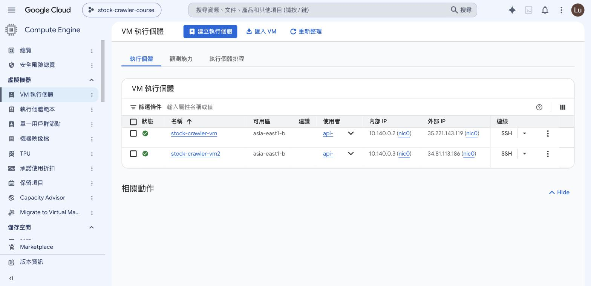

SSH 進 VM2，重演第 14 章的環境準備（裝 Docker → clone → build worker image）：

```bash
gcloud compute ssh stock-crawler-vm2 --zone=asia-east1-b

curl -fsSL https://get.docker.com | sudo sh   # 官方一鍵腳本；逐步安裝版見第 14 章 F-4
sudo usermod -aG docker $USER
git clone https://github.com/lu791019/stock-crawler-de-course-materials.git stock-crawler
cd stock-crawler && cp .env.example .env
sudo docker compose -f docker-compose-local.yml build worker_twse worker_tpex
```

到這裡兩台機器都就位了：VM1 是中樞、VM2 是勞力。worker 還沒啟動——它要連的資料庫還不存在，下一步先把資料庫生出來。

> **那 VM1 上舊 MySQL 容器裡的資料呢？** 留在原本的 volume 裡不動（Part A 的 `down` 只停容器，不刪 volume）。**Cloud SQL 從空的開始**——爬蟲重跑一次就會把資料寫進去，課程不搬舊資料。真實系統的資料庫搬遷要用 Database Migration Service 或 dump/import，是另一個題目。BigQuery 那半邊完全不受影響，raw 層從第 14 章累積至今的資料都還在。

### Part C：建立 Cloud SQL 實例

**C-1 啟用 API**（每個服務第一次用都要）：

```bash
gcloud services enable sqladmin.googleapis.com
```

同一件事的 Console 版：「≡ → API 和服務 → 程式庫」搜尋 Cloud SQL Admin API，點進去按「啟用」。啟用後這一頁會顯示綠勾「API 已啟用」——CLI 跑完回來看，狀態是同一個：

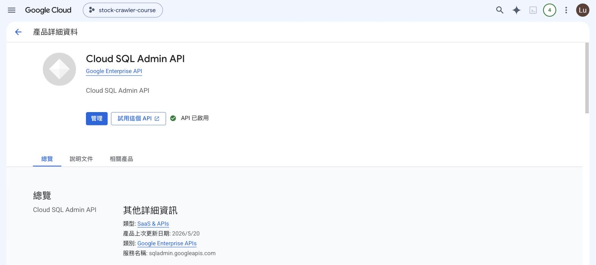

**C-2 建立實例**：

```bash
gcloud sql instances create stock-mysql \
  --database-version=MYSQL_8_0 \
  --tier=db-f1-micro \
  --region=asia-east1 \
  --root-password=1234
```

五個參數逐一對照（格式跟第 14 章 F-2 建 VM 那張表一樣）：

| 參數 | 本課程填的值 | 為什麼填這個 |
|------|-------------|-------------|
| （`create` 後的第一個值） | `stock-mysql` | 實例名稱，自取 |
| `--database-version` | `MYSQL_8_0` | 跟課程一路用的 MySQL 8.0 對齊 |
| `--tier` | `db-f1-micro` | 最小最便宜的規格，教學夠用 |
| `--region` | `asia-east1` | 跟 VM 同區，連線最快 |
| `--root-password` | `1234` | **刻意跟 `.env.example` 的預設一致**——這是等一下「程式一行都不用改帳密」的關鍵 |

- **建立要等約 10 分鐘**（Google 在幫你準備一台帶備份機制的資料庫伺服器），比開 VM 慢很多是正常的

**同一件事的 Console 版**（跟第 14 章建 VM 一樣，建議先用表單看懂每個欄位，實際建立用指令）。入口：「≡ → SQL」→ 藍色「**建立執行個體**」下拉 → 「**新增執行個體**」：

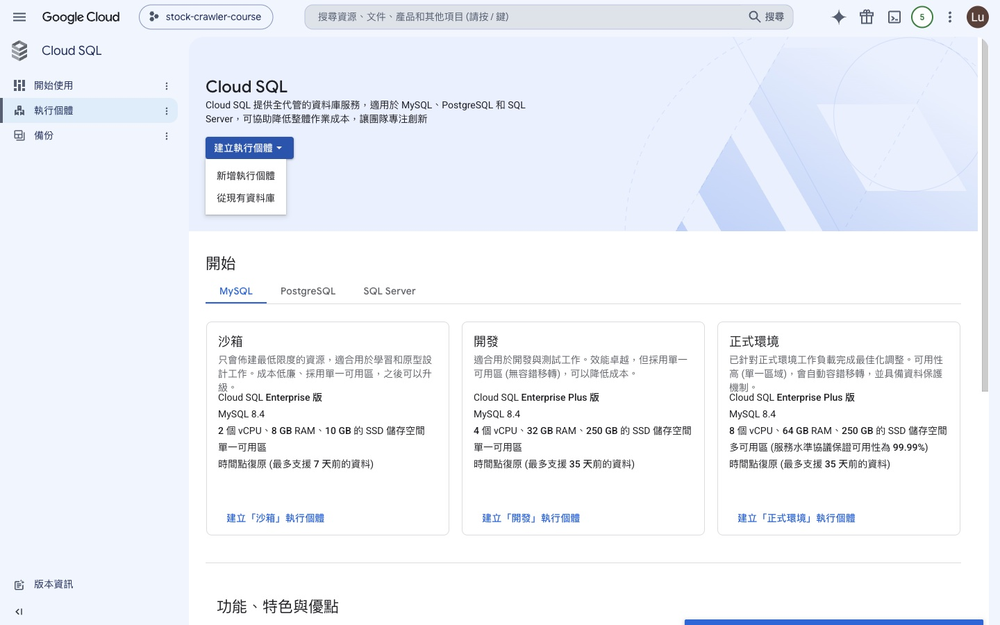

首頁還有「沙箱／開發／正式環境」三張快速建立卡，預設值（MySQL 8.4、大機型）與課程不符，**不要用快速卡**，走「新增執行個體」的完整表單。下一頁選擇資料庫引擎，按「**選擇「MySQL」**」：

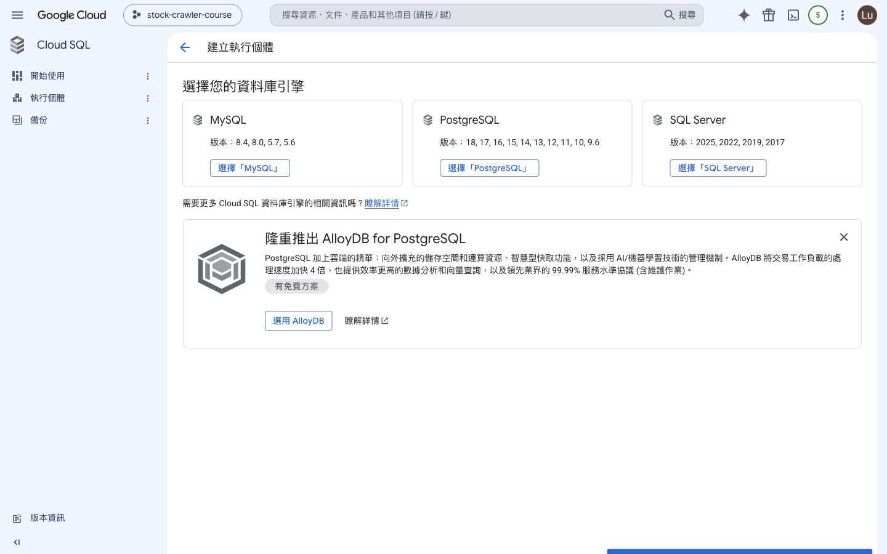

表單的預設值幾乎每一項都跟課程要的不同，逐項對照著改（每一項都對應 CLI 的一個參數）：

| 表單欄位 | 預設值 | 要改成 | 對應 CLI 參數 |
|---------|--------|--------|--------------|
| 選擇 Cloud SQL 版本 | Enterprise Plus | **Enterprise** | （tier 隱含） |
| 資料庫版本 | MySQL 8.4 | **MySQL 8.0** | `--database-version` |
| 執行個體 ID | 空 | `stock-mysql` | 第一個參數 |
| 區域 | us-central1（愛荷華州） | **asia-east1（台灣）** | `--region` |
| 可用區可用性 | 多可用區 | **單一可用區** | （課程規格不支援多可用區） |
| 機器設定 → 機器家族 | 一般用途 - 專屬核心 | **一般用途 - 共用核心** | `--tier` |
| 機器規格 | 1 vCPU，1.7 GB | **1 vCPU，0.614 GB** | `--tier=db-f1-micro` |

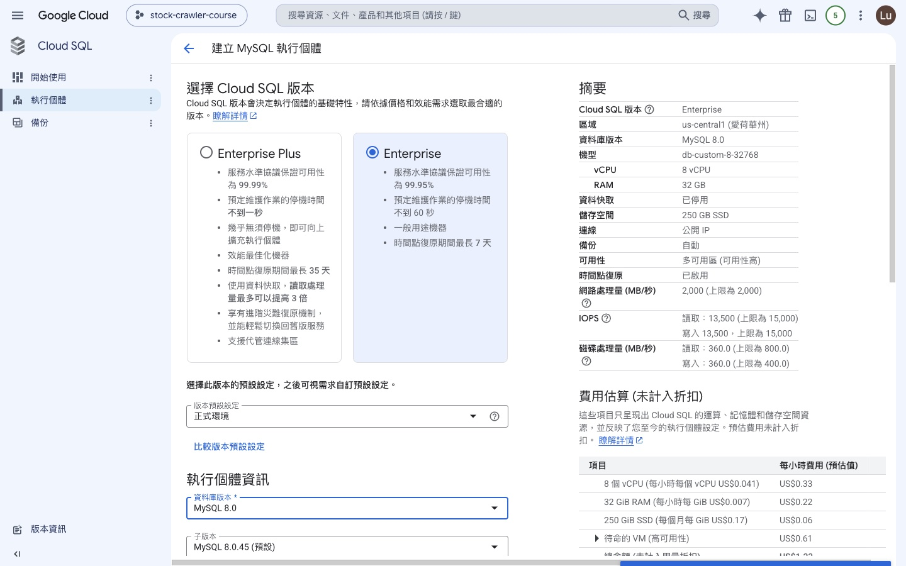

兩個表單才看得到的地方：

- **密碼欄的政策提示**：表單要求至少 8 個字元、含大小寫英文字母、數字和非英數字元——填課程的 `1234` 會出現紅字。這是表單的前端檢查，`gcloud` 的 `--root-password` 沒有這一關（課程主線用 CLI 就是 `1234`）。用表單建立的話，按「產生」讓它生一組合規密碼，再照 Part D 的做法交給 Secret Manager 保管。
- **右側「摘要」與「費用估算」即時更新**：每改一個欄位，右側的機型、區域和每小時費用馬上跟著變——這就是第 14 章說的「介面能看到所有選項和即時費用」。全部照表改完，摘要的「機型」列會顯示 `db-f1-micro`，每小時費用估算約 US$0.07：

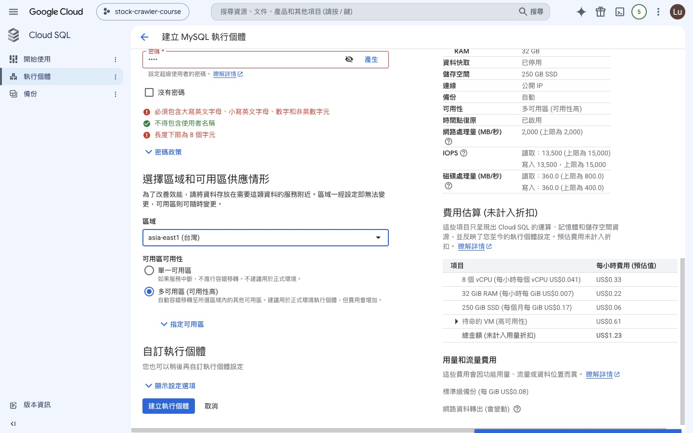

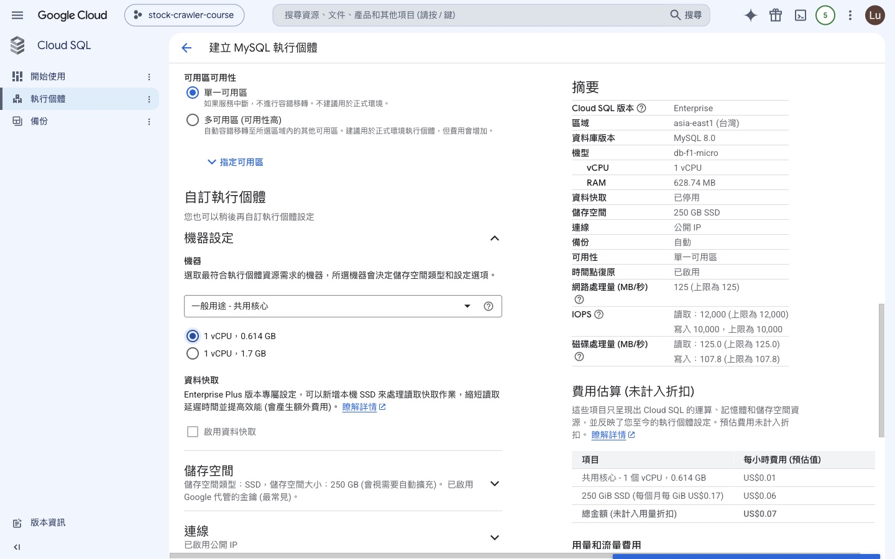

表單填完按最下方的「建立執行個體」就等於那條 `gcloud sql instances create`。**CLI 和表單擇一**——已經用指令建好的人，表單看到這裡按「取消」離開即可，不要建出第二顆。

- 完成後查狀態與 IP：

```bash
gcloud sql instances list
# NAME         DATABASE_VERSION  TIER         PRIMARY_ADDRESS   STATUS
# stock-mysql  MYSQL_8_0         db-f1-micro  35.xxx.xxx.xxx    RUNNABLE
```

`PRIMARY_ADDRESS` 就是 Cloud SQL 的 IP，抄進上面的表。

Console 上也看得到（≡ → SQL）：狀態綠勾＝RUNNABLE，公開 IP 位址就是剛才的 `PRIMARY_ADDRESS`：

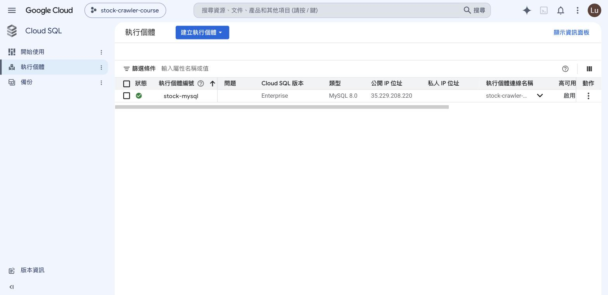

**C-3 授權網路＋建資料庫**：

Cloud SQL 預設誰都連不進來（跟 VM 防火牆同一個哲學）。把兩台 VM 的**外部 IP** 加進授權清單（值表這時候已經抄齊了——這就是「先開機器、再建資料庫」的理由），並建立課程用的資料庫：

```bash
gcloud sql instances patch stock-mysql \
  --authorized-networks={VM1外部IP}/32,{VM2外部IP}/32

gcloud sql databases create mydb --instance=stock-mysql
```

> 為什麼授權的是「外部 IP」？VM 連 Cloud SQL 的公網位址時，流量是從 VM 的外部 IP 出去的，Cloud SQL 看到的來源就是它。也因此：**VM 重開機換了外部 IP，就要回來重跑一次 patch**——這是本章排錯表的第一名。

patch 的結果在 Console 看得到：≡ → SQL → stock-mysql → 左側「連線設定」→「網路連線」分頁。「已授權網路」列出的兩筆 /32，就是兩台 VM 的外部 IP（之後想用滑鼠加 IP，也是在這頁按「新增網路」）：

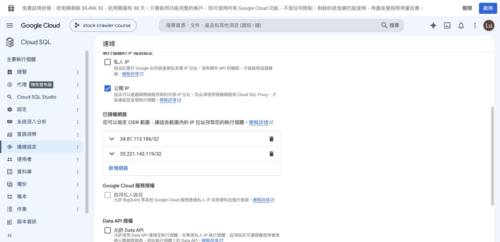

「新增網路」按下去就是 patch 指令的表單版——名稱自取（例如 `vm1`）、「IP 範圍」填 `{VM外部IP}/32`，按「完成」再按頁面底部的「儲存」，效果跟 `--authorized-networks` 相同：

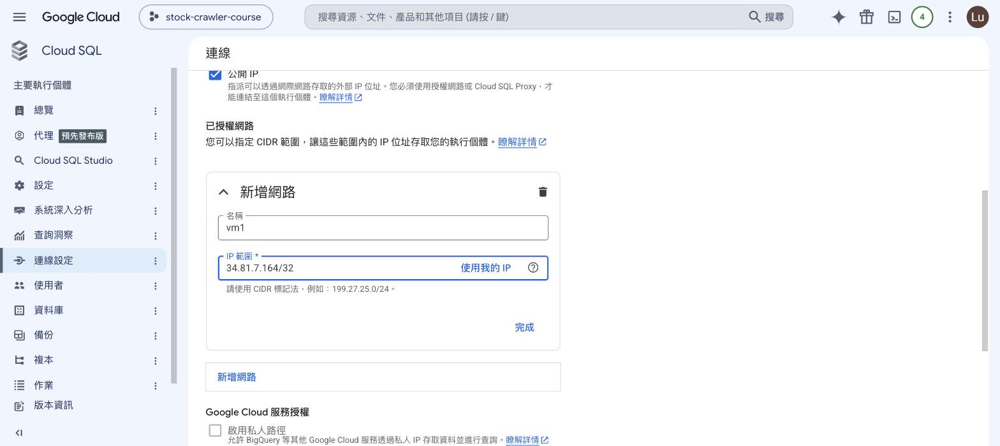

`databases create` 的 Console 版：SQL → stock-mysql → 左側「**資料庫**」——清單會多出 `mydb` 這一列（類型「使用者」，跟系統自帶的四個區分開；上方的「建立資料庫」按鈕就是同一條指令的表單版）：

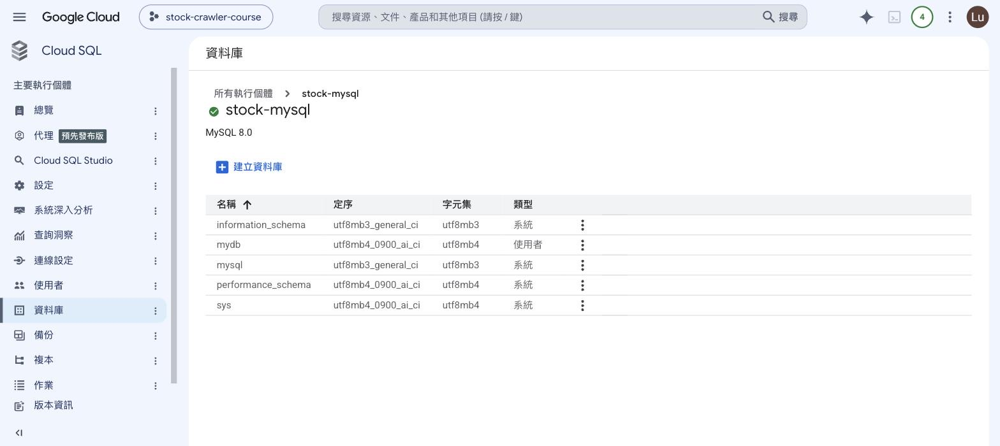

### Part D：把資料庫密碼交給 Secret Manager 保管

上一步建立 Cloud SQL 時，密碼 `1234` 直接寫在指令裡。這在本機沒問題（第 1 到 13 章都是這樣用的），但資料已經上雲，密碼的處理方式也該跟著調整。原因有三個：

1. 指令歷史會留下這個密碼（`history` 指令查得到）
2. 等一下 Part E 的 `.env` 如果要填密碼，那個檔案就會明碼放在 VM 的磁碟上
3. 之後要換密碼，每台機器的檔案都要各改一次

**Secret Manager 是 GCP 的密碼保管服務**：你把密碼存進去，程式執行時再跟它要。這是 `.env` 做法的雲端版本——`.env` 解決的是「密碼不進 git」，Secret Manager 再往前一步解決「密碼不留在機器上」。

補充G 教 `.env` 時就預告過這個服務，現在資料庫上雲了，正好是換過來的時機。

**D-1 啟用 API 並建立 secret**：

```bash
gcloud services enable secretmanager.googleapis.com

# 建立一顆名叫 mysql-password 的 secret，內容是 1234
# printf 不會在字串後面加換行；--data-file=- 表示「內容從管線讀進來」
# 這樣寫的好處是密碼不會出現在指令的參數裡，指令歷史不會留下它
printf "1234" | gcloud secrets create mysql-password \
  --data-file=- --replication-policy=automatic
```

同一件事的 Console 版：「≡ → 安全性 → Secret Manager」→ 上方「**+ 建立密鑰**」，名稱填 `mysql-password`、往下捲到「密鑰值」欄填 `1234`，其餘（類型、複製政策、加密）全部維持預設，按「**建立密鑰**」：

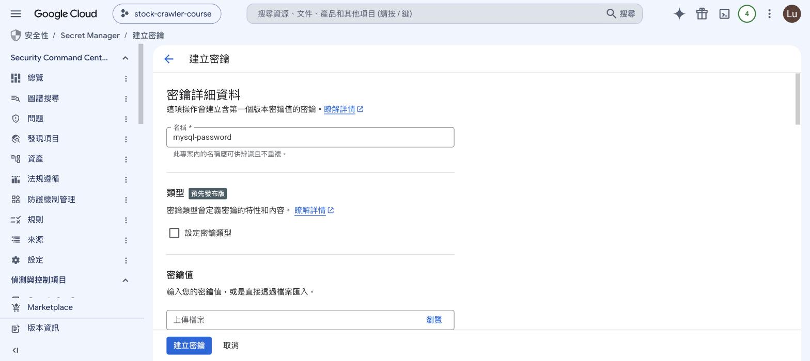

建立成功後，清單會出現 `mysql-password`。注意清單只列**名稱與屬性**（位置、加密方式、建立時間），**看不到密碼的值**——要看值得點進去、展開特定版本，而且那個動作會留下稽核紀錄：

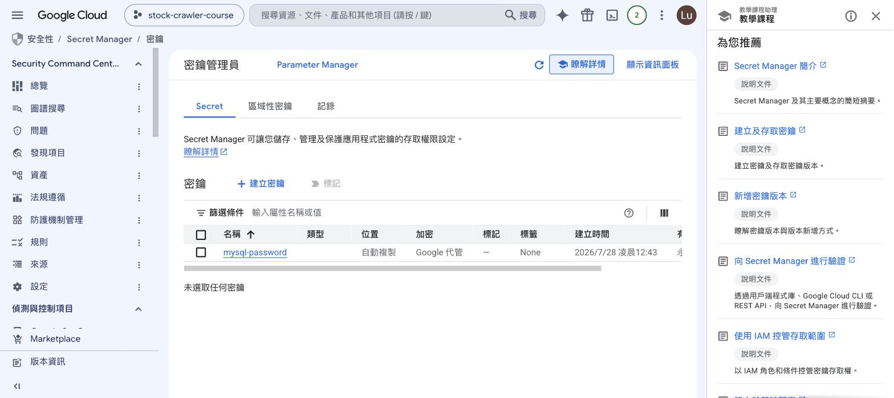

點進去的「版本」分頁此時只有版本 1（D-4 之後這頁會累積出輪替軌跡，見後面的版本清單截圖）。

**D-2 授權兩台 VM 讀取這顆 secret**：

VM 上的程式要讀 secret，得先取得權限。這裡用第 15 章學過的 IAM 授權，但範圍不一樣。兩台 VM 用同一個 Compute Engine 預設服務帳戶，授權一次就涵蓋兩台：

```bash
# 先查出專案編號（跟專案 ID 不同，是一串數字）
gcloud projects describe {你的專案ID} --format="value(projectNumber)"

# 授權 VM 的預設服務帳戶讀取這顆 secret
gcloud secrets add-iam-policy-binding mysql-password \
  --member="serviceAccount:{專案編號}-compute@developer.gserviceaccount.com" \
  --role="roles/secretmanager.secretAccessor"
```

專案編號在 Console 首頁也查得到：≡ → 資訊主頁，「專案資訊」卡列著專案名稱、**專案編號**、專案 ID 三項——`projects describe` 撈的就是中間那格：

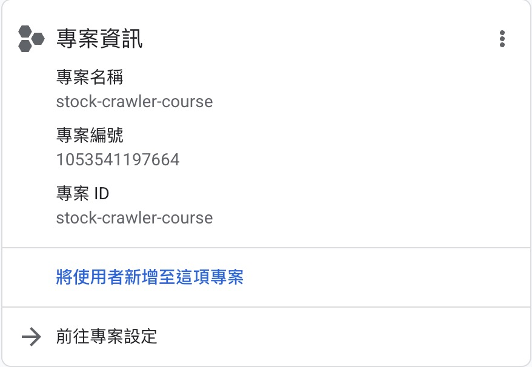

跟第 15 章的授權比較，差別在**範圍**：

| | 第 15 章 | 這裡 |
|---|---------|------|
| 指令 | `gcloud projects add-iam-policy-binding` | `gcloud secrets add-iam-policy-binding` |
| 後面接的對象 | 專案名稱 | `mysql-password` 這一顆 secret |
| 權限生效範圍 | 整個專案 | 只有這顆 secret |

這是最小權限原則更精確的做法：**角色收到最小**（`secretAccessor` 只能讀取內容，不能修改、刪除，也不能列出其他 secret），**範圍也收到最小**（單一資源，不是整個專案）。

要注意的是，VM 的預設服務帳戶雖然掛著 Editor 這個涵蓋很廣的角色，但 **Editor 不包含讀取 secret 內容的權限**。不做這一步授權，程式讀 secret 會被 403 拒絕。

同一件事的 Console 版：Secret Manager → `mysql-password` → 「**權限**」分頁 → 「**授予存取權**」，新增主體填 `{專案編號}-compute@developer.gserviceaccount.com`、角色搜尋選「**Secret Manager 密鑰存取者**」（描述寫著「可存取密鑰的酬載」——正是 `secretAccessor` 的中文名）後儲存：

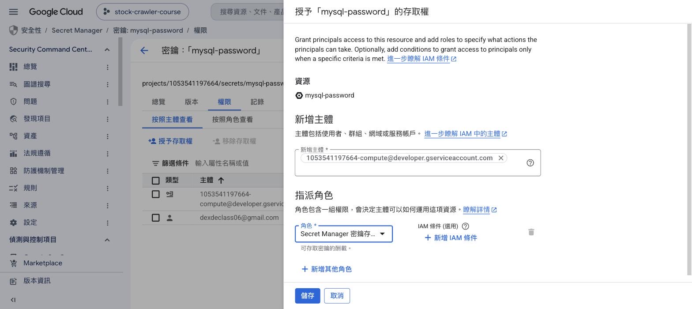

授權完成後這一頁會多出那一列：

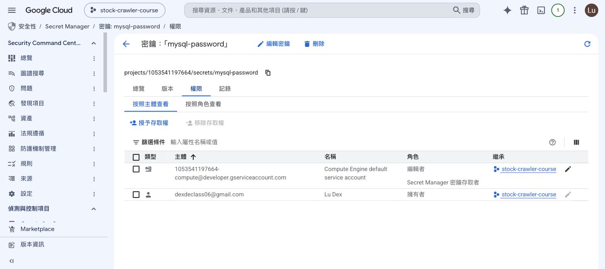

**D-3 驗證**：

```bash
# 在你自己的電腦上（你是專案 Owner，本來就讀得到）
gcloud secrets versions access latest --secret=mysql-password
# 1234

# SSH 進 VM1 再執行一次（這次用的是 VM 服務帳戶的身分，證明 D-2 的授權生效）
gcloud compute ssh stock-crawler-vm --zone=asia-east1-b
gcloud secrets versions access latest --secret=mysql-password
# 1234
```

在 VM1 或 VM2 驗都可以——兩台掛的是同一個 Compute Engine 預設服務帳戶，一台通過就代表授權對兩台都生效。

`versions access` 的 Console 版：點進 `mysql-password` → 「**版本**」分頁 → 版本 1 那列右側「**⋮**」→「**查看密鑰值**」，對話框直接顯示這一版的值：

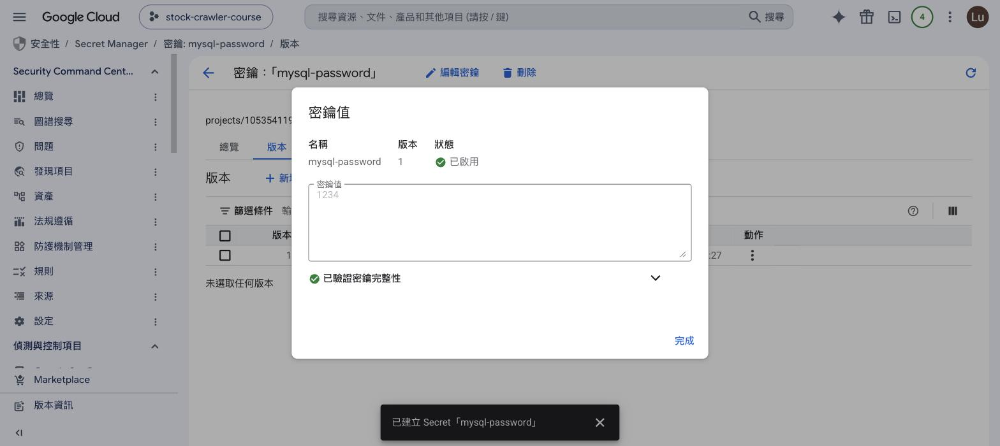

注意這個動作跟 CLI 的 `versions access` 一樣會留在稽核紀錄裡——「誰在什麼時候讀過密碼」查得到，這是 Secret Manager 相對 `.env` 手抄密碼的關鍵差異。

**D-4 部署時取出——密碼從 Secret Manager 寫進 `.env`**：

程式讀密碼的方式**維持原樣**：`config.py` 的 `MYSQL_PASSWORD = os.environ.get("MYSQL_PASSWORD", "1234")`，只認環境變數。要換的是 **`.env` 裡那個值從哪裡來**——不再手打密碼，用指令當場向 Secret Manager 取出、寫進 `.env`（跟第 14 章 H-3 寫 `GCP_PROJECT_ID` 同一套做法）。

**這套動作在哪台機器做？判斷方式：哪台機器的容器要連 MySQL，就在哪台做。** 本章的答案是**只有 VM2**——要連 Cloud SQL 的是 VM2 上的 worker；VM1 上的 Airflow、RabbitMQ、Flower 都不連 MySQL，**VM1 不用做這一步**。所以這裡先把三個步驟講清楚，實際執行的位置在 Part E：VM2 完成 `.env` 接線後，緊接著就是這套 ①②③。

```bash
# 在 VM2 的 ~/stock-crawler
# ① 先刪掉既有的 MYSQL_PASSWORD 行——第一次執行時檔案裡沒有這行，這條只是讓重跑安全
sed -i '/^MYSQL_PASSWORD=/d' .env

# ② 取出最新版密碼、附加到 .env
#    $(...) 會先執行括號裡的指令、把輸出當值寫進去
echo "MYSQL_PASSWORD=$(gcloud secrets versions access latest --secret=mysql-password)" >> .env

# ③ 啟動（或重建）需要這個密碼的容器——compose 的插值會從 .env 讀到密碼
#    本章要起的是 worker（--no-deps 的理由見 Part E；密碼輪替後重跑的也是這一條）
sudo docker compose -f docker-compose-local.yml up -d --no-deps worker_twse worker_tpex
```

這個做法的分工：**Secret Manager 是密碼的唯一真實來源，`.env` 是部署那一刻取出的落地值**。程式一行不改、不裝任何 SDK；取出動作用的是「執行指令的機器」的身分——在 VM 上就是 D-2 授權的服務帳戶。整個流程你**沒有手打過密碼**：不經鍵盤、不經聊天室，指令歷史裡也只有 `$(...)` 這串文字，不是密碼的值。`.env` 本身在 `.gitignore` 裡（第 14 章步驟 6 的規矩），不會進 repo。

**換密碼＝新增版本＋重新取出＋up。** 團隊環境密碼會需要輪替（組員退出專題、密碼外流）。流程兩步，**注意在不同機器執行**：

**（在你自己的電腦）** 新增一個版本——`versions add` 是新增版本，`latest` 會自動指向最新這一版：

```bash
printf "{新密碼}" | gcloud secrets versions add mysql-password --data-file=-
# Created version [10] of the secret [mysql-password].
```

**（SSH 進 VM2——跑 worker 的機器）** 重跑 D-4 的 ①②③（刪舊行 → 取出寫入 → up），容器就會拿到新值。哪幾台要重跑，判斷方式跟 D-4 相同：哪台的容器連 MySQL 就重跑哪台——本章只有 VM2。驗證直接看容器的環境變數：

```bash
sudo docker exec {容器名} env | grep MYSQL_PASSWORD
# MYSQL_PASSWORD={新密碼}     ← 值來自 Secret Manager 的 latest
```

一個要記住的行為：**`docker restart` 拿不到新密碼**——環境變數是容器「建立」時由 compose 插值寫入的，restart 只是重開同一個容器；要拿新版本就重跑 ①②③（compose 偵測到 `.env` 的值變了，`up -d` 會自動重建容器）：

```bash
sudo docker restart {容器名}   # ← 容器內 MYSQL_PASSWORD 還是舊值
# 重跑 D-4 的 ①②③            # ← 這才會換新值
```

Console 上可以看到累積的所有版本（≡ → 安全性 → Secret Manager → 點 mysql-password → 版本分頁）。每個版本都保留著，可以停用、也可以切回舊版——這頁就是密碼輪替的軌跡：

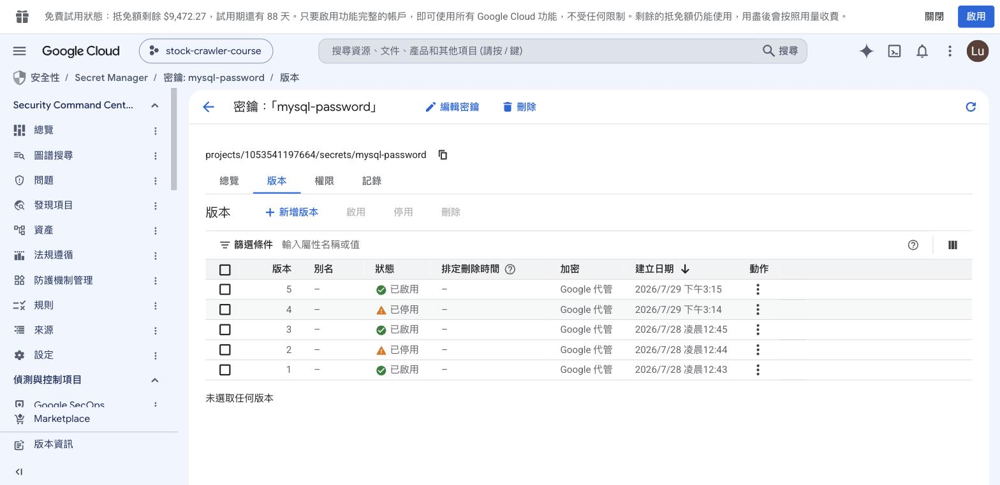

> 補充：`crawler/config.py` 裡有一段註解掉的 Secret Manager 讀取程式碼（程式執行時自己去讀 secret、失敗就 fallback 回預設值）。那是另一種做法，代價是程式要裝 SDK、且失敗時靜默改用預設密碼不報錯——課程採用部署時注入，把密碼問題留在部署層、程式保持乾淨。

### Part E：`.env` 接線——「只改三行」的實作

worker 在 compose 檔裡的連線目標長這樣（打開 `docker-compose-local.yml` 看 worker 的 environment 段）：

```yaml
- RABBITMQ_HOST=${RABBITMQ_HOST:-rabbitmq}
- MYSQL_HOST=${MYSQL_HOST:-mysql}
- MYSQL_PASSWORD=${MYSQL_PASSWORD:-1234}
- GCP_PROJECT_ID=${GCP_PROJECT_ID:-}
```

`${變數:-預設值}` 是 compose 的**插值**：up 的當下，**同目錄的 `.env`（或 shell 環境）有設這個變數就用設的值，沒設就用預設值**。預設值全是「大家都在同一台」的容器名——所以 1 到 13 章在本機什麼都不用設，行為就是同機互連。

現在 RabbitMQ 在別台、MySQL 在 Cloud SQL，**把 VM2 的 `.env` 打開，告訴它新目標在哪**（B 段 `cp .env.example .env` 複製好的檔案裡，這三行本來就以註解形式等在那裡，打開改值即可）：

```bash
# 在 VM2 的 ~/stock-crawler 下，把三個連線目標寫進 .env（第 14 章 H-3 的同一套做法）：
echo "RABBITMQ_HOST={VM1內部IP}" >> .env       # 例：10.140.0.2——同 VPC 用內部 IP
echo "MYSQL_HOST={CloudSQL IP}" >> .env        # 例：35.229.208.220
echo "GCP_PROJECT_ID=$(gcloud config get-value project)" >> .env   # 雙寫的 BigQuery 半邊（第 15 章讀碼段⓪）

tail -3 .env    # 核對寫進去的值
```

`.env.example` 的模板裡這三行以註解形式存在——`echo` 直接補在檔尾即可，compose 只認沒被註解的行。

一句話總結這個設計：**同一份 compose 檔走遍本機和雲端，每台機器的連線目標由它自己的 `.env` 決定**——第 6 章「設定集中管理」的完整版。四個值的**來源**值得注意：兩個 HOST 抄自 `instances list`、專案 ID 問 `gcloud config`、密碼向 Secret Manager 要——**沒有一個值是憑記憶手打的**，這就是設定管理的紀律：每個值都有可查證的出處。

第四行是密碼——D-4 講好的 ①②③ 在這裡實際執行（本章唯一要連 MySQL 的機器就是 VM2）：

```bash
sed -i '/^MYSQL_PASSWORD=/d' .env
echo "MYSQL_PASSWORD=$(gcloud secrets versions access latest --secret=mysql-password)" >> .env

sudo docker compose -f docker-compose-local.yml up -d --no-deps worker_twse worker_tpex

sudo docker logs crawler_twse --tail 5
```

預期看到兩行關鍵 log：

```
Connected to amqp://worker:**@{VM1內部IP}:5672//
twse@xxxx ready.
```

worker 跨機器連上了 VM1 的 RabbitMQ。`--no-deps` 的意思是「只啟動我指定的服務」——不加的話，compose 會照 `depends_on` 把本機的 rabbitmq 也一起啟動（worker 實際連的是 VM1，本機這顆只會佔用記憶體）。

注意這裡沒有動任何防火牆設定，內部 IP 互連走的是 `default-allow-internal` 這條預設規則。**整次搬家，程式碼一行都沒改；改動就是 `.env` 的四行——三個連線目標加一行從 Secret Manager 取出的密碼。**

兩個驗證——連線值真的進了容器、密碼真的來自 Secret Manager：

```bash
# 在 VM2 上：三個 .env 的值都在容器環境裡
sudo docker exec crawler_twse env | grep -E "RABBITMQ_HOST|MYSQL_HOST|GCP_PROJECT_ID"

sudo docker exec crawler_twse env | grep MYSQL_PASSWORD
# MYSQL_PASSWORD={secret 目前的值}
```

secret 的值跟預設一樣是 1234 時看不出來源——照 D-4 的輪替流程加一個好辨識的版本（例如 `sm-test-42`）、重跑 ①②③、再看一次 env，值變了就證明是 Secret Manager 來的；測完記得把版本換回來。

> 對照：第 12 章教過「compose 檔 `environment:` 寫死的值會蓋過 env_file」——當時的結論是 environment 優先。現在 environment 這一側自己變成了插值，值的來源反轉成「`.env` → 插值 → 容器」，這正是插值跟 env_file 的差別：env_file 是「另一個給值的來源（會被 environment 蓋掉）」，插值是「environment 自己開的洞」。

### Part F：跨機器端到端——從 Airflow 出發

發任務照第 14 章 Part J 的方式：**VM1 的 Airflow 觸發 producer DAG**。瀏覽器開 `http://{VM1外部IP}:8081`（防火牆規則第 14 章開過、規則綁標籤不用重設；IP 換了網址跟著換），unpause `stock_crawler_producer_dag` 後按 ▶ 觸發；或在 VM1 上用指令：

```bash
# 在 VM1 上
sudo docker exec airflow-scheduler airflow dags trigger stock_crawler_producer_dag
```

到 VM2 確認 worker 消化（十支股票都發到 twse 佇列，單一 worker 逐筆處理，全部做完約一兩分鐘）：

```bash
# 在 VM2 上
sudo docker logs crawler_twse 2>&1 | grep -c succeeded    # 期望 10
```

驗資料真的進了 Cloud SQL（用一次性的 mysql 客戶端容器，用完即丟）：

```bash
# 在 VM2 上
sudo docker run --rm mysql:8.0 \
  mysql -h{CloudSQL IP} -uroot -p1234 -N \
  -e "SELECT COUNT(*) FROM mydb.TaiwanStockPrice;"
```

有筆數就是全通：**Airflow 在 VM1 發任務、佇列把任務送到 VM2、worker 把資料寫進 Cloud SQL**——三個零件在三個地方，協作靠的是第 1 章就認識的訊息佇列。表是 to_sql 自動建的，跟第 5 章在本機第一次寫入時一模一樣。

> 排錯備忘：Cloud SQL 剛從停用喚醒（或剛建好）的前一兩分鐘，worker 可能報 `Can't connect ... Connection refused`——實例還在暖機。等它穩定後重新觸發一次 DAG 即可；先用 `SELECT 1` 確認連得上再發任務可以避開這個時間差。

雙寫的另一半也要驗——**BigQuery 那份在搬家後照常落地**（比對發任務前後的筆數，或看 worker log 的「資料已上傳到 BigQuery」）：

```bash
# 在 VM2（或任何登入 gcloud 的機器）上
bq query --use_legacy_sql=false "SELECT COUNT(*) AS cnt FROM raw.TaiwanStockPrice"
```

筆數比發任務前多，證明「先搞懂」藍圖那條虛線成立：**搬家動的是 MySQL 的位置，BigQuery 的資料線從第 14 章到現在沒有斷過、也沒改過任何設定**——這就是雙寫架構在搬家日的價值。

跨機分工在 Flower 上也看得到：瀏覽器開 `http://{VM1外部IP}:5555`——Flower 跑在 VM1，列出的兩個 worker 卻是 VM2 上的容器（worker 名稱 @ 後面的主機碼跟 VM1 不同台），各自 Succeeded 1 筆：

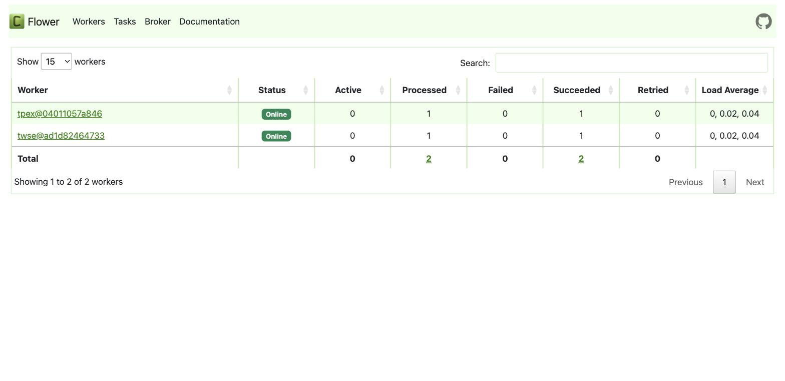

**用 Console 的圖形介面查資料——Cloud SQL Studio**：≡ → SQL → **點執行個體名稱 stock-mysql 進入詳情頁** → 左側選單的「Cloud SQL Studio」。

**找不到 Cloud SQL Studio？三種情況逐一排查**：

1. **你還在執行個體清單頁**。清單頁的左側選單只有「開始使用／執行個體／備份」三項，**沒有** Cloud SQL Studio——它是執行個體層級的功能，要先點執行個體名稱進入詳情頁，左側選單才會變成「總覽／Cloud SQL Studio／設定／…／使用者／資料庫」這一組：

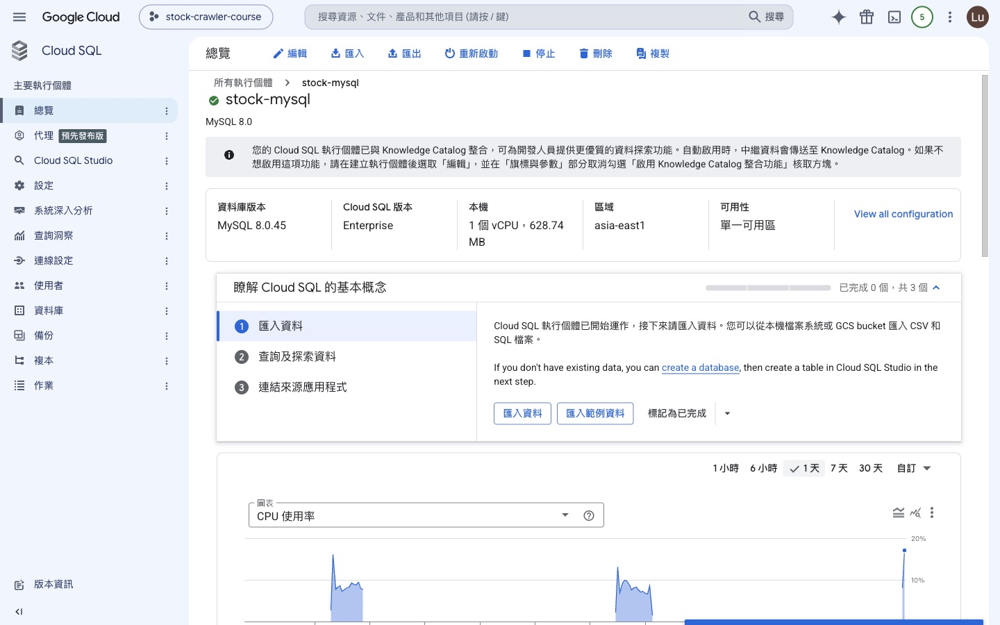

2. **執行個體停止中**。選單項目還在，但點進去會顯示「**這個執行個體並未執行，因此您目前無法存取 Cloud SQL Studio。**」，「驗證」按鈕也是灰的。收工停用實例之後回來想查資料就會遇到這個畫面——先把實例啟動（`gcloud sql instances patch stock-mysql --activation-policy=ALWAYS`，或詳情頁上方的「啟動」按鈕），等狀態變回 RUNNABLE 再進 Studio：

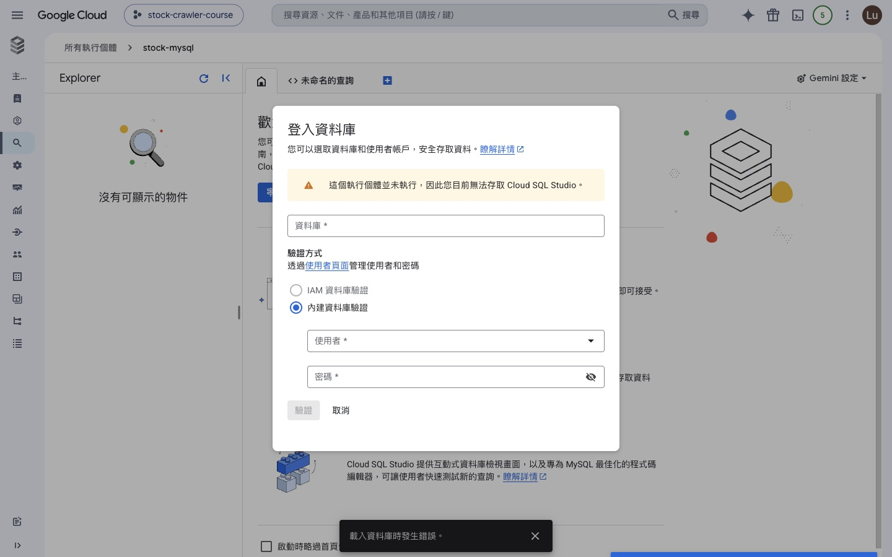

3. **執行個體已刪除**。清單是空的，自然沒有東西可點——本章結尾刪過實例的人，要先回 C-2 重建。

進得去之後還有一個坑：登入對話框的使用者下拉裡，**root 是灰色不可選的**（顯示「不支援 'root'@'%'」）——Studio 不開放 root 帳號登入，這是它的安全限制：

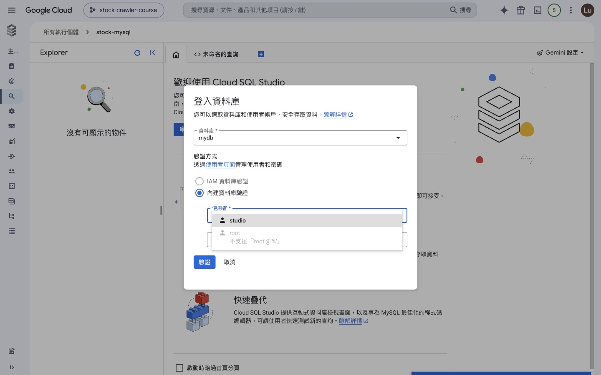

解法是先用 gcloud 建一個一般使用者（`--host=%` 要明確給，不給的話 host 是空值，Studio 一樣拒收）：

```bash
gcloud sql users create studio --instance=stock-mysql --password=1234 --host=%
```

回到 Studio 重新整理頁面，登入資料庫選 `mydb`、使用者選 `studio`、密碼 `1234` → 驗證。左側 Explorer 會列出 mydb 的資料表，開一個 SQL 編輯器分頁直接下查詢：

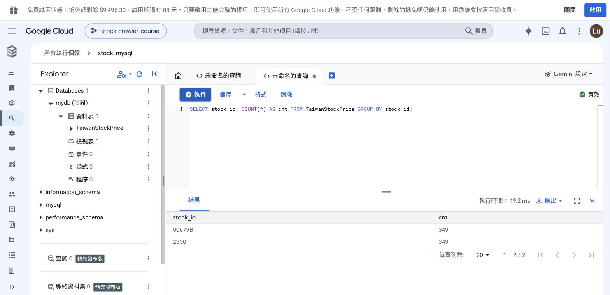

託管服務自帶管理介面，phpMyAdmin 在雲端段就退役了。

## Cloud SQL vs BigQuery：營運面的對照

第 15 章從「同一筆資料的兩個命運」比過 OLTP 與 OLAP 的概念差異；本章兩者你**都營運過了**——建過實例、設過授權、付過（試用額度的）錢。現在從營運者的角度再比一次，這張表的每一列你都有第一手經驗：

| 營運面 | Cloud SQL（本章） | BigQuery（第 15 章） |
|---|---|---|
| 「開機器」這件事 | 有——建實例選機型（db-f1-micro），約 10 分鐘 | 沒有——沒有實例概念，開個 dataset 就能寫 |
| 連線方式 | IP＋授權網路（你 patch 過的 authorized-networks）＋帳號密碼 | 無連線設定——走 API，身分即通行證（VM 身分或金鑰） |
| 授權模型 | 資料庫自己的帳號系統（root、studio……）＋網路白名單 | 全走 GCP IAM（第 15 章 T-2 給組員的兩個角色） |
| 計費邏輯 | **機器開多久**——實例跑著就計費，跟你查不查無關 | **掃描多少**——不查就近乎免費，儲存費另計但很小 |
| 「下課停機」動作 | 必要：`--activation-policy=NEVER`，忘了就一直燒 | 不存在這個動作——沒有可以停的機器 |
| 停機的代價 | 停用期間完全不能查 | ——（永遠在線） |
| 擴充方式 | 換更大的機型（要重啟）、加唯讀副本 | 自動——你從沒設定過它的算力 |
| 密碼／機密 | 有 root 密碼要管（本章 Secret Manager 的主角） | 沒有密碼這種東西 |

一句話收斂：**Cloud SQL 是「託管的機器」，BigQuery 是「無伺服器的服務」**——前者你還看得到機器的影子（機型、IP、開關機），後者連機器的概念都被抽走了。這條光譜上還有一種更特別的動物，下一節開一台來看。

## 動手開一台 Cloud Spanner（Bonus）——分散式資料庫長什麼樣

Cloud SQL 是「一台託管的 MySQL」；**Cloud Spanner 是 Google 自研的分散式關聯式資料庫**——資料自動分片到多台機器、跨節點仍保有 SQL 交易與強一致性，Google 自家的廣告、Gmail 底層都跑它。它解的是 Cloud SQL 的天花板：單機 MySQL 撐不住的規模（水平擴充）與「升級要重啟」的停機窗。

Spanner 有 **90 天免費試用 instance**（不扣試用額度、不會產生費用）。這一節開一台，讓**真的爬蟲資料流進去**——用跟搬家同一套辦法（`.env` 加開關、Airflow 發任務），再做兩個「Cloud SQL 做不到」的實驗。

**這一節是 Bonus**：主線的雙寫與後續章節都不依賴它，跳過不影響第 17 章。另外注意免費試用 instance **每個專案終身只有一次**——專案已經開過（即使刪掉了）就無法再開；做不了的話，把 S-4 的兩個實驗結論與 S-5 的對照表讀懂，這一節的目的就達成了。要真的動手也可以開最小的付費 instance（`--processing-units=100`，從試用額度扣、按小時計，做完刪除即停止計費）。

> **動手前的三個限制先知道**（免費試用版）：
> 1. **每個專案終身只有一次**——刪掉不會退還額度，這台開了就別隨手刪（反正它不計費，90 天到期會自動停用）
> 2. 10GB 儲存、算力固定（不能調）、不支援備份還原
> 3. 單區域限定；到期後有 30 天寬限期可升級成付費版保資料

**S-1 啟用 API 並建立試用 instance**：

```bash
gcloud services enable spanner.googleapis.com

gcloud spanner instances create stock-spanner-trial \
  --config=regional-asia-east1 \
  --description="course trial" \
  --instance-type=FREE_INSTANCE
```

約半分鐘建好（對照 Cloud SQL 的 10 分鐘）。確認狀態與到期日：

```bash
gcloud spanner instances describe stock-spanner-trial \
  --format="value(state,instanceType,freeInstanceMetadata.expireTime)"
# READY  FREE_INSTANCE  {90天後的日期}
```

Console 上核對（≡ → Spanner → 點執行個體名稱）。這一頁把免費試用版的三個特徵都攤在同一張表裡：設定是 `asia-east1（台灣）`＝建立時 `--config=regional-asia-east1` 的單一區域、資源調度模式是「手動分配」、還有一列**「Spanner 免費試用執行個體到期日」**——上面那條指令查到的日期，介面版在這裡：

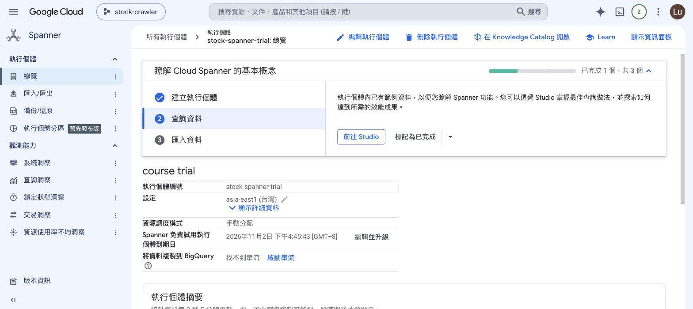

**S-2 建資料庫與表——SQL 幾乎一樣，主鍵長在不一樣的地方**：

建的表用跟 MySQL 那張同名同欄位的 `TaiwanStockPrice`（等一下爬蟲要直接寫進來）：

```bash
gcloud spanner databases create stockdb --instance=stock-spanner-trial \
  --ddl='CREATE TABLE TaiwanStockPrice (
    stock_id STRING(16) NOT NULL,
    date DATE NOT NULL,
    Trading_Volume INT64,
    Trading_money INT64,
    open FLOAT64,
    max FLOAT64,
    min FLOAT64,
    close FLOAT64,
    spread FLOAT64,
    Trading_turnover INT64
  ) PRIMARY KEY (stock_id, date)'
```

跟 MySQL 的差異很明顯：型別叫 `STRING(16)`／`FLOAT64`／`INT64`（Spanner 的 GoogleSQL 方言），而且 **`PRIMARY KEY` 寫在括號外面**——因為主鍵在 Spanner 不只是唯一性約束，它決定**資料怎麼分片到多台機器**（相近主鍵的列存一起）。設計主鍵＝設計資料分佈，這是分散式資料庫跟單機資料庫思維上的第一個分歧點。

**S-3 讓真的爬蟲資料流進來——`.env` 加兩行、Airflow 發一次任務**：

爬蟲任務裡有第三個寫入口：`upload_data_to_spanner_if_configured(df)`。它的開關跟雙寫的 BigQuery 半邊同一套設計——沒設 `SPANNER_INSTANCE` 就什麼都不做（1 到 15 章一路都是這個狀態），設了才寫。

設了之後，同一份資料會落進三個地方，而三邊的**寫入語義各不相同**：

| 目的地 | 寫法 | 同一天重跑會怎樣 |
|--------|------|-----------------|
| Cloud SQL | `to_sql(if_exists="append")` | 疊一份重複 |
| BigQuery raw | 批次 load，`WRITE_APPEND` | 疊一份重複（raw 的天性） |
| **Spanner** | `insert_or_update`（主鍵 upsert） | **筆數不變**，同股同日只有一列 |

第三欄就是等一下 S-3 末尾要對照的東西——`crawler/spanner.py` 只有這一個關鍵差異。

在 **VM2** 的 `.env` 再加一行、重跑 up：

```bash
# VM2 的 ~/stock-crawler
echo "SPANNER_INSTANCE=stock-spanner-trial" >> .env
# （instance 開在別的專案才需要 SPANNER_PROJECT_ID；同專案不用設）

sudo docker compose -f docker-compose-local.yml up -d --no-deps worker_twse worker_tpex
```

回 VM1 的 Airflow 再觸發一次 `stock_crawler_producer_dag`，VM2 的 worker log 會多一行：

```
資料已 upsert 到 Spanner 表 'TaiwanStockPrice'，共 XXX 筆記錄
```

查 Spanner 裡的筆數（在你自己的電腦或 VM 都可以）：

```bash
gcloud spanner databases execute-sql stockdb --instance=stock-spanner-trial \
  --sql="SELECT COUNT(*) AS n, COUNT(DISTINCT stock_id) AS stocks FROM TaiwanStockPrice"
```

連跑兩次 DAG 就看得出差別：Spanner 的筆數**第二次不會再增加**（upsert 以主鍵去重，同一支股票同一天只有一列），Cloud SQL 與 BigQuery raw 則是各疊一輪。同一批資料寫進三種資料庫，寫入語義的差別在筆數上直接看得到。體驗完把 `.env` 那行拿掉（`sed -i '/^SPANNER_INSTANCE=/d' .env`）、重跑 up，爬蟲就回到雙寫。

用滑鼠查同一份資料——Console 的 **Spanner Studio**（≡ → Spanner → 執行個體 → 資料庫 → 左側「Spanner Studio」）。左側 Explorer 展開 `Schemas → Default → Tables` 就是 S-2 建的 `TaiwanStockPrice`，右邊開一個查詢分頁下 SQL：

```sql
SELECT stock_id, date, open, close, Trading_Volume
FROM TaiwanStockPrice WHERE stock_id = '2330' ORDER BY date DESC LIMIT 10
```

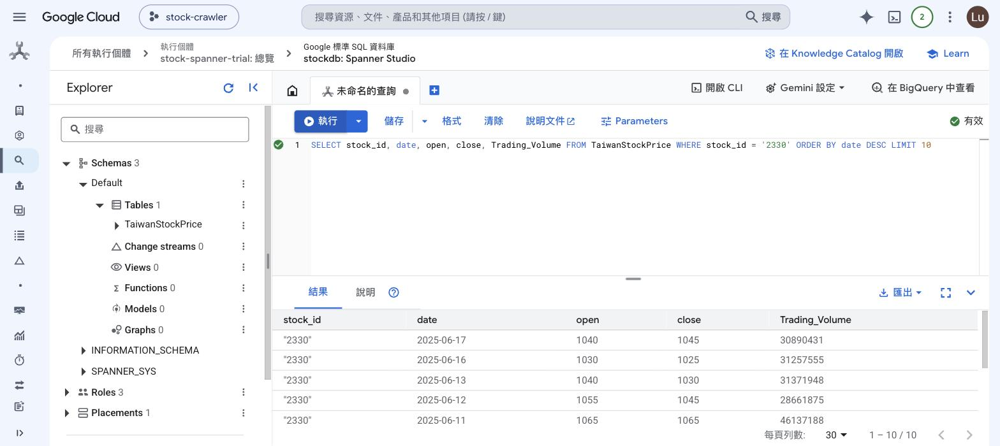

這張畫面跟 Part F 的 Cloud SQL Studio 是同一個角色——託管服務自帶的查詢介面。差別在方言：這裡跑的是 GoogleSQL，不是 MySQL 的 SQL。

**S-4 兩個「Cloud SQL 做不到」的實驗**：

**實驗①：改 schema 不鎖表**。對正在服務的表加欄位：

```bash
gcloud spanner databases ddl update stockdb --instance=stock-spanner-trial \
  --ddl='ALTER TABLE TaiwanStockPrice ADD COLUMN ma5 FLOAT64'
```

Spanner 的 schema 變更是**線上作業**——執行期間讀寫照常，不鎖表、不停機。MySQL 的大表 `ALTER TABLE` 歷來是維運的難題（鎖表時間隨資料量成長）；Spanner 把它變成背景工作。

**實驗②：調算力不用重啟——但免費版會告訴你另一件事**：

```bash
gcloud spanner instances update stock-spanner-trial --processing-units=200
# ERROR: The field instance.processing_units cannot be set for free instances.
```

被拒了——免費試用版的算力是固定的。但這條指令在**付費版**上會直接生效：Spanner 的算力單位叫 **processing units（PU）**，調整時**不用停機、不用重啟、連線不中斷**——對照 Cloud SQL 換機型要重啟的停機窗，這是兩者在「擴充」這件事上的本質差異。免費版擋下這條指令的錯誤訊息，順便讓你看清楚「免費體驗」與「生產能力」的界線在哪。

**S-5 對照表——什麼時候用誰**：

| | Cloud SQL | Cloud Spanner |
|---|---|---|
| 本質 | 託管的**單機** MySQL/PostgreSQL | Google 自研的**分散式**關聯式資料庫 |
| 擴充 | 垂直為主（換機型，要重啟）＋唯讀副本 | 水平（調 PU／加節點，**不停機**） |
| 規模上限 | 單機的天花板（數 TB 級） | 近乎無上限（PB 級、全球分佈） |
| schema 變更 | 大表 ALTER 可能鎖表 | 線上變更，不鎖表 |
| 相容性 | 就是 MySQL——現有程式、工具直接用 | GoogleSQL／PostgreSQL 方言——`pymysql` 不能直連，要換 client |
| 價格量級 | db-f1-micro 一個月十幾美元起 | 最小正式配置一個月百美元級起跳 |
| 適用 | 中小規模、想沿用 MySQL 生態 | 超大規模、全球多區、不能停機的關鍵系統 |

課程的爬蟲該搬去 Spanner 嗎？**不該**——資料量離 Cloud SQL 的天花板遠得很，而且 worker 用的 `pymysql`＋SQLAlchemy 生態直接可用。Spanner 是「規模到了、停機代價大到付得起它的價格」時的答案，不是預設選項。

## GCP 資料庫選型光譜

雲端段一路用過 Cloud SQL 和 BigQuery、剛剛又摸了 Spanner——把 GCP 的五種主力資料庫服務排成一張光譜，選型的問題就有地圖可查：

| 服務 | 資料模型 | 一句話定位 | 典型場景 | 課程對應 |
|------|---------|-----------|---------|---------|
| **Cloud SQL** | 關聯式（MySQL/PostgreSQL/SQL Server） | 託管的單機資料庫 | 中小型應用的營運庫（OLTP） | 本章，爬蟲的 MySQL |
| **Cloud Spanner** | 關聯式（分散式） | 不能停機、規模無上限的關聯式庫 | 金融核心、全球型服務 | 本章試用機 |
| **BigQuery** | 欄式倉儲 | 無伺服器的分析倉儲（OLAP） | 報表、大規模統計、ML | 第 15 章 |
| **Firestore** | 文件式 NoSQL | App 後端的即時文件庫 | 行動／Web app 的使用者資料 | 補充D 的 MongoDB 同族 |
| **Bigtable** | 寬欄式 NoSQL | 低延遲海量鍵值讀寫 | 時序資料、IoT、監控指標 | ——（認得名字即可） |

選型的判斷順序跟第 5 章、補充D 學過的一樣：**先問資料形狀與存取模式**（關聯？文件？分析掃描？），**再問規模與可用性要求**，最後才是價錢——光譜上往右下走（Spanner、Bigtable）都是「規模換錢」的選擇，規模沒到就是浪費。

## Swarm 一頁＋K8s 簡介

現在你有兩台機器手動分工，自然的下一個問題：機器更多的時候，誰來管「哪個容器跑在哪台」？這類工具叫**容器編排（orchestration）**：

- **Docker Swarm**：Docker 內建的編排功能，指令與 compose 相近。目前業界採用率低，讀文件或面試時認得這個名字即可
- **Kubernetes（K8s）**：目前的業界標準編排工具。負責一群機器上的容器調度、故障自動重啟、滾動更新與水平擴縮；源自 Google 內部系統 Borg，GCP 上的託管版本就是第 14 章服務對照表裡的 GKE
- **本課程不教 K8s 的原因**：它的內容量相當於一整門課；學習順序上 compose 是它的前置——compose 管一台機器上的容器，K8s 管一群機器上的容器，把 compose 用熟之後再學 K8s，概念可以直接對應過去。課程的規模（兩三台 VM、十來個容器）用 compose 加人工分工就能完成

## 團體專案上雲：本章設定的團隊版

> 前置：第 14 章〈團體專案上雲〉做完。

**先說這一節在做什麼。** 本章你把資料庫搬上 Cloud SQL、密碼交給 Secret Manager 保管——但密碼的**值**還是課程的 1234，授權網路和 secret 授權也都是照一個人的流程設的。換成團體專題，會遇到四個問題：

1. **Cloud SQL 的密碼還能用 1234 嗎？**——不能。第 14 章步驟 6 講過弱密碼的前提在團隊環境被稀釋，資料庫是全組資產，建實例時就用強密碼 →（T-1）
2. **組員的電腦要加進 Cloud SQL 授權網路嗎？**——不用。白名單越短越好，組員查資料走 VM 或 Cloud SQL Studio →（T-2）
3. **Secret Manager 要授權給每位組員嗎？**——不用。讀 secret 的是程式不是人，授權綁 VM 的服務帳戶、一次涵蓋全組——跟第 15 章 T-1 同一個道理 →（T-3）
4. **之後要換密碼怎麼辦？**——組員退出專題、密碼疑似外流時會需要。Secret Manager 的版本機制讓換密碼變成兩條指令 →（T-4）

歸納起來就兩件事：**密碼的值要升級（T-1、T-4），授權的範圍不用擴大（T-2、T-3）**。

| 層 | 解決的問題 | 要做什麼 | 誰做 | 段落 |
|----|-----------|---------|------|------|
| 密碼的值 | 1234 前提消失 | 建實例用強密碼（已建的用 set-password 換） | 開專案者 | T-1 |
| 網路白名單 | 組員要不要直連 DB | 不加組員 IP——查資料走 VM 或 Studio | 全組約定 | T-2 |
| Secret 授權 | 要不要授權每個人 | 不用重做——授權綁 VM 服務帳戶 | 開專案者（Part D 的 D-2 已做） | T-3 |
| 密碼輪替 | 退組／外流要換密碼 | versions add 新版本＋SQL 端同步 | 開專案者 | T-4 |

**T-1 建實例就用強密碼，不用 1234**

課程用 1234 是為了跟 `.env.example` 對齊、示範「程式一行都不用改」；團體專案沒有這個包袱，照第 14 章步驟 6 產生強密碼，建實例時直接帶入，`.env` 的 `MYSQL_PASSWORD` 也同步用它：

```bash
gcloud sql instances create {你們的實例名} \
  --database-version=MYSQL_8_0 --tier=db-f1-micro --region=asia-east1 \
  --root-password={步驟 6 產生的強密碼}
```

已經用 1234 建了也能改，一條指令、不用重建實例：

```bash
gcloud sql users set-password root --host=% --instance={實例名} --password='{強密碼}'
```

從 VM 上驗證（用 mysql image 當一次性 client，跑完即棄）：

```bash
# 強密碼登入成功
sudo docker run --rm mysql:8.0 mysql -h{CloudSQL IP} -uroot -p'{強密碼}' -N -e "SELECT 1;"
# 1
# 舊密碼 1234 被拒
sudo docker run --rm mysql:8.0 mysql -h{CloudSQL IP} -uroot -p1234 -N -e "SELECT 1;"
# ERROR 1045 (28000): Access denied for user 'root'
```

另外，Part C 建實例時密碼寫在指令裡，指令歷史查得到——開專案者換完密碼記得 `history -c`，或者本來就用 `set-password` 換過一輪，歷史裡的舊密碼就失效了。

Console 也能核對使用者清單：SQL → 實例 → 左側「**使用者**」，會列出 root 和 studio 兩個帳戶（改密碼也可以從每列右側的三點選單「變更密碼」做，跟 `set-password` 等效）：

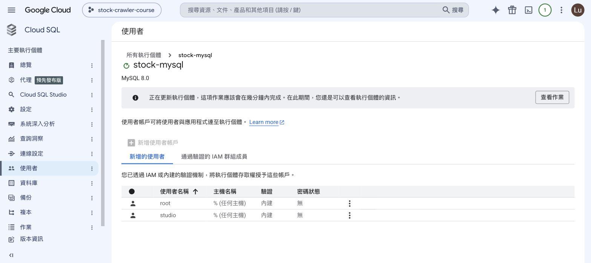

**T-2 授權網路越短越好——組員的電腦不加進去**

白名單只放 VM 的外部 IP。組員要查資料有兩條路，都不需要把個人 IP 加進 Cloud SQL：SSH 進共用 VM 用上面那招一次性 mysql client，或用 Cloud SQL Studio（走 Console，不經授權網路）。Studio 的 `studio` 使用者密碼也用強的：

```bash
gcloud sql users set-password studio --host=% --instance={實例名} --password='{另一組強密碼}'
```

白名單狀態可以在 Console 核對：SQL → 實例 → 「**連線設定**」→ 摘要分頁的「安全性」段，「已授權網路」應該只有 VM 的 IP、一筆都不多：

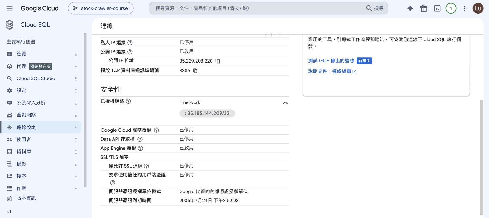

**T-3 Secret Manager 的授權不用重做**

D-2 的授權對象是 Compute Engine 預設服務帳戶——在 VM 上執行 `gcloud secrets versions access` 用的就是這個身分，不論哪位組員做 D-4 的取出寫入，讀 secret 的都是同一個服務帳戶，一次授權全組涵蓋。組員個人帳號不需要 `secretAccessor`：個人帳號只在自己電腦上管理 secret（開專案者），VM 上的讀取走服務帳戶。

授權狀態可以在 Console 核對：安全性 → Secret Manager → `mysql-password` → 「**權限**」分頁——服務帳戶掛「Secret Manager 密鑰存取者」，成員清單裡沒有任何組員的個人帳號，這就是「授權綁程式不綁人」的樣子：


**T-4 換密碼＝加一個新版本**

團隊環境密碼會需要輪替（例如組員退出專題、密碼不小心外流）。Secret Manager 端加新版本、Cloud SQL 端同步改，兩條指令：

```bash
printf "{新密碼}" | gcloud secrets versions add mysql-password --data-file=-
# Created version [8] of the secret [mysql-password].
gcloud sql users set-password root --host=% --instance={實例名} --password='{新密碼}'

# 驗證 latest 已指向新版本
gcloud secrets versions access latest --secret=mysql-password
# {新密碼}

# 版本清單就是輪替的軌跡——舊版本還在，出問題可以回頭比對
gcloud secrets versions list mysql-password
# NAME  STATE     CREATED
# 8     enabled   ...    ← 新密碼
# 7     enabled   ...
```

SQL 端改完後，跑服務的 VM **重跑一次 D-4 的 ①②③**（刪舊行 → 取出寫入 → up），容器就拿到新版（記住：`docker restart` 不會）——**程式碼與 compose 檔一行都不用動**，這正是密碼集中管理在團隊場景的價值：換密碼是一個人的兩三條指令，不是全組每台機器各改一次檔案。

輪替軌跡在 Console 的「**版本**」分頁：每一列一個版本、帶建立日期，最新版在最上面——誰在什麼時候換過密碼，翻這頁就有紀錄：

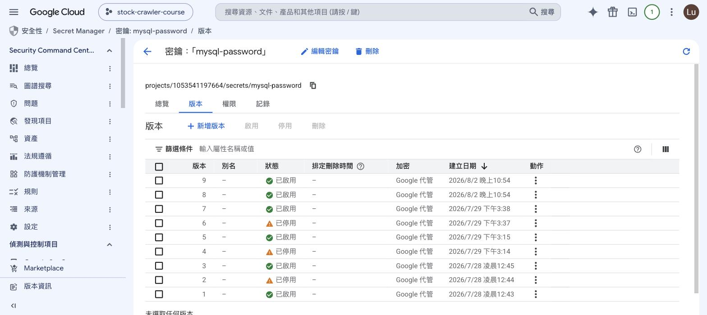

## 收工：三個東西都要停

```bash
# Cloud SQL 停止（activation-policy 設 NEVER＝停用；之後要用改回 ALWAYS）
gcloud sql instances patch stock-mysql --activation-policy=NEVER

# 兩台 VM 一起停
gcloud compute instances stop stock-crawler-vm stock-crawler-vm2 --zone=asia-east1-b
```

Cloud SQL 停止的 Console 版：SQL → 點 stock-mysql 進詳情頁 → 上方按鈕列的「**停止**」（跟「編輯／匯入／匯出／重新啟動／刪除」並排，見 Part F 那張詳情頁截圖）。VM 停止的 Console 版在第 14 章「用 Console 停機／開機」補充段。

提醒：停用 Cloud SQL 之後，Cloud SQL Studio 會顯示「這個執行個體並未執行」而無法查資料（Part F 排查清單第 2 項）——這是正常現象，不是壞掉。

| 資源 | 停了之後 | 還會收的錢 |
|------|---------|-----------|
| VM ×2 | TERMINATED，外部 IP 回收 | 磁碟費（兩顆 20GB 合計每月約 NT$50） |
| Cloud SQL | 停用，資料保留 | 儲存費（少量） |
| Spanner 試用機（Bonus 有做才有） | **不用停**——免費 instance 本來就不計費 | $0（90 天到期自動停用；記得別手動刪，額度不會退還） |

重新開工的順序：Cloud SQL `--activation-policy=ALWAYS` → VM start → **查新的外部 IP → 重跑 authorized-networks 的 patch**（IP 換了，舊授權就失效——別忘了這步）。

## 檢查：這一章做完的狀態

- [ ] `gcloud sql instances list` 看得到 stock-mysql，STATUS 是 RUNNABLE（收工後 STOPPED）
- [ ] 授權網路含兩台 VM 的外部 IP；mydb 資料庫存在
- [ ] VM1 只跑 Airflow 三容器＋rabbitmq＋flower；VM2 只跑兩個 worker
- [ ] VM2 worker log 有 `Connected to amqp://...{VM1內部IP}` 與 `ready`
- [ ] VM1 發任務後，Cloud SQL 的 `mydb.TaiwanStockPrice` 查得到資料，**且 BigQuery 的 `raw.TaiwanStockPrice` 筆數同步增加**（雙寫兩邊都活著）
- [ ]（Bonus，有做才勾）Spanner 試用 instance 存在（READY）且 `TaiwanStockPrice` 有爬蟲寫入的資料；兩個實驗跑過：線上加欄位、調 PU 被免費版拒絕
- [ ] VM ×2 與 Cloud SQL 停止（Spanner 試用機不計費，不用動）

## 想一想

1. 為什麼 VM2 連 RabbitMQ 用內部 IP、連 Cloud SQL 卻用外部 IP？（提示：Cloud SQL 不在你的 VPC 裡——它是 Google 託管專案裡的機器。進階解法叫「私人服務存取」，課程不會用到但值得知道名字）
2. 如果爬蟲量變大，下一台該加的是 VM3 跑更多 worker，還是把 VM1 換大台？這跟第 7 章 `--scale` 的水平擴充是同一題嗎？
3. 建立 Cloud SQL 時密碼 1234 寫在指令裡，Part D 把它移進 Secret Manager 之後，這個密碼還有哪些地方留著明碼？（提示：查一下 `history`）
4. 密碼輪替時，正在執行的 worker 用的還是它啟動時讀到的舊密碼。什麼時候才會真的換成新密碼？這對「舊密碼何時可以停用」有什麼影響？

## 練習

1. 把 VM2 的 worker `--scale worker_twse=2`（compose 檔的 `container_name` 要先拿掉），看 Flower（VM1 外部 IP:5555）出現兩個 twse worker——跨機器版的第 7 章實驗
2. 故意把 `.env` 的 `MYSQL_HOST` 改錯一碼再發任務，觀察 worker log 的錯誤長相，再改回來——練排錯手感
3. 全部停機再全部開機，走一遍「查新 IP → 重 patch 授權網路」的復原流程，直到端到端再次全通

## 排錯

| 症狀 | 原因 | 處理 |
|------|------|------|
| worker 連 Cloud SQL 逾時 | VM 重開後外部 IP 換了，授權網路還是舊 IP | `instances list` 查新 IP → 重跑 `sql instances patch --authorized-networks` |
| worker 連不上 RabbitMQ | `.env` 的內部 IP 抄錯，或 VM1 的 rabbitmq 沒起 | 核對 `instances list` 的 INTERNAL_IP；VM1 `docker ps` |
| Access denied for user 'root' | Cloud SQL root 密碼跟 `.env` 對不上 | 建實例時 `--root-password=1234`；或 `gcloud sql users set-password` 重設 |
| 建實例卡很久 | Cloud SQL 建立本來就要約 10 分鐘 | `gcloud sql instances list` 看 STATUS 從 PENDING_CREATE 變 RUNNABLE |
| Unknown database 'mydb' | 忘了建資料庫 | `gcloud sql databases create mydb --instance=stock-mysql` |
| VM2 上莫名多一個 rabbitmq 容器 | up 沒加 `--no-deps`，depends_on 連帶啟動 | `docker rm -f rabbitmq`，之後 up 記得加 `--no-deps` |
| Cloud SQL Studio 的使用者下拉 root 是灰的 | Studio 不開放 root 登入；gcloud 建的使用者沒給 `--host=%` 也會被拒 | `gcloud sql users create studio --password=1234 --host=%` 後重新整理頁面 |
| 兩台 VM 內部 IP 一樣？ | 不可能——同 VPC 內部 IP 唯一；你看到的多半是外部 IP 回收再發 | 分清楚兩欄：INTERNAL_IP vs EXTERNAL_IP |
| VM 上 `secrets versions access` 回 403 Permission denied | 沒做 D-2 的授權，或 member 填錯（要填 VM 用的那個服務帳戶） | 用 `gcloud secrets get-iam-policy mysql-password` 檢查授權對象 |
| 容器裡的密碼還是預設值 1234 | `.env` 裡沒有 `MYSQL_PASSWORD=` 那行——D-4 的取出寫入沒做，或做在別台機器上 | 在跑服務的那台重跑 D-4 的 ①②③；`docker exec {容器} env \| grep MYSQL_PASSWORD` 確認 |
| 換了密碼但容器沒生效 | 只做了 `docker restart`，或 `.env` 還是舊值（沒重新取出） | 重跑 D-4 的 ①②③，compose 偵測到值變了會重建容器 |
| 搬家後 Cloud SQL 有資料、BigQuery 沒新增 | `.env` 漏了 `GCP_PROJECT_ID`（worker 印「BQ 未設定，略過雲端寫入」），或 VM2 建機時沒給 `--scopes=cloud-platform` | 補 `.env` 的變數重跑 up；scopes 要停機後 `gcloud compute instances set-service-account {VM} --scopes=cloud-platform` 補 |
| Spanner 建試用機被拒：limited to 1 per project lifecycle | 這個專案開過（也許已刪掉）免費 instance——刪除不會退還額度 | 免費體驗一個專案只有一次；要再玩只能換專案或開付費 instance |
| Spanner 寫入失敗：Invalid CreateSession（`projects//instances/...`） | worker image 裡是舊版程式——compose 會把沒設的 `SPANNER_PROJECT_ID` 注入成空字串，舊版 config.py 不會回退到 `GCP_PROJECT_ID` | VM2 上 `git pull` 拉最新版、重新 build worker 再 up |
| Spanner 調 PU 報 cannot be set for free instances | 免費試用版算力固定 | 正常——這正是免費版與付費版的界線（S-4 實驗②） |

## 本章總結

- 託管 vs 自架是雲的核心交易：用錢買維運。資料庫最有資格先換成託管——有狀態、故障代價最高
- 內部 IP 給機器互連（免費、不變、免防火牆），外部 IP 給對外（會回收、要授權）——分清楚這兩個，跨機器架構就通了
- Secret Manager 保管密碼：集中儲存、可查詢誰讀過、每個版本都保留；`.env` 裡的值用指令取出寫入，不經鍵盤與聊天室——換密碼＝加新版本＋重新取出，程式只讀環境變數，一行不改
- 授權可以綁在單一資源上（`gcloud secrets add-iam-policy-binding`），範圍比第 15 章的專案層級更精確
- 在 VM 上執行的容器不需要金鑰檔，它用 VM 的服務帳戶身分讀 Secret Manager
- compose 插值＋`.env` 讓「搬家」縮小成三行值的差異——同一份 compose 檔走遍本機和雲端，每台機器的連線目標由它自己的 `.env` 決定
- 跨機器閉環：VM1 發 → VM2 做 → 雙寫落 Cloud SQL＋BigQuery。搬家只動 OLTP 半邊，分析線零改動——雙寫架構的價值在搬家日兌現
- Cloud SQL 是「託管的機器」（開多久算多少、要管密碼與停機），BigQuery 是「無伺服器服務」（掃多少算多少、沒有機器概念）——營運面處處相反
- Spanner 是分散式關聯庫：主鍵決定分片、schema 線上變更、調 PU 不停機；規模沒到它的量級就用 Cloud SQL——選型光譜五個服務各有位置
- Swarm 已少人使用、K8s 是目前的標準但屬於另一門課的範圍——compose 練熟就是學 K8s 的基礎
- 收工兩停一不動：VM ×2＋Cloud SQL 要停，Spanner 試用機不計費；重開要記得「新 IP → 重 patch 授權」

下一章（第 17 章）是最後一章：用 Airflow 排程把「觸發爬蟲雙寫＋重算 BigQuery 分析層」變成每個交易日自動執行的一條線，並對照託管版的 Cloud Composer。

如果你也想把 API 開到網路上讓別人查詢，可以看選讀的補充H——用 Artifact Registry 與 Cloud Run 把 FastAPI 部署成一個固定的 HTTPS 網址。
