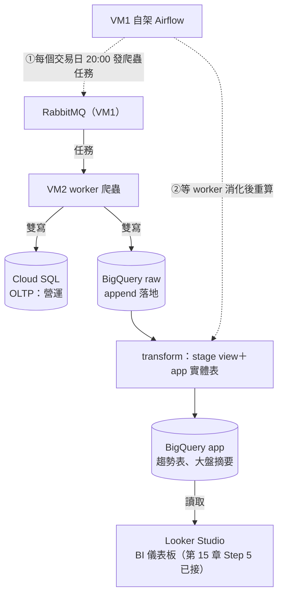
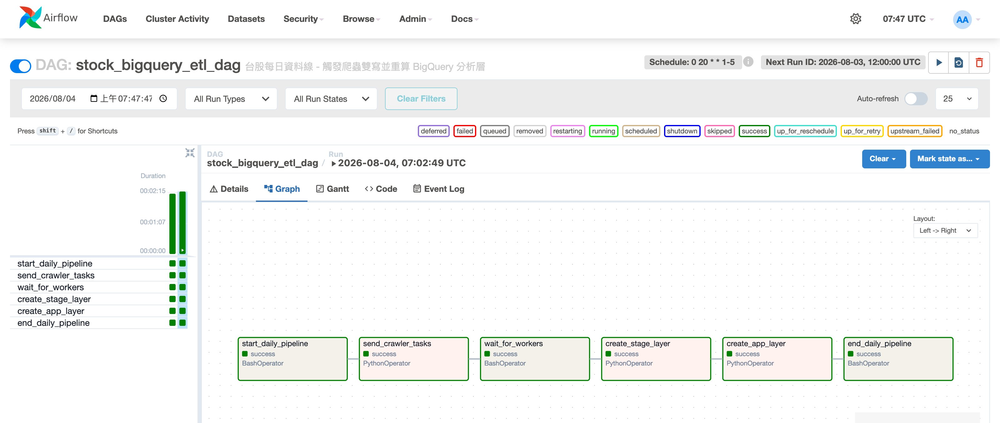
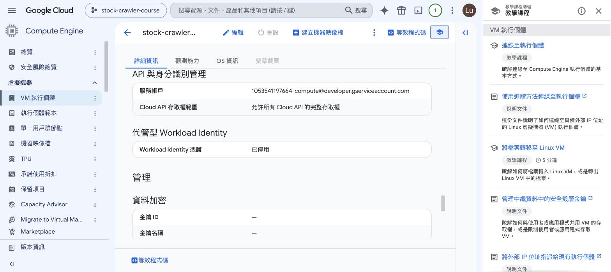
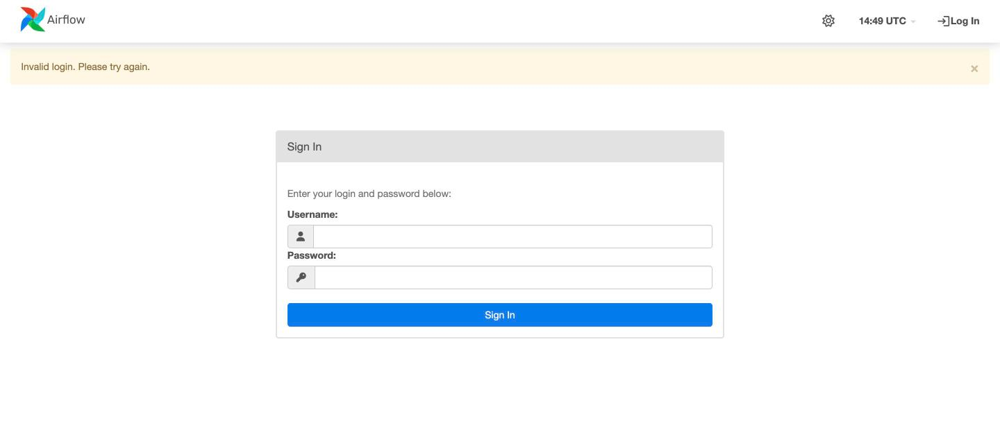
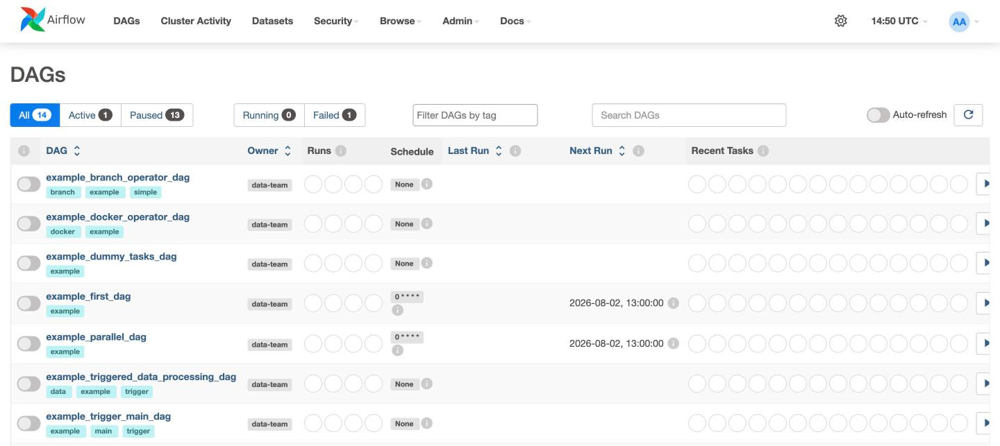
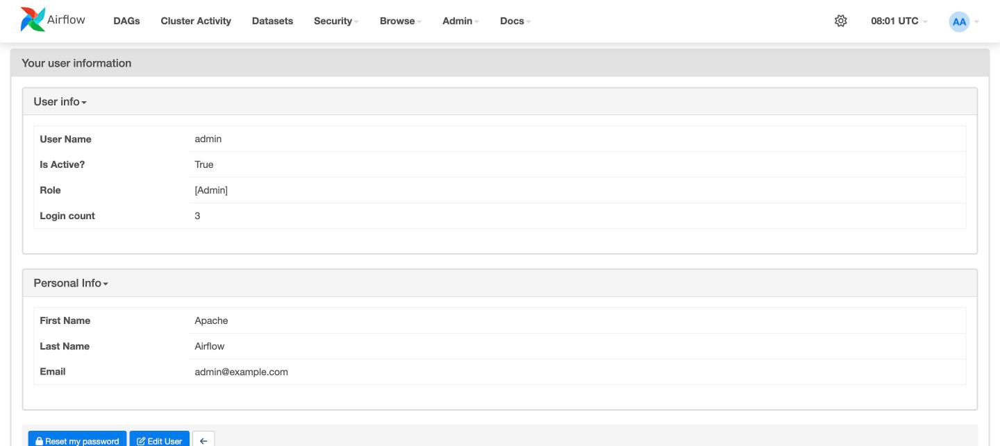
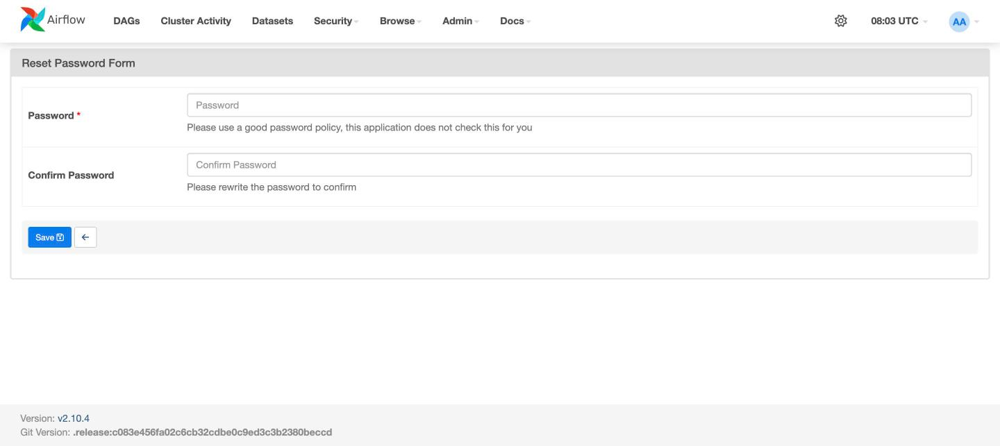

# 課程手冊17 - 每日資料線：Airflow 排程與 Composer

> 本章對應 EP20，是課程最後一章。前置：第 16 章做完（兩台 VM、Cloud SQL、Secret Manager 都在，只是停著）。
>
> 資料庫搬上雲了、密碼也交給 Secret Manager 保管了，剩最後一件事：資料線還要人手動推——爬新資料要有人發任務、BigQuery 的 app 層要有人重算。本章**用自架 Airflow 把「觸發爬蟲雙寫＋重算分析層」排成每個交易日自動執行的一條線**，再對照託管版的 Cloud Composer，最後完成雲端環境的驗證與資源清理。
>
> 做完本章有兩條選讀路線：想把 API 開到網路上，看補充H（用 Cloud Run 部署 API）；想讓每次 push 自動跑測試、自動部署，看補充I（CI 與 CD：GitHub Actions）。

## 本章用到的工具與服務

| 工具／服務 | 類型 | 在本章做什麼 |
|-----------|------|-------------|
| Compute Engine（GCE） | GCP 服務 | VM1 自架 Airflow，跑每個交易日的排程 |
| BigQuery | GCP 服務 | 排程重算 stage／app 分析層的地方；雙寫的 raw 資料已經在裡面 |
| Cloud Composer | GCP 服務 | 託管版 Airflow，講師示範與自架對照，示範完刪除 |
| Cloud Logging | GCP 服務 | Composer 3 的任務 log 集中在這裡讀 |
| 存取範圍（scopes） | GCP 功能 | VM 機器層的舊式權限閘門，與 IAM 疊加的第二道 |
| gcloud／bq CLI | 指令工具 | 開工 SOP、操作 Composer、驗證資料 |
| Airflow | 既有工具 | 第 10 章以來同一套 image 與 DAG |

## 做完這一章你會

1. 在 GCE 上自架 Airflow 跑每日排程，跑通完整雲端資料線：觸發爬蟲雙寫（Cloud SQL＋BigQuery raw）→ 重算 stage／app 分析層
2. 說得出雙寫架構下排程的分工：為什麼不再需要「搬資料」的 task、為什麼 app 層需要每日重算
3. 說得出 Cloud Composer 是什麼、跟自架 Airflow 怎麼選
4. 完成雲端環境的最終驗證與資源清理

## 先搞懂

### 完整資料線：雙寫架構下，排程剩兩件事

雙寫讓資料一寫入就同時落在 Cloud SQL 和 BigQuery raw——**「把資料從 A 搬到 B」的排程工作直接消失了**。每天還需要做的只剩兩件事：①讓爬蟲抓當天的新資料（雙寫自動落兩邊）；②重算 BigQuery 的分析層（app 是實體表，不會自己更新）。本章的 DAG 就編排這兩件事：



看這張圖要分清楚兩種線。**實線是資料實際流動的路徑**：worker 雙寫落地、transform 從 raw 算出 stage 與 app、Looker Studio 讀 app。**虛線是觸發**：Airflow 不在資料路徑上，資料不經過它，它只負責在排定的時間發任務、跑重算。

三層各自的「新鮮度」也不一樣，這決定了排程要重算誰（第 15 章的規矩在這裡變成排程設計）：

| 層 | 形態 | 新資料進來後 | 排程要做什麼 |
|----|------|-------------|-------------|
| raw | 實體表 | 雙寫當下就有了 | 不用管 |
| stage | view | 查詢時即時反映 raw | 不用管（DAG 仍冪等重建定義，重跑無害） |
| app | 實體表（CTAS） | **停在上次重算的樣子** | **每日重算——排程存在的主因** |

### Composer：託管版的 Airflow

排程主線用的是 GCE 上自架的 Airflow 容器，跟第 10 章以來同一套 image 和 DAG。GCP 也有託管版本，叫 **Cloud Composer**。這是第 16 章「託管 vs 自架」的同一道選擇題，換到排程工具上：

| | 自架 Airflow（本章主線） | Cloud Composer |
|---|------------------------|----------------|
| 機器與維運 | 你的 VM，你自己維護 | Google 負責（底層是 GKE） |
| 費用 | VM 費用（已經在付，不會多花） | **最小環境每月數百美元起** |
| 建置時間 | image build 約 10 分鐘 | 環境建置 20-30 分鐘 |
| DAG 部署方式 | 放進 dags/ 目錄 | 上傳到指定的 Cloud Storage bucket |
| 套件與環境變數 | 寫進 Dockerfile 與 compose，一次處理完 | 各自透過 Composer 的介面與指令設定 |
| 不用的時候 | VM `stop` 就不計費，資料設定都留著 | **沒有停機選項，只能刪除環境** |
| 適合的情況 | 學習、小規模、預算有限 | DAG 數量多、團隊規模大、不希望自己維護 scheduler |

課程的安排：**主線用自架（學員不用額外付費），Composer 由講師示範**——Part C 會把主線這支 `stock_bigquery_etl_dag` 原封不動搬到 Composer 上跑一次，DAG 的程式碼一行都不改，示範完**立刻刪除環境**。額度充足的同學可以照 Part C 的步驟自己走一遍，做完務必刪除。

先講結論，Part C 會逐步驗證：編排邏輯在兩邊通用，要各自準備的是執行環境——程式碼怎麼進去、套件怎麼裝、連線設定怎麼給。

## 一步一步

開工前先喚醒系統。照第 16 章收工段的 SOP，外加一步驗證：

```bash
# 1. Cloud SQL 喚醒
gcloud sql instances patch stock-mysql --activation-policy=ALWAYS

# 2. 驗證兩台 VM 的存取範圍（本章 Airflow 要寫 BigQuery；第 14/16 章建機時已給）
gcloud compute instances describe stock-crawler-vm --zone=asia-east1-b \
  --format="value(serviceAccounts[].scopes)"
# ['https://www.googleapis.com/auth/cloud-platform']

# 3. 兩台 VM 開機
gcloud compute instances start stock-crawler-vm stock-crawler-vm2 --zone=asia-east1-b

# 4. 查新的外部 IP（每次開機都會換）
gcloud compute instances list

# 5. 用新 IP 重跑授權網路
gcloud sql instances patch stock-mysql \
  --authorized-networks={VM1外部IP}/32,{VM2外部IP}/32
```

第 2 步是舊識：**存取範圍（scopes）**是 VM 機器層的舊式閘門——就算 IAM 角色有權限，scopes 沒開放的操作一樣做不了（第 14 章 Part F 講過）。照著課程建機的話兩台 VM 都帶著 `cloud-platform`，這裡查一下就好。**輸出不是 `cloud-platform` 的話**（例如 VM 是在加上 `--scopes` 參數之前建的），要趁停機補改——scopes 只能在停機狀態下修改：

```bash
# 只有驗證沒過才需要做；改完再開機
gcloud compute instances set-service-account stock-crawler-vm \
  --zone=asia-east1-b --scopes=cloud-platform
```

開機後才發現 scopes 不對的話，就得再停一次機（IP 會再換一次，授權網路也要重設）——這正是「建機時就給對」的價值。

### Part A：Airflow 上雲——建立排程環境

在 VM1 上準備自架 Airflow。兩個學員步驟：

**A-1 build image**（跟第 10 章本機同一份 Dockerfile）：

```bash
# 在 VM1 的 ~/stock-crawler
git pull
docker build -f airflow/Dockerfile -t stock-airflow:latest .   # 約 10 分鐘
```

> 如果你在 VM1 上跑過 `docker system prune -af` 清理磁碟，它會把「沒有容器在用」的 image 全部清掉，這裡就得重 build。build 等待的時間可以先讀「先搞懂」的 Composer 對照表。

**A-2 寫 Airflow 的雲端 override 檔**（第 16 章 override 手法第三次使用）：

```bash
cat > gcp-airflow-override.yml <<'YML'
# Airflow 上雲 override：MySQL 改連 Cloud SQL、補 GCP 專案 ID
# BigQuery 認證走 VM 中繼資料（服務帳戶），不需要金鑰檔
services:
  airflow-webserver:
    environment:
      MYSQL_HOST: {CloudSQL IP}
      GCP_PROJECT_ID: {你的專案ID}
  airflow-scheduler:
    environment:
      MYSQL_HOST: {CloudSQL IP}
      GCP_PROJECT_ID: {你的專案ID}
YML

docker network create my_network    # airflow compose 宣告要用的外部網路（建過就跳過）
docker compose -f airflow/docker-compose-airflow.yml -f gcp-airflow-override.yml up -d
```

注意 override 裡**沒有** `GOOGLE_APPLICATION_CREDENTIALS` 這個變數。第 15 章在本機需要金鑰檔，是因為你的筆電對 GCP 來說沒有身分；VM 本身有服務帳戶這個身分，Google 的程式庫會自動採用。**在 VM 上執行的程式不需要金鑰檔**，這跟第 16 章 worker 讀 Secret Manager 是同一個機制。

### Part B：觸發完整資料線

等 Airflow init 完成（`docker ps` 看 webserver healthy），觸發每日資料線的 DAG：

```bash
docker exec airflow-scheduler airflow dags unpause stock_bigquery_etl_dag
docker exec airflow-scheduler airflow dags trigger stock_bigquery_etl_dag
```

這支 DAG（`airflow/dags/stock_crawler_etl_bigquery_dag.py`）就是「先搞懂」那張圖的程式版，六個 task 一條直線：

| task | 做什麼 | 對應章節 |
|------|--------|---------|
| `start_daily_pipeline` | 起點訊息 | — |
| `send_crawler_tasks` | 把整批股票的爬蟲任務 `apply_async` 到 twse 佇列——worker 收到就雙寫 | 發任務＝第 12 章串法二；雙寫＝第 15 章讀碼段⓪ |
| `wait_for_workers` | 等 worker 消化（教學版固定等待；真實系統用 sensor 盯完成訊號） | 發任務是非同步的——第 1 章 `.delay()` 的老課題 |
| `create_stage_layer` | 冪等重建 stage view（去重定義） | 第 15 章 Step 3 的 SQL 包成函式 |
| `create_app_layer` | CTAS 重算 app 兩張成品表 | 第 15 章 Step 4 的 SQL 包成函式 |
| `end_daily_pipeline` | 收尾訊息 | — |

**注意這裡沒有「搬資料」的 task**——舊版課程在這裡放了一支 `sync_mysql_to_bigquery`（整表從 MySQL 複製進 BigQuery）；雙寫讓資料寫入當下就在 raw 了，這個搬運工作整個消失。DAG 掛著 `schedule_interval="0 20 * * 1-5"`——每個交易日 20:00 自動跑，手動觸發只是驗收用。

> unpause 之後 Graph 上可能突然多出一個你沒有觸發的 run。那是排程 DAG 被 unpause 時補跑的最近一期，即使 `catchup=False` 也會跑這一期，屬於正常行為。

到瀏覽器開 `http://{VM1外部IP}:8080`（帳密 admin/admin），進入這支 DAG 的 Graph 分頁，六個 task 應該全部是綠色的 success；左側格狀圖每一直行是一次 run（unpause 補跑的那期也在裡面）：



注意這裡的 port 是 **8080**，跟第 10 到 13 章本機環境用的 8081 不同——本機當時改成 8081 是為了避開 phpMyAdmin，雲端的 VM1 上沒有 phpMyAdmin，所以用 compose 檔原本的 8080。

等 run 全綠後，用 bq 驗證整條線真的動了（本機或 VM 都能跑）：

```bash
# 三層筆數：raw 因為這次 run 的雙寫而增加；stage 去重後穩定；app 重算完成
bq query --nouse_legacy_sql \
  "SELECT 'raw' AS layer, COUNT(*) AS n FROM raw.TaiwanStockPrice
   UNION ALL SELECT 'stage', COUNT(*) FROM stage.stock_price_daily
   UNION ALL SELECT 'app.trend', COUNT(*) FROM app.stock_trend_analysis
   ORDER BY layer"

# app 層的技術指標有值
bq query --nouse_legacy_sql \
  "SELECT stock_id, trade_date, ROUND(ma5,2) AS ma5, ROUND(ma20,2) AS ma20
   FROM app.stock_trend_analysis
   WHERE ma20 IS NOT NULL ORDER BY trade_date DESC LIMIT 4"
```

判讀：raw 的筆數比觸發前多（worker 雙寫進來的新一輪 append）；stage 的筆數**不隨重跑膨脹**（去重 view 的效果——同一天的重複列被折疊）；app 兩張表是剛剛 `create_app_layer` 重算出來的最新版。Cloud SQL 那半邊照第 16 章 Part F 的方式驗，筆數同步增加。

到這裡完整資料線就串起來了：**排程發任務 → worker 雙寫（Cloud SQL＋raw）→ transform 重算（stage／app）**，第 15 章接好的 Looker Studio 儀表板下次重新整理就會顯示新資料。這條線之後每個交易日 20:00 自動執行，前提是 VM1 開著。

> 要讓它每天實際執行，VM1 必須一直開著，每月費用約 NT$1,600。課程的做法是上課期間手動觸發驗證，確認排程設定正確即可。這也正是 Composer 這類託管服務的價值之一：執行排程的機器由 Google 維護。

### Part C：Composer 示範（講師操作，學員選做）

把 Part B 剛跑過的 `stock_bigquery_etl_dag` 原封不動搬到 Composer 上執行一次，用來對照託管與自架的差別。**做完立刻刪除環境**，它按小時計費。

> 雙寫版的 DAG 第一個 task 要發任務到 VM1 的 RabbitMQ——Composer 跑在 Google 託管的環境裡，不在你的 VPC 內，所以除了 Cloud SQL 的授權網路（C-6），**RabbitMQ 的 5672 也要對 Composer 的對外 IP 開一條防火牆規則**（C-6 一併處理，示範完刪掉）。這是「託管服務在你網路外面」帶來的第二個網路功課。

#### C-1 啟用 API 並授權服務帳戶

```bash
gcloud services enable composer.googleapis.com iamcredentials.googleapis.com

gcloud projects add-iam-policy-binding {你的專案ID} \
  --member="serviceAccount:{專案編號}-compute@developer.gserviceaccount.com" \
  --role="roles/composer.worker"
```

Composer 除了自己的 API，還相依 `iamcredentials.googleapis.com`。只開前者，建立環境時會被擋下來：

```
FAILED_PRECONDITION: Please enable all APIs Cloud Composer depends on.
List of APIs: iamcredentials.googleapis.com.
```

環境要跑在一個服務帳戶身分下，這裡沿用第 14 章就存在的 Compute Engine 預設服務帳戶，補上 `composer.worker` 角色。

#### C-2 建立環境

```bash
gcloud composer environments create stock-composer \
  --location=asia-east1 \
  --image-version=composer-3-airflow-2 \
  --environment-size=small \
  --service-account={專案編號}-compute@developer.gserviceaccount.com \
  --async
```

`--async` 讓指令立刻返回，環境在背景建立，需要 20-30 分鐘——它在準備一整套跑在 GKE 上的 Airflow。查進度：

```bash
gcloud composer environments list --locations=asia-east1
```

STATE 從 `CREATING` 變成 `RUNNING` 才算建好。

**這裡有一個要先知道的限制：建立中的環境刪不掉。**

```
ERROR: Cannot delete environment in state CREATING.
Environment must be in RUNNING or ERROR state.
```

也就是說按下建立之後就沒有反悔的餘地，那 20-30 分鐘的費用一定會發生。這一點跟 VM 和 Cloud SQL 很不一樣，下面的 C-8 會再說明。

#### C-3 查出這個環境的 DAGs bucket 與網頁介面

```bash
gcloud composer environments describe stock-composer --location=asia-east1 \
  --format="value(config.dagGcsPrefix,config.airflowUri)"
```

第一個值是 DAGs bucket 路徑，長得像 `gs://asia-east1-stock-composer-{編號}-bucket/dags`；第二個是 Airflow 網頁介面的網址，開起來跟你自架的那個介面一模一樣。

#### C-4 上傳 DAG 與 crawler 模組

自架環境能跑爬蟲 DAG，是因為 compose 檔用 volume 把 `../crawler` 掛進容器（第 10 章設定的）。Composer 沒有這個掛載，所以 `crawler` 要自己送上去。

`stock_crawler_etl_bigquery_dag.py`（檔名與它定義的 DAG id `stock_bigquery_etl_dag` 不同，清單與觸發認的都是 DAG id）開頭 import 的就是它：

```python
from crawler.tasks_crawler_finmind import crawler_finmind
from crawler.stock_bigquery_data_transform import (
    create_stage_layer,
    create_app_layer,
)
```

**Composer 會把 DAGs 資料夾加進 PYTHONPATH**，所以把整個 `crawler` 目錄放進去，DAG 就 import 得到：

```bash
BUCKET=gs://asia-east1-stock-composer-{編號}-bucket/dags

# DAG 本身
gcloud storage cp airflow/dags/stock_crawler_etl_bigquery_dag.py $BUCKET/

# crawler 模組整包（DAG 靠它 import）
gcloud storage cp -r crawler $BUCKET/
```

上傳的 `crawler/` 就是你本機這一份，不需要任何修改——所有環境相關的值（專案 ID、主機位址）都走環境變數，下一步在 Composer 上設定。

Composer 大約一到兩分鐘同步一次 bucket，再由 Airflow 解析。等 DAG 出現：

```bash
gcloud composer environments run stock-composer --location=asia-east1 dags list
```

**這裡會發現主線 DAG 沒有出現**——清單裡只有其他 DAG，`stock_bigquery_etl_dag` 不在。DAG import 失敗時就是這個症狀：清單沒有它、UI 上也看不到。查 import 錯誤：

```bash
gcloud composer environments run stock-composer --location=asia-east1 dags list-import-errors
```

```
/home/airflow/gcs/dags/stock_crawler_etl_bigquery_dag.py | Traceback (most recent call last):
|   File "/home/airflow/gcs/dags/crawler/tasks_crawler_finmind.py", line 12, in <module>
|     from crawler.worker import app
|   File "/home/airflow/gcs/dags/crawler/worker.py", line 6, in <module>
|     from loguru import logger
| ModuleNotFoundError: No module named 'loguru'
```

追這條 traceback：DAG import `tasks_crawler_finmind`（要發 Celery 任務）→ 它 import `crawler.worker` → worker 用了 `loguru`——**Composer 3 的映像沒有內建 loguru**。自架環境從來不會踩到這個，因為套件是 `docker build` 時照 `pyproject.toml` 整包裝好的；Composer 的映像裝什麼是 Google 決定的，你的程式用到清單外的套件，就要自己補。查內建清單、補裝套件：

```bash
# 先看映像內建了什麼（pandas、PyMySQL、SQLAlchemy、google-cloud-bigquery 都在，loguru 不在）
gcloud composer environments list-packages stock-composer --location=asia-east1

# 補裝——這又是一次環境更新，要等幾分鐘
gcloud composer environments update stock-composer --location=asia-east1 \
  --update-pypi-package=loguru
```

更新完成後重跑 `dags list`，`stock_bigquery_etl_dag` 出現，代表 `crawler` 匯入成功。這一步是託管環境的第一課：**「環境裡有什麼套件」不再由你的 Dockerfile 決定**——先查清單、缺的用它的介面補、每補一次等一次更新。

#### C-5 套用環境變數

DAG 要發任務到 RabbitMQ、連 Cloud SQL、知道 BigQuery 專案，這些值在自架環境是 override 檔給的，在 Composer 是環境設定的一部分（`RABBITMQ_HOST` 要填 VM1 的**外部** IP——Composer 不在你的 VPC 裡，內部 IP 對它不通）：

```bash
gcloud composer environments update stock-composer --location=asia-east1 \
  --update-env-variables=RABBITMQ_HOST={VM1外部IP},MYSQL_HOST={CloudSQL IP},MYSQL_ACCOUNT=root,MYSQL_PASSWORD=1234,MYSQL_PORT=3306,GCP_PROJECT_ID={你的專案ID}
```

這是一次環境更新，要等幾分鐘，不是改完立刻生效。

漏掉 `GCP_PROJECT_ID` 的話，`config.py` 拿到空字串，兩個 transform task 會因為表名少了專案段（`` `.stage.stock_price_daily` ``）而報 SQL 語法錯誤——task 紅掉，補上環境變數重觸發即可。（雙寫那半邊不受 Composer 的變數影響：實際寫入的是 VM2 的 worker，它讀的是自己 override 檔裡的專案 ID。）

#### C-6 讓 Composer 連得到 Cloud SQL

Cloud SQL 的授權網路認的是來源 IP，所以要先知道 Composer 的工作節點對外時用哪個 IP。這個值 `describe` 查不到，用一支一次性的 DAG 問出來：

這支 DAG 有兩個 task：第一個問出對外 IP，第二個直接試著連 Cloud SQL 的 3306，用來確認授權網路有沒有生效。

```python
# probe_network_dag.py：查 Composer 的對外 IP，並測試能不能連到 Cloud SQL
from datetime import datetime

from airflow import DAG
from airflow.operators.python import PythonOperator


def egress_ip():
    import urllib.request

    ip = urllib.request.urlopen("https://ifconfig.me/ip", timeout=20).read().decode()
    print(f"EGRESS_IP={ip}")
    return ip


def try_mysql():
    import socket

    host, port = "{CloudSQL 公用 IP}", 3306
    s = socket.socket()
    s.settimeout(15)
    try:
        s.connect((host, port))
        print("TCP_CONNECT=OK")
    except Exception as e:
        print(f"TCP_CONNECT=FAIL {type(e).__name__}: {e}")
    finally:
        s.close()


with DAG("probe_network_dag", start_date=datetime(2024, 1, 1),
         schedule_interval=None, catchup=False) as dag:
    PythonOperator(task_id="egress_ip", python_callable=egress_ip) >> \
        PythonOperator(task_id="try_mysql", python_callable=try_mysql)
```

`try_mysql` 只做 TCP 連線測試，不需要帳號密碼——連得上代表授權網路通了，連不上會是逾時。把網路問題跟帳號密碼問題分開驗證，排錯時才知道是哪一層出事。

上傳、觸發，然後讀 log。**Composer 3 的任務 log 送到 Cloud Logging，不放在 bucket 裡**：

```bash
gcloud composer environments run stock-composer --location=asia-east1 \
  dags trigger -- probe_network_dag

# 兩個 task 的輸出各讀一次，過濾字串要跟程式裡印的關鍵字對上
gcloud logging read 'resource.type="cloud_composer_environment" AND textPayload:"EGRESS_IP"' \
  --limit=1 --freshness=10m --format="value(textPayload)"

gcloud logging read 'resource.type="cloud_composer_environment" AND textPayload:"TCP_CONNECT"' \
  --limit=1 --freshness=10m --format="value(textPayload)"
```

拿到 IP 之後做兩件事。①加進 Cloud SQL 授權網路，做法跟第 16 章給兩台 VM 授權完全一樣：

```bash
gcloud sql instances patch stock-mysql \
  --authorized-networks={Composer對外IP}/32,{VM1外部IP}/32,{VM2外部IP}/32
```

②開一條**只對 Composer IP 放行 5672** 的防火牆規則，讓 `send_crawler_tasks` 發得進 VM1 的 RabbitMQ（第 14 章「5672 不對公網」的原則沒有破——來源限縮在單一 IP，而且示範完就刪）：

```bash
gcloud compute firewall-rules create allow-composer-rabbitmq \
  --allow=tcp:5672 --source-ranges={Composer對外IP}/32 --target-tags=stock-web
```

授權前後各觸發一次探測 DAG，`TCP_CONNECT` 會從 `FAIL TimeoutError` 變成 `OK`。

> 重新觸發之後如果讀到的還是上一次的結果，是 Cloud Logging 還沒收到新 log。`--freshness` 縮短到 `2m` 再讀一次，或等一分鐘。

#### C-7 觸發並驗證

```bash
gcloud composer environments run stock-composer --location=asia-east1 \
  dags trigger -- stock_bigquery_etl_dag

# 看整個 run 的狀態
gcloud composer environments run stock-composer --location=asia-east1 \
  dags list-runs -- -d stock_bigquery_etl_dag -o plain

# 看六個 task 各自的狀態
gcloud composer environments run stock-composer --location=asia-east1 \
  tasks states-for-dag-run -- stock_bigquery_etl_dag {run_id} -o plain
```

六個 task 全部 `success`，回頭用 Part B 的三層查詢驗證：raw 又多了一輪雙寫、`app.stock_trend_analysis` 是 Composer 那次 run 重算的——**同一支 DAG、同一份 crawler、同一個 Cloud SQL 與 BigQuery，換的只是誰在跑 scheduler**。

也可以直接開 C-3 查到的網頁介面，用 UI 觸發與觀察，操作方式跟自架的完全相同。

#### C-8 刪除環境（連同臨時防火牆規則）

```bash
gcloud composer environments delete stock-composer --location=asia-east1 --quiet
gcloud composer environments list --locations=asia-east1   # 清單空了才是真的停止計費

# C-6 開的臨時規則一併收掉，5672 回到完全不對外
gcloud compute firewall-rules delete allow-composer-rabbitmq --quiet
```

**Composer 沒有「停機」這個選項。** VM 可以 `stop`、Cloud SQL 可以設 `activation-policy=NEVER`、Cloud Run 沒流量自動縮到零——它們停下來之後資料和設定都還在，要用再開回來。Composer 只有 create、update、delete 三種操作，環境存在就計費，唯一的省錢方式是刪掉，而刪掉就什麼都不留。

這也是為什麼「示範完立刻刪除」不是建議而是必要步驟。

#### 這次示範帶出的三件事

**一、套件不一定要自己裝，但要先查。** C-4 已經真的踩過一次：DAG 需要的 pandas、PyMySQL、SQLAlchemy、google-cloud-bigquery、pyarrow 映像都內建，偏偏 `loguru` 沒有——查清單、補裝、等一次環境更新，DAG 才出現。同一份 `list-packages` 清單也會告訴你版本可能跟你本機不同——例如 SQLAlchemy 是 1.4 而不是專案 `pyproject.toml` 寫的 2.x，程式用到 2.0 才有的寫法就會出問題。`FinMind` 也不在清單裡，要跑會呼叫 FinMind API 的其他爬蟲 DAG 就得比照補裝。

**二、「環境裡有什麼」變成要透過它的介面管理。** 自架時 `docker build` 一次處理完的事——程式碼進 image、套件裝進 image、環境變數寫在 compose——在 Composer 上拆成三件獨立的事：上傳程式碼到 bucket、在設定頁裝套件、用 update 指令改環境變數。每一件都是一次操作，套件與環境變數還各自要等一次環境更新。這是託管服務的隱藏成本：省下維護機器的力氣，換來一套要學的管理介面。

**三、「DAG 兩邊通用」要講得精確一點。** 編排邏輯——DAG 的結構、任務依賴、排程設定、Operator 用法——完全通用，這次連一行都沒改。要各自準備的是執行環境：程式碼怎麼進去、套件怎麼裝、連線設定怎麼給、對外 IP 怎麼授權。評估要不要換到託管服務時，會花時間的是後面那一半。

## 團體專案上雲：本章設定的團隊版

> 前置：第 14 章〈團體專案上雲〉做完。

**先說這一節在做什麼。** 本章你把排程跑起來了：Airflow 每個交易日自動觸發同步，資料線不再需要人。但排程系統有個特性——**它是全組共用的單點**：一個人改壞 DAG，全組的排程一起停；一個人忘了停機，錢從開專案者的額度一直流。換成團體專題，四件事要先講好：

1. **scopes 誰驗、出問題誰補改？**——照課程建機的話 scopes 已經到位，但補改只能停機做，多人環境會出現「A 停機改設定、B 正在等開機」的衝突，要指定人 →（T-1）
2. **Airflow 的 admin/admin 要換嗎？**——要。白名單裡有全組的 IP，介面被看到的面變大了 →（T-2）
3. **排程要每天真的跑嗎？**——這是錢的問題不是技術問題：真的每天跑＝VM 一直開著計費，要全組同意 →（T-3）
4. **DAG 誰都能改，怎麼避免改壞？**——立規矩：修改走 git，不直接在 VM 上動檔案 →（T-4）

前兩個是設定（做一次就好），後兩個是約定（要全組遵守）——排程系統的團隊化，一半靠設定、一半靠紀律。

| 層 | 解決的問題 | 要做什麼 | 誰做 | 段落 |
|----|-----------|---------|------|------|
| 機器 scopes | 補改要停機、多人操作會互相干擾 | 開工 SOP 驗證；不對時由開專案者停機補改 | 開專案者 | T-1 |
| 介面帳密 | admin/admin 暴露面變大 | CLI 或 UI 改密碼；進階：每人一個帳號 | 開專案者 | T-2 |
| 費用 | 每天真的跑＝持續計費 | 全組選定執行模式 | 全組約定 | T-3 |
| 變更管理 | DAG 改壞全組停擺 | 修改一律走 git | 全組約定 | T-4 |

**T-1 scopes 的驗證與補改都歸開專案者**

照第 14／16 章的建機指令，兩台 VM 的 scopes 已是 `cloud-platform`——開工 SOP 第 2 步驗一下就好。會需要**補改**的是「VM 在加上 `--scopes` 參數之前就建好」的小組：補改只能停機做、改一次全 VM 生效——這是機器層設定，跟哪位組員操作無關，指定開專案者處理，避免「A 停機改 scopes 的同時 B 正在等機器開」。指令與輸出：

```bash
gcloud compute instances set-service-account {VM名} --zone=asia-east1-b --scopes=cloud-platform
# Updated [https://www.googleapis.com/compute/v1/projects/{專案ID}/zones/asia-east1-b/instances/{VM名}].

# 驗證 scopes 已改
gcloud compute instances describe {VM名} --zone=asia-east1-b --format="value(serviceAccounts[].scopes)"
# ['https://www.googleapis.com/auth/cloud-platform']
```

Console 的核對位置：Compute Engine → VM 執行個體 → 點 VM 名稱 → 詳細資訊頁往下捲到「**API 與身分識別管理**」段——「Cloud API 存取權範圍」顯示「允許所有 Cloud API 的完整存取權」就是 `cloud-platform` 生效的樣子（VM 停機中也看得到）：



**T-2 Airflow 的 admin/admin 要換掉**

課程沿用預設帳密，防線是 8080 只對白名單 IP 開；團體專案的白名單有全組的 IP，Web 介面被看到的面變大了。用 Airflow CLI 改（在 VM1 上執行，一條指令）：

```bash
sudo docker exec airflow-webserver airflow users reset-password -u admin -p '{全組共用的強密碼}'
# User "admin" password reset successfully
```

改完用瀏覽器驗證：舊的 admin/admin 會被拒、新密碼進得去——





不想下指令的話，UI 介面也能改：登入後點右上角**使用者頭像 → Your Profile**（或直接開 `http://{VM1外部IP}:8080/users/userinfo/`），個人資料頁左下角有「**Reset my password**」按鈕：



按下去進到重設表單，輸入兩次新密碼按 Save 即完成。表單上方寫著「this application does not check this for you」——Airflow 不幫你檢查密碼強度，弱密碼它照收，強度要自己把關：



新帳密的存放比照第 14 章步驟 6：寫在 VM 上的共用位置（例如 .env 同目錄的說明檔），不走聊天室。

**再進一步：每人一個帳號，取代全組共用。** Airflow 支援多使用者，一條指令開一個帳號：

```bash
sudo docker exec airflow-webserver airflow users create \
  -u alice -p '{她自己的密碼}' -f Alice -l Chen -r Admin -e alice@example.com
# User "alice" created with role "Admin"

sudo docker exec airflow-webserver airflow users list
# id | username | email             | first_name | last_name | roles
# 1  | admin    | admin@example.com | Apache     | Airflow   | Admin
# 2  | alice    | alice@example.com | Alice      | Chen      | Admin
```

好處是**留下紀錄**：誰觸發了哪次 run、誰改了哪個設定，UI 的稽核資訊對得到人——DAG 改壞的時候（T-4 的情境）不用猜是誰動的。組員退出專題時 `airflow users delete -u alice` 收回。小組規模的取捨：兩三個人共用一組密碼還管得動，四五個人以上建議直接每人一個帳號。

**T-3 「每天自動跑」是費用決策，要全組同意**

排程真的每天執行的前提是 VM1 一直開著——這筆錢算在開專案者頭上（第 14 章步驟 1）。兩種模式全組選一個：上課／驗收期間手動觸發、平時停機（課程做法，費用趨近零）；或 demo 前一週讓它真的每天跑（接受該週的 VM 費用，週末照停）。費用量級用第 14 章「從帳單看花費」補充的報表確認。

**T-4 DAG 的修改走 git，不直接在 VM 上改**

多人共用一台 VM 時，`dags/` 目錄裡的檔案誰都能動；改壞了一個 DAG，全組的排程一起停。規矩跟程式碼一樣：本機改 → push → VM 上 `git pull`——出問題時 `git log` 找得到是哪次改動（補充I 的 CI 就是這條規矩的自動檢查版）。

## 收工：兩種收法

**今天先收工（課程還沒結束）**——照第 16 章三停：SQL `NEVER`、兩台 VM stop。

**課程結束、確定不再使用**——照順序全部刪除，刪完帳單歸零：

| 順序 | 資源 | 指令／位置 | 為什麼是這個順序 |
|------|------|-----------|----------------|
| 1 | Composer 環境（如果有建立） | `gcloud composer environments delete stock-composer --location=asia-east1` | 費用最高，而且沒有停機選項，只能刪除 |
| 2 | Cloud Run 服務（若做過補充H） | `gcloud run services delete stock-api --region=asia-east1` | 閒置本來就縮零不計費，結束時一併刪除 |
| 3 | 兩台 VM | `gcloud compute instances delete ...` | 磁碟跟著 VM 一起消失 |
| 4 | Cloud SQL | `gcloud sql instances delete stock-mysql` | 儲存費 |
| 5 | Artifact Registry（若做過補充H） | `gcloud artifacts repositories delete stock-repo` | image 儲存費 |
| 6 | BigQuery dataset | `bq rm -r -d raw`／`stage`／`app`／`lab`（各跑一次） | 儲存費（免費層內，可留最後） |
| 7 | Spanner 試用機 | `gcloud spanner instances delete stock-spanner-trial` | 本來就 $0；純粹收乾淨（額度不會退還，先確定真的不玩了） |
| 8 | Secret | `gcloud secrets delete mysql-password` | 費用趨近零 |
| 9 | 整個專案（終極選項） | Console → IAM與管理 → 設定 → 關閉 | 上面全部一次帶走；**30 天寬限期**內可反悔還原 |

## 檢查：這一章做完的狀態

- [ ] VM1 的 Airflow 起得來，`stock_bigquery_etl_dag` 六個 task 全綠
- [ ] 觸發後 raw 筆數增加、stage 筆數不隨重跑膨脹、`app.stock_trend_analysis` 的 MA 值是最新重算的
- [ ] 說得出為什麼這條 DAG 裡沒有「搬資料」的 task
- [ ] 說得出 Composer 與自架的取捨
- [ ] 收工（三停），或課程結束的資源全部刪除

## 想一想

1. Airflow 的 DAG 掛著 `0 20 * * 1-5` 這個排程，但 VM1 關機時它不會執行。要讓它每天真的跑，你有哪些選擇？各自的成本是多少？
2. Composer 每月數百美元，自架 Airflow 用現有的 VM 幾乎不多花錢。什麼情況下這筆錢是值得付的？
3. `create_app_layer` 用的是 CTAS 全表重算。資料量大十倍後該怎麼改？（提示：raw 是日期分區表，MA20 只需要每支股票最近的一段歷史——重算可以只涵蓋受新資料影響的區間，再 MERGE 回成品表）
4. 雙寫已經讓 raw 即時更新，為什麼 app 層不干脆也做成 view，讓排程完全消失？（提示：第 15 章「View vs Table」的取捨——報表每次開啟都重算整段視窗函數的代價）

## 練習

1. 照第 16 章的做法建第二顆 secret `rabbitmq-password`，只授權給 VM 的服務帳戶，啟動指令同時注入兩個變數（`WORKER_PASSWORD=$(...) MYSQL_PASSWORD=$(...) sudo -E docker compose ...`），override 檔補上對應的插值行
2. 對 `stock_bigquery_etl_dag` 的 `schedule_interval` 解讀：`"0 20 * * 1-5"` 是什麼時間？改成「每小時」怎麼寫？（第 9 章 cron 語法的複習）

## 排錯

| 症狀 | 原因 | 處理 |
|------|------|------|
| airflow up 報 stock-airflow image 不存在 | 之前跑過 `prune -af`，把沒在用的 image 清掉了 | A-1 重 build |
| 瀏覽器連 8081 打不開 Airflow | 雲端用的是 compose 檔原本的 8080，8081 是本機為了避開 phpMyAdmin 才改的 | 改連 `http://{VM1外部IP}:8080` |
| 瀏覽器連 8080 逾時 | 你的對外 IP 換了，防火牆規則 allow-stock-web 還是舊 IP | `curl -4 ifconfig.me` 查目前 IP，再 `gcloud compute firewall-rules update allow-stock-web --source-ranges={新IP}/32` |
| airflow up 報 network my_network not found | compose 宣告的外部網路還沒建 | `docker network create my_network` |
| DAG 全綠但 raw 筆數沒增加 | `send_crawler_tasks` 只負責發任務——worker 那端沒起來、或 worker 沒拿到 `GCP_PROJECT_ID`（log 印「BQ 未設定，略過雲端寫入」） | 查 VM2 的 worker 容器狀態與 env；Flower 看任務是否被消化 |
| transform task 紅掉、SQL 錯誤裡表名少了專案段 | Airflow 容器沒拿到 `GCP_PROJECT_ID`（override 檔漏了或 up 時沒帶） | 補 override 的變數重新 up，重觸發 DAG |
| transform task 報 Not found: Dataset raw | 這個專案還沒有雙寫過任何資料（raw 是第一次雙寫時建的） | 先讓爬蟲跑過一輪（第 14 章 H-3/H-4），或等 DAG 的 wait 之後重試 |
| unpause 後多一個沒觸發過的 run | 排程 DAG unpause 會補跑最近一期（catchup=False 也一樣） | 正常現象；不想要就在 unpause 前先 trigger 手動 run 驗證 |
| BigQuery 寫入 403 | VM scopes 不含 BigQuery（建機時沒給 `--scopes=cloud-platform`） | 停機 → `set-service-account --scopes=cloud-platform` → 開機 → 重授權 Cloud SQL（開工 SOP 第 2 步的補改流程） |
| Composer 建立回報 `FAILED_PRECONDITION: Please enable all APIs` | 只開了 `composer.googleapis.com`，還相依 `iamcredentials.googleapis.com` | 兩個一起 enable 後重下建立指令 |
| Composer 環境刪不掉，回報 `Cannot delete environment in state CREATING` | 建立中的環境不能刪 | 等 STATE 變成 `RUNNING` 再刪；建立那 20-30 分鐘的費用無法迴避 |
| DAG 上傳了但 `dags list` 看不到 | DAG import 失敗——`crawler` 模組沒一起上傳，或用到映像沒有的套件（例如 loguru） | `dags list-import-errors` 看 traceback；缺模組就 `gcloud storage cp -r crawler {bucket}/dags/`、缺套件就 `--update-pypi-package` 補裝（C-4 的流程） |
| Composer 上任務報 `Access Denied: Project your-project-id` | 沒設 `GCP_PROJECT_ID` 環境變數，`config.py` 退回預設值 | `environments update --update-env-variables=GCP_PROJECT_ID=...` |
| Composer 上連 Cloud SQL 逾時 | 授權網路沒有 Composer 的對外 IP | 用探測 DAG 查出對外 IP（C-6），加進 `authorized-networks` |
| 找不到 Composer 的任務 log | Composer 3 的 log 送到 Cloud Logging，不在 bucket | `gcloud logging read 'resource.type="cloud_composer_environment"'` |

## 本章總結

- 金鑰檔只有 GCP 外面的程式才需要；VM 上的程式用自己的服務帳戶身分，不需要金鑰
- 雙寫讓「搬資料」的排程工作消失；每日資料線剩兩件事：觸發爬蟲雙寫、重算分析層——排程真正在養的是 app 這種不會自己更新的實體表
- 完整資料線：排程發任務 → worker 雙寫（Cloud SQL＋BigQuery raw）→ transform 重算（stage／app）→ Looker Studio
- Composer 是託管版 Airflow：編排邏輯兩邊通用（同一支 DAG 一行都不用改），要各自準備的是執行環境——程式碼上傳、套件安裝、連線設定、對外 IP 授權（雙寫版連 RabbitMQ 也要授權，託管服務在你的網路外面）
- Composer 沒有停機選項，只有 create／update／delete，環境存在就計費——示範完必須刪除
- 資源清理照順序刪：費用高的先刪，關閉整個專案是最後手段（30 天內可還原）

---

主線十七章的內容到此結束。起點是一支印出「發送任務」的 Celery 腳本，終點是一條具備佇列分流、失敗重試、去重冪等、容器化、多機分工、託管資料庫、機密管理與每日排程的雲端資料管線。兩章選讀把它再往外推一步：補充H 讓 API 對外服務、補充I 讓每次 push 自動測試與部署。這門課要傳達的不是這條管線本身，而是拆解它的方法——之後你會需要自己設計別的管線。
