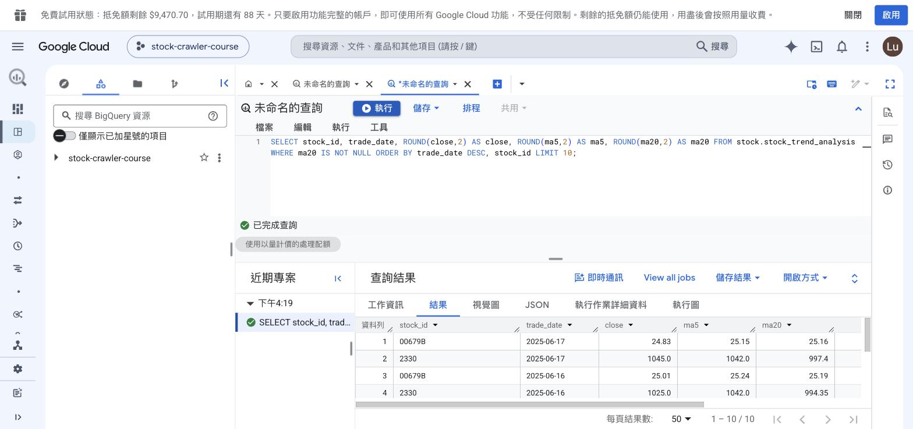
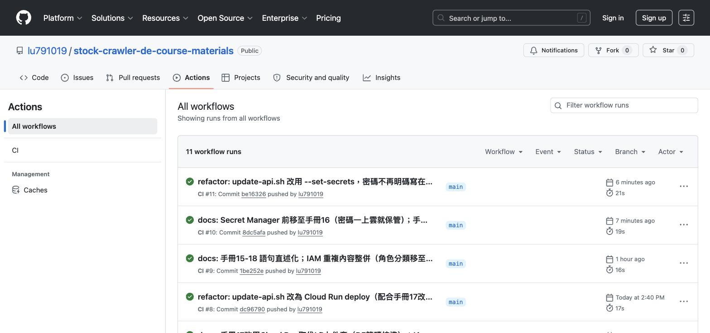

# 課程手冊17 - 每日資料線與 CI：Airflow 排程、Composer 與 GitHub Actions

> 本章對應 EP20，是課程最後一章。前置：第 16 章做完（兩台 VM、Cloud SQL、Secret Manager 都在，只是停著）。
>
> 資料庫搬上雲了、密碼也交給 Secret Manager 保管了，但還有兩件事沒做：每日同步要手動觸發、程式改了要手動測試。本章分別處理：**用自架 Airflow 排程把資料線全線串起、用 GitHub Actions 讓每次 push 自動跑測試**，最後完成雲端環境的驗證與資源清理。
>
> 想把 API 也開到網路上的話，做完本章可以接著看補充G（用 Cloud Run 部署 API），那一章是選讀的。

## 做完這一章你會

1. 在 GCE 上自架 Airflow 跑每日排程，跑通完整雲端資料線：爬蟲 → Cloud SQL → BigQuery
2. 說得出 Cloud Composer 是什麼、跟自架 Airflow 怎麼選
3. 看懂 GitHub Actions 的 CI 流程：push 自動跑測試
4. 完成雲端環境的最終驗證與資源清理

## 先搞懂

### 完整資料線：從手動同步變成每日排程

本章把第 15 章「手動跑一次」的同步，改成由 Airflow 排程的每日管線。全線如下，每一段前面章節都建過：

```
VM2 worker 爬蟲 ──寫入──▶ Cloud SQL（OLTP：即時、逐筆）
                              │
              VM1 自架 Airflow 每個交易日 20:00 觸發 sync
                              ▼
                        BigQuery（OLAP：分析、聚合）
                         主表＋每日行情／MA5·MA20 趨勢／大盤摘要
                              │
                              ▼
                     Looker Studio（BI 儀表板，第 15 章 Bonus 已接）
```

OLTP 和 OLAP 分開的理由第 15 章講過（分析查詢不影響營運資料庫）。本章新增的是**排程**：同步這件事不再需要人記得執行，改由 Airflow 每個交易日自動跑。

### Composer：託管版的 Airflow

排程主線用的是 GCE 上自架的 Airflow 容器，跟第 10 章以來同一套 image 和 DAG。GCP 也有託管版本，叫 **Cloud Composer**。這是第 16 章「託管 vs 自架」的同一道選擇題，換到排程工具上：

| | 自架 Airflow（本章主線） | Cloud Composer |
|---|------------------------|----------------|
| 機器與維運 | 你的 VM，你自己維護 | Google 負責（底層是 GKE） |
| 費用 | VM 費用（已經在付，不會多花） | **最小環境每月數百美元起** |
| 建置時間 | image build 約 10 分鐘 | 環境建置 20-30 分鐘 |
| DAG 部署方式 | 放進 dags/ 目錄 | 上傳到指定的 Cloud Storage bucket |
| 適合的情況 | 學習、小規模、預算有限 | DAG 數量多、團隊規模大、不希望自己維護 scheduler |

課程的安排：**主線用自架（學員不用額外付費），Composer 由講師示範**——示範建置流程、把同一支 DAG 上傳到 bucket、在託管的介面上觸發成功，說明「DAG 在兩邊通用，差別只在誰維護機器」，示範完**立刻刪除環境**（它按小時計費）。額度充足的同學可以照示範步驟自己走一遍，做完務必刪除。

### CI/CD：把手動流程自動化

CI/CD（持續整合／持續部署）的每個環節，前面章節都做過：

```
git push ──▶ 自動跑測試（補充C 寫好的 pytest）──▶ 自動 build 並上傳 image ──▶ 自動部署到執行環境
         └────────── CI（本章實作）──────────┘└──────────── CD（概念，本章不實作）────────────┘
```

本章實作 CI 這一段：repo 裡放一份 GitHub Actions 的 workflow 檔，之後每次 push，GitHub 會自動開一台臨時虛擬機執行你的測試。**測試沒過的程式碼不應該上線，而且這件事不該依賴人工記得檢查**。補充C 寫的測試，在這裡成為上線前的檢查關卡。

## 一步一步

開工前先喚醒系統。照第 16 章收工段的 SOP，但這次**趁 VM 還停著**多做一件事：

```bash
# 1. Cloud SQL 喚醒
gcloud sql instances patch stock-mysql --activation-policy=ALWAYS

# 2. 趁停機改 VM 的存取範圍（本章的 Airflow 要寫入 BigQuery，預設範圍不夠）
gcloud compute instances set-service-account stock-crawler-vm \
  --zone=asia-east1-b --scopes=cloud-platform

# 3. 兩台 VM 開機
gcloud compute instances start stock-crawler-vm stock-crawler-vm2 --zone=asia-east1-b

# 4. 查新的外部 IP（每次開機都會換）
gcloud compute instances list

# 5. 用新 IP 重跑授權網路
gcloud sql instances patch stock-mysql \
  --authorized-networks={VM1外部IP}/32,{VM2外部IP}/32
```

第 2 步要解釋一下。VM 的身分是它的服務帳戶，但機器層還有一道舊式的限制叫**存取範圍（scopes）**：就算 IAM 角色有權限，scopes 沒開放的操作一樣做不了。預設的 scopes 對 BigQuery 只有唯讀，本章的 Airflow 要寫入資料，會被擋下來回報 403。`--scopes=cloud-platform` 的意思是「scopes 不設限，權限完全由 IAM 角色決定」。

**這個設定只能在停機狀態下修改**，所以放在開工時跟開機一起做。開機後才想到的話，就得再停一次機（IP 會再換一次，授權網路也要重設）。

### Part A：Airflow 上雲——建立排程環境

在 VM1 上準備自架 Airflow。三個學員步驟：

**A-1 build image**（跟第 10 章本機同一份 Dockerfile）：

```bash
# 在 VM1 的 ~/stock-crawler
git pull
docker build -f airflow/Dockerfile -t stock-airflow:latest .   # 約 10 分鐘
```

> 如果你在 VM1 上跑過 `docker system prune -af` 清理磁碟，它會把「沒有容器在用」的 image 全部清掉，這裡就得重 build。build 等待的時間可以先看 Part C 的 CI 段。

**A-2 取消 `crawler/bigquery.py` 的註解**（第 15 章在本機做過同一件事，這次在 VM 上）：把 `from crawler.config import GCP_PROJECT_ID as PROJECT_ID` 打開、把寫死的 `PROJECT_ID = "your-project-id"` 註解掉。

**A-3 寫 Airflow 的雲端 override 檔**（第 16 章 override 手法第三次上場）：

```bash
cat > gcp-airflow-override.yml <<'YML'
# Airflow 上雲 override：MySQL 改連 Cloud SQL、補 GCP 專案 ID
# BigQuery 認證走 VM 中繼資料（服務帳戶），不需要金鑰檔
services:
  airflow-webserver:
    environment:
      MYSQL_HOST: {CloudSQL IP}
      GCP_PROJECT_ID: {你的專案ID}
  airflow-scheduler:
    environment:
      MYSQL_HOST: {CloudSQL IP}
      GCP_PROJECT_ID: {你的專案ID}
YML

docker network create my_network    # airflow compose 宣告要用的外部網路（建過就跳過）
docker compose -f airflow/docker-compose-airflow.yml -f gcp-airflow-override.yml up -d
```

注意 override 裡**沒有** `GOOGLE_APPLICATION_CREDENTIALS` 這個變數。第 15 章在本機需要金鑰檔，是因為你的筆電對 GCP 來說沒有身分；VM 本身有服務帳戶這個身分，Google 的程式庫會自動採用。**在 VM 上執行的程式不需要金鑰檔**，這跟第 16 章 worker 讀 Secret Manager 是同一個機制。

### Part B：觸發完整資料線

等 Airflow init 完成（`docker ps` 看 webserver healthy），觸發 BigQuery ETL DAG：

```bash
docker exec airflow-scheduler airflow dags unpause stock_bigquery_etl_dag
docker exec airflow-scheduler airflow dags trigger stock_bigquery_etl_dag
```

這支 DAG 你在第 12 章見過但跳過了（當時沒有 GCP）：`sync_mysql_to_bigquery` 先把 Cloud SQL 的股價全量同步進 BigQuery，然後三個 transform task 建出每日行情、MA5/MA20 趨勢、大盤摘要的 View 與實體表。它掛著 `schedule_interval="0 20 * * 1-5"`——每個交易日 20:00 自動跑，手動觸發只是驗收用。

> unpause 之後 Graph 上可能突然多出一個你沒有觸發的 run。那是排程 DAG 被 unpause 時補跑的最近一期，即使 `catchup=False` 也會跑這一期，屬於正常行為。

到瀏覽器開 `http://{VM1外部IP}:8080`（帳密 admin/admin），進入這支 DAG 的 Graph 分頁，六個 task 應該全部是綠色的 success：


左側的格狀圖是歷次執行紀錄，每一直行是一次 run。上圖左邊幾行有紅色與橘色，那是實測過程中失敗的幾次（原因見排錯表的 `DAY partitioning` 那一條），修正後才變成全綠——這也是排錯時最直觀的檢查方式。

注意這裡的 port 是 **8080**，跟第 10 到 13 章本機環境用的 8081 不同。本機當時改成 8081 是為了避開 phpMyAdmin，雲端的 VM1 上沒有 phpMyAdmin，所以用 compose 檔原本的 8080。

等 run 全綠後，回**本機**用 bq 驗證資料真的落地：

```bash
bq query --nouse_legacy_sql \
  "SELECT COUNT(*) AS n, COUNT(DISTINCT stock_id) AS stocks, MAX(date) AS latest
   FROM stock.TaiwanStockPrice"
# 筆數與 Cloud SQL 一致、股票數＝你爬過的支數

bq query --nouse_legacy_sql \
  "SELECT stock_id, trade_date, ROUND(ma5,2) AS ma5, ROUND(ma20,2) AS ma20
   FROM stock.stock_trend_analysis
   WHERE ma20 IS NOT NULL ORDER BY trade_date DESC LIMIT 4"
# 每支股票最近日期的 MA5 / MA20 有值
```

同一組查詢也可以在 Console 上執行（≡ → BigQuery → SQL 查詢），結果會像這樣：



這裡的資料跟第 15 章手動同步時看到的是同一批，差別在於這次是由 Airflow 排程觸發的。

到這裡完整資料線就串起來了：worker 爬進 Cloud SQL 的資料，由排程的 Airflow 同步進 BigQuery、算出技術指標，第 15 章接好的 Looker Studio 儀表板下次重新整理就會顯示新資料。這條線之後每個交易日 20:00 自動執行，前提是 VM1 開著。

> 要讓它每天實際執行，VM1 必須一直開著，每月費用約 NT$1,600。課程的做法是上課期間手動觸發驗證，確認排程設定正確即可。這也正是 Composer 這類託管服務的價值之一：執行排程的機器由 Google 維護。

### Part C：CI——push 自動跑測試

repo 裡已經有 `.github/workflows/ci.yml`，逐行讀：

```yaml
name: CI
on:
  push:
    branches: [main]      # push 到 main 就觸發
  pull_request:
    branches: [main]

jobs:
  test:
    runs-on: ubuntu-latest          # GitHub 免費提供的臨時虛擬機
    steps:
      - uses: actions/checkout@v4   # 等於 git clone
      - uses: astral-sh/setup-uv@v5 # 裝 uv——跟你本機同一套工具
      - run: uv sync --frozen       # 完全照 uv.lock 還原依賴（環境可重現）
      - run: uv run pytest tests/ -m "not integration" -v
```

四個 step 就是你在本機做過無數次的動作：clone → 裝工具 → 裝依賴 → 跑測試。`-m "not integration"` 排除需要真實 MySQL 的整合測試（CI 的臨時機器上沒有 MySQL；補充C 設計的標記在這裡發揮作用）。

驗證方式：到課程 repo 的 GitHub 頁面 → **Actions** 分頁，能看到每次 push 觸發的 CI 紀錄。每一列左邊的綠色勾號代表那次 push 的測試全部通過，右邊顯示執行時間（這個專案的測試約 20 秒跑完）：



想自己觸發一次：fork 課程 repo 到自己帳號、改一個檔案後 push，你自己 repo 的 Actions 頁就會執行。

CD 段課程不實作，但路徑是這樣：在 workflow 後面繼續加 steps，讓它做 `docker build`、把 image 上傳到倉庫、再通知執行環境換新版本。補充G 會實際做過這三個動作的手動版（Artifact Registry 與 Cloud Run），`gcp/update-api.sh` 就是把它們串成一支腳本，接到 workflow 後面 CI/CD 就完整了。

### Part D：Composer 示範（講師操作，學員選做）

流程走一遍給你看（額度充足者可跟做，**做完立刻刪**）：

1. 啟用 API：`gcloud services enable composer.googleapis.com`
2. Console：≡ → Composer → 建立環境（Composer 3）→ 名稱、區域 asia-east1、規格選最小 → 建立（**等 20-30 分鐘**，它在建立一整套跑在 GKE 上的 Airflow）
3. 建好後環境詳情頁有一個 **DAGs 資料夾**連結，那是一個 Cloud Storage bucket。把 `airflow/dags/example_first_dag.py` 上傳進去
4. 開「Airflow 網頁介面」，操作介面跟你自架的完全一樣。DAG 幾分鐘後會自動出現，unpause → trigger → 執行成功
5. **示範結束立刻刪除環境**（Console 的刪除鈕），它按小時計費

第 3 步刻意選 `example_first_dag.py` 這支範例 DAG，因為它只用 Airflow 內建的 Operator，沒有其他依賴。

**課程的爬蟲 DAG 不能直接這樣上傳**，這是託管環境的第一個功課。打開 `stock_crawler_dag.py` 看第 24 行：

```python
from crawler.tasks_crawler_finmind import crawler_finmind
```

它 import 了 `crawler` 這個模組。自架環境能跑，是因為 compose 檔用 volume 把 `../crawler` 掛進容器裡（第 10 章設定的）。Composer 環境沒有這個掛載，也沒有這個模組，DAG 一上傳就會出現 import 錯誤，連 UI 都不會顯示它。

要讓課程的 DAG 在 Composer 上執行，至少要處理兩件事：

| 要處理什麼 | 在 Composer 上怎麼做 |
|-----------|-------------------|
| `crawler` 模組 | 一起上傳到 DAGs bucket（Composer 會把該目錄加進 PYTHONPATH），或打包成 Python 套件安裝 |
| 第三方套件（FinMind、pymysql 等） | 在環境設定的「PyPI 套件」頁面逐一指定版本安裝 |

這正是**託管服務的隱藏成本**：機器不用你維護了，但「環境裡有什麼」變成你要透過它的介面去管理，而不是自己寫一份 Dockerfile 就搞定。自架時你用 `docker build` 一次處理完的事，在 Composer 上要拆成上傳程式碼與設定套件兩件事。

所以「DAG 在兩邊通用」這句話要講得精確一點：**編排邏輯（DAG 的結構、依賴關係、排程設定）完全通用，但執行環境要各自準備**。這個差異在評估要不要換到託管服務時，是實際會花時間的部分。

## 收工：兩種收法

**今天先收工（課程還沒結束）**——照第 16 章三停：SQL `NEVER`、兩台 VM stop。

**課程結束、確定不再使用**——照順序全部刪除，刪完帳單歸零：

| 順序 | 資源 | 指令／位置 | 為什麼是這個順序 |
|------|------|-----------|----------------|
| 1 | Composer 環境（如果有建立） | Console → Composer → 刪除 | 費用最高，優先刪除 |
| 2 | Cloud Run 服務（若做過補充G） | `gcloud run services delete stock-api --region=asia-east1` | 閒置本來就縮零不計費，結束時一併刪除 |
| 3 | 兩台 VM | `gcloud compute instances delete ...` | 磁碟跟著 VM 一起消失 |
| 4 | Cloud SQL | `gcloud sql instances delete stock-mysql` | 儲存費 |
| 5 | Artifact Registry（若做過補充G） | `gcloud artifacts repositories delete stock-repo` | image 儲存費 |
| 6 | BigQuery dataset | `bq rm -r -d stock` | 儲存費（免費層內，可留最後） |
| 7 | Secret | `gcloud secrets delete mysql-password` | 費用趨近零 |
| 8 | 整個專案（終極選項） | Console → IAM與管理 → 設定 → 關閉 | 上面全部一次帶走；**30 天寬限期**內可反悔還原 |

## 檢查：這一章做完的狀態

- [ ] VM1 的 Airflow 起得來，`stock_bigquery_etl_dag` 全綠
- [ ] bq 查得到 TaiwanStockPrice 主表與 stock_trend_analysis 的 MA 值
- [ ] GitHub Actions 頁看得到 CI 綠勾
- [ ] 說得出 Composer 與自架的取捨、CD 段還缺哪些 step
- [ ] 收工（三停），或課程結束的資源全部刪除

## 想一想

1. Airflow 的 DAG 掛著 `0 20 * * 1-5` 這個排程，但 VM1 關機時它不會執行。要讓它每天真的跑，你有哪些選擇？各自的成本是多少？
2. Composer 每月數百美元，自架 Airflow 用現有的 VM 幾乎不多花錢。什麼情況下這筆錢是值得付的？
3. sync 用的是全量 replace（每次整表重傳）。資料量大十倍後該怎麼改？（提示：BigQuery 的分區正是為增量寫入設計的——只重傳當天的分區）

## 練習

1. 照第 16 章的做法建第二顆 secret `rabbitmq-password`，只授權給 VM 的服務帳戶，把 `config.py` 的 `WORKER_PASSWORD` 也接上同一套 fallback 設計
2. 把 `ci.yml` 的 pytest 改成故意會失敗的指令、push 到自己的 fork，看 Actions 變紅——體會「守門員擋下紅燈」長什麼樣，再改回來
3. 對 `stock_bigquery_etl_dag` 的 `schedule_interval` 解讀：`"0 20 * * 1-5"` 是什麼時間？改成「每小時」怎麼寫？（第 9 章 cron 語法的複習）

## 排錯

| 症狀 | 原因 | 處理 |
|------|------|------|
| config.py import 報 GCP_PROJECT_ID 未定義 | 第 16 章取消 Secret Manager 區塊註解時，上面的 GCP_PROJECT_ID 那行忘了一起取消 | 兩處一起取消註解 |
| airflow up 報 stock-airflow image 不存在 | 之前跑過 `prune -af`，把沒在用的 image 清掉了 | A-1 重 build |
| 瀏覽器連 8081 打不開 Airflow | 雲端用的是 compose 檔原本的 8080，8081 是本機為了避開 phpMyAdmin 才改的 | 改連 `http://{VM1外部IP}:8080` |
| 瀏覽器連 8080 逾時 | 你的對外 IP 換了，防火牆規則 allow-stock-web 還是舊 IP | `curl -4 ifconfig.me` 查目前 IP，再 `gcloud compute firewall-rules update allow-stock-web --source-ranges={新IP}/32` |
| airflow up 報 network my_network not found | compose 宣告的外部網路還沒建 | `docker network create my_network` |
| sync task 報 400：DAY partitioning 只接受 DATE，found STRING | 來源表是 to_sql 自動建的，`date` 欄是文字型別；舊版 sync 沒做型別轉換 | `git pull` 拉最新版（sync 上傳前已加 `pd.to_datetime`）；順便記住：**to_sql 自動建表的欄位型別要用 `SHOW COLUMNS` 驗過，不能想當然** |
| unpause 後多一個沒觸發過的 run | 排程 DAG unpause 會補跑最近一期（catchup=False 也一樣） | 正常現象；不想要就在 unpause 前先 trigger 手動 run 驗證 |
| BigQuery 寫入 403 | VM scopes 還是預設唯讀（開工 SOP 的第 2 步沒做） | 停機 → `set-service-account --scopes=cloud-platform` → 開機 → 重授權 Cloud SQL |
| CI 的 uv sync 失敗 | uv.lock 跟 pyproject 不同步 | 本機 `uv lock` 後重新 push |

## 本章總結

- 金鑰檔只有 GCP 外面的程式才需要；VM 上的程式用自己的服務帳戶身分，不需要金鑰
- 完整資料線：爬蟲 → Cloud SQL → 排程 Airflow → BigQuery → Looker Studio，同步改由排程自動執行
- Composer 是託管版 Airflow：DAG 在兩邊通用，差別在誰維護機器、以及費用
- CI 的四個步驟就是你手動做過的 clone、裝工具、裝依賴、跑測試，交給 GitHub 每次 push 自動執行；CD 是發佈流程的自動化，補充G 有手動版
- 資源清理照順序刪：費用高的先刪，關閉整個專案是最後手段（30 天內可還原）

---

十八章的內容到此結束。起點是一支印出「發送任務」的 Celery 腳本，終點是一條具備佇列分流、失敗重試、去重冪等、容器化、多機分工、託管資料庫、對外服務、機密管理、每日排程與自動測試的雲端資料管線。這門課要傳達的不是這條管線本身，而是拆解它的方法——之後你會需要自己設計別的管線。
